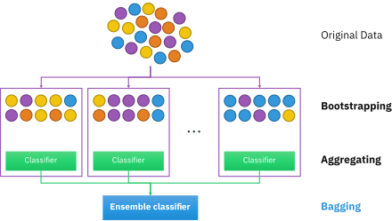

## Table of Contents

## What is bagging in machine learning?

Bagging, short for Bootstrap Aggregating, is a machine learning technique used to improve the accuracy and stability of models. It works by creating multiple versions of a dataset through a process called bootstrapping, where random samples are taken with replacement from the original data. Each of these samples is then used to train a separate model. By combining the predictions from all these models, bagging reduces the risk of overfitting and helps to create a more robust final model.

In simpler terms, imagine you're trying to guess the average height of people in a city. Instead of measuring everyone, you could take several smaller groups of people, measure their heights, and then average those results. If you do this many times, your final average will likely be more accurate than if you had just measured one group. Bagging does something similar with data and predictions, making the overall result more reliable.

Bagging is particularly useful with algorithms that have high variance, like decision trees. When you use bagging with decision trees, it's called a Random Forest. Each tree in the forest is grown on a different bootstrap sample, and their combined predictions give a more accurate and stable outcome than a single decision tree would. This method is widely used because it's effective and easy to understand and implement.

## How does bagging help in reducing overfitting?

Bagging helps reduce overfitting by creating multiple versions of a dataset and training separate models on each version. Overfitting happens when a model learns the details and noise in the training data too well, and it doesn't perform well on new data. By using different samples of the data, each model sees a slightly different version of the world. This means that the noise and specific details in one sample might not be in another, so the models don't all learn the same quirks of the data.

When we combine the predictions from all these models, the errors and quirks from individual models tend to cancel each other out. Imagine if one model made a mistake because it learned a weird pattern in its sample, but other models didn't see that pattern in their samples. The combined prediction would be less influenced by that weird pattern. So, bagging smooths out the predictions, making the final model more general and better at handling new, unseen data. This is why bagging helps reduce overfitting and makes the model more reliable.

## What is the difference between bagging and boosting?

Bagging and boosting are both ways to make [machine learning](/wiki/machine-learning) models better, but they do it in different ways. Bagging works by making lots of copies of your data, but each copy is a bit different. You train a model on each copy, and then you take all those models and combine their answers. This helps because if one model makes a mistake, the others might not make the same mistake, so the final answer is more reliable. It's like asking a bunch of friends for advice and then deciding what to do based on what most of them say.

Boosting, on the other hand, is like training models one after the other, and each new model tries to fix the mistakes of the last one. You start with a simple model, see where it goes wrong, and then make the next model focus more on those wrong parts. You keep doing this, making each new model better and better at fixing the errors of the previous ones. It's like learning from your mistakes over time, where each new attempt gets a little smarter because it knows what went wrong before.

## Can you explain the process of creating a bagging ensemble?

To create a bagging ensemble, you start by taking your original dataset and making copies of it. But, these aren't exact copies. Instead, you use something called bootstrapping, which means you randomly pick items from your dataset, but you might pick the same item more than once. Imagine you have a big jar of marbles and you're drawing them out, but you put each marble back in the jar after you draw it. You do this many times to make different sets of marbles, and each set is a bit different because you might get the same marble more than once. You do the same thing with your data, creating different samples, and then you train a separate model on each sample.

Once you have all these models trained on the different samples, you use them to make predictions. If you're trying to predict something, like whether it will rain or not, each model gives its own answer. To get the final prediction, you take all these answers and combine them. If most models say it will rain, then the final prediction is that it will rain. This way, even if one model makes a mistake, the others might not make the same mistake, so your final prediction is more reliable. This is how bagging helps you make better predictions by using the wisdom of the crowd from all your models.

## What types of base learners are typically used in bagging?

In bagging, the most common type of base learner used is a decision tree. A decision tree works by making a series of decisions, kind of like playing a game of "20 Questions," where each question splits the data into groups until you reach a final answer. Since decision trees can sometimes be too focused on the details of the data they're trained on, using many of them together in bagging helps balance out their mistakes and makes the overall prediction more reliable. When you use decision trees with bagging, it's called a Random Forest, and it's very popular because it works well and is easy to understand.

But decision trees aren't the only base learners used in bagging. You can also use other types of models like neural networks or support vector machines. These models are a bit more complicated, but they can also benefit from the bagging process. By training many versions of these models on different samples of the data and then combining their predictions, you can reduce the chance that any one model will make a big mistake. This makes your final model more accurate and reliable, no matter what kind of base learner you start with.

## How does bagging improve the accuracy and stability of machine learning algorithms?

Bagging helps make machine learning models more accurate and stable by creating many different versions of the data and training a separate model on each version. Imagine you're trying to guess how many jelly beans are in a jar. If you ask a lot of people and then take the average of their guesses, you'll likely get a more accurate number than if you just asked one person. Bagging does something similar by combining the predictions from all these models, which helps to smooth out mistakes and make the final prediction more reliable.

This process also makes the models more stable because it reduces the risk of overfitting. Overfitting happens when a model learns the details of the training data too well and doesn't work as well on new data. By training models on different samples of the data, bagging ensures that no single model gets too focused on the quirks of just one sample. When you combine the predictions from all these models, the errors and quirks from individual models cancel each other out, making the final model better at handling new, unseen data.

## What are the advantages of using bagging in decision tree algorithms?

Using bagging with decision tree algorithms, like in a Random Forest, makes them better in two big ways. First, it helps make the predictions more accurate. When you train lots of decision trees on different pieces of your data, and then combine their answers, you get a more reliable final prediction. It's like asking a bunch of friends for advice and then deciding what to do based on what most of them say. If one tree makes a mistake because it learned something weird from its piece of data, the other trees might not make the same mistake, so the final answer is better.

Second, bagging helps make decision trees more stable and less likely to overfit. Overfitting is when a tree learns the details of the training data too well and doesn't work as well on new data. By training each tree on a different sample of the data, bagging makes sure no single tree gets too focused on the quirks of just one sample. When you combine the predictions from all these trees, the errors and quirks from individual trees cancel each other out, making the final model better at handling new, unseen data. This makes decision trees much more useful and reliable.

## How does the number of base learners affect the performance of a bagging model?

The number of base learners, or models, in a bagging ensemble can really change how well it works. When you have more models, you get a more stable prediction because each model sees a different piece of the data. It's like asking more friends for advice; the more opinions you get, the better your final decision might be. But, if you add too many models, it might not make the prediction much better and could make your computer work harder for no good reason. So, you need to find a good balance where adding more models helps, but doesn't slow things down too much.

In simple terms, more models usually mean better and more reliable predictions, but only up to a point. If you keep adding more and more models, the improvement might get smaller and smaller. It's important to test and see how many models work best for your specific problem. This way, you can make your bagging model as good as it can be without wasting time and computer power.

## Can bagging be applied to regression problems? If so, how?

Yes, bagging can be used for regression problems, where you're trying to predict a number instead of a category. Imagine you want to guess the price of a house based on its size, location, and other details. Instead of using just one model to make this guess, you can use bagging to create many different models, each trained on a slightly different set of house data. Each model will make its own guess about the house price, and then you take the average of all these guesses to get your final prediction. This way, even if one model makes a big mistake, the other models might not make the same mistake, so your final guess is more reliable.

When you apply bagging to regression, you're still using the same basic idea of making multiple copies of your data and training separate models on each copy. But instead of voting on a category like in classification, you're averaging the predictions to get a single number. This averaging helps smooth out any errors that might come from individual models, making your final prediction more accurate and less likely to be thrown off by weird patterns in the data. It's like asking a lot of people to guess the number of jelly beans in a jar and then taking the average of their guesses to get a more accurate number.

## What are some practical examples of bagging in real-world applications?

Bagging is used in many real-world situations to make predictions more reliable. One common example is in finance, where banks use it to predict if someone will pay back a loan. They might train lots of different models on different pieces of data about people's past loans and then combine all those models' guesses to decide if someone is likely to repay a new loan. This helps the bank make better decisions and reduces the chance of giving out loans that won't be paid back.

Another example is in medicine, where doctors might use bagging to predict if a patient has a certain disease. They collect lots of information about patients, like their age, symptoms, and test results. Then, they train many models on different samples of this data to see if a new patient might have the disease. By combining the predictions from all these models, doctors can make a more accurate diagnosis and provide better care to their patients.

Bagging is also used in online shopping to recommend products to customers. Companies gather data about what people buy and what they look at online. They train many models on different pieces of this data to guess what someone might want to buy next. By averaging the guesses from all these models, the company can show customers products they're more likely to be interested in, making shopping easier and more fun for everyone.

## How can you evaluate the performance of a bagging model?

To check how well a bagging model is doing, you can use something called cross-validation. Imagine you're trying to guess how many jelly beans are in a jar. You could split your guesses into groups, use some groups to make your guess, and then see how close you were with the other groups. Cross-validation does this by splitting your data into pieces, using some pieces to train your models, and then testing them on the other pieces. You do this many times with different pieces, and then you average how well your models did. This helps you see if your bagging model is good at guessing new data it hasn't seen before.

Another way to see how your bagging model is doing is by looking at things like accuracy, precision, and recall. Accuracy is like seeing how many times your model guessed right out of all its guesses. Precision tells you how many of your model's "yes" guesses were actually right, and recall tells you how many of the things you wanted to find, your model actually found. For example, if you're using a bagging model to guess if it will rain, accuracy would tell you how often your model was right about rain or no rain. Precision would tell you how many times your model said it would rain and it actually did, and recall would tell you how many times it actually rained and your model said it would. By looking at these numbers, you can get a good idea of how well your bagging model is working.

## What are the potential drawbacks or limitations of using bagging in machine learning?

One problem with using bagging in machine learning is that it can make your computer work a lot harder. When you use bagging, you're training many different models instead of just one. This means your computer needs to do a lot more calculations, which can take more time and use more power. If you're working on a big project with a lot of data, this can be a big deal because you might have to wait longer to get your results, and your computer might get slow or even crash.

Another issue is that while bagging can help make your predictions more reliable, it doesn't always make them perfect. Sometimes, the models in your bagging ensemble might all make similar mistakes because they're all looking at pieces of the same data. This can happen if there's something weird or tricky in your data that all the models pick up on. So, even though bagging usually helps, it's not a magic fix for every problem, and you might still need to try other ways to make your model better.

## References & Further Reading

[1]: Breiman, L. (1996). ["Bagging Predictors."](https://link.springer.com/article/10.1023/A:1018054314350) Machine Learning, 24(2), 123-140.

[2]: ["Advances in Financial Machine Learning"](https://www.amazon.com/Advances-Financial-Machine-Learning-Marcos/dp/1119482089) by Marcos Lopez de Prado

[3]: Friedman, J., Hastie, T., & Tibshirani, R. (2001). ["The Elements of Statistical Learning."](https://link.springer.com/book/10.1007/978-0-387-84858-7) Springer Series in Statistics.

[4]: ["Machine Learning for Algorithmic Trading"](https://github.com/stefan-jansen/machine-learning-for-trading) by Stefan Jansen

[5]: Dietterich, T. G. (2000). ["Ensemble Methods in Machine Learning."](https://link.springer.com/chapter/10.1007/3-540-45014-9_1) Lecture Notes in Computer Science, 1857, 1-15.

[6]: ["Quantitative Trading: How to Build Your Own Algorithmic Trading Business"](https://books.google.com/books/about/Quantitative_Trading.html?id=j70yEAAAQBAJ) by Ernest P. Chan

[7]: Bauer, E., & Kohavi, R. (1999). ["An Empirical Comparison of Voting Classification Algorithms: Bagging, Boosting, and Variants."](https://link.springer.com/article/10.1023/A:1007515423169) Machine Learning, 36(1/2), 105-139.