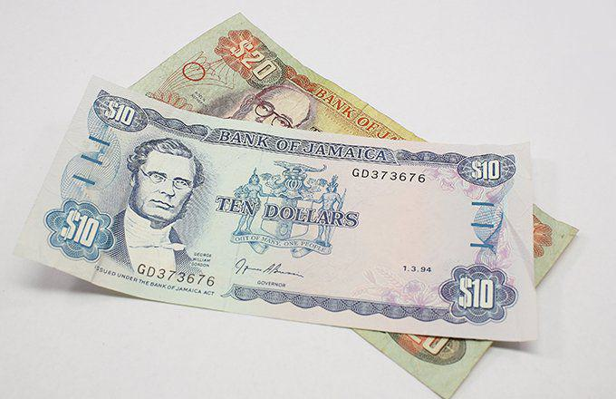

The Bahamas, an archipelagic state consisting of about 700 islands, is renowned for its breathtaking landscapes and vibrant culture. As an independent nation, it employs the Bahamian Dollar (BSD) as the official currency, a crucial component of its economic infrastructure. The Bahamian Dollar is pegged at a 1:1 ratio to the U.S. Dollar, ensuring stability in foreign exchange and fostering economic confidence. This peg simplifies trade and tourism transactions, which is essential given the Bahamas' reliance on these sectors.

The country’s economic framework is heavily anchored in tourism, financial services, and a few distinctive exports, which have all been influenced by global economic shifts and innovations in financial markets. A prominent evolution in these markets is the rise of algorithmic trading, which holds the potential to reshape the financial services landscape. This trading method uses algorithms to execute orders at speeds and frequencies impossible for human traders, thereby enhancing market efficiency and liquidity.

Following the COVID-19 pandemic, the need to adapt and innovate within financial systems became more pronounced. The economic effects of the pandemic highlighted vulnerabilities and underscored the importance of diversification and robust economic strategies. In this context, algorithmic trading emerges as a crucial innovation, offering the potential to streamline operations, reduce costs, and open new avenues for growth in the financial services sector.

As the Bahamas transitions into a post-COVID-19 economy, integrating algorithmic trading could provide a competitive edge, further stabilizing and diversifying its economy. This approach not only aligns with global financial practices but also reinforces the steady link between the Bahamian Dollar and its foundational role within both domestic and international markets. Understanding this evolving financial landscape is essential for the Bahamas to sustain economic growth and maintain its standing in the global arena.

## Table of Contents

## The Bahamian Dollar: An Overview

The Bahamian Dollar (BSD) is the official currency used by The Bahamas and is pegged at a fixed rate of 1:1 with the United States Dollar (USD). This peg is crucial for maintaining economic stability in The Bahamas, which is heavily dependent on tourism and financial services linked to the U.S. economy. The Central Bank of The Bahamas, established in 1974, is responsible for the issuance and management of the currency, which includes both banknotes and coins. 

The BSD is subdivided into 100 cents, with coins in denominations of 1, 5, 10, and 25 cents, and 1 dollar. Banknotes, on the other hand, are issued in denominations of 50, 100, 500, 1,000, and 5,000 dollars. The design of these banknotes holds special cultural significance as each one reflects the rich heritage and history of The Bahamas. These designs often include images of native flora and fauna, prominent national figures, and depictions of historical events, aimed at celebrating the Bahamian identity.

For instance, the reverse side of the banknotes frequently portrays symbols representing various aspects of Bahamian culture and history. This incorporation of cultural elements serves not only as a daily reminder of the nation's identity but also as a tool for educating citizens and visitors about the rich tapestry of Bahamian heritage.

The careful management of the Bahamian Dollar by the Central Bank, along with the currency's pegging to the USD, provides a stable monetary environment that is essential for facilitating trade and attracting foreign investment. This stability is especially important as The Bahamas continues to strengthen its financial service sector and tourism industry, which compose significant portions of its economy.

## Economic Role of the Bahamian Dollar

The Bahamian Dollar (BSD) plays an essential economic role in The Bahamas, where the economy is heavily supported by tourism, financial services, and unique exports such as lobster and rum. The stable value of the BSD, maintained by its 1:1 peg to the U.S. dollar, is pivotal in reinforcing the country's appeal as a premier tourism destination and a hub for international business.

The tourism sector, accounting for approximately 50% of the Gross Domestic Product (GDP) and providing employment to about half of the Bahamian workforce, benefits significantly from the BSD's stability. This peg reduces currency exchange risks for U.S. tourists, who form a considerable portion of the visitors to the archipelago. Moreover, the pegged rate fosters a seamless economic interaction between local businesses and their U.S.-based counterparts in the tourism and service industries.

In addition to tourism, the financial services sector is another pillar of the Bahamian economy. With the BSD's stability and convertibility to the U.S. dollar, The Bahamas has positioned itself as a global financial services centre, attracting offshore banking, insurance services, and wealth management. The peg fosters confidence among international clients looking for a stable economic environment to establish financial operations.

The COVID-19 pandemic posed significant challenges to the Bahamian economy, disrupting tourism and causing economic contraction. In response, the Central Bank of The Bahamas implemented several monetary policy measures to aid recovery, emphasizing maintaining the BSD's stable value and supporting [liquidity](/wiki/liquidity-risk-premium) in the financial system. These efforts included lowering the Discount Rate, encouraging local banks to provide loan relief to businesses and individuals, and issuing guidelines to ensure continuous banking service provision, even in lockdown conditions.

Recently, the country's post-pandemic recovery has been spurred by efforts to diversify the economy and enhance resilience. The Central Bank has supported policies promoting digital payments and introducing financial technologies, which contribute to financial inclusion and increased transaction efficiency. These steps align with broader economic recovery strategies aimed at stabilizing the financial services sector and revitalizing tourism, thereby ensuring sustainable economic growth and maintaining investor confidence in the Bahamian economy.

## Bahamian Economy in the Global Context

The Bahamas, known for its strategic position as an international tax haven, significantly influences its financial services sector. This role as a tax haven arises from the country's favorable tax laws, which provide structured opportunities for individuals and corporations to manage and shield their wealth. Offshore banking, reduced taxation, and stringent privacy laws bolster the appeal of the Bahamas to foreign investors and multinational corporations. Such an economic strategy aims to attract capital inflow, enhance foreign investment, and contribute meaningfully to the national GDP.

Significant events like the Panama Papers and the Bahamas Leaks have put global financial transparency and tax havens under scrutiny. The Panama Papers, a colossal leak of 11.5 million legal documents from the Panamanian law firm Mossack Fonseca, exposed the hidden financial dealings of numerous high-profile individuals and corporations. Similarly, the Bahamas Leaks revealed crucial data on offshore companies in the Bahamas, impacting perceptions regarding the country's financial arena.

These revelations have pressured global regulators to tighten the screws on financial secrecy and illicit financial activities. For the Bahamas, this means navigating a delicate balance between maintaining its lucrative financial services sector and complying with international transparency standards. The leaks ignited debates over legal and ethical financial practices, urging the Bahamas to reform its regulations. In response, measures like implementing more robust KYC (Know Your Customer) protocols and joining international efforts to curtail money laundering and tax evasion have been considered.

In this digital and interconnected world, the challenges for the Bahamian economy include safeguarding its reputation as a financial hub while adapting to increased demands for transparency and accountability. The country faces the threat of diminished attractiveness as a tax haven, prompting a re-evaluation of its economic strategies. Policymakers are urged to explore avenues that build resilience, such as diversifying the economy, fostering digital financial technologies, and enhancing regulatory frameworks.

However, these challenges bring opportunities for growth and modernization. By embracing digital innovations, the Bahamas can enhance its competitiveness in global markets. Investments in fintech, blockchain technology, and digital banking can serve as catalysts for economic transformation, offering new revenue channels and employment prospects. Additionally, aligning with international standards can improve the country's credibility, attracting reputable global businesses seeking compliant yet advantageous financial environments.

In conclusion, while the Bahamas navigates through the complexities of being a tax haven in a rapidly evolving financial landscape, its focus on adaptation and innovation will play a crucial role in sustaining economic growth and stability.

## Emergence of Algorithmic Trading

Algorithmic trading has revolutionized the landscape of financial markets by utilizing computer algorithms to execute trades at speeds and frequencies unimaginable to human traders. Its primary advantage lies in its ability to enhance market efficiency through the reduction of transaction costs, elimination of human error, and the execution of complex trading strategies based on real-time data analysis.

In the context of the Bahamian economy, which has a robust financial services sector, [algorithmic trading](/wiki/algorithmic-trading) presents several potential benefits. The Bahamas has positioned itself as an attractive destination for international banking and financial services, partly due to its regulatory environment and the strategic 1:1 pegging of the Bahamian Dollar to the U.S. Dollar. Algorithmic trading could further enhance the sector by facilitating improved liquidity, increased transparency, and more precise market pricing. This could attract more international investors looking for dynamic investment opportunities facilitated by cutting-edge trading technologies.

Regulatory perspectives on algorithmic trading in the Bahamas are crucial, given the potential risks associated with high-frequency trading, such as market manipulation and the exacerbation of financial [volatility](/wiki/volatility-trading-strategies). Authorities in the Bahamas must balance fostering innovation while safeguarding market integrity. The Central Bank of The Bahamas may need to augment its regulations by incorporating mechanisms to monitor and control algorithmic trading activities effectively. This could involve developing frameworks similar to those established by the Securities and Exchange Commission (SEC) or the Commodity Futures Trading Commission (CFTC) in the United States, which include stringent oversight and the requirement for robust risk management systems.

Innovation within the Bahamas to adapt to modern trade practices could involve investment in technological infrastructure and the education of a workforce skilled in financial technologies. Encouraging partnerships between local financial institutions and global fintech firms could facilitate the transfer of technology and expertise, aiding the development of indigenous capabilities in algorithmic trading. Additionally, initiatives to promote research and development in advanced trading systems within local universities and technology hubs could drive the sector's growth.

In conclusion, as the Bahamas continues to recover economically post-COVID-19, embracing algorithmic trading not only has the potential to modernize its financial services sector but also to secure a competitive edge in the global financial market. Enhanced regulatory frameworks and investment in innovation and education will be pivotal to realizing the full potential of algorithmic trading in the Bahamian context.

## Impact of Algorithmic Trading on the Bahamian Market

Algorithmic trading has increasingly become a focal point for the growth of financial services in the Bahamian market. This technological advancement promises greater efficiency and precision in executing trades, offering significant growth potential for the financial services sector. The integration of algorithmic trading strategies, tools, and technologies could reshape the Bahamian financial landscape, enhancing the country's market competitiveness and attracting a broader range of investors.

**Strategies, Tools, and Technologies**

Algorithmic trading involves using complex algorithms to execute orders based on a pre-defined set of rules and computational decision-making processes. Common strategies include statistical [arbitrage](/wiki/arbitrage), [market making](/wiki/market-making), and [trend following](/wiki/trend-following). These strategies capitalize on temporary mispricings, provide liquidity, and exploit directional price trends, respectively.

Tools such as automated trading platforms and software, data analytics tools, and real-time market data feeds play a crucial role in implementing algorithmic trading strategies. Advanced technologies like [machine learning](/wiki/machine-learning) and [artificial intelligence](/wiki/ai-artificial-intelligence) further enhance these tools by improving pattern recognition and market prediction capabilities.

For the Bahamian market, adopting such strategies and technologies can lead to increased trade efficiency and reduced transaction costs. This efficiency can be particularly advantageous in a financial services sector characterized by significant cross-border transactions and interactions.

**Impact on Local Investment and Economic Diversification**

The adoption of algorithmic trading can profoundly affect the Bahamian investment landscape. By increasing the market's sophistication and appeal to global investors, the Bahamas could see an influx of capital and a diversification of its investment pool. Algorithmic trading tends to increase market liquidity and reduce bid-ask spreads, making markets more attractive to investors. Additionally, algorithmic trading facilitates the entry of institutional investors who rely on precise and high-frequency trade executions.

Moreover, the diversification benefits extend beyond financial services to impact the broader Bahamian economy. With enhanced market efficiency and greater investment appeal, sectors such as tourism and real estate could also benefit indirectly from increased investor interest and economic activities. The Bahamas could position itself as a leader in the Caribbean for technological integration in financial markets, stimulating innovation and potentially fostering new business sectors around fintech and digital finance services.

The challenge for the Bahamas will be to develop a regulatory framework that ensures the integrity and stability of markets while encouraging innovation and competition. Striking the right balance between regulation and growth is vital for harnessing the full potential of algorithmic trading in the Bahamian market. By attracting skilled financial technologists and investing in local talent development, the nation can lay a strong foundation for future growth and economic resilience.

## Conclusion

The Bahamian Dollar (BSD) plays a crucial role in maintaining the national identity and economic stability of The Bahamas. Its 1:1 peg with the U.S. dollar provides a level of currency stability that is vital for sustaining the country's significant tourism industry and encouraging foreign investment. The stability of the BSD underpins The Bahamas' economy, which is heavily reliant on sectors such as tourism, financial services, and select exports.

As the country navigates through the post-COVID-19 economic recovery, the integration of algorithmic trading into the Bahamian financial landscape emerges as a substantial opportunity. Algorithmic trading can enhance the efficiency and competitiveness of financial services by employing advanced technologies and strategies to optimize trading decisions. This evolution in trading presents the potential for growth and diversification within the local investment landscape, crucial for adapting to an increasingly digital and globalized economy.

For The Bahamas to maintain its economic [momentum](/wiki/momentum) and prowess on the international stage, fostering innovation within its financial sector is imperative. By embracing algorithmic trading, The Bahamas can modernize its financial market infrastructure, thereby attracting more foreign investment and expanding its economic activities. This modernization, coupled with continuous economic recovery efforts, is essential for sustaining long-term growth and securing a competitive edge in the global market. Through strategic advancements and a commitment to innovation, The Bahamas can ensure the robust economic health needed to prosper in an interconnected world.

## References & Further Reading

[1]: ["The Bahamas - Banking and Securities"](https://www.centralbankbahamas.com/publications/financial-stability-report/financial-stability-report-2023) from the Library of Congress

[2]: ["Central Bank of The Bahamas"](https://www.centralbankbahamas.com/) website

[3]: Lopez de Prado, M. (2018). ["Advances in Financial Machine Learning."](https://www.amazon.com/Advances-Financial-Machine-Learning-Marcos/dp/1119482089) Wiley.

[4]: Chan, E. (2008). ["Quantitative Trading: How to Build Your Own Algorithmic Trading Business."](https://github.com/justinchou/books-quantitative-trading) Wiley.

[5]: Aronson, D. R. (2007). ["Evidence-Based Technical Analysis: Applying the Scientific Method and Statistical Inference to Trading Signals."](https://www.amazon.com/Evidence-Based-Technical-Analysis-Scientific-Statistical/dp/0470008741) Wiley.

[6]: Jansen, S. (2020). ["Machine Learning for Algorithmic Trading."](https://github.com/stefan-jansen/machine-learning-for-trading) Packt Publishing.

[7]: Bergstra, J., Bardenet, R., Bengio, Y., & Kégl, B. (2011). ["Algorithms for Hyper-Parameter Optimization."](https://dl.acm.org/doi/10.5555/2986459.2986743) Advances in Neural Information Processing Systems 24.