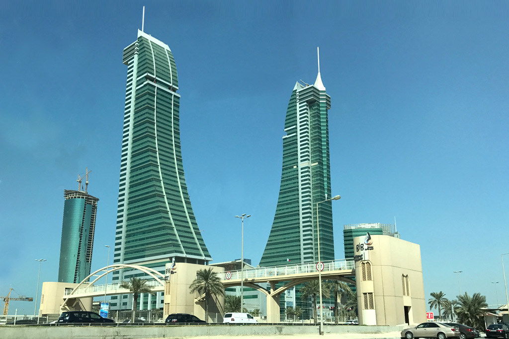

## Table of Contents

## What is the Bahrain Stock Exchange (BSE)?

The Bahrain Stock Exchange (BSE) is a place where people can buy and sell shares of companies in Bahrain. It helps companies get money by selling parts of their business to the public. People who buy these shares become part owners of the company and can make money if the company does well.

The BSE started in 1987 and is run by the Central Bank of Bahrain. It has different types of markets, like the main market for big companies and the junior market for smaller ones. The BSE helps the economy grow by making it easier for businesses to raise money and for people to invest in them.

## How can one start investing in the Bahrain Stock Exchange?

To start investing in the Bahrain Stock Exchange, you first need to open a trading account with a brokerage firm that is licensed by the Central Bank of Bahrain. You can find these firms by visiting the BSE's website or by asking for recommendations from friends or financial advisors. Once you choose a brokerage, you'll need to fill out an application form and provide some personal information and documents like your ID and proof of address. After your account is approved, you'll be able to deposit money into it to start trading.

After setting up your account, you can begin investing by choosing which companies you want to buy shares in. You can do this by researching the companies listed on the BSE, looking at their financial reports, and deciding which ones you think will do well in the future. Once you've made your choices, you can place orders through your brokerage's trading platform. It's a good idea to start small and learn as you go, and maybe even talk to a financial advisor to get some tips on how to invest wisely.

## What are the main indices of the Bahrain Stock Exchange?

The Bahrain Stock Exchange has two main indices that help people understand how the market is doing. The first one is called the Bahrain All Share Index (BASI). This index shows how all the companies listed on the BSE are doing overall. It gives a broad picture of the market's performance by including all the companies, no matter their size or what they do.

The second main index is the Bahrain Islamic Index (BII). This index only includes companies that follow Islamic financial rules. These rules are based on Sharia law and avoid things like interest and certain types of debt. The BII is important for investors who want to make sure their investments follow these religious guidelines. Both indices help investors see how different parts of the market are doing and make better decisions about where to put their money.

## What types of securities are traded on the Bahrain Stock Exchange?

The Bahrain Stock Exchange (BSE) is a place where different types of securities are traded. The main types of securities you can find there are stocks and bonds. Stocks are pieces of ownership in a company. When you buy a stock, you become a part owner of that company and can make money if the company does well. Bonds, on the other hand, are like loans that you give to a company or the government. They promise to pay you back with interest over time.

In addition to stocks and bonds, the BSE also trades other financial products like mutual funds and exchange-traded funds (ETFs). Mutual funds are collections of stocks and bonds managed by professionals, making it easier for people to invest in a variety of securities at once. ETFs are similar but are traded like stocks on the exchange. These different types of securities give investors many choices for how they want to invest their money on the BSE.

## How does the Bahrain Stock Exchange regulate trading activities?

The Bahrain Stock Exchange (BSE) works hard to make sure trading is fair and safe. It does this by following rules set by the Central Bank of Bahrain. The BSE watches over all the trading that happens every day to stop any bad behavior, like insider trading or market manipulation. They use special computer systems to keep an eye on everything and make sure everyone follows the rules. If someone breaks the rules, the BSE can take action against them, like fining them or even stopping them from trading.

The BSE also makes sure that all the companies listed on the exchange give out honest and clear information. This means companies have to share important details about their business, like how much money they are making or losing, and any big changes happening. This helps people make smart choices about buying and selling stocks. The BSE checks this information to make sure it is true and complete. By doing all these things, the BSE helps keep the market fair and trustworthy for everyone.

## What are the trading hours of the Bahrain Stock Exchange?

The Bahrain Stock Exchange (BSE) has specific times when people can buy and sell stocks. The trading hours are from 9:30 AM to 12:30 PM, Monday through Friday. This means you can trade for three hours each day during the weekdays.

If you want to trade outside these hours, you can't do it directly on the BSE. But you can still plan your trades or look at the market information at any time. It's good to know these hours so you can be ready to trade when the market is open.

## How has the Bahrain Stock Exchange performed historically?

The Bahrain Stock Exchange (BSE) has had ups and downs over the years. It started in 1987, and since then, it has grown a lot. In the early years, it was small, but as more companies joined and more people started trading, it got bigger. The BSE has seen some good times, like when the economy was doing well and more people were buying stocks. But it has also faced tough times, like during global financial crises when the market went down and people lost money.

In recent years, the BSE has been working to improve and attract more investors. It has introduced new rules to make trading safer and more transparent. The BSE has also added new types of investments, like Islamic funds, to appeal to a wider range of people. Overall, while the BSE has had its challenges, it continues to be an important part of Bahrain's economy, helping companies raise money and giving people a chance to invest and grow their wealth.

## What are the major companies listed on the Bahrain Stock Exchange?

The Bahrain Stock Exchange has many important companies listed that people can invest in. Some of the biggest ones are from the banking and finance sector. For example, there's the National Bank of Bahrain, which is one of the oldest and biggest banks in the country. Another big one is the Bahrain Islamic Bank, which follows Islamic finance rules and is very popular among investors who want to follow those rules. There are also other banks like Ahli United Bank and Bank of Bahrain and Kuwait that are well-known and have a lot of shares traded on the exchange.

Apart from banks, there are also big companies from other industries. For instance, the Bahrain Telecommunications Company (Batelco) is a major player in the telecom sector and is well-known across the region. In the energy sector, you have companies like Bapco Energies, which is involved in oil and gas and plays a big role in Bahrain's economy. These companies are important because they help drive the economy and give investors a chance to own a piece of them by buying their stocks.

Overall, the Bahrain Stock Exchange has a mix of companies from different fields, but the banking and finance sector stands out with many big names. The presence of these major companies makes the BSE an attractive place for investors looking to grow their money by investing in well-established businesses in Bahrain.

## What role does the Bahrain Stock Exchange play in the national economy?

The Bahrain Stock Exchange (BSE) is very important for Bahrain's economy. It helps companies get money by letting them sell shares to the public. When companies sell shares, they can use the money to grow their business, create new jobs, and help the economy get bigger. The BSE also makes it easy for people to invest their money in these companies, which can help them save for the future or make more money.

The BSE also helps keep the economy stable. By having rules and watching over trading, it makes sure that the market is fair and safe for everyone. This builds trust in the market, which is good for the economy. When people trust the market, they are more likely to invest, and this can lead to more money flowing into businesses and helping them grow. Overall, the BSE plays a big role in making Bahrain's economy stronger and helping it grow.

## How does the Bahrain Stock Exchange compare to other stock exchanges in the region?

The Bahrain Stock Exchange (BSE) is smaller than some of the other stock exchanges in the region, like the Saudi Stock Exchange (Tadawul) and the Dubai Financial Market (DFM). These bigger exchanges have more companies listed and more people trading on them. But the BSE is still important for Bahrain's economy. It helps local companies get money to grow and gives people in Bahrain a place to invest their money.

Even though the BSE is smaller, it has some special things that make it different. For example, it has a strong focus on Islamic finance, with the Bahrain Islamic Index (BII) for people who want to follow Islamic investment rules. The BSE also works hard to keep trading safe and fair, which helps build trust among investors. Compared to bigger exchanges, the BSE might not have as many big international companies, but it plays a big role in helping Bahrain's economy grow and stay stable.

## What are the recent developments and future plans for the Bahrain Stock Exchange?

The Bahrain Stock Exchange has been working hard to improve and grow. One big change is that they've been using new technology to make trading easier and faster. They've also been working on making the rules clearer and stronger to keep trading fair and safe. Another important thing they've done is to start new types of investments, like Islamic funds, to attract more people who want to follow Islamic finance rules. These changes have helped the BSE become more modern and appealing to investors.

Looking ahead, the Bahrain Stock Exchange has big plans to keep growing. They want to bring in more companies to list on the exchange, which will give investors more choices. They're also planning to work with other stock exchanges in the region to make it easier for people to trade across borders. The BSE wants to keep using new technology to make trading even better and to keep making sure the market stays fair and safe for everyone. By doing these things, the BSE hopes to play an even bigger role in helping Bahrain's economy grow and stay strong.

## What advanced trading strategies can be applied in the Bahrain Stock Exchange?

When trading on the Bahrain Stock Exchange, one advanced strategy you can use is called "[momentum](/wiki/momentum) trading." This means you watch the market closely to see which stocks are going up fast. When you find a stock that is moving up quickly, you buy it, hoping it will keep going up so you can sell it later for a profit. This strategy needs you to keep an eye on the market all the time and be ready to act fast. It can be risky because if the stock suddenly goes down, you could lose money. But if you're good at spotting trends, it can be a way to make more money.

Another strategy is "value investing." This is when you look for companies that you think are worth more than their current stock price. You do a lot of research to find these companies, looking at their financial reports and seeing how well they are doing. Once you find a company that you think is undervalued, you buy its stock and hold onto it for a long time, waiting for other people to realize its true value and for the stock price to go up. This strategy takes patience and a lot of research, but it can be a good way to build wealth over time.

A third strategy to consider is "diversification." Instead of putting all your money into one stock, you spread it out over many different stocks and types of investments. This can help lower your risk because if one stock goes down, you still have others that might go up. On the Bahrain Stock Exchange, you can diversify by investing in different sectors like banking, telecom, and energy. By using this strategy, you can protect your money and still have a chance to make a profit.

## References & Further Reading

[1]: Lopez de Prado, M. (2018). ["Advances in Financial Machine Learning."](https://www.amazon.com/Advances-Financial-Machine-Learning-Marcos/dp/1119482089) Wiley.

[2]: Aronson, D. R. (2006). ["Evidence-Based Technical Analysis: Applying the Scientific Method and Statistical Inference to Trading Signals."](https://www.amazon.com/Evidence-Based-Technical-Analysis-Scientific-Statistical/dp/0470008741) Wiley.

[3]: Chan, E. P. (2009). ["Quantitative Trading: How to Build Your Own Algorithmic Trading Business."](https://github.com/ftvision/quant_trading_echan_book) Wiley.

[4]: Jansen, S. (2020). ["Machine Learning for Algorithmic Trading: Predictive Models to Extract Signals from Market and Alternative Data for Systematic Trading Strategies with Python."](https://github.com/stefan-jansen/machine-learning-for-trading) Packt Publishing.

[5]: Bergstra, J., Bardenet, R., Bengio, Y., & Kégl, B. (2011). ["Algorithms for Hyper-Parameter Optimization."](https://dl.acm.org/doi/10.5555/2986459.2986743) Advances in Neural Information Processing Systems 24.