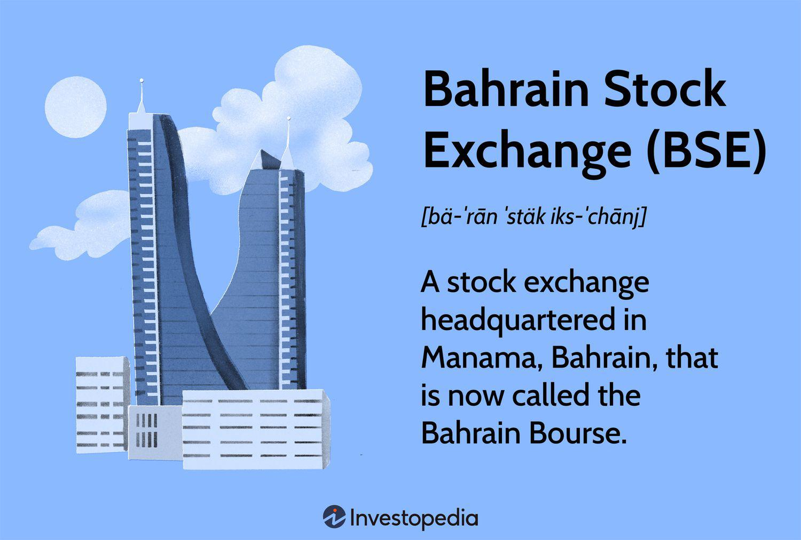

The Bahrain Stock Exchange (BSE), established as a pivotal financial institution in the Gulf Cooperation Council (GCC) region, has played a significant role in the Middle East's financial landscape. Originally inaugurated in 1987, the BSE facilitated the trading of securities and served as a critical platform for capital raising, thereby contributing to the economic development of Bahrain. Its importance was not just confined to the national level; the BSE formed an integral part of the GCC financial markets, offering a gateway for investors seeking exposure to this economically vibrant region.

In 2010, the BSE underwent a transformative restructuring, leading to the establishment of the Bahrain Bourse. This transition marked a strategic initiative to modernize Bahrain's financial infrastructure, aligning with international standards and practices. The change reflected a broader commitment to enhancing market efficiency, transparency, and investor protection. The restructuring aimed to broaden the market offerings, incorporating advanced trading systems to facilitate a wider array of financial instruments, thus attracting a diverse investor base.



Algorithmic trading, a sophisticated method utilizing computer algorithms to execute trading orders at high speed, has revolutionized modern financial markets. This approach capitalizes on mathematical models and data analysis to make informed trading decisions, minimizing human intervention and thereby reducing the potential for errors. The impact of algorithmic trading is profound; it has increased market liquidity, optimized pricing, and fostered more efficient market dynamics.

Within the context of the Bahrain Bourse, algorithmic trading holds significant relevance. As the Bourse aims to align with global financial practices, integrating algorithmic trading represents a strategic move to enhance its competitive edge. This adoption facilitates greater liquidity and efficiency, attracting international investors who seek technologically advanced trading environments. Moreover, algorithmic trading platforms support the diversification of investment products available on the Bahrain Bourse, further cementing its position as a dynamic financial hub in the region.

In summary, the evolution from the Bahrain Stock Exchange to Bahrain Bourse is a reflection of Bahrain's broader ambition to modernize its financial sector. The incorporation of algorithmic trading not only underscores the Bourse's commitment to technological innovation but also signals its intent to maintain relevance and competitiveness in an increasingly digital global financial market.

## Table of Contents

## Historical Background of Bahrain Stock Exchange

The Bahrain Stock Exchange (BSE) was established in 1987 as an essential component of Bahrain's strategic initiative to enhance its financial sector and diversify its economy. Initially, BSE played a pivotal role in creating a structured financial market within Bahrain, allowing for more organized trading activities in stocks and bonds. For nearly two decades, the BSE served as a critical platform for local and regional investors, providing them an avenue for capital formation and a mechanism for capital allocation within the economy.

In 2010, the transition from the Bahrain Stock Exchange to the Bahrain Bourse marked a significant evolution in Bahrain's financial landscape. This transformation was driven by the need to modernize the exchange's infrastructure and operations to align with international standards and practices. The decision to rebrand and revamp the stock exchange was also influenced by the growing importance of digital trading and the need to integrate more advanced technological solutions to stay competitive in the global financial market.

Several milestones in the history of the Bahrain Stock Exchange underscore its impact on the region's financial framework. One notable achievement was the launch of an electronic trading system that replaced the traditional open-outcry floor trading. This shift not only increased efficiency and transparency in trading processes but also attracted a broader range of participants, including institutional and international investors.

Another critical development was the expansion of financial instruments available for trading. Initially limited to equities and bonds, the BSE gradually introduced additional products such as mutual funds and Islamic financial instruments, addressing the diverse needs of Bahrain's investor community and reflecting the country's commitment to Sharia-compliant financial practices.

Furthermore, the establishment of strategic partnerships and collaborations with other regional and international exchanges significantly boosted the credibility and reach of the BSE. These alliances enabled knowledge sharing, technological upgrades, and facilitated greater [liquidity](/wiki/liquidity-risk-premium) through cross-border trading activities.

The transition to the Bahrain Bourse was not merely a rebranding exercise but constituted a comprehensive overhaul in regulatory frameworks and operational strategies. This evolution was aimed at fostering a robust investment environment that could adapt to the dynamic global financial landscape and technological advancements. By embracing these changes, the Bahrain Bourse succeeded in enhancing its role as a key financial hub in the Middle East, continuing to attract investment and contributing to the economic growth of Bahrain.

## Current Structure and Functioning of Bahrain Bourse

Bahrain Bourse, established as the successor to the Bahrain Stock Exchange, plays a pivotal role in the nation's financial landscape by offering a platform for various financial instruments. The structure of Bahrain Bourse is designed to facilitate the trading of different segments, including equities, indexes, and derivatives.

**Segments Traded on Bahrain Bourse**

1. **Equities**: Equities represent a significant portion of the trading activity on Bahrain Bourse. These include common shares of local and international companies that are listed and traded. Investors can participate in the growth of various sectors such as banking, telecommunications, and industrial services by acquiring shares.

2. **Indexes**: Bahrain Bourse offers trading in indexes that track the performance of multiple stocks. These indexes provide investors with a metric to gauge the overall health and trend of the market. They serve as benchmarks for portfolio performance and are crucial for index-based investment strategies.

3. **Derivatives**: Although the market for derivatives is not as developed as equities or indexes, Bahrain Bourse is expanding its offerings to include products such as options and futures. These instruments allow investors to hedge risks or speculate based on their market outlook, thereby adding depth to the financial markets.

**Services Offered by Bahrain Bourse**

Bahrain Bourse provides a comprehensive suite of services that enhance market functionality and integrity:

- **Listing Services**: The Bourse facilitates the listing of companies by providing them access to capital and increased visibility. This service is integral for both new and existing companies aiming to raise funds and expand their investor base.

- **Trading Services**: Advanced trading systems support effective and efficient trading activities. The Bourse ensures transparency and liquidity within the market, allowing investors to execute buy and sell orders with ease.

- **Settlement Services**: A robust settlement system is in place to ensure the secure and timely completion of transactions. This service minimizes counterparty risk and ensures that the transfer of securities and funds is carried out smoothly.

- **Depository Services**: Bahrain Bourse operates a secure depository that maintains electronic records of securities. The depository service ensures the safekeeping and transferability of securities, thereby enhancing investor confidence.

**Regulatory Framework and the Role of the Central Bank of Bahrain**

Bahrain Bourse maintains its operations as a self-regulated entity, which means it oversees its activities to ensure fair and orderly markets. It establishes rules and regulations to protect investors and ensure operational integrity. However, the Central Bank of Bahrain (CBB) plays a crucial role as the overarching regulatory authority. The CBB sets the regulatory framework within which Bahrain Bourse operates, ensuring alignment with international best practices and standards. This dual-layer governance structure enhances the credibility and reliability of the financial market in Bahrain.

 to Algorithmic Trading

Algorithmic trading is a sophisticated method of executing trades that employs pre-defined instructions for variables such as timing, price, and [volume](/wiki/volume-trading-strategy). These instructions, or algorithms, enable the execution of orders to be automated and makes decisions to buy or sell financial instruments in the electronic financial markets. The importance of [algorithmic trading](/wiki/algorithmic-trading) in financial markets is underscored by its ability to process a large quantity of market data and execute trades at speeds that are impossible for human traders to achieve. This method of trading is crucial in modern financial markets due to its role in facilitating high-frequency trading ([HFT](/wiki/high-frequency-trading-strategies)), which enhances market liquidity and efficiency.

The technology behind algorithmic trading involves a combination of data science, advanced computational techniques, and high-speed network infrastructure. The algorithms are developed using complex mathematical models and quantitative analysis, which may include statistical [arbitrage](/wiki/arbitrage) strategies, market-making strategies, and execution-based strategies among others. These strategies benefit from using big data analytics and [machine learning](/wiki/machine-learning) to refine the trading process, adjust to market trends, and predict future price movements.

Python is a popular programming language used in developing algorithms due to its comprehensive libraries and tools for data analysis and its simplicity in handling large datasets. For instance, the 'pandas' library is widely used for data manipulation and analysis, while 'numpy' provides support for large, multi-dimensional arrays and matrices, along with a plethora of mathematical functions to perform operations on these arrays. The following simple Python snippet exemplifies how one could use an algorithm to identify moving average crossovers, which is a typical buy/sell indicator:

```python
import pandas as pd

# Sample data loading
data = pd.read_csv('market_data.csv')
short_window = 40
long_window = 100

# Calculate short-term moving average
data['short_mavg'] = data['close'].rolling(window=short_window, min_periods=1).mean()

# Calculate long-term moving average
data['long_mavg'] = data['close'].rolling(window=long_window, min_periods=1).mean()

# Generate trading signals
data['signal'] = 0.0
data['signal'] = data.apply(lambda row: 1.0 if row['short_mavg'] > row['long_mavg'] else 0.0, axis=1)

# Generate trading orders
data['positions'] = data['signal'].diff()
```

This code calculates the moving averages over the specified short and long windows for price data and generates signals based on the crossover of these averages. The signal '1.0' indicates a buy order when the short-term moving average crosses above the long-term moving average.

The key benefits of algorithmic trading are multi-faceted. Primarily, it significantly increases the speed, efficiency, and accuracy of trading by minimizing the emotional and psychological influences that can lead to human error. It ensures that trading strategies are executed more precisely and consistently than manual trading. Additionally, algorithmic trading allows for the efficient scanning of a breadth of securities across various exchanges, enabling traders to leverage arbitrage opportunities that might not otherwise be apparent. Finally, the automation inherent in algorithmic trading can significantly reduce transaction costs by optimizing the execution of large orders and minimizing market impact.

In summary, algorithmic trading transforms the execution of trades by enabling automated, data-driven decision making. The integration of sophisticated technologies and advanced computational methodologies not only enhances the speed and efficiency of trades but also provides traders and investors with a strategic edge in navigating the complexities of modern markets.

## Algorithmic Trading in Bahrain Bourse

Bahrain Bourse has embraced algorithmic trading to enhance its operational efficiency and provide advanced trading solutions for market participants. Algorithmic trading, which involves the use of computer algorithms to automate trading decisions, is now a significant part of the trading landscape within the Bourse. This integration underscores Bahrain Bourse's commitment to technological advancements and aligns with global trends in the financial markets.

Bahrain Bourse has developed an infrastructure that supports algorithmic trading by providing low latency trading environments and access to real-time data feeds. This allows traders to implement complex trading strategies that rely on rapid execution and detailed market analysis. The Bourse’s infrastructure is designed to facilitate a seamless trading experience, minimizing execution time which is crucial for high-frequency trading strategies.

The regulatory framework for algorithmic trading in Bahrain is governed by the Central Bank of Bahrain, which sets forth guidelines to ensure fair and transparent trading practices. This framework establishes parameters to monitor algorithmic trading activities, preventing market abuse and ensuring market integrity. Regulations mandate that all algorithmic trading systems must incorporate risk management mechanisms to mitigate potential impacts on market [volatility](/wiki/volatility-trading-strategies).

Several successful use cases highlight the integration of algorithmic trading within Bahrain Bourse. For instance, institutional investors have leveraged algorithmic strategies to optimize their portfolio management, achieving better pricing and improved liquidity management. Moreover, market makers utilize algorithms to maintain [order book](/wiki/order-book-trading-strategies) equilibrium, ensuring continuous availability of buy and sell quotes for various securities.

Bahrain Bourse's commitment to embracing algorithmic trading is evident through continuous investment in technological upgrades and partnerships with global technology providers. This focus on innovation not only enhances the trading experience for market participants but also positions Bahrain as a competitive hub in the international financial market.

The integration of algorithmic trading within Bahrain Bourse reflects the ongoing evolution of financial markets, where technology plays a pivotal role in shaping trading dynamics and strategies. As the Bourse continues to innovate and adapt, algorithmic trading will remain a critical component of its operational framework, offering numerous opportunities for traders and investors in Bahrain and beyond.

## Challenges and Opportunities for Algo Trading in Bahrain

Algorithmic trading in Bahrain presents a unique set of challenges and opportunities that reflect the broader context of its burgeoning financial market. As algorithmic trading becomes increasingly significant, understanding these dynamics is crucial for stakeholders within the Bahrain Bourse and beyond.

One of the main challenges faced by algorithmic traders in Bahrain is navigating the regulatory environment. While the Bahrain Bourse and the Central Bank of Bahrain have established frameworks to govern trading activities, the rapid evolution of technology often outpaces regulatory updates. This can create ambiguity or constraints for traders looking to implement sophisticated algorithms that require clarity in regulatory compliance. Ensuring that algorithmic strategies adhere to market fairness and transparency requirements without contradicting existing regulations is a continuous balancing act.

Technological limitations present another significant hurdle. Although Bahrain is making strides in improving its technological infrastructure, algorithmic trading requires highly advanced computational capabilities and real-time data processing. Traders need access to cutting-edge technology and high-speed internet to fully leverage their algorithms, which may not yet be uniformly available. Moreover, integrating these systems with existing market structures can be costly and complex, potentially deterring widespread adoption.

Despite these challenges, numerous opportunities for growth and expansion exist in Bahrain’s algorithmic trading landscape. The strategic geographical position of Bahrain provides advantageous access to the Middle Eastern and global markets, allowing for cross-border trading activities that could be optimized using algorithmic methods. Additionally, as the global financial sector increasingly embraces fintech, Bahrain has the potential to attract investment and talent by positioning itself as a regional hub for financial innovation.

The adoption of algorithmic trading can also generate significant efficiencies in the market, including increased liquidity, reduced transaction costs, and minimized human error. These improvements can enhance market confidence and attract both domestic and international investors, creating a virtuous cycle of investment and growth.

Furthermore, embracing algorithmic trading can align with Bahrain’s broader economic vision of diversification and modernization. By fostering a supportive ecosystem for fintech innovation, Bahrain can capitalize on the expertise and technology associated with algorithmic trading, thus enhancing its financial sector's global competitiveness.

In conclusion, while algorithmic trading in Bahrain faces challenges, particularly in the regulatory and technological domains, the opportunities for economic growth and market efficiency are significant. Addressing these challenges head-on can position Bahrain as a leader in financial innovation, benefiting traders, investors, and the broader economy.

## Future Outlook

Forecasting the future of Bahrain's financial market within the context of algorithmic trading involves examining several key trends and potential technological advancements. As Bahrain continues to position itself as a financial hub in the Middle East, adopting and integrating new technologies will play a crucial role in shaping its financial landscape.

Algorithmic trading, which refers to the use of computer algorithms to execute trades at high speeds and volumes, is expected to gain prominence on the Bahrain Bourse. Technological advancements such as [artificial intelligence](/wiki/ai-artificial-intelligence) (AI) and machine learning (ML) are likely to enhance the capabilities of algorithmic trading systems. AI can be used to identify patterns and predict market movements more accurately, while ML can enable systems to adapt to new data and refine trading strategies over time.

The deployment of blockchain technology could revolutionize trade settlement processes. Blockchain can offer enhanced transparency, reduced settlement times, and lower operational costs. By streamlining procedures and ensuring secure transactions, blockchain could significantly increase the efficiency of Bahrain Bourse operations.

Furthermore, the introduction of 5G technology is anticipated to impact trading activities. With faster data transmission and reduced latency, 5G can facilitate real-time data analysis and quicker decision-making, which are crucial for executing algorithmic trades effectively.

Policy changes are another [factor](/wiki/factor-investing) that could influence the future trajectory of Bahrain's financial markets. Regulatory bodies may need to adapt existing frameworks to accommodate advancements in technology and the complexities of algorithmic trading. Policymakers could focus on creating a balanced regulatory environment that encourages innovation while ensuring market stability and protecting investor interests.

As Bahrain strives to attract more foreign investment, regulatory clarity and robust cybersecurity measures will be critical. Investors will seek assurance that the markets are both advanced and secure, minimizing risks associated with automated trading systems.

Overall, the future outlook for Bahrain's financial market involves a blend of technological advancements and evolving regulatory landscapes. These elements will inevitably shape trading dynamics on the Bahrain Bourse, offering both challenges and opportunities for traders and investors. By embracing cutting-edge technologies and fostering a conducive policy environment, Bahrain can potentially enhance its competitiveness on the global financial stage.

## Conclusion

The transformation from the Bahrain Stock Exchange (BSE) to the Bahrain Bourse signifies a significant leap in the region's financial infrastructure, marking a modernization of operations and services to align with global standards. This evolution has not only enhanced the operability and attractiveness of Bahrain's financial market but has also set the stage for the incorporation of advanced trading practices, such as algorithmic trading. 

Algorithmic trading, characterized by the use of computer algorithms to automate trading decisions, has had a profound impact on modern financial markets, including the Bahrain Bourse. Its integration has brought about increased efficiency, speed, and precision in trading activities. By automating processes, it reduces human error and allows traders to exploit market conditions instantaneously. This capability is particularly valuable in high-frequency trading environments where milliseconds can determine profitability.

The key takeaway from the integration of cutting-edge technology like algorithmic trading into Bahrain's financial market is the enhanced competitiveness and innovation it fosters. By adopting such technologies, Bahrain Bourse not only improves its market dynamics but also attracts a broader investor base, including international players who view algorithmic trading as a staple of modern financial markets.

Stakeholders in Bahrain's financial sector should thoroughly consider the implications of algorithmic trading on their operations. This involves understanding not only the potential benefits but also the challenges, such as technological requirements and regulatory compliance. Embracing these technologies could lead to substantial opportunities for growth and development, positioning Bahrain as a progressive player in the global financial arena.

Ultimately, the evolution from BSE to Bahrain Bourse and the incorporation of algorithmic trading reflect Bahrain's commitment to innovation and modernization. This strategic direction provides a strong foundation for future advancements and establishes Bahrain Bourse as a significant player in the global market, equipped with the tools necessary to navigate and capitalize on the rapidly evolving financial landscape.

## References & Further Reading

[1]: Lopez de Prado, M. (2018). ["Advances in Financial Machine Learning."](https://www.amazon.com/Advances-Financial-Machine-Learning-Marcos/dp/1119482089) Wiley.

[2]: Aronson, D. R. (2006). ["Evidence-Based Technical Analysis: Applying the Scientific Method and Statistical Inference to Trading Signals."](https://www.amazon.com/Evidence-Based-Technical-Analysis-Scientific-Statistical/dp/0470008741) Wiley.

[3]: Chan, E. P. (2009). ["Quantitative Trading: How to Build Your Own Algorithmic Trading Business."](https://github.com/ftvision/quant_trading_echan_book) Wiley.

[4]: Jansen, S. (2020). ["Machine Learning for Algorithmic Trading: Predictive Models to Extract Signals from Market and Alternative Data for Systematic Trading Strategies with Python."](https://github.com/stefan-jansen/machine-learning-for-trading) Packt Publishing.

[5]: Bergstra, J., Bardenet, R., Bengio, Y., & Kégl, B. (2011). ["Algorithms for Hyper-Parameter Optimization."](https://dl.acm.org/doi/10.5555/2986459.2986743) Advances in Neural Information Processing Systems 24.