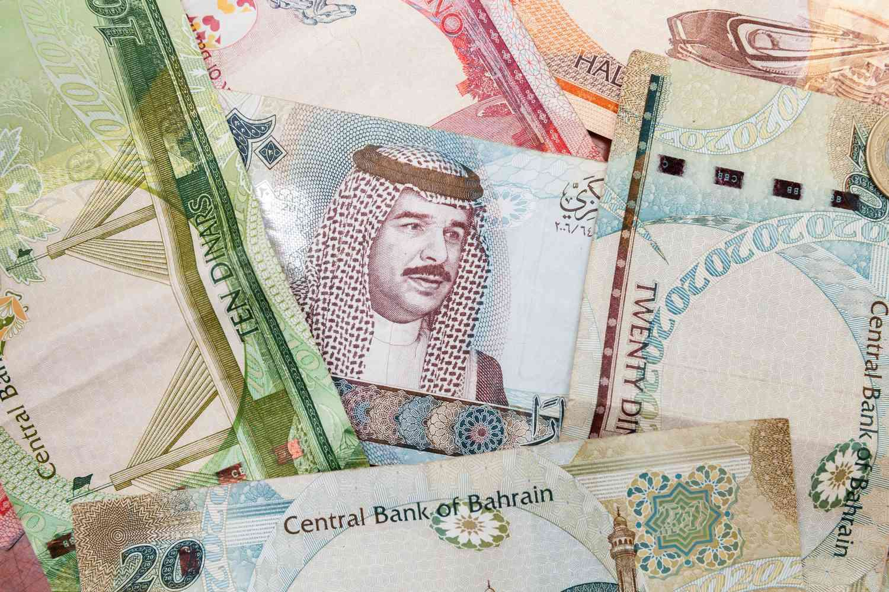

The Middle East is a region of significant economic potential and diversity, characterized by its strategic importance in global trade and finance. Currencies in this area are crucial to economic interactions on a global scale, and among these, the Bahraini Dinar (BHD) emerges as one of the most valuable. The Bahraini Dinar's strong position is reflective of Bahrain's resource-rich economy and financial stability in the region.

The Bahraini Dinar stands out particularly for its high value and stability, being pegged to the US Dollar at a fixed rate. This peg provides a conducive environment for foreign investments, ensuring currency stability that is appealing to both regional and international investors. The currency's high valuation also underscores Bahrain's robust economic sectors, notably oil and finance, which are integral to the country's gross domestic product (GDP) and overall financial health.

This article examines the mechanisms that underpin the Bahraini Dinar's strength, covering its role within Bahrain's economic framework, which includes a thriving oil and gas industry alongside economic diversification efforts in financial services, tourism, and manufacturing. Algorithmic trading, a modern trading technique, is also reshaping currency markets, enhancing efficiencies and forecasting abilities. The integration of algorithmic trading tools into the currency markets, especially those involving high-value currencies like the Bahraini Dinar, provides opportunities for more precise market predictions and optimal trading outcomes, which could transform how currencies are traded globally.

Understanding the nuances of the Bahraini Dinar and its role within the broader scope of Middle Eastern economies allows stakeholders to navigate the complexities of currency trading and leverage the advancements in trading technologies effectively. This knowledge is essential not only for preserving the economic benefits that the Dinar brings to Bahrain but also for investors seeking lucrative opportunities in a digitally evolving trading landscape.

## Table of Contents

## Understanding the Bahraini Dinar

The Bahraini Dinar (BHD) was introduced in 1965, effectively replacing the Gulf Rupee as the official currency of Bahrain. This transition marked a significant step in solidifying Bahrain's economic identity, as the nation shifted towards broader financial independence and stability. The Bahraini Dinar is pegged to the US Dollar, with an exchange rate of 1 BHD to approximately 2.65 USD, a rate that has largely remained stable over the years. This peg provides a substantial degree of economic predictability, creating a favorable environment for foreign investors by minimizing exchange rate volatility.

The currency is available in multiple denominations, encompassing both banknotes and coins, which facilitates a comprehensive range of transactions. Banknotes are issued in values of 0.5, 1, 5, 10, and 20 dinars, while coins are available in fils denominations: 5, 10, 25, 50, and 100 fils (1 dinar = 1000 fils). This variety accommodates both domestic day-to-day transactions and larger international trades, cementing the Dinar's role as a versatile instrument in the financial markets.

The high value attributed to the Bahraini Dinar is reflective of Bahrain’s vigorous economic sectors, chiefly the oil and finance industries. The oil sector, traditionally a cornerstone of Bahrain’s economy, continues to contribute significantly to the country's fiscal health. Alongside oil, the financial services sector has expanded considerably, drawing on Bahrain's strategic location and robust regulatory framework to attract banking and finance businesses.

This combination of a US Dollar peg and strong economic foundations enhances the credibility and demand for the Bahraini Dinar in international trade and investment. Consequently, the Bahraini Dinar not only functions as the backbone of Bahrain's domestic economy but also plays an influential role in the broader Middle Eastern economic ecosystem.

## Bahrain's Economic Landscape

Bahrain's economy is robust and multifaceted, with the oil and gas sector serving as its cornerstone. This sector contributes significantly to government revenues, underlining the nation's position as a key player in the global energy market. However, Bahrain has recognized the risks of over-reliance on hydrocarbons and has embarked on comprehensive economic diversification initiatives. These efforts have led to the expansion of financial services, which now play a critical role in Bahrain's economic structure. The financial services sector benefits from Bahrain's strategic location, advanced regulatory framework, and skilled workforce, making it a regional financial hub.

Tourism is another growing sector in Bahrain's economic landscape. The country leverages its cultural heritage and modern amenities to attract international visitors. The development of luxury hotels, shopping centers, and cultural sites has bolstered tourism's contribution to the national economy, offering employment and further diversifying revenue streams. Moreover, manufacturing has seen significant advancements, supported by government incentives and investment-friendly policies. This sector's growth aims to reduce import dependency and enhance Bahrain’s export capabilities.

The stability of the Bahraini Dinar plays a central role in maintaining economic equilibrium. As a currency pegged to the US Dollar, the Dinar benefits from reduced [volatility](/wiki/volatility-trading-strategies), making it a reliable medium for domestic and international transactions. This stability is crucial for attracting overseas investments, as it provides investors with confidence in the predictability of returns. A stable currency further facilitates economic planning and policy implementation, allowing Bahrain to sustain its growth trajectory across diverse sectors.

## Algorithmic Trading in the Currency Market

Algorithmic trading has revolutionized the currency market by employing sophisticated computer programs to automate trading strategies and execute orders at speeds that human traders cannot match. This technological advancement relies heavily on algorithms—which are sets of rules or instructions—that analyze large datasets, identify trading opportunities, and execute trades with precision.

In foreign exchange ([forex](/wiki/forex-system)) markets, where the Bahraini Dinar is traded, algorithms have become vital tools. They can process vast amounts of data in real time, including economic indicators, market news, and historical price patterns, to predict currency market movements with enhanced accuracy. Algorithms use statistical models and advanced computational techniques to detect patterns and make decisions based on statistical probabilities.

For instance, [machine learning](/wiki/machine-learning) models might be employed to predict price movements by learning from past data. Algorithms can also back-test trading strategies on historical data to optimize performance before deploying them in live markets. This capability allows for minimizing risks and maximizing gains, especially crucial in trading high-value currencies like the Bahraini Dinar.

The introduction of [algorithmic trading](/wiki/algorithmic-trading) has significantly improved efficiency in managing currency fluctuations. Algorithms help in minimizing the impact of human errors and emotional decision-making, which are common in manual trading. They also enable [liquidity](/wiki/liquidity-risk-premium) provision by rapidly adjusting to market conditions, thus stabilizing prices and narrowing bid-ask spreads.

Moreover, algorithmic trading supports high-frequency trading ([HFT](/wiki/high-frequency-trading-strategies)) strategies, which involve executing a large number of orders at extremely fast speeds. While HFT can create liquidity and efficiency, it requires significant technological infrastructure, including low-latency networks and high-performance computing.

Despite its advantages, algorithmic trading introduces complexities such as the need for robust risk management systems to handle potential algorithmic failures and market manipulations. Nonetheless, for traders and financial institutions dealing with the Bahraini Dinar, the strategic use of algorithmic trading can yield significant benefits, ensuring competitive positioning in the volatile forex market.

## The Role of Bahraini Dinar in Global Trade

As one of the most valued currencies globally, the Bahraini Dinar (BHD) holds a significant position in both Middle Eastern and international trade. Its enduring stability and high value make it a preferred currency for transactions within the oil and finance sectors. Bahrain's economy, heavily reliant on these sectors, benefits from the Dinar's robustness, which in turn allows it to wield influence over pricing and trade balances.

The Bahraini Dinar's peg to the US Dollar is a crucial [factor](/wiki/factor-investing) in its global reliability. This fixed exchange rate provides a safeguard against volatile currency fluctuations, ensuring predictable economic conditions that promote investor confidence. A stable currency promotes stable pricing for exports and imports, lessening the risks associated with currency devaluation or inflation. 

Additionally, the peg creates an implicit trust in the Dinar's value, reinforcing its attractiveness in international transactions. In the oil sector, where precision in pricing is critical due to the vast scales of trade, the Dinar's stability becomes a strategic asset. Its reliability ensures that contracts can be drafted with the assurance of consistent valuation, thereby facilitating smoother trade negotiations and settlements.

Moreover, the high value of the Bahraini Dinar allows it to serve as a reliable store of value. This attribute is particularly beneficial in the finance sector, where it is used in various financial instruments and foreign exchange reserves. This stability also attracts foreign direct investment, as investors seek to benefit from a currency less prone to sudden devaluation.

In summary, the Bahraini Dinar's pivotal role in trade is underpinned by its stability and strong valuation, augmented by its strategic peg to the US Dollar. This combination makes it an indispensable tool for facilitating seamless transactions and fostering economic stability in Bahrain and beyond.

## Benefits and Challenges of Algo Trading

Algorithmic trading significantly enhances decision-making capabilities by automating the trading process, allowing for rapid execution of trades. The speed at which algorithms operate grants them the ability to process vast amounts of data more quickly than a human trader, minimizing the likelihood of human errors that could affect trading outcomes. This automation not only boosts efficiency but also allows traders to capitalize on even minute market fluctuations, which is especially crucial in volatile forex markets involving high-value currencies like the Bahraini Dinar.

However, algorithmic trading introduces several challenges. System failures are a notable risk, as trading algorithms rely heavily on technology. If there are software bugs or hardware issues, these can lead to significant trading losses. Moreover, market manipulation risks can also arise from the misuse of algorithmic trading, as unscrupulous actors might employ these strategies to create false signals or manipulate prices.

To mitigate these challenges, traders dealing with Bahraini Dinars must exercise diligent oversight of their algorithmic trading systems. Regular testing and validation of algorithms can reduce the likelihood of errors and system failures. Moreover, robust security measures and regulatory compliance are essential in preventing misuse and ensuring fair trading practices.

By understanding and addressing these potential pitfalls, traders can better leverage the advantages of algorithmic trading. Combining the speed and efficiency of automated systems with careful oversight allows market participants to navigate the complexities of the currency market more effectively, enhancing their potential for successful trading outcomes.

## Conclusion

The Bahraini Dinar (BHD) stands out as a robust symbol of Bahrain's economic vitality, reflecting the enduring stability and affluence of the nation. With its high valuation and strategic peg to the US Dollar, the Dinar plays a critical role in fostering a conducive environment for both local and international investments. This monetary stability is instrumental in projecting confidence in Bahrain as a reliable partner in global trade networks, especially within the oil and financial sectors.

The adoption of algorithmic trading techniques has markedly enhanced Bahrain's economic engagement on the global stage. By leveraging automated systems to make rapid and informed trading decisions, Bahrain has positioned itself favorably in the competitive currency markets. Algorithmic trading harnesses the power of advanced data analysis and real-time information processing, allowing traders to optimize their strategies with higher precision and reduced risk.

As technology continues to evolve, the symbiotic relationship between the Bahraini Dinar and algorithmic trading opens numerous prospects for investors. Understanding the dynamics of the BHD and integrating these modern trading methodologies can lead to significant financial gains. The evolving landscape of currency trading underscores the importance of staying informed about both the capabilities and risks associated with algorithmic trading—ensuring that stakeholders can maximize their returns while safeguarding against potential pitfalls. This forward-thinking approach not only underscores Bahrain's commitment to economic growth but also highlights its role as a pivotal player in the financial world.

## References & Further Reading

[1]: Neely, C. J., Weller, P. A., & Ulrich, J. M. (2009). ["The Adaptive Markets Hypothesis: Evidence from the Foreign Exchange Market."](https://www.semanticscholar.org/paper/The-Adaptive-Markets-Hypothesis%3A-Evidence-from-the-Neely-Weller/92c9fbb89f03119a7141a198be1751aac3f65322) Journal of Financial and Quantitative Analysis, 44(2).

[2]: ["The Economics of Exchange Rates"](https://www.jstor.org/stable/2728909) by Lucio Sarno and Mark P. Taylor

[3]: Tsang, E. P. K., & Martinez-Jaramillo, S. (2004). ["Computational Finance."](https://www.bracil.net/finance/papers/TsangMartinez-CompFinance-Ieee_conneCtIonS2004.pdf) Expert Systems with Applications

[4]: Alden, C. (2012). ["Algorithmic Trading: Winning Strategies and Their Rationale."](https://www.wiley.com/en-us/Algorithmic+Trading%3A+Winning+Strategies+and+Their+Rationale-p-9781118460146) Wiley Trading Series.

[5]: Rey, H. (2015). ["Dilemma not Trilemma: The Global Financial Cycle and Monetary Policy Independence."](https://www.nber.org/papers/w21162) National Bureau of Economic Research Working Paper Series.