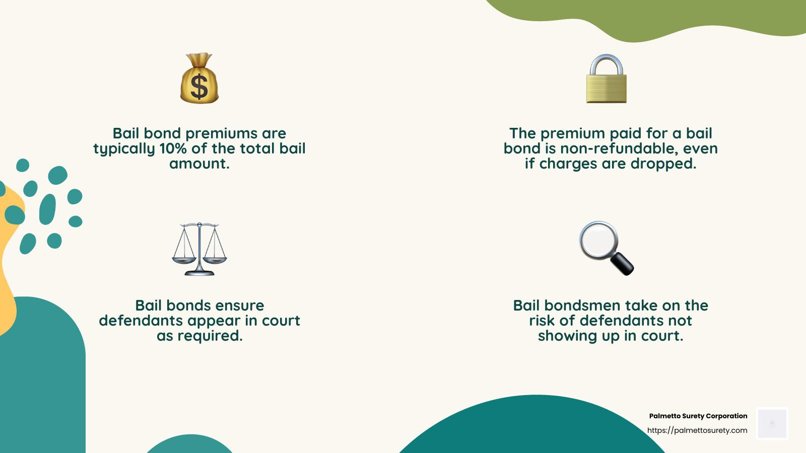

In the intricate world of finance and legal systems, the topics of bail money, bail bond refundability, and algorithmic trading intersect in unexpected ways. This article explores the complexities of bail bonds, the conditions under which bail money can be refunded, and the role of algorithmic trading in developing financial strategies related to these topics. Understanding these concepts is essential for individuals navigating the legal system as defendants or those working within the financial industry.

Bail bonds play a crucial role in the legal system, serving as surety for defendants awaiting trial. These agreements involve significant financial considerations and impact both the legal and financial landscapes. Bail bond refundability is a key aspect, with conditions and processes varying across jurisdictions. The timely refund of bail money depends on compliance with court appearances and other legal conditions, affecting defendants and their financial obligations.



Algorithmic trading, a vital component of modern financial markets, employs computers to automate trading decisions based on pre-determined algorithms. This technology enhances the speed and efficiency of trades, influencing financial stability and profitability. Understanding how algorithmic trading intersects with bail bond financial strategies can provide insights into managing risks and optimizing returns.

This article combines these domains to offer a comprehensive understanding of bail money, bond refundability, and algorithmic trading. By exploring these topics, we aim to provide a knowledge base valuable in both legal and financial settings, enabling better risk management and outcome optimization for individuals and institutions alike.

## Table of Contents

## Understanding Bail Bonds

Bail bonds are legally binding agreements that facilitate a defendant's temporary release from custody while ensuring their subsequent court appearances. These agreements are particularly crucial in the judicial process, allowing defendants to continue their daily lives pending trial. A bail bond agent plays a pivotal role in this system by posting the bail on behalf of the defendant. The agent typically charges a non-refundable fee, usually around 10% of the total bail amount, as compensation for their service and the financial risk they assume.

There are several types of bail bonds, each with distinct characteristics and implications for refundability:

1. **Surety Bonds**: A surety bond involves a third-party guarantor, generally a bail bond agent, pledging to pay the full bail amount if the defendant fails to appear in court. The defendant or their loved ones pay the agent the non-refundable percentage fee. Due to the involvement of a professional guarantor, the risk is managed through the agent's due diligence and measures to ensure compliance.

2. **Cash Bonds**: This involves the full bail amount being paid directly in cash. Refundability in cash bonds is straightforward, as the court returns the entire sum to the payer, minus administrative fees, once all court appearances and conditions are met. This option does not require a bail bond agent, reducing costs but requiring liquidity.

3. **Property Bonds**: These bonds use real estate as collateral. The defendant or their family submits property documents to the court, equating the equity to the bail amount. The property can be forfeited if the defendant does not comply with court obligations. Refundability here involves reclaiming the property title post-trial without financial loss, contingent on compliance.

Bail bond [agents](/wiki/agents) manage substantial risks, as they are financially liable if a defendant absconds. To mitigate this, agents often require co-signers or collateral and keep close tabs on the defendant, sometimes employing bounty hunters to ensure court appearances. Through these practices, agents balance their profit margins with the assumed risks, maintaining the integrity of the judicial release process.

## Conditions for Bail Money Refundability

Bail money is typically refunded when defendants adhere to all court appearance requirements and comply with any additional bail conditions set by the court. However, several circumstances can prevent the refunding of bail money. The most common scenario is the defendant's failure to appear in court, which often results in the forfeiture of the bail amount. Additionally, if a defendant violates any bail conditions, such as contacting a victim or leaving a designated area, the bail money might also be forfeited.

The process of retrieving refunded bail money involves several steps and can vary depending on the jurisdiction. Generally, after the court case is concluded and the defendant has met all obligations, a request for the return of bail money can be submitted. This typically involves filling out specific forms provided by the court and including any required documentation that proves compliance with court orders.

Most courts will deduct certain fees from the bail amount before issuing a refund. These fees might cover administrative costs or other expenses related to processing the bail. The exact deductions are usually specified in the bail agreement or can be requested from the court.

Jurisdictions differ in how they handle bail refund processes. In some areas, the process is straightforward and quick, while in others, it may take several weeks or months to receive the refunded amount. Typically, the waiting period for bail refunds ranges from 30 to 90 days after the court case's conclusion. However, this timeline can be longer depending on court backlog and administrative efficiency.

Individuals seeking bail refunds should be informed of the specific requirements and timelines in their jurisdiction to avoid unnecessary delays. It's also important to keep records of all court appearances and any communications related to the bail process to ensure a smooth refund process.

## Algorithmic Trading in the Financial Market

Algorithmic trading utilizes computer systems to execute trading decisions based on pre-defined algorithms and financial models. This technology has fundamentally transformed the financial markets by enhancing the speed, efficiency, and execution of trades. 

The core of [algorithmic trading](/wiki/algorithmic-trading) involves constructing algorithms that can process large data sets to identify profitable trading opportunities. These algorithms are based on various financial models and quantitative analyses. They can range from simple moving averages to complex statistical [arbitrage](/wiki/arbitrage) models which consider multiple market factors and historical data. 

For instance, a basic algorithm might execute trades when a stock's 50-day moving average crosses above its 200-day moving average, a common indicator of a bullish trend. More sophisticated algorithms might use [machine learning](/wiki/machine-learning) techniques to continuously adapt to new data and market conditions.

Algorithm development for trading purposes involves several steps, including [backtesting](/wiki/backtesting) against historical data to assess performance and risk management. Backtesting helps validate strategies in past markets, revealing potential profitabilities and pitfalls, while risk management techniques, such as the Value at Risk (VaR) model, are critical for determining the potential risks involved in trading strategies. 

```python
import numpy as np

def moving_average(prices, window_size):
    return np.convolve(prices, np.ones(window_size)/window_size, mode='valid')

prices = [20, 21, 22, 23, 24, 25, 24, 23, 22, 24, 26, 28, 29]
short_ma = moving_average(prices, 3)  # 3-day moving average
long_ma = moving_average(prices, 5)   # 5-day moving average

trade_signals = [(s, l) for s, l in zip(short_ma, long_ma) if s > l]
print(trade_signals)
```

This Python snippet computes simple moving averages and identifies buy signals where the short moving average crosses above the long moving average.

Algorithmic trading significantly impacts financial stability. While it increases market [liquidity](/wiki/liquidity-risk-premium) and reduces transaction costs, it can also contribute to market [volatility](/wiki/volatility-trading-strategies), as evidenced by events such as the 2010 Flash Crash.

The intersection between bail bond financial strategies and algorithmic trading is particularly noteworthy in risk management. Institutions handling bail bond funds may deploy algorithmic trading strategies to optimize returns while managing associated financial risks. The use of algorithms allows for real-time risk assessment and decision-making, crucial for managing portfolios with diverse financial instruments related to bail bonds.

Ultimately, algorithmic trading's evolution and its integration with financial strategies emphasize the need for robust risk management tools to mitigate potential adverse effects on financial markets.

## Integration of Bail Bond Agreements and Algorithmic Trading

Financial institutions that manage bail bond funds may incorporate algorithmic trading to enhance returns while efficiently managing associated risks. The integration of bail bond agreements and algorithmic trading can be augmented through the use of big data and machine learning technologies, offering numerous benefits including optimized financial strategies and increased profitability.

### Big Data and Machine Learning in Bail Bond Fund Management

The implementation of big data analytics allows financial institutions to gather and process a vast array of information related to bail bonds and market conditions. Machine learning algorithms can analyze patterns within this data, predicting market trends and optimizing trading strategies. For instance, algorithms can be designed to assess the creditworthiness of defendants, thereby influencing the decision to post bail and the terms offered.

Machine learning models, such as regression analysis and decision trees, enable the identification of predictive factors that affect the risk and profitability of trade decisions. For example, a linear regression model can be used to predict future market prices based on historical data:

$$
y = \beta_0 + \beta_1 x_1 + \beta_2 x_2 + \ldots + \beta_n x_n + \epsilon
$$

where $y$ is the predicted price, $\beta$ represents the coefficients, $x$ denotes the predictive features, and $\epsilon$ is the error term.

### Potential Benefits

Algorithmic trading can yield considerable advantages for financial entities overseeing multiple bail bond contracts. Key benefits include:

1. **Maximized Returns**: By employing algorithms to execute trades at optimal times, institutions can capitalize on short-term market fluctuations, potentially yielding higher returns on invested bail funds.

2. **Risk Reduction**: Automated trading systems can be programmed to follow stringent risk management protocols, such as stop-loss orders, which help minimize the potential for loss.

3. **Operational Efficiency**: Automating the trading process reduces the need for human intervention, leading to lower transaction costs and faster execution speeds.

### Security, Compliance, and Ethical Considerations

As institutions integrate algorithmic trading with bail bond funds, they face several security, compliance, and ethical challenges:

- **Security**: Safeguarding sensitive data against cyber threats is paramount. Robust encryption and cybersecurity measures must be in place to protect financial data and ensure the integrity of the trading system.

- **Compliance**: Algorithmic trading in the context of bail bond funds requires adherence to both financial regulations and legal standards governing bail operations. Institutions must ensure trading practices align with regulatory requirements to avoid legal repercussions.

- **Ethical Considerations**: The use of algorithms necessitates ethical scrutiny, particularly in ensuring fair treatment of defendants whose bail conditions might be influenced by data-driven decisions. Maintaining a balance between profitability and ethical responsibility is crucial.

In summary, the integration of bail bond agreements with algorithmic trading provides significant opportunities for optimization and profitability. By leveraging big data and machine learning, financial institutions can enhance their strategies while addressing pertinent issues of security, compliance, and ethics.

## Conclusion

Navigating the topics of bail money, bond refundability, and algorithmic trading highlights a spectrum of intricate challenges and transformative opportunities. Understanding how these subjects intersect is pivotal for making informed decisions with legal and financial implications. By comprehending the processes involving bail money and the conditions required for refundability, individuals can effectively traverse the legal landscape and ensure compliance with court mandates.

Algorithmic trading further introduces a layer of complexity and opportunity in financial strategies. Its ability to enhance trading efficiency and optimize returns is particularly relevant for institutions managing bail bond funds. These entities can leverage big data and machine learning to bolster their investment strategies, thus improving the management of bail bond agreements.

The key to successfully navigating these areas is staying informed and adhering to the ever-evolving legal regulations. As algorithmic trading becomes increasingly vital in optimizing financial outcomes, maintaining ethical compliance is critical. Institutions and individuals are encouraged to continually explore innovative strategies that align with legal standards to manage risks effectively.

By combining legal compliance with advanced financial technologies, entities can capitalize on these intersections to advance their objectives. This integrated approach not only aids in managing potential risks but also unlocks pathways to enhanced profitability and strategic financial growth, irrespective of one's role in either the legal or financial domains.

## References & Further Reading

[1]: Bergstra, J., Bardenet, R., Bengio, Y., & Kégl, B. (2011). ["Algorithms for Hyper-Parameter Optimization."](https://dl.acm.org/doi/10.5555/2986459.2986743) Advances in Neural Information Processing Systems 24.

[2]: ["Advances in Financial Machine Learning"](https://www.amazon.com/Advances-Financial-Machine-Learning-Marcos/dp/1119482089) by Marcos Lopez de Prado

[3]: ["Evidence-Based Technical Analysis: Applying the Scientific Method and Statistical Inference to Trading Signals"](https://www.amazon.com/Evidence-Based-Technical-Analysis-Scientific-Statistical/dp/0470008741) by David Aronson

[4]: ["Machine Learning for Algorithmic Trading"](https://github.com/PacktPublishing/Machine-Learning-for-Algorithmic-Trading-Second-Edition) by Stefan Jansen

[5]: ["Quantitative Trading: How to Build Your Own Algorithmic Trading Business"](https://books.google.com/books/about/Quantitative_Trading.html?id=j70yEAAAQBAJ) by Ernest P. Chan