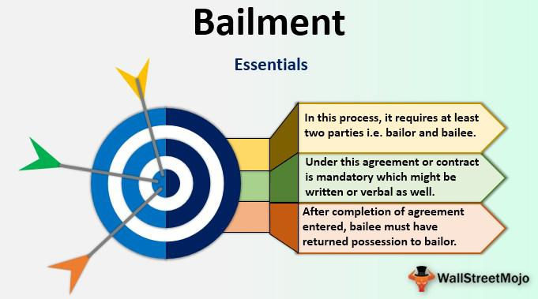

In this article, we explore the intricate world of bailment in property law, legal agreements related to asset transfer and commercial contracts, and the role of algorithmic trading in modern financial markets. Bailment, a fundamental concept in property law, involves the temporary transfer of possession but not ownership of an asset, presenting unique challenges and opportunities in legal terms. The legal agreements that underpin bailment and similar transactions are critical for clarifying the responsibilities and expectations of involved parties, thereby reducing potential conflicts and ensuring the smooth operation of asset transfers.

Concurrently, algorithmic trading represents a significant technological advancement in financial markets, characterized by the use of computer algorithms to execute trades based on predefined strategies. This development highlights a growing intersection between legal frameworks and technological innovations, as markets increasingly rely on algorithms to enhance speed, efficiency, and accuracy, while minimizing human error. The coalescence of legal agreements and technological advancements in algo trading necessitates a comprehensive understanding of both domains to foresee and mitigate risks effectively.

Understanding these intersections is crucial for businesses and individuals navigating these fields, providing a foundation for robust risk management and strategic decision-making. Through a detailed examination, we provide insights into how these concepts are applied in practice and their implications for stakeholders, aiming to empower them with knowledge to navigate the evolving landscape of legal and technological intersections proficiently.

## Table of Contents

## Understanding Bailment in Property Law

Bailment in property law involves the temporary transfer of possession but not ownership of an asset from one party, known as the bailor, to another, the bailee. This legal relationship is pivotal in distinguishing the rights and responsibilities that arise from mere possession as opposed to ownership. The defining characteristic of bailment is that it encompasses three key components: a contract, the delivery of the asset, and acceptance by the bailee. These elements are essential to its validity and enforceability.

A bailment agreement typically arises from a contract, which may be expressed or implied, detailing the terms of the possession transfer. Such a contract is fundamental, as it lays out the duration, the purpose of the bailment, and the conditions under which the asset may be used. While the transfer of possession must occur without transfer of title, the contract provides clarity and protection for both parties involved.

Delivery of the asset is another integral aspect, signifying the physical or constructive transfer of the item to the bailee. Constructive delivery occurs when no physical handing over happens, but actions denote the transfer of possession, such as handing someone the keys to a storeroom containing the goods. Acceptance, on the other hand, requires the bailee’s acknowledgment of receiving the asset under the terms outlined in the bailment agreement. Without acceptance, no bailment can be said to exist.

The legal nuances of bailment also cover different types, categorized based on whom they benefit. The most common forms include:

1. **Bailment Benefiting Both Parties**: This occurs in commercial contexts, where both the bailor and the bailee receive benefits. An everyday example would be a rental car service, where the rental company (bailor) gains a fee, and the customer (bailee) gets the use of a vehicle.

2. **Bailment for the Sole Benefit of the Bailor**: This is a form of bailment where the bailee does not derive any benefit from holding the asset. An illustration of this is when a friend asks you to keep their possessions while they are away. The bailee’s obligation is minimal, generally only to avoid gross negligence.

3. **Bailment for the Sole Benefit of the Bailee**: Here, the bailee enjoys benefit without reciprocating any consideration. Borrowing a book from a friend is a classic example. In this case, a high standard of care is expected from the bailee to prevent damage to the property.

Understanding these different bailment arrangements is crucial as they dictate the rights and obligations of both the bailor and bailee. The responsibilities attached to each type of bailment are proportionate to the benefits received. For instance, a bailee in a mutually beneficial bailment owes a reasonable standard of care to the asset, whereas a bailee in a bailment for their sole benefit may be liable for even slight negligence.

In all forms of bailment, failure to meet the standards of care or fulfill contractual obligations could result in legal liability. As such, parties involved in bailment agreements must clearly comprehend these distinctions to protect their legal interests and facilitate smooth transactions.

## Legal Agreements in Bailment and Property Law

Legal agreements in bailment are essential for clearly defining the transfer of possession of property while maintaining the ownership rights of the bailor. These agreements are vital in ensuring both parties understand their roles and responsibilities. The contract commonly specifies the duration for which the asset will be in the possession of the bailee, the purpose for which the asset may be used, and any specific conditions that must be satisfied during the bailment period.

For instance, if a car is lent to a friend, the bailment agreement may limit its use to personal errands only and specify that the return should occur in a week. Such parameters help avoid misunderstandings and disputes that may later arise due to ambiguous or unwritten terms.

A comprehensive bailment contract should meticulously outline the condition in which the property should be maintained, any restrictions on its use, and the roles of each party in terms of upkeep or repairs. These contracts are instrumental in determining liability in cases where the property is lost, damaged, or not returned in an agreeable state.

Clarity and completeness in these contracts prevent potential disputes that may lead to legal action. A poorly drafted agreement can lead to significant legal challenges, as parties may exploit ambiguities to their advantage. Consequently, clearly articulated legal agreements are foundational to safeguarding the interests of both bailor and bailee, ensuring that each fulfills their respective obligations and understands the extent of their rights concerning the property involved.

To avoid disputes, agreements should also account for the potential risks involved, stipulate dispute resolution mechanisms, and address compensation in case of any breach. These robust agreements foster trust and legal compliance, essential components for successful bailment arrangements.

## Algorithmic Trading: An Overview

Algorithmic trading, commonly referred to as algo trading, represents a transformative approach in the execution of traditional financial transactions. It harnesses the power of computer algorithms to make optimal trading decisions based on pre-set rules and criteria. These algorithms are typically rooted in a variety of market attributes, including price, timing, and [volume](/wiki/volume-trading-strategy), with the objective of executing trades at the most advantageous conditions.

At the core of [algorithmic trading](/wiki/algorithmic-trading) is the principle of speed. The algorithms can analyze and process vast amounts of market data in fractions of a second, far exceeding human capabilities. This rapid data processing allows traders to identify and act on market conditions or opportunities that are ephemeral in nature. Consequently, algo trading significantly enhances the efficiency of executing trades and minimizes the latency often associated with manual trading methods. 

Another hallmark of algorithmic trading is its efficiency. By automating the trading process, it removes the inefficiencies and biases that can occur with human intervention. The algorithm follows its encoded logic without deviation, ensuring a consistent execution of trades according to the specified strategy. This can lead to more predictable and stable trading outcomes, as well as improved [liquidity](/wiki/liquidity-risk-premium) in the markets.

Furthermore, algo trading reduces the likelihood of human error. The emotional factors and psychological barriers that can influence decision-making in traditional trading are eliminated. Instead, decisions are executed based on quantitative analysis and historical data, leading to potentially higher precision and accuracy in trading operations. 

Overall, algorithmic trading has become increasingly significant in contemporary financial markets. It is not only employed by investment banks and hedge funds but also by retail traders due to its accessibility and the advancement in technology. The adoption of algo trading continues to grow, driven by its ability to leverage statistical models, [machine learning](/wiki/machine-learning), and big data analytics to achieve competitive edges in trading activities.

In summary, algorithmic trading leverages the speed, efficiency, and precision of computer algorithms to automate the trading process, offering substantial advantages over traditional trading methods. Its rise is a testament to the evolving landscape of financial markets, where the integration of technology continues to reshape trading strategies and execution.

## Interplay Between Legal Agreements and Algo Trading

With the advancement of technology, algorithmic trading has significantly reshaped financial markets, making it imperative for legal agreements to incorporate technological considerations and address potential risks. As algorithmic trading utilizes complex computer algorithms to make rapid trading decisions, contracts between involved parties now require provisions that recognize these new dynamics.

Legal frameworks governing algorithmic trading focus on ensuring compliance with existing financial regulations and mitigating risks associated with algorithmic operations. These frameworks must consider critical aspects such as data protection, intellectual property, and system reliability. Compliance with regulations such as the Markets in Financial Instruments Directive (MiFID II) in the European Union and the Securities Exchange Act in the United States is essential to maintain market integrity and protect investors. These regulations mandate rigorous testing, system controls, and transparency in algorithmic strategies.

Creating contracts that adequately capture both legal and technological elements necessitates a detailed understanding of the algorithms' functioning and associated risks. Contracts must outline the parties' responsibilities in managing software updates, system failures, and market aberrations that algorithms may exploit inadvertently. They should specify safeguards to prevent algorithm-induced market manipulations, such as price spoofing or quote stuffing, which could damage market stability.

Moreover, legal agreements should define the parameters for algorithm performance monitoring, including criteria for system shutdowns or overrides during market turbulence. The roles and liabilities of parties involved should be clarified to address scenarios of negligence or non-compliance, with legal recourses explicitly stated.

Incorporating technological clauses into legal contracts also involves addressing cybersecurity concerns, given that algorithmic trading systems are prime targets for cyber-attacks. Agreements should include provisions for data protection and response protocols in the event of security breaches.

To effectively craft these sophisticated contracts, legal professionals must collaborate with technologists to ensure that all pertinent algorithmic aspects are comprehensively covered. This interdisciplinary approach will help create agreements that not only meet existing legal standards but also adapt to future advancements in trading technologies.

## Rights and Liabilities in Bailment and Algo Trading

Bailment agreements establish specific rights and liabilities for both the bailor and the bailee, shaped largely by the underlying contractual terms and the standard of care expected from the bailee. The bailee, for example, is typically required to take reasonable care of the bailed property. If the bailee fails to meet this duty due to negligence, they may be held liable for any damage, loss, or unauthorized use of the property. Conversely, the bailor has obligations, such as ensuring that the bailed property is fit for the intended use. If the bailor provides defective goods resulting in harm or additional costs, they could be held liable for those consequences.

Algo trading introduces a distinct set of rights and liabilities, mainly centered around compliance with legal standards and the management of algorithmic behaviors. In algo trading, firms must ensure their trading algorithms adhere to regulatory requirements, such as those set by the Securities and Exchange Commission (SEC) or the Financial Conduct Authority (FCA). Failure to comply can result in substantial penalties and liabilities. Furthermore, traders must manage risks associated with algorithmic behaviors, such as erratic price fluctuations or market abuses like spoofing or layering.

Legal recourses in case of contract breaches or misconduct vary depending on the circumstances. For bailment, legal recourse might involve claims for breach of contract or negligence, seeking financial compensation for the loss or damage incurred. For algo trading, potential recourses include regulatory actions, such as fines or sanctions, as well as civil litigation from affected parties seeking damages caused by algorithmic errors or breaches of fiduciary duties.

In both bailment and algo trading, maintaining clear and well-drafted contracts is critical. These contracts should articulate the rights and obligations, outline the standards of care required, and stipulate the consequences of breaches. Effective agreements coupled with diligent compliance efforts are essential in minimizing liabilities and safeguarding interests in these complex arrangements.

## Conclusion

The integration of traditional legal principles with modern technological practices, such as algorithmic trading, presents opportunities and challenges for businesses and individuals. Understanding bailment in property law and the legal facets of algorithmic trading provides stakeholders with the knowledge to navigate this evolving landscape effectively. Bailment principles can be adapted to govern new forms of asset transfer that involve technological tools, ensuring that possession and control are clearly documented and understood by both parties.

In the dynamic arena of algo trading, maintaining robust legal agreements is crucial. These agreements must account for both regulatory compliance and the technical nuances of algorithmic strategies. As algorithms drive decisions in milliseconds, they bring forth legal and ethical questions regarding accountability and transparency. Thus, carefully crafted contracts must stipulate terms that address these rapid technological shifts while protecting the involved parties.

Furthermore, ongoing compliance measures serve as a vital component of safeguarding business interests in the fast-paced world of financial technology. Legal frameworks must be continually assessed and updated to keep pace with innovations in trading technologies. By doing so, businesses can leverage technological advancements while minimizing potential risks. Establishing a proactive approach to legal compliance not only ensures adherence to current regulations but also equips entities with the flexibility to adapt to future developments.

In conclusion, the successful blend of established legal doctrine with the cutting-edge practices of algorithmic trading requires a balanced approach. Through a comprehensive understanding of both fields and strategic contract management, stakeholders can effectively manage risks and seize the opportunities presented by rapid innovation.

## References & Further Reading

[1]: Bergstra, J., Bardenet, R., Bengio, Y., & Kégl, B. (2011). ["Algorithms for Hyper-Parameter Optimization."](https://dl.acm.org/doi/10.5555/2986459.2986743) Advances in Neural Information Processing Systems 24.

[2]: ["Advances in Financial Machine Learning"](https://www.amazon.com/Advances-Financial-Machine-Learning-Marcos/dp/1119482089) by Marcos Lopez de Prado

[3]: ["Evidence-Based Technical Analysis: Applying the Scientific Method and Statistical Inference to Trading Signals"](https://www.amazon.com/Evidence-Based-Technical-Analysis-Scientific-Statistical/dp/0470008741) by David Aronson

[4]: ["Machine Learning for Algorithmic Trading"](https://github.com/stefan-jansen/machine-learning-for-trading) by Stefan Jansen

[5]: ["Quantitative Trading: How to Build Your Own Algorithmic Trading Business"](https://www.amazon.com/Quantitative-Trading-Build-Algorithmic-Business/dp/1119800064) by Ernest P. Chan

[6]: Puschmann, T., & Alt, R. (2016). "Digital transformation in the financial services industry: The role of FinTech and innovation." ["Journal of Financial Transformation"](https://www.capco.com/Capabilities/Research-Lab/Retail-Banking), 44, 49-58.

[7]: Easley, D., Lopez de Prado, M. M., & O’Hara, M. (2012). ["The Volume Clock: Insights into the High-Frequency Paradigm."](https://papers.ssrn.com/sol3/papers.cfm?abstract_id=2034858) The Review of Financial Studies, 25(8), 1985–2023. 

[8]: "Markets in Financial Instruments Directive (MiFID II)." European Securities and Markets Authority. ["MiFID II."](https://www.esma.europa.eu/publications-and-data/interactive-single-rulebook/mifid-ii)

[9]: Hasbrouck, J., & Saar, G. (2013). ["Low-latency trading."](https://papers.ssrn.com/sol3/papers.cfm?abstract_id=1695460) Journal of Financial Markets, 16(4), 646–679.