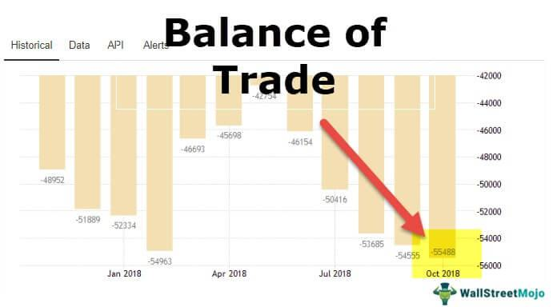

In today's interconnected world, understanding the intricate dynamics of global transactions is vital for businesses and policymakers. These dynamics encompass the balance of payments, international trade, and algorithmic trading, each playing a crucial role in shaping economic policies and strategies. The balance of payments (BOP), for instance, serves as a financial statement that summarizes a country's economic transactions with the rest of the world over a specific period. It comprises various components, including the current account, capital account, and financial account, which collectively offer insights into the country's economic interactions.

Similarly, international trade acts as a critical component of the BOP, influencing economic health and policy decisions across borders. Trade surpluses and deficits have significant implications for currency valuations and international relations, necessitating governmental interventions through tariffs, quotas, or subsidies to manage trade balances effectively. Organizations like the World Trade Organization (WTO) facilitate this process by ensuring fair and regulated trade practices globally.

The role of technology in modern finance, particularly algorithmic trading, cannot be overstated. Algorithmic trading, characterized by the use of computerized systems for trading decisions, enhances market efficiency through faster transactions and reduced human error. Despite its advantages, it introduces challenges, such as increased market volatility and regulatory compliance issues, that necessitate careful balancing by investors and policymakers.

Furthermore, an in-depth understanding of how balance of payments deficits and surpluses affect currencies and trade policies is essential. These economic indicators provide crucial feedback for formulating policies that promote economic stability and growth. As the global financial landscape evolves, the interplay between these elements demands adaptive strategies and informed decision-making to sustain economic prosperity.

By the end of this article, readers will gain a clearer insight into how global finance operates and how these components work together to influence economic stability and growth. The interconnections between global transactions, BOP, international trade, and technological advancements like algorithmic trading form the backbone of informed economic policies, shaping the future of financial regulation and international cooperation.

## Table of Contents

## Understanding the Balance of Payments (BOP)

The Balance of Payments (BOP) is a comprehensive statement that encapsulates all economic transactions made between residents of a country and the rest of the world over a specified timeframe, usually a quarter or a year. This crucial tool aids economists, policymakers, and financial analysts in understanding a country's economic position and structuring informed economic policies. The BOP is sectioned into three primary components: the current account, the capital account, and the financial account, each documenting distinct types of economic interactions.

1. **Current Account**: The current account tracks the trade of goods and services, investment income, and current transfers. It reflects the country's net income over a period, providing insights into trade balances and income flows:
   - **Trade Balance**: This is the difference between a country's exports and imports of goods and services. A persistent trade surplus or deficit can signal underlying economic issues, affecting exchange rates and national income.
   - **Net Income from Abroad**: This includes earnings on investments held abroad minus payments made to foreign investors. It includes dividends, interest payments, and labor income.
   - **Current Transfers**: These are unilateral transfers without a quid pro quo, such as foreign aid, gifts, and remittances from expatriates.

2. **Capital Account**: The capital account is considerably smaller compared to the other two components and includes transactions that involve non-financial and non-produced assets. This encompasses the transfer of assets such as patents, trademarks, and inheritance taxes. Although it plays a minor role, changes in the capital account can influence the broader economic picture, particularly in intellectual property and capital flow transitions.

3. **Financial Account**: The financial account accounts for changes in international ownership of financial assets and liabilities. This section reports cross-border investments and financial flows, which include:
   - **Direct Investment**: Investments in tangible assets such as property, factories, and businesses abroad are classified here. These are long-term investments where the investor seeks control over the business operations.
   - **Portfolio Investment**: This category involves buying stocks and bonds, which do not offer control over the business operations. It reflects a country's investment climate and can influence currency and stock exchange markets.
   - **Other Investments**: These typically encompass loans, currency reserves, and bank capital flows. These transactions can be volatile and often reflect changes in global market conditions and investor confidence.

The accurate representation of a country's financial transactions with the global economy through the BOP has profound implications for economic policy and planning. It provides a snapshot of a country's economic ties with the rest of the world, helping identify sectors of deficit or surplus, potential areas for policy intervention, and impacts on foreign exchange reserves.

## The Role of International Trade

International trade serves as a cornerstone for the balance of payments (BOP), profoundly impacting a country's economic health and shaping policy decisions. As countries engage in trade, the resulting surpluses and deficits play a pivotal role in influencing economic policies and currency valuations.

A trade surplus occurs when a nation's exports exceed its imports. This situation often leads to an appreciation of the country's currency, as the demand for its goods and services increases, prompting foreign buyers to purchase the local currency to complete transactions. This increase in demand can lead to a strengthened currency, benefiting industries reliant on imported goods and services.

Conversely, a trade deficit arises when imports surpass exports, potentially causing the national currency to depreciate. In such cases, a country might find its currency losing value, which can make imports more expensive and contribute to inflationary pressures. Policymakers are charged with addressing these imbalances by implementing measures like tariffs, which are taxes on imported goods aimed at reducing import volumes, or quotas, which limit the amount of certain goods that can be imported. Additionally, subsidies to domestic industries can be introduced to enhance competitive positioning in the international market.

Global agreements and organizations play crucial roles in managing international trade dynamics. The World Trade Organization (WTO), for instance, facilitates the establishment of a rules-based trade system designed to ensure fair and predictable trade flows. By promoting transparency and reducing trade barriers, the WTO seeks to minimize conflicts and enhance the global economic environment. Such global efforts contribute to the establishment of a stable and predictable trade atmosphere, guiding countries in forming balanced trade policies and fostering international economic cooperation.

## Algorithmic Trading and Its Impact

Algorithmic trading, or algo trading, involves leveraging computational power and sophisticated algorithms to execute trading decisions with minimal human oversight. This approach has revolutionized the securities trading landscape by improving the speed and efficiency of transactions. Through automation, trade executions can occur within microseconds, a significant enhancement over manual trading methods, thereby reducing opportunities for [arbitrage](/wiki/arbitrage) and increasing market competitiveness.

Increased [liquidity](/wiki/liquidity-risk-premium) is one of the primary contributions of [algorithmic trading](/wiki/algorithmic-trading) to global markets. By systematically interacting with market data, algo trading ensures continuous buy and sell orders, thereby easing the flow of transactions and helping to narrow bid-ask spreads. This liquidity provision benefits all market participants by facilitating the easy entry and [exit](/wiki/exit-strategy) of trades, creating a more resilient market structure.

Furthermore, algorithmic trading aids in the quicker dissemination of price information. Since algorithms can process vast amounts of data instantaneously, they can adjust to market conditions in real-time. This rapid information flow is crucial for price discovery, as it allows market prices to reflect available information more accurately and promptly.

However, the increasing reliance on algorithmic trading also introduces a set of risks. One such risk is market [volatility](/wiki/volatility-trading-strategies), which can be exacerbated by automated trading systems that react to the same market signals simultaneously, leading to abrupt price movements. Events like the 2010 Flash Crash illustrate how algorithms, operating in milliseconds, can lead to severe market disruptions if not properly managed.

Another significant challenge lies in regulatory compliance. With the complexity and speed of algorithmic systems, ensuring that these strategic trades adhere to market regulations becomes intricate. The risk of algorithms behaving erratically or executing unintended trades poses a compliance challenge for regulators and market participants alike.

To mitigate these risks while capitalizing on the benefits, investors and policymakers must strive for a balanced approach. Regulatory frameworks need updating to cope with technological advancements, ensuring that algorithmic trading does not compromise market integrity. Policies emphasizing transparency, risk management, and fairness are critical in cultivating an environment where algorithmic strategies can thrive without undermining market stability. 

As the landscape of trading continues to evolve, stakeholders must continuously reassess the impacts of these technologies, ensuring that they align with the overarching goals of market fairness and efficiency.

## Challenges and Considerations

The Balance of Payments (BOP) system, while structurally comprehensive, encounters several formidable challenges that affect its accuracy and efficacy. Firstly, data accuracy remains a significant concern. The collection and reporting of economic transactions across borders require meticulous accuracy, which is often compromised due to varying national statistical capabilities and reporting standards. Discrepancies can arise from differences in accounting practices, data collection methodologies, and misreporting, leading to potential misinterpretations of a country's economic status.

Exchange rate fluctuations constitute another challenge affecting the BOP system. These fluctuations can lead to substantial valuation changes in recorded transactions, complicating the accurate portrayal of economic interactions. For example, a depreciation in a country's currency might improve its trade balance on paper by making its exports cheaper, but might not necessarily reflect an underlying economic improvement. 

To mitigate such imbalances, international policy coordination is crucial. Harmonizing standards and improving the timeliness and comparability of data through global cooperation can enhance the reliability of the BOP as a statistical measure. Organizations such as the International Monetary Fund (IMF) play a pivotal role in promoting such standardization efforts.

Technological advancements in trading present further challenges that necessitate the evolution of regulatory frameworks. The advent of technologies like algorithmic trading has introduced new scales of efficiency and complexity into financial markets. These technologies can amplify market volatility and introduce systemic risks, underscoring the need for robust regulatory oversight to safeguard market stability.

Moreover, the conceptual framework of the BOP struggles to fully account for contemporary economic activities. Traditional BOP accounting does not seamlessly incorporate transactions involving digital commerce and intangible assets like intellectual property. The increasingly digital nature of global trade, marked by the rise of e-commerce and the significance of digital services, calls for an updated approach to capturing and reflecting these transactions accurately in the BOP.

Overall, addressing these challenges involves a concerted effort to enhance data accuracy, adapt regulatory measures to technological changes, and revise the BOP framework to reflect modern economic realities. Such improvements are necessary to provide a clear and accurate representation of a nation's economic standing and ensure informed economic policy-making.

## Conclusion

The conclusion of this article highlights the intricate web that connects global transactions, balance of payments (BOP), international trade, and algorithmic trading, all of which serve as pivotal components in shaping informed economic policies. It is essential to comprehend these elements fully, as they are instrumental in maintaining economic stability and fostering growth within the global financial arena.

In the contemporary economic landscape, technology's role cannot be overstated, particularly with its influence on market dynamics, evidenced by the growing prevalence of algorithmic trading. Such advancements necessitate an adaptive approach from regulators and policymakers, who must focus on ensuring the potential benefits of these technologies are maximized while minimizing associated risks, such as market volatility and regulatory challenges. This requires robust regulatory frameworks that can keep pace with technological innovations.

Looking toward the future, economic policies will increasingly prioritize international cooperation and maximize technological advancements to drive sustainable economic growth. Cooperation among nations and multilateral institutions will be paramount to addressing global challenges, managing trade imbalances, and ensuring fair and consistent economic practices across borders.

Moreover, leveraging technological advancements will facilitate more efficient and transparent financial markets. Policymakers will need to integrate cutting-edge technologies to streamline processes and achieve a resilient global economy while safeguarding against potential disruptions.

In summary, the interplay of these complex elements demands a strategic approach centered around cooperation, innovation, and regulatory foresight. Such an approach will be critical to navigating and stabilizing the global financial environment, ultimately leading to sustained economic prosperity.

## References & Further Reading

[1]: Krugman, P., & Obstfeld, M. (2014). ["International Economics: Theory and Policy"](https://www.pearson.com/se/Nordics-Higher-Education/subject-catalogue/economics/International-Economics-Theory-and-Policy-Krugman.html). Pearson.

[2]: Mishkin, F. S. (2016). ["The Economics of Money, Banking, and Financial Markets"](https://www.pearsonhighered.com/assets/preface/0/1/3/4/0134855388.pdf). Pearson.

[3]: Hull, J. C. (2017). ["Options, Futures, and Other Derivatives"](https://www.semanticscholar.org/paper/Options%2C-Futures%2C-and-Other-Derivatives-Hull/89bdee500c8623864fc9eb7a471546aa713acc44). Pearson.

[4]: Lopez de Prado, M. (2018). ["Advances in Financial Machine Learning"](https://www.amazon.com/Advances-Financial-Machine-Learning-Marcos/dp/1119482089). Wiley.

[5]: Chan, E. P. (2009). ["Quantitative Trading: How to Build Your Own Algorithmic Trading Business"](https://github.com/ftvision/quant_trading_echan_book). John Wiley & Sons.

[6]: International Monetary Fund. (2021). ["Balance of Payments and International Investment Position Manual"](https://www.imf.org/-/media/Files/Publications/balance-of-payments-statistics/ABPEA2021001.ashx). International Monetary Fund.