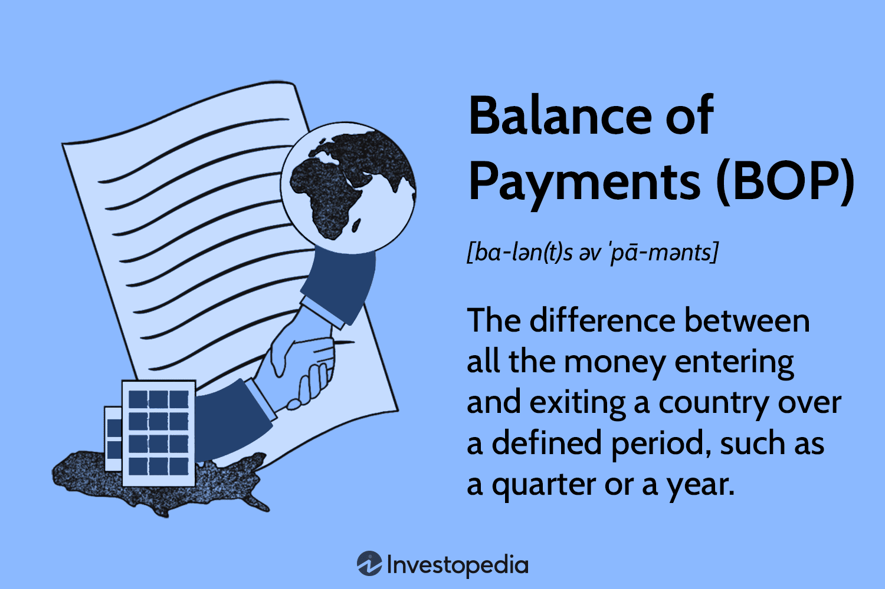

## Table of Contents

## What is the Balance of Payments?

The Balance of Payments, often abbreviated as BOP, is a record of all economic transactions between the residents of a country and the rest of the world over a specific period, usually a year. It includes the total value of goods and services exported and imported, financial transfers, and investments flowing in and out of the country. Think of it as a big ledger that keeps track of a country's economic interactions with other countries, showing whether the country is spending more foreign currency than it is receiving or vice versa.

The BOP is divided into three main components: the current account, the capital account, and the financial account. The current account records transactions related to trade in goods and services, as well as income from investments and transfers like foreign aid. The capital account includes transactions involving the transfer of capital, such as the sale and purchase of non-financial assets like land. The financial account tracks investments in financial assets, like stocks and bonds. A country's BOP is considered balanced if the sum of these accounts equals zero, meaning the inflows and outflows of money are equal. If not, it can indicate economic strengths or weaknesses that policymakers need to address.

## Why is the Balance of Payments important for a country?

The Balance of Payments is important for a country because it shows how well the country is doing in the global economy. It tells us if a country is earning more money from other countries than it is spending, or if it is spending more than it is earning. This information helps the government and businesses make smart decisions. For example, if a country is spending more than it earns, it might need to change its policies to save money or earn more from other countries.

Also, the Balance of Payments can show if a country's economy is strong or weak. If a country has a lot of money coming in from other countries, it might mean that other countries trust and want to invest in it. On the other hand, if a country is losing a lot of money, it could be a sign that it needs to fix some problems. By looking at the Balance of Payments, leaders can figure out what to do to make the economy better and more stable.

## What are the main components of the Balance of Payments?

The Balance of Payments has three main parts: the current account, the capital account, and the financial account. The current account keeps track of everyday transactions like buying and selling goods and services between countries. It also includes money from things like foreign aid and income from investments in other countries. If a country exports more than it imports, it has a current account surplus, which means it's earning more money from other countries than it's spending.

The capital account is a bit different. It records transactions that involve moving capital, like when a country buys or sells land or other non-financial assets to or from another country. This part of the Balance of Payments is usually smaller than the current account but still important because it shows how a country is using its resources.

The financial account tracks investments in financial assets, like stocks and bonds. When people or businesses from one country invest in another country, it's recorded here. This part of the Balance of Payments helps show how much money is flowing into and out of a country through investments. Together, these three accounts give a complete picture of a country's economic interactions with the rest of the world.

## How is the Balance of Payments structured?

The Balance of Payments is like a big report card for a country's money dealings with other countries. It's split into three main parts: the current account, the capital account, and the financial account. The current account tracks everyday transactions, like when a country buys or sells things like cars or computers with other countries. It also includes money from things like foreign aid and income from investments in other countries. If a country sells more than it buys, it has a current account surplus, meaning it's making more money from other countries than it's spending.

The capital account is different because it deals with moving capital, like when a country buys or sells land or other non-financial assets to or from another country. This part of the Balance of Payments is usually smaller but still important because it shows how a country is using its resources. The financial account tracks investments in things like stocks and bonds. When people or businesses from one country invest in another country, it's recorded here. This part helps show how much money is flowing into and out of a country through investments. Together, these three accounts give a complete picture of a country's economic interactions with the rest of the world.

## What is the difference between the current account and the capital account?

The current account and the capital account are two different parts of a country's Balance of Payments. The current account keeps track of everyday transactions, like when a country buys or sells things like cars or computers with other countries. It also includes money from things like foreign aid and income from investments in other countries. If a country sells more than it buys, it has a current account surplus, which means it's making more money from other countries than it's spending.

The capital account is different because it deals with moving capital, like when a country buys or sells land or other non-financial assets to or from another country. This part of the Balance of Payments is usually smaller but still important because it shows how a country is using its resources. While the current account focuses on the flow of goods, services, and income, the capital account is more about the movement of assets that aren't financial, helping to give a fuller picture of a country's economic health.

## How does a trade surplus or deficit affect the Balance of Payments?

A trade surplus or deficit is part of the current account in the Balance of Payments. A trade surplus happens when a country exports more goods and services than it imports. This means the country is earning more money from other countries than it is spending. When a country has a trade surplus, it adds to the positive side of its current account, making the Balance of Payments look better. On the other hand, a trade deficit occurs when a country imports more than it exports, meaning it's spending more money on foreign goods and services than it's earning. A trade deficit makes the current account negative, which can make the Balance of Payments look worse.

The impact of a trade surplus or deficit on the Balance of Payments is important because it shows how well a country is doing in its trade with other countries. If a country consistently has a trade surplus, it suggests that its economy is strong and competitive, attracting buyers from around the world. This can lead to more money flowing into the country, which can be good for the overall Balance of Payments. However, if a country has a persistent trade deficit, it might need to borrow money or use its reserves to pay for the extra imports, which can put pressure on the country's finances and affect the Balance of Payments negatively. Understanding these impacts helps countries make better economic policies.

## What role do foreign exchange reserves play in the Balance of Payments?

Foreign exchange reserves are like a country's savings account in different currencies. They help a country manage its Balance of Payments by giving it money to use when it needs to pay for more imports than it earns from exports. If a country has a trade deficit, meaning it's buying more from other countries than it's selling, it can use its foreign exchange reserves to pay for the difference. This helps keep the Balance of Payments stable because the country can still meet its financial obligations without borrowing more money.

Having enough foreign exchange reserves also gives a country confidence in the global market. Other countries and investors see a country with good reserves as more reliable and less risky. This can attract more investment, which is recorded in the financial account of the Balance of Payments. So, foreign exchange reserves not only help a country handle immediate trade imbalances but also contribute to a healthier overall Balance of Payments by boosting the country's economic image and drawing in more foreign money.

## How can a country address a persistent Balance of Payments deficit?

When a country has a persistent Balance of Payments deficit, it means it's spending more money on things from other countries than it's earning. To fix this, the country can try to sell more of its own stuff to other countries. This means boosting exports by making its products cheaper or better. The government might also make it harder or more expensive to buy things from other countries by putting taxes or limits on imports. This can help balance out the money coming in and going out.

Another way to deal with a persistent deficit is to get more money coming into the country through investments. The country can make it easier and more attractive for people from other countries to invest in its businesses or buy its stocks and bonds. This extra money can help cover the deficit. If all else fails, the country might need to borrow money from other countries or international organizations like the International Monetary Fund. But borrowing too much can lead to more problems down the road, so it's best to try other solutions first.

## What are the implications of a Balance of Payments surplus?

A Balance of Payments surplus means a country is earning more money from other countries than it is spending. This can be good because it shows the country's economy is strong and doing well in global trade. When a country has a surplus, it might have more money to spend on things like building roads or schools, or it can save the extra money for the future. Other countries and investors might also see a country with a surplus as a good place to invest, which can bring in even more money.

However, having a big surplus for a long time can also cause problems. Other countries might get upset if they feel the country with the surplus is not buying enough from them. This can lead to trade fights or other countries putting up barriers to stop the surplus country from selling so much. Also, if the surplus is too big, it might mean the country is not spending enough at home, which could slow down its own economy. So, while a surplus can be a sign of strength, it needs to be managed carefully to keep everyone happy and the economy balanced.

## How do exchange rates impact the Balance of Payments?

Exchange rates are like the price of one country's money compared to another country's money. When the exchange rate changes, it can affect how much a country buys and sells to other countries, which is part of the Balance of Payments. If a country's money gets weaker compared to other countries' money, its exports become cheaper for other countries to buy. This can lead to more exports and a better current account in the Balance of Payments. On the other hand, if a country's money gets stronger, its exports become more expensive, which might lead to fewer exports and a worse current account.

The exchange rate also affects the financial account in the Balance of Payments. If a country's money is strong, it might attract more investors from other countries because they want to take advantage of the strong currency. This can lead to more money coming into the country through investments, which can help balance out a trade deficit. But if the country's money is weak, investors might pull their money out, which can make the financial account worse. So, exchange rates can have a big impact on the Balance of Payments by changing how much a country trades and invests with other countries.

## What are some common misconceptions about the Balance of Payments?

One common misconception about the Balance of Payments is that a deficit is always bad and a surplus is always good. People often think that if a country spends more money on things from other countries than it earns, it's in trouble. But sometimes, a deficit can be okay if it's because the country is investing in things that will help its economy grow in the future. On the other hand, a surplus might seem great, but if it's too big, it could mean the country isn't spending enough at home, which can slow down its own economy.

Another misconception is that the Balance of Payments has to be perfectly balanced all the time. Some people think that if a country is spending more than it's earning or earning more than it's spending, it's doing something wrong. But the truth is, it's normal for the Balance of Payments to be out of balance sometimes. Countries can use their savings or borrow money to cover short-term differences. What's more important is that the country manages its Balance of Payments well over time and doesn't let deficits or surpluses get out of control.

## How do international organizations like the IMF assist countries with Balance of Payments issues?

International organizations like the International Monetary Fund (IMF) help countries that are having trouble with their Balance of Payments. If a country is spending more money on things from other countries than it's earning, it might need to borrow money to cover the difference. The IMF can lend money to these countries to help them pay for the things they need. This can give the country some time to fix its problems and get its Balance of Payments back in shape.

The IMF also gives advice and support to countries to help them manage their money better. They might suggest ways for the country to sell more of its own stuff to other countries or to spend less on things from abroad. This can help the country earn more money and reduce its Balance of Payments deficit. By working with the IMF, countries can learn how to keep their economies stable and avoid big problems in the future.

## What is Understanding Economic Accounting?

Economic accounting is a framework used to systematically measure and analyze the economic activities and financial health of an economy. It plays a critical role in providing comprehensive data that guide policy-making and business strategies. Central to economic accounting are national income accounts, product accounts, and financial statements.

**National Income Accounts**

This component of economic accounting quantifies the total economic output of a nation. It includes metrics such as Gross Domestic Product (GDP), Gross National Product (GNP), and Net National Income (NNI). GDP measures the market value of all final goods and services produced within a country in a given period, providing an overview of economic performance. Mathematically, GDP can be represented as:

$$
\text{GDP} = C + I + G + (X - M)
$$

where $C$ is consumption, $I$ is investment, $G$ is government spending, and $(X - M)$ is net exports.

GNP extends GDP by adding income earned by residents from abroad and subtracting income earned by foreigners within the country. NNI further refines this by subtracting depreciation, offering insight into the sustained national economic output.

**Product Accounts**

Product accounts detail the output and input flows within an economy, helping to trace the production and consumption of goods and services. They play a pivotal role in identifying productive sectors and areas requiring economic support. These accounts are intrinsic to calculating GDP by the production and expenditure approaches.

**Financial Statements**

Financial statements, including balance sheets, income statements, and cash flow statements, provide a snapshot of the financial health of businesses and, by extension, the economy. They offer detailed insights into assets, liabilities, revenue, and expenditure. These statements are essential for assessing a company's profitability, [liquidity](/wiki/liquidity-risk-premium), and solvency, which in turn affects economic stability and growth predictions.

**Role in Decision-Making**

Economic accounting is indispensable for government and business decision-making. Governments rely on these accounts to design fiscal and monetary policies, assess economic performance, forecast economic trends, and allocate resources efficiently. For instance, understanding GDP and national income trends helps in setting interest rates and tax policies.

For businesses, financial statements are critical in strategic planning, investment decisions, and performance evaluations. Economic accounting helps businesses understand market demand, optimize resource allocation, and navigate economic cycles.

In conclusion, economic accounting provides essential data and analysis tools for evaluating and directing economic policies and business strategies. Its systematic approach to measuring economic performance is fundamental for maintaining healthy, stable, and growing economies.

## References & Further Reading

[1]: Bergstra, J., Bardenet, R., Bengio, Y., & Kégl, B. (2011). ["Algorithms for Hyper-Parameter Optimization."](https://papers.nips.cc/paper/4443-algorithms-for-hyper-parameter-optimization) Advances in Neural Information Processing Systems 24.

[2]: ["Advances in Financial Machine Learning"](https://www.amazon.com/Advances-Financial-Machine-Learning-Marcos/dp/1119482089) by Marcos Lopez de Prado

[3]: ["Evidence-Based Technical Analysis: Applying the Scientific Method and Statistical Inference to Trading Signals"](https://www.amazon.com/Evidence-Based-Technical-Analysis-Scientific-Statistical/dp/0470008741) by David Aronson

[4]: ["Machine Learning for Algorithmic Trading"](https://github.com/stefan-jansen/machine-learning-for-trading) by Stefan Jansen

[5]: ["Quantitative Trading: How to Build Your Own Algorithmic Trading Business"](https://www.amazon.com/Quantitative-Trading-Build-Algorithmic-Business/dp/1119800064) by Ernest P. Chan