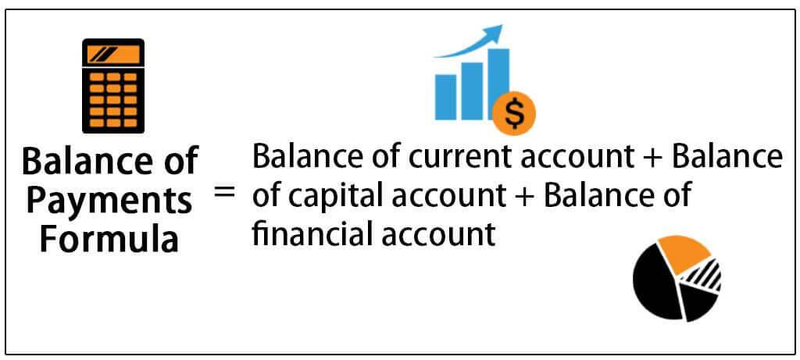

Economic accounting, balance of payments (BOP), and algorithmic trading are pivotal components of modern financial analysis. Economic accounting is the systematic performance measurement of an economy, utilizing standardized methods to capture a comprehensive picture of national and global economic health. This discipline focuses on national income accounting, which quantifies a nation's total economic activity, encompassing goods and services production, and financial transactions. It plays an essential role in both government policy-making and business strategy, offering insights into economic performance, resource allocation, and fiscal health.

The balance of payments is a critical tool for assessing a country’s international economic transactions over a specified period. It consists of three primary components: the current account, the capital account, and the financial account. The current account deals with the trade of goods and services, income, and current transfers. The capital account reflects net changes in ownership of national assets, and the financial account tracks investment flows. BOP data is invaluable for policymakers and investors alike, offering a snapshot of a nation's economic standing relative to the world, influencing exchange rates, foreign investment, and economic policy.



Algorithmic trading, on the other hand, refers to the use of computer algorithms to execute trading orders in financial markets at speeds and frequencies impossible for human traders. This approach leverages computational power to analyze market data, predict trends, and execute orders efficiently. Benefits of algorithmic trading include enhanced speed, reduced possibility of human error, and the ability to execute complex strategies that would be unmanageable manually. As such, algorithmic trading has become increasingly popular, representing a significant proportion of trades in many financial markets worldwide.

The intersection of these fields is gaining importance in today's financial landscapes. Economic accounting provides the quantitative foundation upon which trading strategies can be built and analyzed. BOP data, as part of economic accounting, offers insights into the macroeconomic trends and the fiscal condition of countries—information vital for traders operating across global markets. Algorithmic trading stands to gain considerably from integrating insights derived from economic accounting and BOP statistics. The goal of this article is to explore the synergies between BOP and algorithmic trading, particularly examining how BOP data can be harnessed within trading algorithms to forecast market movements and optimize trading strategies in the dynamic environment of global finance.

## Table of Contents

## Understanding Economic Accounting

Economic accounting is a framework used to systematically measure and analyze the economic activities and financial health of an economy. It plays a critical role in providing comprehensive data that guide policy-making and business strategies. Central to economic accounting are national income accounts, product accounts, and financial statements.

**National Income Accounts**

This component of economic accounting quantifies the total economic output of a nation. It includes metrics such as Gross Domestic Product (GDP), Gross National Product (GNP), and Net National Income (NNI). GDP measures the market value of all final goods and services produced within a country in a given period, providing an overview of economic performance. Mathematically, GDP can be represented as:

$$
\text{GDP} = C + I + G + (X - M)
$$

where $C$ is consumption, $I$ is investment, $G$ is government spending, and $(X - M)$ is net exports.

GNP extends GDP by adding income earned by residents from abroad and subtracting income earned by foreigners within the country. NNI further refines this by subtracting depreciation, offering insight into the sustained national economic output.

**Product Accounts**

Product accounts detail the output and input flows within an economy, helping to trace the production and consumption of goods and services. They play a pivotal role in identifying productive sectors and areas requiring economic support. These accounts are intrinsic to calculating GDP by the production and expenditure approaches.

**Financial Statements**

Financial statements, including balance sheets, income statements, and cash flow statements, provide a snapshot of the financial health of businesses and, by extension, the economy. They offer detailed insights into assets, liabilities, revenue, and expenditure. These statements are essential for assessing a company's profitability, [liquidity](/wiki/liquidity-risk-premium), and solvency, which in turn affects economic stability and growth predictions.

**Role in Decision-Making**

Economic accounting is indispensable for government and business decision-making. Governments rely on these accounts to design fiscal and monetary policies, assess economic performance, forecast economic trends, and allocate resources efficiently. For instance, understanding GDP and national income trends helps in setting interest rates and tax policies.

For businesses, financial statements are critical in strategic planning, investment decisions, and performance evaluations. Economic accounting helps businesses understand market demand, optimize resource allocation, and navigate economic cycles.

In conclusion, economic accounting provides essential data and analysis tools for evaluating and directing economic policies and business strategies. Its systematic approach to measuring economic performance is fundamental for maintaining healthy, stable, and growing economies.

## Exploring the Balance of Payments (BOP)

The Balance of Payments (BOP) is a comprehensive accounting framework that records all economic transactions between residents of a given country and the rest of the world over a specified period. These transactions help in understanding the economic relationship between nations and are crucial in assessing a country's financial stability and economic health. The BOP is divided into three main components: the current account, the capital account, and the financial account.

The **current account** captures transactions that involve the exchange of goods, services, income, and current transfers. It is further broken down into the trade balance (exports minus imports of goods and services), net income from abroad (including dividends and interest), and net current transfers, such as foreign aid or remittances. A surplus in the current account indicates that a country is a net lender to the rest of the world, whereas a deficit suggests it is a net borrower.

The **capital account** is relatively smaller and records capital transfers and the acquisition or disposal of non-produced, non-financial assets. Examples include debt forgiveness, transfers related to the sale of tangible assets like real estate, and patents. 

The **financial account** reflects changes in ownership of international financial assets and liabilities. It includes direct investment, portfolio investment, and other investments. Direct investment involves long-term investment in a business enterprise in another country. Portfolio investment consists of investing in foreign securities such as stocks and bonds, while other investments include trade credits, loans, and currency deposits. 

The importance of the BOP lies in its ability to indicate the economic transactions a country has with the rest of the world. Tracking these transactions helps in assessing whether a nation can fund its transactions through its own economy or needs foreign assistance. Persistent deficits in the current account might indicate looming financial trouble or a potential devaluation of the country's currency, necessitating intervention or adjustment measures.

BOP data is of great significance for policymakers and international investors. Policymakers use BOP [statistics](/wiki/bayesian-statistics) to inform decisions related to monetary policy, fiscal policy, and exchange rate determination. A surplus or deficit in the BOP influences interest rates and inflation policies. For instance, a current account deficit could prompt a country to raise interest rates to attract foreign capital, thus impacting domestic monetary policy.

International investors rely on BOP data to assess the economic stability and investment climate of a country. BOP statistics provide insights into potential currency fluctuations and economic risks, influencing decisions on investments in foreign markets. An understanding of a country's BOP can guide investors regarding currency hedging strategies, as significant deficits might suggest future currency devaluation, impacting returns on investments. 

Overall, the Balance of Payments is an essential tool for assessing a country's economic transactions and is crucial for effective decision-making by both governmental bodies and investors.

 to Algorithmic Trading

Algorithmic trading is a method of executing orders using automated and pre-programmed trading instructions to account for variables such as time, price, and [volume](/wiki/volume-trading-strategy). This approach utilizes complex mathematical models and algorithms to perform high-speed trading decisions, which are typically beyond the capabilities of human traders. 

At its core, [algorithmic trading](/wiki/algorithmic-trading) involves the use of computer algorithms to trigger orders based on predefined criteria. These criteria can include statistical [arbitrage](/wiki/arbitrage), [trend following](/wiki/trend-following), mean reversion, or other quantitative metrics. The algorithms can process vast amounts of data and execute trades in fractions of a second, allowing traders to capitalize on fleeting market opportunities.

The benefits of algorithmic trading are numerous. First, it offers significant speed advantages. Algorithms can process information and execute trades at a velocity unattainable by human intervention, ensuring that orders are placed at the most opportune moments. Secondly, algorithmic trading enhances accuracy. By eliminating human error, it allows for the precise execution of trades according to defined parameters, minimizing the risk of accidental mistakes and emotional decision-making. Additionally, algorithms can manage a multitude of complex strategies simultaneously, optimizing portfolio returns based on continuous market assessments.

Algorithmic trading has become increasingly popular and prevalent in modern financial markets. Major exchanges across the globe, including the New York Stock Exchange and NASDAQ, experience extensive algorithmic activity, with estimates suggesting that it may account for up to 70% of total trade volume. The rise of high-frequency trading, a subset of algorithmic trading characterized by extremely short holding periods, has further accentuated its importance. 

Moreover, the proliferation of accessible programming languages, such as Python, has democratized algorithmic trading, allowing individual traders to develop and implement their own strategies. For example, Python's libraries like NumPy and pandas are widely used for data analysis, while packages such as TA-Lib provide a suite of technical analysis functions for creating trading algorithms.

Ultimately, algorithmic trading represents a significant advancement in market dynamics, reshaping how securities are traded and presenting both opportunities and challenges for institutional and retail traders alike.

## The Link Between BOP and Algorithmic Trading

The interplay between the Balance of Payments (BOP) and algorithmic trading is a critical nexus in modern financial markets. The BOP—a comprehensive accounting record of a country's economic transactions with the world—provides vital insights into trade balance, capital flows, and foreign exchange reserves. These components can significantly influence algorithmic trading strategies, particularly within [forex](/wiki/forex-system) and global equities markets.

Algorithmic trading relies on computer programs to execute trades with high speed and precision, often capitalizing on minute price discrepancies across markets. BOP data can act as a significant determinant for such trading strategies due to its reflection of economic trends and conditions. For instance, a persistent trade surplus or deficit in the BOP can lead to expectations of currency appreciation or depreciation, impacting forex trading algorithms that use predictive modeling. 

Predictive models for currency and commodity prices can be enhanced through BOP statistics. These models often incorporate macroeconomic indicators that relate to trade and capital flows observed in the BOP. Algorithms can use these indicators to forecast currency trends or commodity prices, leveraging [machine learning](/wiki/machine-learning) techniques. For example, using Python, traders might implement a regression model that predicts future currency positions based on historical BOP data.

```python
import pandas as pd
from sklearn.linear_model import LinearRegression

# Example of using BOP data for currency prediction
# Assume bop_data is a DataFrame containing historical BOP statistics and corresponding currency values

bop_data = pd.read_csv('bop_data.csv')  # Example CSV file
X = bop_data[['current_account', 'capital_account', 'financial_account']]
y = bop_data['currency_value']

model = LinearRegression()
model.fit(X, y)

# Predict future currency value
future_bop = pd.DataFrame([[500, -200, 150]], columns=['current_account', 'capital_account', 'financial_account'])
predicted_value = model.predict(future_bop)
```

Integrating BOP data into algorithmic trading platforms poses several challenges. The complexity of interpreting extensive BOP datasets and the timeliness of data release can affect the accuracy of trading decisions. Moreover, algorithmic strategies need to accommodate changing international economic dynamics, requiring constant adaptation of predictive models.

There are also technical considerations, such as data latency, system integration, and the computational power required to process high-frequency data. Furthermore, algorithms must be robust against unexpected economic shifts that are not immediately reflected in BOP data but may affect market conditions.

In conclusion, while BOP data holds significant potential for enhancing algorithmic trading strategies, particularly through predictive modeling, integrating this data requires sophisticated systems and adaptive models. Understanding these factors is crucial for navigating the volatile and complex landscape of global financial markets, where algorithmic trading plays an increasingly dominant role.

## Impacts and Implications

Combining Balance of Payments (BOP) data with algorithmic trading introduces significant potential impacts on financial markets and economic stability. This synergy leverages detailed insights about global economic transactions to refine and enhance algorithmic trading strategies. This fusion can lead to increased market efficiencies through more informed trading decisions and improved price discovery, as algorithms incorporate comprehensive international transaction data.

A primary benefit of integrating BOP data with algorithmic trading is the augmentation of predictive capabilities. By utilizing BOP statistics, algorithms can model currency flows and predict market movements. For example, a significant trade deficit reported in the BOP data might inform algorithms of potential currency depreciation, prompting strategic trades. This information flow allows for timely risk adjustments, enhancing market liquidity and potentially stabilizing currency markets by mitigating abrupt speculative moves.

However, this intersection also poses policy implications and regulatory challenges. As algorithms become sophisticated, regulatory bodies must ensure that the trading activities do not lead to market manipulation or systemic risks. Regulatory frameworks must evolve to address the transparency and accountability of algorithms using BOP data. For instance, safeguards should be in place to monitor whether algorithmic strategies based on BOP data distort market prices or lead to unequal information access among market participants.

The future outlook for the integration of BOP data in algorithmic trading showcases numerous opportunities for innovation and advancement. One area of growth is the development of AI-driven models capable of autonomously analyzing vast datasets, including BOP, to generate actionable trading strategies. This advancement could lead to more democratized trading environments where smaller entities can compete with established financial institutions by leveraging sophisticated algorithms.

Moreover, the evolution of quantum computing could exponentially increase the processing capabilities necessary to handle complex BOP datasets, potentially revolutionizing the predictive accuracy of algorithmic trading strategies. As more sophisticated computing methods evolve, so too will the capacity to incorporate increasingly granular data, enhancing the precision of decision-making in trading environments.

In conclusion, while the integration of BOP data in algorithmic trading presents significant opportunities for market enhancement and economic insight, it necessitates careful consideration of regulatory frameworks to safeguard financial stability. The continual refinement of these systems holds promise for more robust, efficient, and equitable global financial markets.

## Conclusion

In conclusion, the article explored the intricate interplay between economic accounting’s balance of payments (BOP) and the sphere of algorithmic trading. The balance of payments serves as a vital tool in providing a comprehensive overview of a country's economic transactions with the rest of the world, highlighting its role as an integral component of economic accounting. Understanding the BOP is crucial for policymakers and international investors as it provides insights into the economic health and financial stability of a nation. This understanding has been demonstrated to be increasingly significant in the context of algorithmic trading.

Algorithmic trading, characterized by the use of computer algorithms to efficiently execute trading strategies, has gained prominence due to its speed, precision, and ability to leverage complex algorithms. The integration of BOP data into trading algorithms presents both opportunities and challenges. By incorporating BOP statistics, traders and financial analysts can potentially enhance predictive models to anticipate currency and commodity price movements more effectively. Nonetheless, the task is not without challenges, including the need for sophisticated data analysis methods and the necessity to remain compliant with various regulations.

The potential impacts of merging BOP data with algorithmic trading strategies are profound, offering possibilities for innovation and optimization in financial markets. However, such an integration underscores the need for well-defined regulatory frameworks to address potential risks to market stability and protect economic interests.

The evolving landscape of finance and technology underscores the importance of further research into this promising field. Encouraging more work in integrating economic principles with technological advancements such as algorithmic trading can lead to greater efficiencies and innovations, ultimately fostering a more robust global financial system. Future exploration in this area will undoubtedly pave the way for advancements that enhance both economic understanding and technological capabilities.

## References & Further Reading

[1]: Bergstra, J., Bardenet, R., Bengio, Y., & Kégl, B. (2011). ["Algorithms for Hyper-Parameter Optimization."](https://papers.nips.cc/paper/4443-algorithms-for-hyper-parameter-optimization) Advances in Neural Information Processing Systems 24.

[2]: ["Advances in Financial Machine Learning"](https://www.amazon.com/Advances-Financial-Machine-Learning-Marcos/dp/1119482089) by Marcos Lopez de Prado

[3]: ["Evidence-Based Technical Analysis: Applying the Scientific Method and Statistical Inference to Trading Signals"](https://www.amazon.com/Evidence-Based-Technical-Analysis-Scientific-Statistical/dp/0470008741) by David Aronson

[4]: ["Machine Learning for Algorithmic Trading"](https://github.com/stefan-jansen/machine-learning-for-trading) by Stefan Jansen

[5]: ["Quantitative Trading: How to Build Your Own Algorithmic Trading Business"](https://www.amazon.com/Quantitative-Trading-Build-Algorithmic-Business/dp/1119800064) by Ernest P. Chan