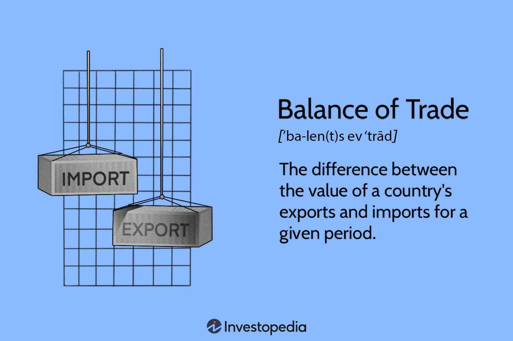

## Table of Contents

## What is the balance of trade?

The balance of trade is the difference between the value of a country's exports and the value of its imports over a certain period, usually a year. If a country exports more than it imports, it has a trade surplus. If it imports more than it exports, it has a trade deficit. This balance is an important part of a country's economy because it shows how much the country is trading with other countries.

A trade surplus can be good for a country because it means more money is coming into the country than going out. This can help the country's economy grow. However, a trade deficit might mean that the country is spending more on foreign goods than it is earning from its own exports. This can lead to borrowing money from other countries, which might cause economic problems in the future. Governments and economists watch the balance of trade closely to make decisions about economic policies.

## How is the balance of trade calculated?

The balance of trade is calculated by subtracting the total value of a country's imports from the total value of its exports over a specific time period, like a year. If the value of exports is higher than the value of imports, the country has a trade surplus. If the value of imports is higher than the value of exports, the country has a trade deficit. This calculation is usually done using data from customs and trade statistics.

The data used for this calculation includes the monetary value of goods that cross the country's borders. Services, like tourism or banking, are not included in the balance of trade but are part of the broader balance of payments. To get accurate figures, countries use customs declarations and other trade documents to track the value of goods entering and leaving the country.

## What is the difference between a trade surplus and a trade deficit?

A trade surplus happens when a country sells more things to other countries than it buys from them. This means more money comes into the country than goes out. It's like having more income than expenses. A trade surplus can be good because it can make the country's economy stronger. It can also mean that the country is good at making things that other countries want to buy.

A trade deficit is the opposite. It happens when a country buys more things from other countries than it sells to them. This means more money goes out of the country than comes in. It's like spending more money than you earn. A trade deficit might not be good because it can make the country borrow money from other countries, which can lead to problems if it keeps happening for a long time.

## Why is the balance of trade important for a country's economy?

The balance of trade is really important for a country's economy because it shows if the country is making more money from selling things to other countries than it's spending on buying things from them. If a country has a trade surplus, it means it's selling more than it's buying, which can make the economy stronger. This is good because it brings more money into the country, which can help create jobs and grow businesses.

On the other hand, if a country has a trade deficit, it means it's buying more from other countries than it's selling. This can be a problem because the country might need to borrow money to pay for all the things it's buying. If this keeps happening, it could lead to economic problems in the future. So, governments and economists watch the balance of trade closely to make smart decisions about the country's money and policies.

## Can you provide examples of countries with a trade surplus?

Germany is a good example of a country with a trade surplus. It sells a lot of cars, machines, and chemicals to other countries. These things are popular all over the world, so Germany makes more money from selling them than it spends on buying things from other countries. This helps Germany's economy stay strong.

Another example is China. China makes and sells a lot of electronics, clothes, and toys. Many countries buy these things from China, so China earns more money from its exports than it spends on imports. This trade surplus helps China's economy grow and gives it more money to use for other things.

## Can you provide examples of countries with a trade deficit?

The United States often has a trade deficit. This means it buys more things from other countries than it sells to them. For example, the U.S. imports a lot of cars, electronics, and clothes from countries like China, Japan, and Mexico. Even though the U.S. exports things like airplanes and farming products, it doesn't make enough money from these exports to cover all the things it buys. This trade deficit means the U.S. needs to borrow money or use its savings to pay for the difference.

Another country with a trade deficit is the United Kingdom. The UK buys more goods from other countries than it sells. It imports a lot of food, cars, and machinery. While the UK does export things like airplanes and financial services, it's not enough to balance out what it spends on imports. This ongoing trade deficit can affect the UK's economy because it means more money is going out than coming in, which can lead to borrowing and other financial challenges.

## How does the balance of trade affect currency value?

The balance of trade can affect how much a country's money, or currency, is worth compared to other countries' money. If a country has a trade surplus, it means it's selling more things to other countries than it's buying. This can make its currency stronger because more people want to buy that country's money to pay for the things they're buying. When a currency is stronger, it can buy more foreign goods and services, which can be good for the people in that country.

On the other hand, if a country has a trade deficit, it's buying more things from other countries than it's selling. This can make its currency weaker because it needs to buy more foreign money to pay for all the things it's importing. A weaker currency means it can buy less from other countries, which might make things more expensive for people at home. So, the balance of trade plays a big role in deciding how strong or weak a country's money is.

## What are the factors that influence a country's balance of trade?

A country's balance of trade is influenced by many things. One big [factor](/wiki/factor-investing) is how much people in the country want to buy things from other countries. If people want a lot of foreign goods, like cars or electronics, the country will import more, which can lead to a trade deficit. Another factor is how much other countries want to buy things made in the country. If the country makes things that other countries really want, like technology or food, it can have a trade surplus because it exports more.

Exchange rates also play a big role. If a country's money is worth a lot compared to other countries' money, its exports might be too expensive for other countries to buy. This can lead to a trade deficit. But if the country's money is worth less, its exports become cheaper, which can help the country sell more things and have a trade surplus. Government policies can also affect the balance of trade. For example, if a government puts taxes on imports, it can make foreign goods more expensive, which might make people buy more things made at home.

Other factors include how good the country is at making things and how much it costs to make them. If a country can make things cheaply and well, it can sell more to other countries and have a trade surplus. But if it's hard for the country to make things or if it costs a lot, it might have to buy more from other countries, leading to a trade deficit. All these factors together decide if a country will have a trade surplus or a trade deficit.

## How do trade policies impact the balance of trade?

Trade policies can really change a country's balance of trade. If a government puts high taxes on things coming into the country, it makes those things more expensive. This can make people buy more things made at home instead of buying from other countries. This can help the country have a trade surplus because it's selling more things to other countries than it's buying. Also, if the government gives money or help to companies that make things to sell to other countries, it can make those companies sell more, which can also lead to a trade surplus.

On the other hand, if a government makes it easy for things to come into the country by not putting taxes on them, people might buy more from other countries. This can lead to a trade deficit because the country is buying more than it's selling. Sometimes, trade agreements between countries can also affect the balance of trade. If two countries agree to buy and sell things from each other without taxes, it can change how much each country is importing and exporting. So, trade policies are a big deal when it comes to deciding if a country will have a trade surplus or a trade deficit.

## What are the long-term effects of a persistent trade deficit or surplus?

A country that keeps having a trade deficit for a long time might face some problems. When a country buys more from other countries than it sells, it has to borrow money or use its savings to pay for the difference. This can make the country owe a lot of money to other countries, which can be hard to pay back. It can also make the country's money, or currency, worth less compared to other countries' money. This might make things more expensive for people at home because they have to pay more for things from other countries. If the trade deficit keeps going, it can slow down the country's economy because it's not making as much money from selling things as it's spending on buying them.

On the other hand, a country with a long-term trade surplus can have some good things happen. When a country sells more than it buys, it brings in more money than it spends. This can make the country's economy stronger because it has more money to use for things like building roads, schools, and helping businesses grow. It can also make the country's money worth more compared to other countries' money. But if the trade surplus is too big for too long, it might make other countries unhappy because they feel like they're not selling enough to the country with the surplus. This can lead to trade fights or disagreements between countries.

## How does the balance of trade relate to the balance of payments?

The balance of trade is a part of the bigger picture called the balance of payments. The balance of payments is like a big report that shows all the money coming in and going out of a country. It includes money from selling things to other countries (exports) and money spent on buying things from other countries (imports), which is the balance of trade. But it also includes other things like money from tourists, money sent home by people working in other countries, and money from investments.

If a country has a trade surplus, where it sells more than it buys, this can help the balance of payments look better because more money is coming into the country. But if it has a trade deficit, where it buys more than it sells, the balance of payments might look worse because more money is going out. The balance of payments helps countries see if they're spending more money than they're [earning](/wiki/earning-announcement), which can be important for making decisions about the country's money and economy.

## What strategies can countries use to improve their balance of trade?

Countries can use different strategies to make their balance of trade better. One way is to make things cheaper and better at home so that other countries want to buy more from them. This can be done by helping companies with money or by making it easier for them to do business. Another way is to put taxes on things coming into the country, which makes them more expensive. This can make people buy more things made at home instead of buying from other countries. Also, making deals with other countries to buy and sell things without taxes can help a country sell more of its own things.

Another strategy is to make the country's money worth less compared to other countries' money. This makes things made in the country cheaper for other countries to buy, which can help the country sell more and have a better balance of trade. But this can also make things from other countries more expensive for people at home. Governments can also focus on making things that other countries really want, like technology or food, and selling more of those things. By using these strategies, a country can try to sell more than it buys and improve its balance of trade.

## What is the Understanding of Balance of Trade (BOT)?

The Balance of Trade (BOT) is a fundamental economic metric that quantifies the difference in value between a country's exports and imports over a specific period. It is calculated using the formula:

$$
\text{BOT} = \text{Exports} - \text{Imports}
$$

A positive BOT value indicates a trade surplus, meaning the total value of a country's exports exceeds that of its imports. Conversely, a negative BOT signifies a trade deficit, where imports surpass exports, leading to an outflow of domestic currency to foreign markets.

BOT is a vital component of a nation's balance of payments, which is a comprehensive accounting of all economic transactions between residents of a country and the rest of the world over a specific timeframe. It plays a crucial role in reflecting a country's economic exchanges at an international level.

Notably, while a favorable BOT (trade surplus) may often be seen as a sign of economic strength, presenting a nation as a competitive producer in global markets, this is not universally conclusive. A persistent trade surplus can sometimes lead to trade tensions with other nations, potentially invoking protective measures against perceived economic dominance.

Conversely, a trade deficit, while frequently interpreted as economic weakness, could also signify robust domestic demand, indicating that consumers have sufficient purchasing power to acquire foreign goods and services. In some instances, a trade deficit might support economic growth if imports are directed towards investments that enhance future productive capacity.

Evaluating BOT as an indicator of economic health requires a nuanced approach, wherein it must be considered alongside other critical economic metrics such as Gross Domestic Product (GDP), employment levels, and inflation rates. This comprehensive view ensures a more accurate interpretation of a country's economic standing and its implications for policy-making and international relations.

## What are the special considerations in trade balances?

Trade balances are critical components of a nation's economic assessment, but they are not definitive indicators of economic health on their own. Analyzing trade balances requires a comprehensive understanding of broader economic contexts, including business cycles and other fiscal metrics. A trade balance, whether surplus or deficit, must be viewed through the lens of its interaction with external economic variables.

Exchange rate fluctuations are pivotal in influencing trade balances. The exchange rate affects the competitiveness of a country's goods and services abroad. A stronger domestic currency makes exports more expensive and imports cheaper, potentially leading to a trade deficit, whereas a weaker currency can enhance export competitiveness and lead to a surplus. This relationship can be described using the equation of exchange:

$$
\text{Balance of Trade} = \text{Exports} - \text{Imports}
$$

Fiscal policies also play a substantial role in shaping trade balances. Government policies concerning taxation, government spending, and borrowing influence domestic demand and inflation, which, in turn, affect trade dynamics. For example, an expansionary fiscal policy, characterized by increased government spending or tax cuts, can stimulate domestic demand, possibly increasing imports and contributing to a trade deficit.

Countries may adopt specific strategies, such as currency devaluation or trade protectionism, to influence their trade balances. Currency devaluation involves reducing the value of a country's currency relative to others, making exports cheaper and imports more expensive. While this can boost export volumes and reduce trade deficits, it may also lead to inflation and reduced purchasing power domestically. Trade protectionism, which includes tariffs and quotas, aims to protect domestic industries by making imported goods more expensive. While it may improve the trade balance, it can lead to retaliation by trade partners and reduced economic efficiency.

In the long term, maintaining a healthy trade balance requires strategies beyond short-term measures. Countries should focus on fostering globally competitive exports, which involves investing in research and development, improving product quality, and enhancing supply chain efficiencies. Efficient import management is also vital, ensuring that imports complement domestic production rather than competing with it.

Trade balances must be considered within the broader spectrum of economic activities. Their interaction with business cycles, exchange rates, and fiscal policies is complex and requires nuanced analysis. Understanding these dynamics is essential for crafting sustainable economic strategies that support long-term growth and stability.

## References & Further Reading

[1]: Krugman, P. R., & Obstfeld, M. (2009). ["International Economics: Theory and Policy"](https://archive.org/details/internationaleco0008krug). Pearson Education.

[2]: Bhagwati, J. (2004). ["In Defense of Globalization"](https://www.researchgate.net/publication/274185673_In_Defense_of_Globalization) Oxford University Press.

[3]: Lopez de Prado, M. (2018). ["Advances in Financial Machine Learning"](https://www.amazon.com/Advances-Financial-Machine-Learning-Marcos/dp/1119482089). Wiley.

[4]: Hull, J. C. (2021). ["Options, Futures, and Other Derivatives"](https://books.google.com/books/about/Options_Futures_and_Other_Derivatives_Gl.html?id=sdg2EAAAQBAJ). Pearson Education.

[5]: Baldwin, R. E. (2016). ["The Great Convergence: Information Technology and the New Globalization"](https://www.jstor.org/stable/j.ctv24w655w). Belknap Press.

[6]: U.S. Census Bureau. (2022). ["U.S. Trade in Goods and Services - Balance of Payments (BOP) Basis"](https://www.census.gov/ft900). 

[7]: World Bank. (2020). ["China's Economy: Surging Exports in 2020 - World Bank Data"](https://merics.org/en/merics-briefs/trump-20-and-chinas-eu-policy-mercosur-trade-tensions). 

[8]: Stiglitz, J. (2002). ["Globalization and Its Discontents"](https://books.google.com/books/about/Globalization_and_Its_Discontents.html?id=geN6MUthHdkC). W.W. Norton & Company.