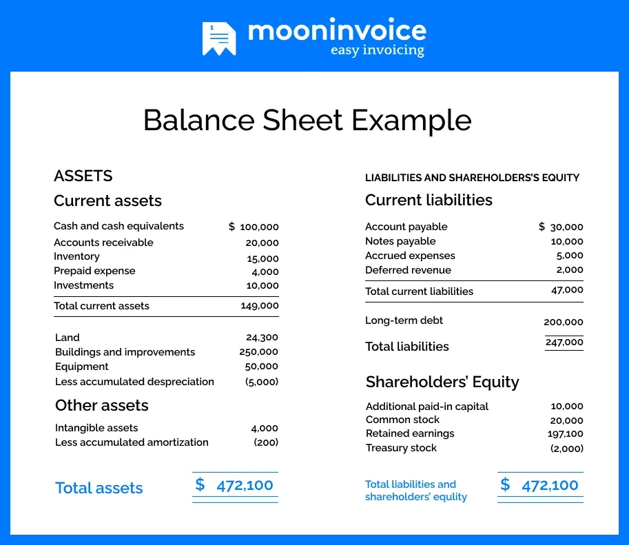

## Table of Contents

## What is a balance sheet?

A balance sheet is a financial statement that shows what a company owns and what it owes at a specific time. It's like a snapshot of the company's financial health. The balance sheet has two main parts: assets, which are things the company owns like money, buildings, and equipment; and liabilities, which are debts the company needs to pay, like loans or bills.

The balance sheet also includes something called equity, which is the difference between the company's assets and liabilities. Equity represents the owner's share in the business. The basic idea behind a balance sheet is that the total value of a company's assets should equal the sum of its liabilities and equity. This is why it's called a balance sheet – because it balances out. By looking at a balance sheet, people like investors or managers can see if the company is doing well financially or if it might have problems.

## What are the main components of a balance sheet?

The main components of a balance sheet are assets, liabilities, and equity. Assets are everything a company owns that has value. This includes cash, money that people owe the company, buildings, machines, and even things like patents or trademarks. Assets are usually split into two groups: current assets, which can be turned into cash quickly, and non-current assets, which are things that will be used over a long time.

Liabilities are what the company owes to others. This can be money the company borrowed, like loans from a bank, or money it needs to pay for things it bought, like bills from suppliers. Just like assets, liabilities are divided into current liabilities, which need to be paid soon, and long-term liabilities, which the company has more time to pay.

Equity is the part of the company that belongs to the owners. It's what's left after you subtract the liabilities from the assets. Equity can include money that the owners put into the business, as well as any profits that the company has made but not given back to the owners. The balance sheet shows that a company's total assets are equal to its total liabilities plus its equity, which is why it's called a balance sheet.

## How do assets, liabilities, and equity relate on a balance sheet?

On a balance sheet, assets, liabilities, and equity all work together to show how a company is doing financially. Assets are everything the company owns that has value, like cash, buildings, and equipment. Liabilities are what the company owes, such as loans or bills. Equity is what's left over when you take away the liabilities from the assets, and it shows how much of the company really belongs to the owners.

The main idea of a balance sheet is that the total value of the company's assets should be the same as the total of its liabilities plus its equity. This is why it's called a "balance" sheet - because everything has to balance out. If a company has a lot of assets and not many liabilities, it usually means the company is doing well. But if the liabilities are more than the assets, it might mean the company has financial problems.

## What are current assets and how are they listed on a balance sheet?

Current assets are things a company owns that can be turned into cash within a year. They are important because they show how much money the company can get quickly if it needs to. Examples of current assets include cash, money that people owe the company (called accounts receivable), and things like inventory, which are products the company has ready to sell.

On a balance sheet, current assets are listed at the top of the assets section. They are usually shown in the order of how quickly they can be turned into cash. So, cash would be listed first, then accounts receivable, then inventory, and any other current assets. This way, anyone looking at the balance sheet can see right away how much money the company can get its hands on fast.

## What are non-current assets and what examples can be included?

Non-current assets are things a company owns that it plans to keep and use for more than one year. These assets are not meant to be turned into cash quickly, but they help the company do its business over a long time. Non-current assets are important because they show how much the company has invested in its future.

Examples of non-current assets include buildings, land, and big machines or equipment that the company uses to make its products or provide its services. Other examples are long-term investments, like stocks or bonds that the company plans to hold onto for a while, and intangible assets, like patents or trademarks that give the company special rights or advantages. These assets are all listed on the balance sheet after the current assets, showing what the company has for the long term.

## What are current liabilities and how do they differ from long-term liabilities?

Current liabilities are debts that a company needs to pay within one year. These can include things like bills from suppliers that the company hasn't paid yet, wages it owes to employees, and short-term loans that need to be paid back soon. They are important because they show how much money the company needs to come up with quickly to keep running smoothly.

Long-term liabilities, on the other hand, are debts that the company doesn't have to pay back within the next year. These can be things like long-term loans from a bank or bonds that the company issued to raise money. Long-term liabilities help show how the company is planning to use money over a longer period of time. The main difference between current and long-term liabilities is the time the company has to pay them back, which affects how the company manages its money and plans for the future.

## How is shareholders' equity calculated on a balance sheet?

Shareholders' equity is what's left over after you subtract a company's liabilities from its assets. It shows how much of the company really belongs to the people who own the shares, or stocks, of the company. You can think of it as the net worth of the company from the shareholders' point of view. To calculate shareholders' equity, you start with the total assets of the company and then take away the total liabilities. The formula is simple: Shareholders' Equity = Total Assets - Total Liabilities.

This number is important because it tells investors and owners how much value they have in the company. If shareholders' equity is high, it means the company has a lot of value after paying off its debts. If it's low or negative, it might mean the company owes more than it owns, which could be a warning sign. Shareholders' equity can also change over time because of things like profits the company makes, money the company pays out to shareholders as dividends, or new money that shareholders put into the company.

## Can you explain the difference between book value and market value on a balance sheet?

Book value and market value are two different ways to look at the value of a company. Book value is what you see on the balance sheet. It's calculated by taking the total assets of the company and subtracting the total liabilities. This gives you the shareholders' equity, which is the book value. It's like a snapshot of what the company is worth according to its own records and accounting rules.

Market value, on the other hand, is what people are willing to pay for the company's stock in the open market. It's not shown on the balance sheet but can be figured out by looking at the stock price and the number of shares the company has. Market value can be very different from book value because it's influenced by things like how well people think the company will do in the future, the overall economy, and even news or rumors. So, while book value is based on what the company has and owes right now, market value is more about what people think the company is worth.

## How does the balance sheet reflect a company's financial health?

A balance sheet shows a company's financial health by listing all its assets, liabilities, and equity at a certain time. It's like a big picture of what the company owns and what it owes. If a company has a lot of assets compared to its liabilities, it means the company is doing well. It has enough things of value to cover its debts, which is a good sign. On the other hand, if the liabilities are bigger than the assets, it could mean the company is in trouble because it owes more than it owns.

The balance sheet also helps people see how much of the company belongs to the owners, which is called equity. If the equity is high, it shows that after paying off all the debts, there's still a lot of value left for the owners. This is a good sign of financial health. But if the equity is low or negative, it could mean the company is not doing well because it doesn't have much left for the owners after paying its debts. By looking at the balance sheet, people can get a quick idea of whether the company is strong and stable or if it might have financial problems.

## What are some common ratios used to analyze a balance sheet?

When people want to understand a company's financial health by looking at its balance sheet, they often use ratios. One common ratio is the current ratio, which shows if a company can pay its short-term debts. You find it by dividing current assets by current liabilities. A high current ratio means the company has enough money coming in soon to pay what it owes soon, which is good. Another ratio is the debt-to-equity ratio, which tells you how much the company relies on borrowed money compared to money from owners. You get this by dividing total liabilities by total equity. A lower debt-to-equity ratio usually means the company is less risky because it's not borrowing too much.

Another useful ratio is the return on equity (ROE), which shows how well the company is using the money the owners put in to make a profit. You calculate it by dividing net income by shareholders' equity. A high ROE means the company is doing a good job of turning the owners' money into more money. The equity ratio is also important, showing how much of the company's assets are owned by the owners rather than borrowed. You find it by dividing total equity by total assets. A higher equity ratio means the company is more financially stable because it's not relying too much on borrowed money.

## How do changes in accounting standards affect the presentation of a balance sheet?

Changes in accounting standards can affect how a company's balance sheet looks because these standards are the rules that companies follow when they make their financial statements. If the rules change, companies have to follow the new rules, which can mean they show their assets, liabilities, and equity differently. For example, if a new rule says that certain things should be counted as assets when they weren't before, the total assets on the balance sheet will go up. Or if a new rule changes how a company should list its debts, the liabilities might look different too.

These changes can make it hard for people to compare a company's balance sheet from one year to the next because the numbers might be affected by the new rules rather than just how the company is doing. But the good thing is that changes in accounting standards are usually made to make financial statements clearer and more useful. So even though it might take some time to get used to the new way of showing things, in the end, it can help people understand a company's financial health better.

## Can you provide an example of a balance sheet from a real company and explain its components?

Here's a simple example of a balance sheet from Apple Inc., as of September 2022. At the top of the balance sheet, you'll see the company's total assets. Apple's total assets were about $352 billion. This includes current assets like cash and cash equivalents, which were about $23.6 billion, and accounts receivable, which were about $60.9 billion. These are things Apple can turn into cash quickly. Apple also has non-current assets like property, plant, and equipment, which were about $48.9 billion. These are things Apple plans to use for a long time.

Below the assets, you'll see the liabilities and equity. Apple's total liabilities were about $287 billion. This includes current liabilities like accounts payable, which were about $64.5 billion, and long-term liabilities like long-term debt, which were about $98.7 billion. These are the debts Apple owes to others. After subtracting the total liabilities from the total assets, you get the shareholders' equity, which was about $65 billion for Apple. This is what's left over for the owners of the company after all the debts are paid. It shows how much of Apple really belongs to its shareholders.

This balance sheet tells us that Apple has a lot of assets compared to its liabilities, which is a good sign of financial health. The company has enough valuable things to cover what it owes, and there's still a lot left over for the owners. By looking at this balance sheet, people can see that Apple is doing well financially.

## What is the key to understanding the balance sheet?

A balance sheet is a fundamental financial document that provides a snapshot of a company's financial position at a specific point in time. It is structured around the accounting equation:

$$
\text{Assets} = \text{Liabilities} + \text{Shareholders' Equity}
$$

This equation ensures that the balance sheet is always balanced, which is essential for accurate financial reporting and analysis. Each element of the balance sheet offers critical insights into a company's financial health.

**Assets** represent everything a company owns that has value. They are divided into current assets and non-current assets. Current assets are expected to be converted into cash or used up within one year, such as cash, accounts receivable, and inventory. Non-current assets, also known as long-term assets, include property, plant, equipment, and intangible assets like patents, which provide value over a longer period.

**Liabilities** encompass a company's financial obligations. Similar to assets, liabilities are categorized into current and long-term liabilities. Current liabilities are due within one year, including accounts payable and short-term loans. Long-term liabilities, such as bonds payable and long-term loans, are obligations that are payable over a time frame exceeding one year.

**Shareholders' Equity** reflects the residual interest in the assets of a company after deducting liabilities. It comprises common and preferred stock, additional paid-in capital, and retained earnings. Retained earnings represent the cumulative amount of net income retained in the business instead of being distributed as dividends.

The balance sheet is an indispensable tool for evaluating a company's financial health. It allows investors and creditors to assess a company's [liquidity](/wiki/liquidity-risk-premium), solvency, and overall financial stability. By analyzing the relationships between the various components—such as the ratio of current assets to current liabilities, known as the current ratio—stakeholders can make informed decisions regarding investment and lending opportunities. The balance sheet, therefore, plays a crucial role in both internal and external financial analysis, guiding strategic decision-making and providing transparency to stakeholders.

## What are the components of a balance sheet?

A balance sheet, often referred to as a statement of financial position, is an essential part of financial reporting. It offers insights into a company’s financial health by showcasing its assets, liabilities, and shareholders’ equity at a specific point in time.

### Assets: Current vs. Non-Current

Assets are economic resources that a company owns or controls with the expectation that they will provide future benefits. They are classified into two main categories: current and non-current assets.

- **Current assets** are those expected to be converted into cash or consumed within one year. Examples include:
  - **Cash**: Liquid assets readily available for use.
  - **Accounts receivable**: Money owed to the company by customers for goods or services already delivered.
  - **Inventory**: Goods available for sale or in the process of being made ready for sale.

- **Non-current assets**, also known as long-term assets, are not expected to be liquidated within the fiscal year. Examples include:
  - **Property, plant, and equipment (PP&E)**: Tangible assets such as buildings and machinery that a company uses in its operations.
  - **Intangible assets**: Non-physical assets like patents and trademarks.

### Liabilities: Short-term vs. Long-term

Liabilities represent obligations that a company must settle in the future, usually through the transfer of money, goods, or services.

- **Short-term liabilities**, or current liabilities, are due for settlement within one year. Common examples are:
  - **Accounts payable**: Money owed by the company to suppliers for products and services purchased on credit.
  - **Short-term loans**: Borrowings that need to be repaid within a year.

- **Long-term liabilities** are obligations that are not due for more than one year. These may include:
  - **Long-term loans and bonds payable**: Debts that extend beyond the one-year mark.
  - **Deferred tax liabilities**: Taxes owed but not yet payable due to timing differences between accounting and tax rules.

### Shareholders’ Equity

Shareholders’ equity, sometimes called stockholders' equity, represents the residual interest in the assets of the company after deducting liabilities. It is an indicator of the company's net worth and comprises several components:

- **Retained earnings**: Profits that a company reinvests in its operations rather than distributing to shareholders as dividends.
- **Common stock**: Equity securities representing ownership in a corporation, with voting rights typically attached.
- **Preferred stock**: Equity securities with dividends or liquidation preferences over common stock, usually lacking voting rights.

The relationship between these elements is expressed in the fundamental accounting equation:

$$
\text{Assets} = \text{Liabilities} + \text{Shareholders’ Equity}
$$

Understanding these components helps stakeholders assess the financial health and operational efficiency of a business, forming the foundation for various financial analyses and strategy formulations.

## What is the impact of algorithmic trading?

Algorithmic trading, commonly defined as the use of computer programs to execute trades, capitalizes on speed and efficiency to manage large volumes of transactions. The integration of financial statements, especially the balance sheet, holds significant potential to enrich these trading strategies. By providing insights into a company's financial health, balance sheet data equips [algorithmic trading](/wiki/algorithmic-trading) systems with a deeper understanding of underlying economic indicators.

A balance sheet portrays a company's assets, liabilities, and shareholders' equity at a precise moment, formulated by the equation: 

$$
\text{Assets} = \text{Liabilities} + \text{Shareholders' Equity}
$$

This foundational data is invaluable for crafting sophisticated trading algorithms. For instance, metrics such as liquidity ratios or debt-equity ratios, derived from balance sheet components, can serve as criteria in algorithmic decision-making processes, offering predictive power regarding a company's future ability to sustain operations or expand.

Algorithmically trading assets at high speed necessitates integrating balance sheets into these models. The alignment of accounting data with trading algorithms introduces both opportunities and challenges. A crucial benefit is the potential to augment algorithmic strategies with [fundamental analysis](/wiki/fundamental-analysis), increasing the robustness and depth of trading decisions. However, potential challenges arise due to the static nature of balance sheets. Being snapshots in time, these documents may not reflect current market conditions, thus necessitating the incorporation of real-time data to mitigate any temporal discrepancies.

Moreover, the accuracy and timeliness of balance sheet data are paramount. Algorithms depend on precise inputs to function optimally. Outdated or inaccurately reported financial information could mislead algorithmic decisions, potentially leading to unfavorable trading outcomes.

In this rapidly evolving field, the successful intersection of accounting data and trading algorithms involves not only leveraging the inherent value of balance sheets but also continuously refining techniques to ensure data accuracy and relevance. This includes powerful computational tools and algorithms, capable of swiftly interpreting complex datasets and adjusting strategies in real time. As technology updates, the harmonization between traditional accounting data and advanced trading systems is expected to advance, offering even more precise and efficient investment strategies.

## What is Balance Sheet Analysis for Trading Algorithms?

Integrating balance sheet analysis into trading algorithms involves using financial ratios and historical data to inform and optimize trading models. Ratios such as the debt-to-equity ratio and the acid-test ratio provide insight into a company’s financial stability and liquidity, making them valuable metrics for algorithmic traders.

### Incorporation of Balance Sheet Ratios

1. **Debt-to-Equity Ratio**: This ratio measures the relative proportion of shareholders' equity and debt used to finance a company's assets and is calculated as:
$$
   \text{Debt-to-Equity Ratio} = \frac{\text{Total Liabilities}}{\text{Shareholders' Equity}}

$$

   A higher ratio suggests more leverage and potential financial risk, while a lower ratio indicates more equity financing, reducing risk. Trading algorithms can integrate this ratio to assess risk levels associated with trading particular stocks, filtering out companies with overly high financial leverage.

2. **Acid-Test Ratio (Quick Ratio)**: This liquidity ratio tests a company’s ability to cover its short-term obligations with its most liquid assets. It is expressed as:
$$
   \text{Acid-Test Ratio} = \frac{\text{Current Assets} - \text{Inventory}}{\text{Current Liabilities}}

$$

   An acid-test ratio above 1 generally indicates that a company has adequate liquidity to meet its short-term liabilities. By incorporating this ratio, trading algorithms can identify firms with strong liquidity positions, which may be more resilient to market [volatility](/wiki/volatility-trading-strategies), making them favorable investment options.

### Historical Balance Sheet Data

Trading algorithms can analyze historical balance sheet data to predict financial trends. For example, observing consistent growth in shareholders' equity might signal a strengthening company, potentially leading to increased stock prices. Conversely, rising liabilities or decreasing asset values could indicate financial trouble, guiding algorithms to short the stock or avoid purchasing.

### Challenges and Solutions

Balance sheets present static snapshots of a company's financial health from a specific point in time, which can be limiting as financial conditions can quickly change. This static nature poses challenges in fast-paced trading environments where real-time data is crucial. However, these challenges can be mitigated through:

- **Data Integration**: Incorporating additional real-time market data like earnings releases, economic indicators, and industry trends alongside balance sheet information gives a holistic view of a company's financial status. 

- **Dynamic Adjustments**: Implementing machine learning models capable of learning and adapting to new financial data can help overcome the inherent static nature of balance sheets. Algorithms can be programmed to adjust their parameters dynamically based on the latest financial reports, announcements, and real-time data feeds.

By integrating these strategies, trading algorithms can more effectively utilize balance sheet data, aligning trading decisions with a company’s financial conditions and market dynamics.

## What are the frequently asked questions?

**What is a balance sheet and why is it important for algorithmic trading?**

A balance sheet is a financial statement that presents a detailed overview of a company's financial situation by enumerating its assets, liabilities, and shareholders' equity at a specific point in time. It adheres to the fundamental accounting equation:

$$
\text{Assets} = \text{Liabilities} + \text{Shareholders' Equity}
$$

This equation ensures that the balance sheet is balanced, offering insights into the company's financial health, capital structure, and liquidity. In algorithmic trading, the balance sheet is a crucial source of fundamental data that can enhance trading strategies. By evaluating financial stability and operational efficiency, traders can optimize algorithms to predict market movements or identify investment opportunities based on the financial realities of companies.

**How can balance sheet data be incorporated into trading algorithms?**

Incorporating balance sheet data into trading algorithms involves using key financial ratios and indicators derived from the balance sheet to guide algorithmic decisions. For example, common metrics include the debt-to-equity ratio, which assesses financial leverage, and the current ratio, which measures liquidity. These ratios can be integrated into Python-based trading algorithms as follows:

```python
def debt_to_equity_ratio(total_liabilities, total_equity):
    return total_liabilities / total_equity

def current_ratio(current_assets, current_liabilities):
    return current_assets / current_liabilities

def analyze_balance_sheet(data):
    debt_equity = debt_to_equity_ratio(data['total_liabilities'], data['total_equity'])
    curr_ratio = current_ratio(data['current_assets'], data['current_liabilities'])
    return {
        "Debt to Equity": debt_equity,
        "Current Ratio": curr_ratio
    }

# example usage
balance_sheet_data = {
    "total_liabilities": 500000,
    "total_equity": 2000000,
    "current_assets": 1200000,
    "current_liabilities": 800000
}

analysis = analyze_balance_sheet(balance_sheet_data)
```

By leveraging such analyses, algorithms can make informed buy-sell decisions, hedging strategies, or risk assessments based on the financial metrics indicative of a company's performance and market position.

**What are some limitations of using balance sheet data in trading algorithms?**

While balance sheet data provides valuable insights, it is inherently static, representing a single point in time rather than continuous information. This limitation can result in lag, as traders and algorithms may act on outdated data if there are significant changes in a company's financial situation. Moreover, balance sheets are typically published quarterly or annually, which might not coincide with the real-time needs of algorithmic trading.

Another limitation is that balance sheets do not account for market dynamics, forward-looking projections, or qualitative factors such as management quality that could influence a company's future performance. Consequently, an over-reliance on balance sheet data could potentially lead to suboptimal trading decisions.

To address these limitations, traders can integrate real-time financial data and employ more frequent updates to balance sheet analyses, complementing them with other financial statements and market data. This approach ensures that trading algorithms maintain accuracy and relevance in rapidly changing markets.

## References & Further Reading

[1]: Bergstra, J., Bardenet, R., Bengio, Y., & Kégl, B. (2011). ["Algorithms for Hyper-Parameter Optimization."](https://papers.nips.cc/paper/4443-algorithms-for-hyper-parameter-optimization) Advances in Neural Information Processing Systems 24.

[2]: ["Advances in Financial Machine Learning"](https://www.amazon.com/Advances-Financial-Machine-Learning-Marcos/dp/1119482089) by Marcos Lopez de Prado

[3]: ["Evidence-Based Technical Analysis: Applying the Scientific Method and Statistical Inference to Trading Signals"](https://www.amazon.com/Evidence-Based-Technical-Analysis-Scientific-Statistical/dp/0470008741) by David Aronson

[4]: ["Machine Learning for Algorithmic Trading"](https://github.com/stefan-jansen/machine-learning-for-trading) by Stefan Jansen

[5]: ["Quantitative Trading: How to Build Your Own Algorithmic Trading Business"](https://www.amazon.com/Quantitative-Trading-Build-Algorithmic-Business/dp/1119800064) by Ernest P. Chan