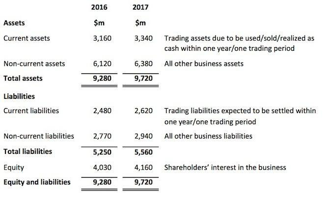

The concept of a balance sheet serves as a cornerstone in financial statement accounting. It provides a snapshot of a company's financial position at a specific point in time by detailing its assets, liabilities, and shareholders' equity. This static picture is crucial for assessing a company's financial health and making informed decisions about future financial activities. Financial analysts, investors, and stakeholders rely on a balance sheet to evaluate a company's solvency, liquidity, and operational efficiency.

With the advent of algorithmic trading, understanding financial statements like the balance sheet becomes increasingly important for traders and investors leveraging automated systems. Algorithmic trading involves the use of computer programs that execute trading orders at high speeds by following a set of pre-defined criteria. In this environment, the integration of financial statement data, particularly balance sheets, presents a novel avenue to enhance investment strategies. By incorporating balance sheet metrics and ratios into trading algorithms, traders can potentially predict market trends and make data-driven decisions.



This article explores how balance sheet data can be systematically integrated into algorithmic trading to optimize investment strategies. By bridging traditional financial analysis with cutting-edge technology, traders can develop robust systems that account for underlying financial health indicators, thus potentially gaining competitive advantages in dynamic markets. Understanding the balance sheet is fundamental not only for traditional investors but also for those looking to capitalize on algorithmic trading opportunities.

## Table of Contents

## Understanding the Balance Sheet

A balance sheet is a fundamental financial document that provides a snapshot of a company's financial position at a specific point in time. It is structured around the accounting equation:

$$
\text{Assets} = \text{Liabilities} + \text{Shareholders' Equity}
$$

This equation ensures that the balance sheet is always balanced, which is essential for accurate financial reporting and analysis. Each element of the balance sheet offers critical insights into a company's financial health.

**Assets** represent everything a company owns that has value. They are divided into current assets and non-current assets. Current assets are expected to be converted into cash or used up within one year, such as cash, accounts receivable, and inventory. Non-current assets, also known as long-term assets, include property, plant, equipment, and intangible assets like patents, which provide value over a longer period.

**Liabilities** encompass a company's financial obligations. Similar to assets, liabilities are categorized into current and long-term liabilities. Current liabilities are due within one year, including accounts payable and short-term loans. Long-term liabilities, such as bonds payable and long-term loans, are obligations that are payable over a time frame exceeding one year.

**Shareholders' Equity** reflects the residual interest in the assets of a company after deducting liabilities. It comprises common and preferred stock, additional paid-in capital, and retained earnings. Retained earnings represent the cumulative amount of net income retained in the business instead of being distributed as dividends.

The balance sheet is an indispensable tool for evaluating a company's financial health. It allows investors and creditors to assess a company's [liquidity](/wiki/liquidity-risk-premium), solvency, and overall financial stability. By analyzing the relationships between the various components—such as the ratio of current assets to current liabilities, known as the current ratio—stakeholders can make informed decisions regarding investment and lending opportunities. The balance sheet, therefore, plays a crucial role in both internal and external financial analysis, guiding strategic decision-making and providing transparency to stakeholders.

## Components of a Balance Sheet

A balance sheet, often referred to as a statement of financial position, is an essential part of financial reporting. It offers insights into a company’s financial health by showcasing its assets, liabilities, and shareholders’ equity at a specific point in time.

### Assets: Current vs. Non-Current

Assets are economic resources that a company owns or controls with the expectation that they will provide future benefits. They are classified into two main categories: current and non-current assets.

- **Current assets** are those expected to be converted into cash or consumed within one year. Examples include:
  - **Cash**: Liquid assets readily available for use.
  - **Accounts receivable**: Money owed to the company by customers for goods or services already delivered.
  - **Inventory**: Goods available for sale or in the process of being made ready for sale.

- **Non-current assets**, also known as long-term assets, are not expected to be liquidated within the fiscal year. Examples include:
  - **Property, plant, and equipment (PP&E)**: Tangible assets such as buildings and machinery that a company uses in its operations.
  - **Intangible assets**: Non-physical assets like patents and trademarks.

### Liabilities: Short-term vs. Long-term

Liabilities represent obligations that a company must settle in the future, usually through the transfer of money, goods, or services.

- **Short-term liabilities**, or current liabilities, are due for settlement within one year. Common examples are:
  - **Accounts payable**: Money owed by the company to suppliers for products and services purchased on credit.
  - **Short-term loans**: Borrowings that need to be repaid within a year.

- **Long-term liabilities** are obligations that are not due for more than one year. These may include:
  - **Long-term loans and bonds payable**: Debts that extend beyond the one-year mark.
  - **Deferred tax liabilities**: Taxes owed but not yet payable due to timing differences between accounting and tax rules.

### Shareholders’ Equity

Shareholders’ equity, sometimes called stockholders' equity, represents the residual interest in the assets of the company after deducting liabilities. It is an indicator of the company's net worth and comprises several components:

- **Retained earnings**: Profits that a company reinvests in its operations rather than distributing to shareholders as dividends.
- **Common stock**: Equity securities representing ownership in a corporation, with voting rights typically attached.
- **Preferred stock**: Equity securities with dividends or liquidation preferences over common stock, usually lacking voting rights.

The relationship between these elements is expressed in the fundamental accounting equation:

$$
\text{Assets} = \text{Liabilities} + \text{Shareholders’ Equity}
$$

Understanding these components helps stakeholders assess the financial health and operational efficiency of a business, forming the foundation for various financial analyses and strategy formulations.

## Algorithmic Trading and Its Impact

Algorithmic trading, commonly defined as the use of computer programs to execute trades, capitalizes on speed and efficiency to manage large volumes of transactions. The integration of financial statements, especially the balance sheet, holds significant potential to enrich these trading strategies. By providing insights into a company's financial health, balance sheet data equips [algorithmic trading](/wiki/algorithmic-trading) systems with a deeper understanding of underlying economic indicators.

A balance sheet portrays a company's assets, liabilities, and shareholders' equity at a precise moment, formulated by the equation: 

$$
\text{Assets} = \text{Liabilities} + \text{Shareholders' Equity}
$$

This foundational data is invaluable for crafting sophisticated trading algorithms. For instance, metrics such as liquidity ratios or debt-equity ratios, derived from balance sheet components, can serve as criteria in algorithmic decision-making processes, offering predictive power regarding a company's future ability to sustain operations or expand.

Algorithmically trading assets at high speed necessitates integrating balance sheets into these models. The alignment of accounting data with trading algorithms introduces both opportunities and challenges. A crucial benefit is the potential to augment algorithmic strategies with [fundamental analysis](/wiki/fundamental-analysis), increasing the robustness and depth of trading decisions. However, potential challenges arise due to the static nature of balance sheets. Being snapshots in time, these documents may not reflect current market conditions, thus necessitating the incorporation of real-time data to mitigate any temporal discrepancies.

Moreover, the accuracy and timeliness of balance sheet data are paramount. Algorithms depend on precise inputs to function optimally. Outdated or inaccurately reported financial information could mislead algorithmic decisions, potentially leading to unfavorable trading outcomes.

In this rapidly evolving field, the successful intersection of accounting data and trading algorithms involves not only leveraging the inherent value of balance sheets but also continuously refining techniques to ensure data accuracy and relevance. This includes powerful computational tools and algorithms, capable of swiftly interpreting complex datasets and adjusting strategies in real time. As technology updates, the harmonization between traditional accounting data and advanced trading systems is expected to advance, offering even more precise and efficient investment strategies.

## Balance Sheet Analysis for Trading Algorithms

Integrating balance sheet analysis into trading algorithms involves using financial ratios and historical data to inform and optimize trading models. Ratios such as the debt-to-equity ratio and the acid-test ratio provide insight into a company’s financial stability and liquidity, making them valuable metrics for algorithmic traders.

### Incorporation of Balance Sheet Ratios

1. **Debt-to-Equity Ratio**: This ratio measures the relative proportion of shareholders' equity and debt used to finance a company's assets and is calculated as:
$$
   \text{Debt-to-Equity Ratio} = \frac{\text{Total Liabilities}}{\text{Shareholders' Equity}}

$$

   A higher ratio suggests more leverage and potential financial risk, while a lower ratio indicates more equity financing, reducing risk. Trading algorithms can integrate this ratio to assess risk levels associated with trading particular stocks, filtering out companies with overly high financial leverage.

2. **Acid-Test Ratio (Quick Ratio)**: This liquidity ratio tests a company’s ability to cover its short-term obligations with its most liquid assets. It is expressed as:
$$
   \text{Acid-Test Ratio} = \frac{\text{Current Assets} - \text{Inventory}}{\text{Current Liabilities}}

$$

   An acid-test ratio above 1 generally indicates that a company has adequate liquidity to meet its short-term liabilities. By incorporating this ratio, trading algorithms can identify firms with strong liquidity positions, which may be more resilient to market [volatility](/wiki/volatility-trading-strategies), making them favorable investment options.

### Historical Balance Sheet Data

Trading algorithms can analyze historical balance sheet data to predict financial trends. For example, observing consistent growth in shareholders' equity might signal a strengthening company, potentially leading to increased stock prices. Conversely, rising liabilities or decreasing asset values could indicate financial trouble, guiding algorithms to short the stock or avoid purchasing.

### Challenges and Solutions

Balance sheets present static snapshots of a company's financial health from a specific point in time, which can be limiting as financial conditions can quickly change. This static nature poses challenges in fast-paced trading environments where real-time data is crucial. However, these challenges can be mitigated through:

- **Data Integration**: Incorporating additional real-time market data like earnings releases, economic indicators, and industry trends alongside balance sheet information gives a holistic view of a company's financial status. 

- **Dynamic Adjustments**: Implementing machine learning models capable of learning and adapting to new financial data can help overcome the inherent static nature of balance sheets. Algorithms can be programmed to adjust their parameters dynamically based on the latest financial reports, announcements, and real-time data feeds.

By integrating these strategies, trading algorithms can more effectively utilize balance sheet data, aligning trading decisions with a company’s financial conditions and market dynamics.

## Algorithmic Trading: Best Practices

Successful algorithmic trading hinges on the effective integration of real-time financial data, which allows traders to capitalize on dynamic market conditions. Access to up-to-the-minute information ensures that trading algorithms can react swiftly to market movements, thus optimizing the execution of trades and minimizing latency. In particular, real-time updates enhance the precision of trading models that rely on financial statements and key metrics such as price-to-earnings ratios or earnings per share, which can often be derived from components of a balance sheet.

Maintaining a diversified trading strategy is also critical, as it mitigates the risk associated with market volatility. Diversification not only involves spreading investments across different asset classes and sectors but also incorporates fundamental analysis from financial statements. The balance sheet provides vital indicators of a company's financial health, such as liquidity ratios and financial leverage, which can guide investment decisions. By evaluating a company’s asset, liability, and equity structure, traders can better assess potential risks and returns, thereby creating a well-rounded strategy that adjusts to varying market conditions.

Another best practice involves avoiding common pitfalls in algorithm design, particularly the reliance on outdated or inaccurate data. Algorithms should be regularly tested and validated with fresh datasets to ensure their effectiveness remains intact. Dependence on stale data can lead to suboptimal trading decisions and missed opportunities, as market conditions can change rapidly. As part of risk management, implementing data validation checks and ensuring data accuracy is crucial. 

For instance, leveraging Python programming, traders can automate data collection and processing as follows:

```python
import datetime
import yfinance as yf  # For more datasets, visit: https://paperswithbacktest.com/datasets

# Fetching real-time data
ticker = "AAPL"  # Example for Apple Inc.
data = yf.Ticker(ticker)
real_time_data = data.history(period="1d")

# Basic example of integrating data into an algorithm
closing_price = real_time_data['Close'][-1]
if closing_price > 150:  # Condition for a hypothetical strategy
    print(f"Sell {ticker} stock at closing price of {closing_price}")
else:
    print(f"Hold {ticker} stock")
```

This simple script reflects how real-time data can be incorporated effortlessly, allowing for immediate decision-making based on current market conditions. Through effectively managing data, refining algorithms, and employing comprehensive strategies that balance reactiveness and fundamental insights, algorithmic traders can enhance their performance in fast-paced financial markets.

## Conclusion

Integrating balance sheet analysis into algorithmic trading represents a powerful synergy between financial statements and technology. This integration enables traders and investors to gain a comprehensive understanding of a company's financial status, facilitating more informed decision-making. The balance sheet, with its detailed enumeration of assets, liabilities, and shareholders' equity, provides pivotal insights that are invaluable when tailoring trading algorithms.

Algorithmic trading relies on processing vast amounts of data at high speeds, allowing for rapid execution of trades. By harnessing balance sheet data, traders can incorporate fundamental financial indicators into their algorithmic strategies. Key ratios such as the debt-to-equity ratio or the acid-test ratio can offer predictive insights into a company's financial health, thereby influencing trading decisions. For example, a Python script can be used to retrieve and process balance sheet data, calculating these financial ratios to adjust trading strategies dynamically.

As technology continues to evolve, the integration of real-time data into algorithmic trading systems will become increasingly sophisticated. Advancements in [machine learning](/wiki/machine-learning) and [artificial intelligence](/wiki/ai-artificial-intelligence) hold potential for deeper analysis of balance sheet data, which can lead to the development of more robust and adaptive trading algorithms. The rapid processing capabilities of these technologies will enable the real-time incorporation of financial statement data, leading to more responsive and effective trading decisions.

Moreover, improvements in data accuracy and availability will further enhance the role of balance sheet analysis in algorithmic trading. As digital platforms for financial data continue to develop, traders will have access to more comprehensive and up-to-date information, reducing the risk of relying on outdated or inaccuracies in financial statements.

In summary, the convergence of balance sheet analysis and algorithmic trading equips investors and traders with a nuanced understanding of financial markets, fostering strategic decision-making. As technology advances, this synergy will likely continue to unlock new potential in trading algorithms, optimizing performance and outcomes in an increasingly competitive financial landscape.

## FAQs

**What is a balance sheet and why is it important for algorithmic trading?**

A balance sheet is a financial statement that presents a detailed overview of a company's financial situation by enumerating its assets, liabilities, and shareholders' equity at a specific point in time. It adheres to the fundamental accounting equation:

$$
\text{Assets} = \text{Liabilities} + \text{Shareholders' Equity}
$$

This equation ensures that the balance sheet is balanced, offering insights into the company's financial health, capital structure, and liquidity. In algorithmic trading, the balance sheet is a crucial source of fundamental data that can enhance trading strategies. By evaluating financial stability and operational efficiency, traders can optimize algorithms to predict market movements or identify investment opportunities based on the financial realities of companies.

**How can balance sheet data be incorporated into trading algorithms?**

Incorporating balance sheet data into trading algorithms involves using key financial ratios and indicators derived from the balance sheet to guide algorithmic decisions. For example, common metrics include the debt-to-equity ratio, which assesses financial leverage, and the current ratio, which measures liquidity. These ratios can be integrated into Python-based trading algorithms as follows:

```python
def debt_to_equity_ratio(total_liabilities, total_equity):
    return total_liabilities / total_equity

def current_ratio(current_assets, current_liabilities):
    return current_assets / current_liabilities

def analyze_balance_sheet(data):
    debt_equity = debt_to_equity_ratio(data['total_liabilities'], data['total_equity'])
    curr_ratio = current_ratio(data['current_assets'], data['current_liabilities'])
    return {
        "Debt to Equity": debt_equity,
        "Current Ratio": curr_ratio
    }

# example usage
balance_sheet_data = {
    "total_liabilities": 500000,
    "total_equity": 2000000,
    "current_assets": 1200000,
    "current_liabilities": 800000
}

analysis = analyze_balance_sheet(balance_sheet_data)
```

By leveraging such analyses, algorithms can make informed buy-sell decisions, hedging strategies, or risk assessments based on the financial metrics indicative of a company's performance and market position.

**What are some limitations of using balance sheet data in trading algorithms?**

While balance sheet data provides valuable insights, it is inherently static, representing a single point in time rather than continuous information. This limitation can result in lag, as traders and algorithms may act on outdated data if there are significant changes in a company's financial situation. Moreover, balance sheets are typically published quarterly or annually, which might not coincide with the real-time needs of algorithmic trading.

Another limitation is that balance sheets do not account for market dynamics, forward-looking projections, or qualitative factors such as management quality that could influence a company's future performance. Consequently, an over-reliance on balance sheet data could potentially lead to suboptimal trading decisions.

To address these limitations, traders can integrate real-time financial data and employ more frequent updates to balance sheet analyses, complementing them with other financial statements and market data. This approach ensures that trading algorithms maintain accuracy and relevance in rapidly changing markets.

## References & Further Reading

[1]: Bergstra, J., Bardenet, R., Bengio, Y., & Kégl, B. (2011). ["Algorithms for Hyper-Parameter Optimization."](https://papers.nips.cc/paper/4443-algorithms-for-hyper-parameter-optimization) Advances in Neural Information Processing Systems 24.

[2]: ["Advances in Financial Machine Learning"](https://www.amazon.com/Advances-Financial-Machine-Learning-Marcos/dp/1119482089) by Marcos Lopez de Prado

[3]: ["Evidence-Based Technical Analysis: Applying the Scientific Method and Statistical Inference to Trading Signals"](https://www.amazon.com/Evidence-Based-Technical-Analysis-Scientific-Statistical/dp/0470008741) by David Aronson

[4]: ["Machine Learning for Algorithmic Trading"](https://github.com/stefan-jansen/machine-learning-for-trading) by Stefan Jansen

[5]: ["Quantitative Trading: How to Build Your Own Algorithmic Trading Business"](https://www.amazon.com/Quantitative-Trading-Build-Algorithmic-Business/dp/1119800064) by Ernest P. Chan