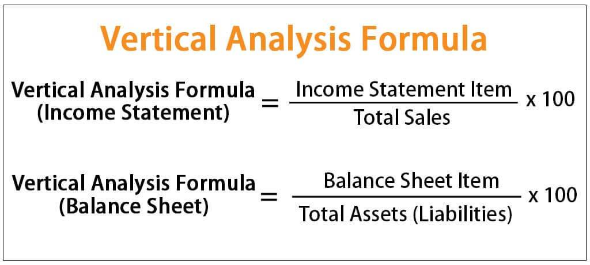

In the intricate landscape of financial analysis, the balance sheet stands as a foundational pillar, closely intertwined with financial statements. These statements serve as a crucial tool in assessing a company's financial health, guiding stakeholders through the decision-making process. Financial statements, including the balance sheet, income statement, and cash flow statement, provide a comprehensive view of a firm's operations, facilitating informed decisions regarding investments, credit extension, and operational strategies.

Algorithmic trading has emerged as a modern technique that leverages this financial statement data to execute trading decisions rapidly and accurately. This technological advancement integrates complex algorithms that incorporate financial data, ensuring trades are executed faster and more efficiently than traditional methods. Understanding the balance sheet's nuances is particularly vital in this context, as it provides insights into a company's financial structure and liquidity. 



The balance sheet encompasses a snapshot of a company's assets, liabilities, and shareholders' equity, thus enabling an assessment of corporate solvency and liquidity—key factors for traders and investors. It reflects the accounting equation: 

$$
\text{Assets} = \text{Liabilities} + \text{Shareholders' Equity}
$$

Maintaining a balanced equation is essential for accurate financial reporting and analysis. Trading strategies grounded in such data are underpinned by robust financial and accounting principles, offering a strategic edge in optimizing investment decisions and risk management.

The intricate relationship between balance sheet analysis and algorithmic trading underscores the strategic advantage that can be achieved through a blend of traditional financial analysis and advanced technology. As algorithmic trading continues to evolve, integrating comprehensive balance sheet analyses into trading strategies promises to refine efficiency and enhance predictive accuracy in the dynamic financial markets.

## Table of Contents

## Understanding the Balance Sheet

A balance sheet is a fundamental financial statement that provides a snapshot of a company's financial position at a specific point in time. It is structured according to the fundamental accounting equation: 
$$
\text{Assets} = \text{Liabilities} + \text{Shareholders’ Equity}
$$
This equation serves as the backbone of the balance sheet, reflecting the principle that what the company owns (assets) is financed by its obligations (liabilities) and the owner's claims on assets (shareholders' equity).

**Assets** are resources owned by the company, which are expected to provide future economic benefits. They are divided into two main categories: current and non-current assets. Current assets include cash, accounts receivable, and inventory, which are expected to be converted into cash or consumed within a year. Non-current assets, also known as long-term assets, include property, plant, equipment, and intangible assets like patents and trademarks.

**Liabilities** represent the company's obligations to external parties, which must be settled over time through the transfer of economic benefits such as money, goods, or services. Like assets, liabilities are categorized into current and long-term. Current liabilities, such as accounts payable and short-term debt, are due within one year. Long-term liabilities, such as bonds payable and long-term loans, are obligations that extend beyond a year.

**Shareholders’ Equity** reflects the residual interest in the company's assets after deducting liabilities. It comprises elements like common stock, preferred stock, retained earnings, and additional paid-in capital. Essentially, it represents the owners' stake in the company.

Maintaining a balanced equation is crucial for ensuring financial accuracy and transparency. The equality $\text{Assets} = \text{Liabilities} + \text{Shareholders’ Equity}$ must always hold, signifying that all resources are accounted for by either obligations to creditors or ownership by shareholders. Any imbalance may indicate errors or financial mismanagement.

The components of the balance sheet collectively offer a comprehensive view of a company's financial health. They provide insights into [liquidity](/wiki/liquidity-risk-premium) through current assets and liabilities, leverage through long-term liabilities, and the overall financial stability and efficiency through shareholders' equity. Analyzing these elements helps stakeholders make informed decisions regarding investment, credit, and management practices, enhancing the ability to evaluate a company's operational strategies and prospects for future growth.

## Components of a Balance Sheet

A balance sheet is a financial statement that offers a snapshot of a company's financial position at a specific point in time. It is structured around the fundamental accounting equation:

$$
\text{Assets} = \text{Liabilities} + \text{Shareholders' Equity}
$$

### Assets

Assets represent the resources a company owns and expects to provide future economic benefits. They are divided into two main categories: current and non-current assets.

- **Current Assets**: These assets are expected to be converted into cash, sold, or consumed within one year. Examples include cash and cash equivalents, accounts receivable, inventory, and short-term investments. Current assets are crucial for maintaining liquidity and supporting day-to-day operations.

- **Non-Current Assets**: Also known as long-term assets, these are resources intended for use over a longer period, typically more than one year. Examples include property, plant, and equipment (PP&E), intangible assets (such as patents and trademarks), and long-term investments. Non-current assets are vital for long-term strategic growth and operational capacity.

### Liabilities

Liabilities are obligations a company must settle in the future, categorized into short-term and long-term liabilities based on their due dates.

- **Short-Term Liabilities**: These are obligations due within one year. They include accounts payable, short-term debt, and accrued expenses. Short-term liabilities are a vital component in assessing a company's operational liquidity and cash flow management.

- **Long-Term Liabilities**: Obligations that are due beyond one year fall into this category. Examples include long-term loans, bonds payable, and deferred tax liabilities. Managing long-term liabilities is important for a company's financial stability and long-term strategic planning.

### Shareholders’ Equity

Shareholders’ equity represents the owners' claims after all liabilities have been settled. It includes various components:

- **Common Stock and Preferred Stock**: Reflect the capital raised from shareholders in exchange for ownership stakes.

- **Retained Earnings**: Accumulated profits that a company reinvests in the business, rather than distributing as dividends.

- **Additional Paid-In Capital**: The excess amount shareholders have paid over the par value of the shares.

Shareholders' equity is crucial in understanding a company's value and provides insights into how profits are utilized, be it reinvestment or distribution to shareholders.

### The Role of Each Component

Each component of the balance sheet plays a critical role in evaluating a company's financial status. Assets illustrate resources available for creating value, liabilities demonstrate financial obligations and risk levels, and shareholders' equity indicates the cushion available for future growth or absorbing losses.

### Interaction of Components

The elements of a balance sheet interact dynamically to reflect a company's financial strategy and stability. For instance, a higher proportion of current assets to current liabilities, known as the current ratio, indicates good short-term financial strength. Conversely, a balance skewed heavily towards long-term liabilities could imply future financial strain unless matched with significant non-current assets or strong revenue-generating capabilities.

Understanding the balance between these components helps stakeholders and analysts assess a company's operational efficiency, financial health, and investment potential. This comprehensive view aids in informed decision-making regarding the company's strategic direction and investment allure.

## Algorithmic Trading and Its Impact

Algorithmic trading, or algo trading, involves the use of computer algorithms to execute trading orders based on predefined criteria. These algorithms operate by processing vast amounts of data at high speeds, allowing traders to capitalize on market opportunities more efficiently than traditional trading methods. A key characteristic of [algorithmic trading](/wiki/algorithmic-trading) is its reliance on speed and data accuracy, driven by the capability to analyze large datasets and execute trades in milliseconds.

Balance sheet data can be integrated into trading algorithms to enhance their predictive power and improve decision-making. The balance sheet provides essential insights into a company's financial position, helping traders assess its financial stability and potential future performance. By incorporating data from the balance sheet, such as assets, liabilities, and shareholders' equity, algorithms can develop a more comprehensive understanding of a company's value.

Financial ratios derived from the balance sheet also play a critical role in creating predictive algorithms. Ratios such as the current ratio, debt-to-equity ratio, and return on equity provide valuable metrics that reflect a company's liquidity, financial leverage, and profitability, respectively. For example, the debt-to-equity ratio, calculated as:

$$
\text{Debt-to-Equity Ratio} = \frac{\text{Total Liabilities}}{\text{Shareholders' Equity}}
$$

can be used to assess the risk level associated with investing in or trading the company's stock. Algorithms can employ these ratios to detect patterns and signals indicating potential trading opportunities.

The benefits of algorithmic trading are numerous. It offers increased efficiency in executing trades, often resulting in better pricing and reduced transaction costs. Additionally, algorithms minimize human error by systematically following pre-established rules, thereby improving the consistency of trading strategies.

However, challenges exist when using balance sheet data in trading algorithms. A significant issue is the static nature of balance sheet data, which is typically reported on a quarterly basis. This can lead to a lag in the information available for making real-time decisions, contrasting with the need for timely and dynamic data inputs in fast-paced trading environments. Moreover, the integration of complex financial data into algorithms necessitates advanced computational capabilities and sophisticated data analysis techniques.

Efforts to address these challenges include enhancing algorithms to incorporate real-time financial data feeds and fostering collaborations between financial analysts and technologists to refine data processing methods. By overcoming these obstacles, traders can better harness the predictive power of balance sheet data, providing more accurate and timely market assessments.

## Balance Sheet Analysis for Trading Algorithms

Trading algorithms increasingly rely on balance sheet analysis to refine strategies and mitigate risks. By utilizing balance sheet data, these algorithms can make more informed decisions, adapting quickly to changing market conditions. This section discusses how balance sheet analysis is integrated into trading algorithms, highlights common financial ratios used, provides historical examples, and addresses challenges associated with dynamic trading environments.

### Incorporating Balance Sheet Analysis into Trading Algorithms

Balance sheet analysis aids trading algorithms by supplying pertinent financial data that algorithms can process to make decisive actions. Algorithms can utilize this data to evaluate a company's structural stability, financial health, and operational efficiency. By incorporating balance sheet data into algorithms, traders can enhance their predictive capabilities.

### Common Ratios Used in Trading Algorithms

1. **Debt-to-Equity Ratio**: This ratio reflects the proportion of debt and equity used to finance a company’s assets and is defined as:
$$
   \text{Debt-to-Equity Ratio} = \frac{\text{Total Liabilities}}{\text{Shareholders' Equity}}

$$

   A higher ratio indicates greater reliance on borrowed funds, signaling higher financial risk.

2. **Acid-Test Ratio (Quick Ratio)**: This measures a company's short-term liquidity by calculating its ability to cover current liabilities without selling inventory. It is formulated as:
$$
   \text{Acid-Test Ratio} = \frac{\text{Current Assets} - \text{Inventories}}{\text{Current Liabilities}}

$$

   A ratio above 1 indicates reliable liquidity.

3. **Return on Equity (ROE)**: Represents the profitability relative to shareholder's equity and is calculated as:
$$
   \text{ROE} = \frac{\text{Net Income}}{\text{Shareholders' Equity}}

$$

   This ratio provides insights into how effectively the company is using capital invested by shareholders.

### Historical Uses of Balance Sheet Data

Historically, firms have leveraged balance sheet data to refine trading strategies. By analyzing historical balance sheet trends, traders can identify patterns that signal financial stability or distress, thus reducing risks associated with investment decisions. For instance, during periods of financial turbulence, companies with lower debt-to-equity ratios have been seen as safer investments, leading to more stable algorithmic trading outcomes.

### Real-World Examples

In practice, hedge funds and proprietary trading firms utilize these ratios to craft trading algorithms that anticipate the financial performance of companies. For example, during the 2008 financial crisis, firms using balance sheet-focused algorithms to assess debt levels successfully identified and reacted to high-risk assets faster than those relying solely on market price movements.

### Challenges and Potential Solutions

Integrating balance sheet data into dynamic trading environments presents several challenges:

- **Data Static Nature**: Balance sheet data is typically updated quarterly, whereas trading algorithms benefit from real-time data. Overcoming this limitation involves supplementing balance sheet data with more frequent updates from other financial statements and market data.

- **Complexity of Data Interpretation**: Analyzing balance sheet data requires nuanced interpretation. Algorithms must be sophisticated enough to contextualize the data within broader market trends. Advanced machine learning models and natural language processing can aid in understanding and integrating qualitative aspects of balance sheet data, such as management discussions or notes in financial reports.

- **Scalability**: As companies expand, their balance sheet entries grow more complex. Algorithms need to scale efficiently to handle increasing data volumes. Using cloud computing solutions and parallel processing capabilities can improve algorithm scalability.

In conclusion, balance sheet analysis significantly enhances the efficacy of trading algorithms by providing deep insights into a company's financial health. With the appropriate methodology and technology, the integration of balance sheet data offers a strategic advantage in the fast-paced world of algorithmic trading.

## Algorithmic Trading: Best Practices

Algorithmic trading has revolutionized the way financial data is utilized in markets, providing an avenue for integrating balance sheet metrics into trading strategies. 

### Guidelines for Integrating Financial Data into Trading Systems

#### Importance of Real-Time Data and Diversified Strategies

Real-time data is crucial for the efficacy of algorithmic trading. Financial markets are dynamic, and the rapid access to and processing of data directly influence a trading algorithm's performance. Real-time data ensures that trading decisions are based on the latest financial conditions. Diversified strategies further enhance this by reducing risk; algorithms that employ a mix of trading strategies can adapt to various market conditions. For instance, a combination of trend-following strategies with mean reversion strategies can offer stability against volatile market movements.

#### Strategies to Avoid Pitfalls

Two significant pitfalls in algorithmic trading are outdated data and inadequate algorithm design. Outdated data can lead to suboptimal decisions, as algorithms depend on data accuracy for predictive validity. Algorithms should be designed to handle data errors and latency buffers, ensuring they respond in real time. Deploying [machine learning](/wiki/machine-learning) models capable of self-optimization can help in continuously refining the algorithm's decision-making based on evolving data trends.

Python Snippet to Handle Real-Time Data Updates:
```python
import pandas as pd
from datetime import datetime

def fetch_real_time_data(source):
    # Simulated function to fetch real-time financial data
    return source.get_latest_data()

def update_algorithm_data(data_frame, new_data):
    return pd.concat([data_frame, new_data]).drop_duplicates().sort_values('timestamp')

# Example usage
data_source = ...  # Initialize data source
current_data = pd.DataFrame()
while True:
    new_data = fetch_real_time_data(data_source)
    current_data = update_algorithm_data(current_data, new_data)
```

#### Technological Tools and Data Management Frameworks

Modern technological tools, such as cloud computing and data storage frameworks, enhance algorithmic trading by providing vast processing capabilities. Platforms like AWS and Google Cloud offer services catered to the needs of high-frequency trading systems, integrating vast datasets across different markets. Data management frameworks like Apache Kafka allow real-time streaming data to be processed effectively, enabling algorithms to react promptly to market changes.

#### Practical Examples of Leveraging Balance Sheet Metrics

A practical example of leveraging balance sheet data is the computation of key financial ratios like the Debt-to-Equity (D/E) ratio or Current Ratio. These metrics can be programmed into trading algorithms to assess the financial health of companies and make informed trading decisions:

```python
def calculate_debt_to_equity(total_liabilities, shareholders_equity):
    return total_liabilities / shareholders_equity

# Example trading decision based on D/E ratio
if calculate_debt_to_equity(company_liabilities, company_equity) < 1:
    execute_buy_order()
else:
    execute_sell_order()
```

In summary, the integration of balance sheet metrics into trading systems involves using real-time, accurate data and robust technological frameworks. Employing diversified strategies and adopting best practices can enhance the overall performance of trading algorithms, leading to informed and strategic trading decisions.

## Conclusion

The integration of balance sheet analysis into algorithmic trading represents a significant progression in financial strategy, bridging the gap between traditional financial analysis and cutting-edge technology. Balance sheets play a crucial role in facilitating informed trading decisions by providing essential insights into a company's financial health, stability, and operational efficiency. Traders and investors can derive critical financial ratios, such as the debt-to-equity ratio or current ratio, which serve as valuable inputs for trading algorithms. These ratios help ascertain the risk and potential return associated with trading opportunities, thereby enhancing decision-making processes.

The future holds promising advancements in balance sheet analysis and trading algorithms. As technology continues to evolve, improved data analytics, machine learning, and [artificial intelligence](/wiki/ai-artificial-intelligence) are expected to further refine and automate the analysis of balance sheets. This will increase the granularity and real-time applicability of financial data in trading systems, ultimately leading to more accurate predictions and strategies with reduced latency and error margins.

There exists a remarkable potential in merging traditional financial analysis with modern technology. By leveraging algorithmic techniques, traders can process vast amounts of balance sheet data with unprecedented speed and precision, enabling the development of adaptive strategies that respond effectively to dynamic market conditions. Such synergy not only enhances efficiency but also positions traders to exploit [arbitrage](/wiki/arbitrage) opportunities that may be missed by conventional methods.

Strategic advantages are achievable through comprehensive balance sheet analysis. By fully integrating financial data into algorithmic frameworks, traders can better gauge market sentiment and identify financial anomalies, leading to superior trading performance. The holistic understanding of a company's financial stance offered by balance sheet analysis remains indispensable to crafting algorithms that align with market realities, thereby securing a competitive edge in an increasingly data-driven financial landscape.

## FAQs

### Clarifying the relevance and functionality of balance sheets in financial statements

Balance sheets are a cornerstone of financial statements, offering a snapshot of a company's financial position at a given moment. They showcase a company's assets, liabilities, and shareholders' equity, following the fundamental equation:

$$
\text{Assets} = \text{Liabilities} + \text{Shareholders' Equity}
$$

This equation ensures that what the company owns and owes is clearly defined, providing clarity for investors, analysts, and stakeholders to assess financial health.

### How can balance sheet data be effectively incorporated into trading algorithms?

Balance sheet data holds critical insight for algorithmic trading. Trading algorithms can incorporate balance sheet figures to calculate key financial ratios such as the Debt-to-Equity ratio or the Current Ratio. These metrics help in evaluating a company’s financial stability and liquidity, guiding investment decisions. For instance, here's a simple Python function to calculate the Debt-to-Equity ratio:

```python
def debt_to_equity(total_liabilities, shareholders_equity):
    return total_liabilities / shareholders_equity

# Example usage
total_liabilities = 500000
shareholders_equity = 250000
ratio = debt_to_equity(total_liabilities, shareholders_equity)
print(f"Debt-to-Equity Ratio: {ratio}")
```

Using historical balance sheet data, algorithms can predict future trends and potentially adjust trading strategies accordingly.

### Limitations and challenges faced when utilizing balance sheet data in fast-paced trading

Despite its importance, balance sheet data presents challenges for fast-paced trading environments. One significant limitation is its static nature, as balance sheets are typically updated quarterly or annually, struggling to reflect real-time changes. Additionally, discrepancies in accounting standards and practices can affect the reliability of the data across different jurisdictions. Algorithmic trading, which thrives on real-time data, must integrate other data sources to complement balance sheet information for timely decision-making.

### Common misconceptions about balance sheets and algorithmic trading addressed

A prevalent misconception is that balance sheets alone can drive algorithmic trading success. While they provide essential insights, trading algorithms require a diverse set of financial indicators and market data to create a holistic view of a trading opportunity. Another misconception is that balance sheets only reflect historical data, ignoring their potential predictive value when used in conjunction with other data for trend analysis and forecasting.

### Explanation of different financial statements and their comparative functionalities

Financial statements encompass more than just balance sheets. They include the income statement and cash flow statement, each serving distinct purposes:

- **Income Statement**: Reflects a company’s profitability over a specific period, detailing revenues and expenses. This statement helps in assessing operational efficiency and profitability trends.

- **Cash Flow Statement**: Tracks the cash generated and utilized by a company during a period, offering insights into liquidity and cash management strategies. It complements the balance sheet by highlighting cash movements that affect working capital.

Incorporating the information from all financial statements delivers a comprehensive assessment of a company’s financial health and operational effectiveness, benefiting both traditional and algorithmic trading strategies.

## References & Further Reading

1. **Academic Papers and Journals**:
   - D. Easley, M. M. López de Prado, and M. O'Hara, "The Microstructure of the ‘Flash Crash’: Flow Toxicity, Liquidity Crashes, and the Probability of Informed Trading," *Journal of Portfolio Management*, vol. 37, no. 2, pp. 118–128, 2011. This paper explores the interactions between algorithmic traders and the market, highlighting the role of balance sheet data in assessing flow toxicity.
   - M. Jegadeesh and S. Titman, "Returns to Buying Winners and Selling Losers: Implications for Stock Market Efficiency," *The Journal of Finance*, vol. 48, no. 1, pp. 65–91, 1993. It provides insights on how financial statement analysis, including balance sheets, can impact trading strategies.

2. **Books**:
   - "Financial Statement Analysis and Security Valuation" by Stephen Penman. This comprehensive text explains how to read and interpret financial statements, including balance sheets, which is essential for effective algorithmic trading.
   - "Algorithmic Trading: Winning Strategies and Their Rationale" by Ernie Chan. The book provides a practical guide to building algorithmic trading strategies using financial data, including insights from balance sheets.

3. **Online Resources and Financial Platforms**:
   - Investopedia (https://www.investopedia.com) offers detailed articles on financial statements, balance sheets, and the basics of algorithmic trading.
   - The Securities and Exchange Commission (SEC) website (https://www.sec.gov) provides access to publicly listed companies' balance sheet data through their financial filings.

4. **Suggested Texts for Beginners**:
   - "Principles of Corporate Finance" by Richard A. Brealey, Stewart C. Myers, and Franklin Allen. This book covers fundamental financial and accounting principles necessary for understanding balance sheets and their relevance in trading.
   - "Python for Finance" by Yves Hilpisch. This book teaches Python programming with applications in financial data analysis and algorithmic trading, making it a good start for beginners interested in integrating coding with financial analysis.

These resources serve as a foundation for anyone looking to deepen their understanding of balance sheet analysis and its applications in algorithmic trading, offering both theoretical foundations and practical tools.

