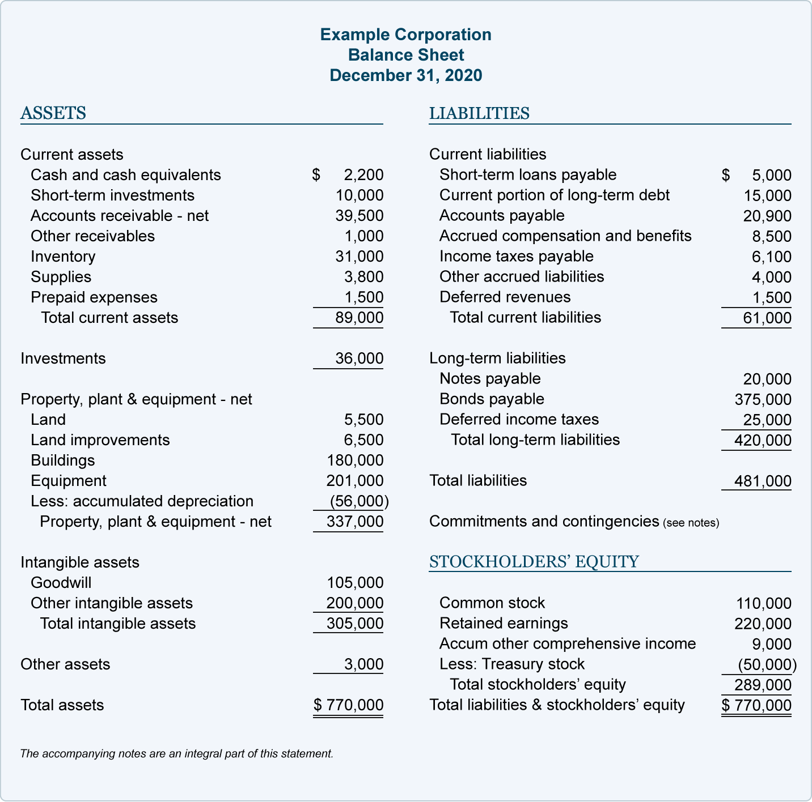

## Table of Contents

## What is a balance sheet?

A balance sheet is a financial statement that shows what a company owns and what it owes at a specific time. It's like a snapshot of the company's financial health. The balance sheet has two main parts: assets, which are things the company owns that have value, like money, buildings, and equipment; and liabilities, which are debts the company needs to pay, like loans and bills.

The balance sheet also includes something called equity, which is the difference between the company's assets and liabilities. Equity represents the owner's share in the business. The basic idea behind a balance sheet is that the total value of the company's assets should equal the total of its liabilities plus equity. This is why it's called a balance sheet – because it must balance out. By looking at a balance sheet, people like investors and managers can see how well the company is doing financially and make decisions based on that information.

## What are the main components of a balance sheet?

A balance sheet has three main parts: assets, liabilities, and equity. Assets are things the company owns that have value. This can include cash, money that people owe the company, buildings, and equipment. Liabilities are the opposite; they are what the company owes to others. This includes loans, bills that need to be paid, and other debts. Equity is what's left over after you subtract the liabilities from the assets. It shows the owner's share in the company.

These three parts work together to show a complete picture of the company's financial health. The balance sheet follows a simple rule: Assets = Liabilities + Equity. This means that everything the company owns (assets) is balanced by what it owes (liabilities) plus the owner's share (equity). By looking at these components, anyone can understand how much the company is worth and how it's managing its money.

## Why is it important for a balance sheet to balance?

A balance sheet needs to balance because it shows that a company's money and things it owns are equal to what it owes plus what the owners have in the business. If it doesn't balance, it means there might be a mistake in the numbers or something wrong with the company's money. This balance helps everyone, like investors and managers, trust the information because it follows a simple rule: everything the company owns should equal what it owes plus the owner's share.

When a balance sheet balances, it gives a clear picture of the company's financial health at a certain time. It's like taking a photo of the company's money situation. If the numbers don't add up, it can be hard to make good decisions about the company's future. So, making sure the balance sheet balances is really important for keeping track of the company's money and making smart choices.

## What does it mean if the accounts on a balance sheet do not equal?

If the accounts on a balance sheet do not equal, it means there is a mistake somewhere in the numbers. The balance sheet should always follow the rule that assets equal liabilities plus equity. When they don't match up, it could be because someone made an error when adding up the numbers or recorded something wrong. It's like trying to solve a puzzle where the pieces don't fit together properly.

This mismatch can cause big problems. People who look at the balance sheet, like investors or managers, might not trust the information if it doesn't balance. They need to know the company's financial health is shown correctly to make good decisions. So, it's really important to find and fix any mistakes quickly to make sure the balance sheet gives a true picture of the company's money situation.

## How do assets, liabilities, and equity relate to each other on a balance sheet?

Assets, liabilities, and equity are the three main parts of a balance sheet, and they work together to show how a company is doing financially. Assets are all the things a company owns that have value, like cash, buildings, or equipment. Liabilities are what the company owes to others, like loans or bills. Equity is what's left over when you take away the liabilities from the assets, and it shows the owner's share in the company.

The key thing about a balance sheet is that it must balance. This means that the total value of the company's assets should always equal the total of its liabilities plus equity. Think of it like a simple math equation: Assets = Liabilities + Equity. If this equation doesn't balance, it means there's a mistake somewhere in the numbers. When everything balances, it gives a clear and trustworthy picture of the company's financial health, which is important for making good decisions about the company's future.

## What common errors can cause a balance sheet to be out of balance?

One common error that can make a balance sheet not balance is when someone makes a mistake while adding up the numbers. This can happen if they miss a number, add it twice, or just get the math wrong. Another mistake is when someone records the wrong amount for an asset, liability, or equity. For example, they might write down $1,000 instead of $10,000 for a loan, which would throw off the balance.

Another type of error is when someone puts a number in the wrong place on the balance sheet. For instance, they might list a loan as an asset instead of a liability. This kind of mistake can really mess things up because it changes how the numbers fit together. Also, if someone forgets to record a transaction, like not writing down a new piece of equipment the company bought, that can also make the balance sheet out of balance.

Finally, errors can happen if someone uses the wrong type of account. For example, if they record an expense as an asset, it will make the numbers not match up. All these mistakes mean the balance sheet won't follow the simple rule that assets should equal liabilities plus equity. When this happens, people need to check the numbers carefully to find and fix the errors so the balance sheet shows the true financial picture of the company.

## How can one ensure that the accounts on a balance sheet always equal?

To make sure the accounts on a balance sheet always equal, you need to be very careful with how you record and add up the numbers. Always double-check your math to make sure you haven't missed any numbers or added them up wrong. It's also important to record each transaction in the right place. For example, if you buy a new computer, make sure you list it as an asset and not as an expense. If you're not sure where something should go, ask someone who knows about accounting to help you.

Another way to keep the balance sheet balanced is by using accounting software. This kind of software can help catch mistakes and make sure everything adds up correctly. It can also remind you to record every transaction so you don't forget anything. Regularly checking the balance sheet and comparing it to other financial statements, like the income statement, can also help. If you find any mistakes, fix them right away to keep the balance sheet accurate and trustworthy.

## What are the differences between a trial balance and a balance sheet?

A trial balance and a balance sheet are both important financial statements, but they serve different purposes and show different information. A trial balance is a list of all the accounts in a company's general ledger at a certain time. It includes both the debit and credit balances for each account. The main goal of a trial balance is to check if the total debits equal the total credits. If they do, it means the accounts are balanced, but it doesn't mean there are no mistakes. The trial balance helps accountants find errors before they make the balance sheet.

A balance sheet, on the other hand, is a snapshot of a company's financial health at a specific time. It shows what the company owns (assets), what it owes (liabilities), and the owner's share in the business (equity). The balance sheet follows the rule that assets must equal liabilities plus equity. Unlike the trial balance, which is used to check for errors, the balance sheet is used to give a clear picture of the company's financial position to people like investors and managers. It's a more detailed and final report compared to the trial balance.

## How do adjusting entries affect the balance of a balance sheet?

Adjusting entries are changes made at the end of an accounting period to make sure the financial statements, like the balance sheet, show the correct numbers. They help match the revenues with the expenses in the right period. For example, if you paid for a year's worth of insurance upfront, an adjusting entry would spread that cost over the year so that each month's balance sheet shows the right amount of insurance expense and the remaining value of the insurance as an asset.

These adjusting entries directly affect the balance sheet by changing the values of assets, liabilities, or equity. If you make an adjusting entry to record depreciation on a piece of equipment, it reduces the value of the equipment (an asset) and increases the accumulated depreciation (a contra-asset account). This makes the total assets on the balance sheet go down, but the balance sheet stays balanced because the change in equity (through the income statement) reflects the expense. Adjusting entries are crucial for making sure the balance sheet gives a true and fair view of the company's financial position at the end of the period.

## What role do accounting standards play in maintaining the balance of a balance sheet?

Accounting standards are rules that tell companies how to record and report their financial information. They help make sure that everyone does accounting the same way, so people can trust the numbers they see on a balance sheet. These standards make sure that the balance sheet shows a true picture of what the company owns, what it owes, and what the owners have in the business. By following these rules, companies can avoid mistakes and keep the balance sheet balanced.

For example, accounting standards tell companies how to value their assets and when to record them. They also explain how to handle liabilities and equity. If everyone follows these standards, it's easier to compare the balance sheets of different companies and make sure they are fair and accurate. This helps investors, managers, and others understand the company's financial health and make good decisions based on that information.

## How do complex transactions like mergers and acquisitions impact the balance sheet's equality?

When a company goes through a merger or acquisition, it can really change its balance sheet. A merger is when two companies join together to become one, and an acquisition is when one company buys another. These big moves mean the company has to add the new company's assets, liabilities, and equity to its own balance sheet. This can make the numbers on the balance sheet much bigger and more complicated. But the rule that assets must equal liabilities plus equity still has to be true. So, the company needs to make sure all the new numbers are added up correctly to keep the balance sheet balanced.

To keep the balance sheet equal during a merger or acquisition, the company has to be very careful with how it records everything. They might need to do some adjusting entries to make sure the numbers fit together right. For example, if they pay for the acquisition with cash, that cash goes down as an asset, but they also get new assets from the company they bought. If they use stock to pay, it changes the equity part of the balance sheet. All these changes need to be done following accounting rules to make sure the balance sheet still balances and shows a true picture of the company's new financial situation.

## What advanced techniques can be used to reconcile discrepancies in a balance sheet?

When a balance sheet doesn't balance, there are some advanced ways to find and fix the problems. One way is to use a tool called a "worksheet" to help see where the numbers might be off. You list all the accounts on this worksheet and then check each one carefully to make sure they're in the right place and have the right numbers. If you find a mistake, you fix it on the worksheet first before changing the balance sheet. Another technique is to use "analytical review," which means looking at the numbers to see if they make sense. For example, if an account suddenly has a much bigger number than usual, you might want to check it more closely to see if there's a mistake.

Another advanced method is to use "reversing entries." These are special journal entries that can help fix timing errors. If you recorded something too early or too late, a reversing entry can move it to the right place and help the balance sheet balance again. Also, using "account reconciliation" can help. This means comparing the balance sheet numbers to other records, like bank statements, to make sure they match. If they don't, you know where to look for errors. All these techniques need careful work and attention to detail, but they can help make sure the balance sheet is accurate and balanced.

## What are the components of a balance sheet?

A balance sheet is a financial statement that offers a snapshot of a company's financial position at a specific point in time. It is structured around the fundamental accounting equation:

$$
\text{Assets} = \text{Liabilities} + \text{Shareholders' Equity}
$$

### Assets

Assets represent the resources a company owns and expects to provide future economic benefits. They are divided into two main categories: current and non-current assets.

- **Current Assets**: These assets are expected to be converted into cash, sold, or consumed within one year. Examples include cash and cash equivalents, accounts receivable, inventory, and short-term investments. Current assets are crucial for maintaining liquidity and supporting day-to-day operations.

- **Non-Current Assets**: Also known as long-term assets, these are resources intended for use over a longer period, typically more than one year. Examples include property, plant, and equipment (PP&E), intangible assets (such as patents and trademarks), and long-term investments. Non-current assets are vital for long-term strategic growth and operational capacity.

### Liabilities

Liabilities are obligations a company must settle in the future, categorized into short-term and long-term liabilities based on their due dates.

- **Short-Term Liabilities**: These are obligations due within one year. They include accounts payable, short-term debt, and accrued expenses. Short-term liabilities are a vital component in assessing a company's operational liquidity and cash flow management.

- **Long-Term Liabilities**: Obligations that are due beyond one year fall into this category. Examples include long-term loans, bonds payable, and deferred tax liabilities. Managing long-term liabilities is important for a company's financial stability and long-term strategic planning.

### Shareholders’ Equity

Shareholders’ equity represents the owners' claims after all liabilities have been settled. It includes various components:

- **Common Stock and Preferred Stock**: Reflect the capital raised from shareholders in exchange for ownership stakes.

- **Retained Earnings**: Accumulated profits that a company reinvests in the business, rather than distributing as dividends.

- **Additional Paid-In Capital**: The excess amount shareholders have paid over the par value of the shares.

Shareholders' equity is crucial in understanding a company's value and provides insights into how profits are utilized, be it reinvestment or distribution to shareholders.

### The Role of Each Component

Each component of the balance sheet plays a critical role in evaluating a company's financial status. Assets illustrate resources available for creating value, liabilities demonstrate financial obligations and risk levels, and shareholders' equity indicates the cushion available for future growth or absorbing losses.

### Interaction of Components

The elements of a balance sheet interact dynamically to reflect a company's financial strategy and stability. For instance, a higher proportion of current assets to current liabilities, known as the current ratio, indicates good short-term financial strength. Conversely, a balance skewed heavily towards long-term liabilities could imply future financial strain unless matched with significant non-current assets or strong revenue-generating capabilities.

Understanding the balance between these components helps stakeholders and analysts assess a company's operational efficiency, financial health, and investment potential. This comprehensive view aids in informed decision-making regarding the company's strategic direction and investment allure.

## What is the impact of algorithmic trading?

Algorithmic trading, or algo trading, involves the use of computer algorithms to execute trading orders based on predefined criteria. These algorithms operate by processing vast amounts of data at high speeds, allowing traders to capitalize on market opportunities more efficiently than traditional trading methods. A key characteristic of [algorithmic trading](/wiki/algorithmic-trading) is its reliance on speed and data accuracy, driven by the capability to analyze large datasets and execute trades in milliseconds.

Balance sheet data can be integrated into trading algorithms to enhance their predictive power and improve decision-making. The balance sheet provides essential insights into a company's financial position, helping traders assess its financial stability and potential future performance. By incorporating data from the balance sheet, such as assets, liabilities, and shareholders' equity, algorithms can develop a more comprehensive understanding of a company's value.

Financial ratios derived from the balance sheet also play a critical role in creating predictive algorithms. Ratios such as the current ratio, debt-to-equity ratio, and return on equity provide valuable metrics that reflect a company's [liquidity](/wiki/liquidity-risk-premium), financial leverage, and profitability, respectively. For example, the debt-to-equity ratio, calculated as:

$$
\text{Debt-to-Equity Ratio} = \frac{\text{Total Liabilities}}{\text{Shareholders' Equity}}
$$

can be used to assess the risk level associated with investing in or trading the company's stock. Algorithms can employ these ratios to detect patterns and signals indicating potential trading opportunities.

The benefits of algorithmic trading are numerous. It offers increased efficiency in executing trades, often resulting in better pricing and reduced transaction costs. Additionally, algorithms minimize human error by systematically following pre-established rules, thereby improving the consistency of trading strategies.

However, challenges exist when using balance sheet data in trading algorithms. A significant issue is the static nature of balance sheet data, which is typically reported on a quarterly basis. This can lead to a lag in the information available for making real-time decisions, contrasting with the need for timely and dynamic data inputs in fast-paced trading environments. Moreover, the integration of complex financial data into algorithms necessitates advanced computational capabilities and sophisticated data analysis techniques.

Efforts to address these challenges include enhancing algorithms to incorporate real-time financial data feeds and fostering collaborations between financial analysts and technologists to refine data processing methods. By overcoming these obstacles, traders can better harness the predictive power of balance sheet data, providing more accurate and timely market assessments.

## What is the Balance Sheet Analysis for Trading Algorithms?

Trading algorithms increasingly rely on balance sheet analysis to refine strategies and mitigate risks. By utilizing balance sheet data, these algorithms can make more informed decisions, adapting quickly to changing market conditions. This section discusses how balance sheet analysis is integrated into trading algorithms, highlights common financial ratios used, provides historical examples, and addresses challenges associated with dynamic trading environments.

### Incorporating Balance Sheet Analysis into Trading Algorithms

Balance sheet analysis aids trading algorithms by supplying pertinent financial data that algorithms can process to make decisive actions. Algorithms can utilize this data to evaluate a company's structural stability, financial health, and operational efficiency. By incorporating balance sheet data into algorithms, traders can enhance their predictive capabilities.

### Common Ratios Used in Trading Algorithms

1. **Debt-to-Equity Ratio**: This ratio reflects the proportion of debt and equity used to finance a company’s assets and is defined as:
$$
   \text{Debt-to-Equity Ratio} = \frac{\text{Total Liabilities}}{\text{Shareholders' Equity}}

$$

   A higher ratio indicates greater reliance on borrowed funds, signaling higher financial risk.

2. **Acid-Test Ratio (Quick Ratio)**: This measures a company's short-term liquidity by calculating its ability to cover current liabilities without selling inventory. It is formulated as:
$$
   \text{Acid-Test Ratio} = \frac{\text{Current Assets} - \text{Inventories}}{\text{Current Liabilities}}

$$

   A ratio above 1 indicates reliable liquidity.

3. **Return on Equity (ROE)**: Represents the profitability relative to shareholder's equity and is calculated as:
$$
   \text{ROE} = \frac{\text{Net Income}}{\text{Shareholders' Equity}}

$$

   This ratio provides insights into how effectively the company is using capital invested by shareholders.

### Historical Uses of Balance Sheet Data

Historically, firms have leveraged balance sheet data to refine trading strategies. By analyzing historical balance sheet trends, traders can identify patterns that signal financial stability or distress, thus reducing risks associated with investment decisions. For instance, during periods of financial turbulence, companies with lower debt-to-equity ratios have been seen as safer investments, leading to more stable algorithmic trading outcomes.

### Real-World Examples

In practice, hedge funds and proprietary trading firms utilize these ratios to craft trading algorithms that anticipate the financial performance of companies. For example, during the 2008 financial crisis, firms using balance sheet-focused algorithms to assess debt levels successfully identified and reacted to high-risk assets faster than those relying solely on market price movements.

### Challenges and Potential Solutions

Integrating balance sheet data into dynamic trading environments presents several challenges:

- **Data Static Nature**: Balance sheet data is typically updated quarterly, whereas trading algorithms benefit from real-time data. Overcoming this limitation involves supplementing balance sheet data with more frequent updates from other financial statements and market data.

- **Complexity of Data Interpretation**: Analyzing balance sheet data requires nuanced interpretation. Algorithms must be sophisticated enough to contextualize the data within broader market trends. Advanced machine learning models and natural language processing can aid in understanding and integrating qualitative aspects of balance sheet data, such as management discussions or notes in financial reports.

- **Scalability**: As companies expand, their balance sheet entries grow more complex. Algorithms need to scale efficiently to handle increasing data volumes. Using cloud computing solutions and parallel processing capabilities can improve algorithm scalability.

In conclusion, balance sheet analysis significantly enhances the efficacy of trading algorithms by providing deep insights into a company's financial health. With the appropriate methodology and technology, the integration of balance sheet data offers a strategic advantage in the fast-paced world of algorithmic trading.

## What are the Frequently Asked Questions?

### Clarifying the relevance and functionality of balance sheets in financial statements

Balance sheets are a cornerstone of financial statements, offering a snapshot of a company's financial position at a given moment. They showcase a company's assets, liabilities, and shareholders' equity, following the fundamental equation:

$$
\text{Assets} = \text{Liabilities} + \text{Shareholders' Equity}
$$

This equation ensures that what the company owns and owes is clearly defined, providing clarity for investors, analysts, and stakeholders to assess financial health.

### How can balance sheet data be effectively incorporated into trading algorithms?

Balance sheet data holds critical insight for algorithmic trading. Trading algorithms can incorporate balance sheet figures to calculate key financial ratios such as the Debt-to-Equity ratio or the Current Ratio. These metrics help in evaluating a company’s financial stability and liquidity, guiding investment decisions. For instance, here's a simple Python function to calculate the Debt-to-Equity ratio:

```python
def debt_to_equity(total_liabilities, shareholders_equity):
    return total_liabilities / shareholders_equity

# Example usage
total_liabilities = 500000
shareholders_equity = 250000
ratio = debt_to_equity(total_liabilities, shareholders_equity)
print(f"Debt-to-Equity Ratio: {ratio}")
```

Using historical balance sheet data, algorithms can predict future trends and potentially adjust trading strategies accordingly.

### Limitations and challenges faced when utilizing balance sheet data in fast-paced trading

Despite its importance, balance sheet data presents challenges for fast-paced trading environments. One significant limitation is its static nature, as balance sheets are typically updated quarterly or annually, struggling to reflect real-time changes. Additionally, discrepancies in accounting standards and practices can affect the reliability of the data across different jurisdictions. Algorithmic trading, which thrives on real-time data, must integrate other data sources to complement balance sheet information for timely decision-making.

### Common misconceptions about balance sheets and algorithmic trading addressed

A prevalent misconception is that balance sheets alone can drive algorithmic trading success. While they provide essential insights, trading algorithms require a diverse set of financial indicators and market data to create a holistic view of a trading opportunity. Another misconception is that balance sheets only reflect historical data, ignoring their potential predictive value when used in conjunction with other data for trend analysis and forecasting.

### Explanation of different financial statements and their comparative functionalities

Financial statements encompass more than just balance sheets. They include the income statement and cash flow statement, each serving distinct purposes:

- **Income Statement**: Reflects a company’s profitability over a specific period, detailing revenues and expenses. This statement helps in assessing operational efficiency and profitability trends.

- **Cash Flow Statement**: Tracks the cash generated and utilized by a company during a period, offering insights into liquidity and cash management strategies. It complements the balance sheet by highlighting cash movements that affect working capital.

Incorporating the information from all financial statements delivers a comprehensive assessment of a company’s financial health and operational effectiveness, benefiting both traditional and algorithmic trading strategies.

## References & Further Reading

1. **Academic Papers and Journals**:
   - D. Easley, M. M. López de Prado, and M. O'Hara, "The Microstructure of the ‘Flash Crash’: Flow Toxicity, Liquidity Crashes, and the Probability of Informed Trading," *Journal of Portfolio Management*, vol. 37, no. 2, pp. 118–128, 2011. This paper explores the interactions between algorithmic traders and the market, highlighting the role of balance sheet data in assessing flow toxicity.
   - M. Jegadeesh and S. Titman, "Returns to Buying Winners and Selling Losers: Implications for Stock Market Efficiency," *The Journal of Finance*, vol. 48, no. 1, pp. 65–91, 1993. It provides insights on how financial statement analysis, including balance sheets, can impact trading strategies.

2. **Books**:
   - "Financial Statement Analysis and Security Valuation" by Stephen Penman. This comprehensive text explains how to read and interpret financial statements, including balance sheets, which is essential for effective algorithmic trading.
   - "Algorithmic Trading: Winning Strategies and Their Rationale" by Ernie Chan. The book provides a practical guide to building algorithmic trading strategies using financial data, including insights from balance sheets.

3. **Online Resources and Financial Platforms**:
   - Investopedia (https://www.investopedia.com) offers detailed articles on financial statements, balance sheets, and the basics of algorithmic trading.
   - The Securities and Exchange Commission (SEC) website (https://www.sec.gov) provides access to publicly listed companies' balance sheet data through their financial filings.

4. **Suggested Texts for Beginners**:
   - "Principles of Corporate Finance" by Richard A. Brealey, Stewart C. Myers, and Franklin Allen. This book covers fundamental financial and accounting principles necessary for understanding balance sheets and their relevance in trading.
   - "Python for Finance" by Yves Hilpisch. This book teaches Python programming with applications in financial data analysis and algorithmic trading, making it a good start for beginners interested in integrating coding with financial analysis.

These resources serve as a foundation for anyone looking to deepen their understanding of balance sheet analysis and its applications in algorithmic trading, offering both theoretical foundations and practical tools.

