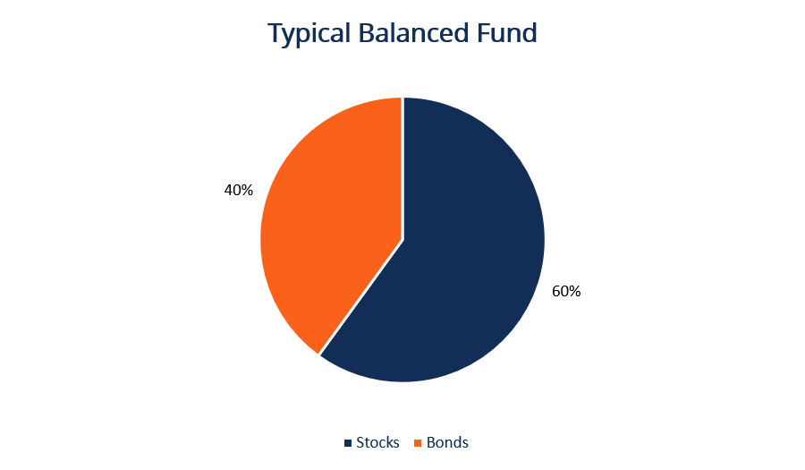

## Table of Contents

## What is a balanced fund?

A balanced fund is a type of investment fund that mixes different kinds of investments, like stocks and bonds, to try to balance risk and reward. It's designed for people who want to grow their money over time but also want some safety. By having both stocks and bonds, the fund aims to reduce the ups and downs that come with investing only in stocks.

These funds are often managed by professionals who decide how much to invest in stocks versus bonds. This mix can change based on what's happening in the market or the economy. For example, if the stock market is doing well, the manager might put more money into stocks. If things look risky, they might shift more into bonds. This active management helps keep the fund balanced and suited to different market conditions.

## How does a balanced fund differ from other types of funds?

A balanced fund is different from other types of funds because it mixes different kinds of investments, like stocks and bonds, in one fund. This mix helps to balance risk and reward. Other funds might focus only on one type of investment. For example, a stock fund invests only in stocks, which can be riskier but might offer higher returns. A bond fund, on the other hand, invests only in bonds, which are usually safer but offer lower returns. A balanced fund tries to give you a bit of both worlds by spreading the money across different types of investments.

Another way a balanced fund differs is that it's often actively managed. This means there are people who watch the market and decide how much of the fund's money should be in stocks versus bonds. They can change this mix based on what's happening in the economy or the market. Other funds, like index funds, might just follow a set list of investments without changing much. This active management in balanced funds aims to keep the fund's risk and reward in balance, which can be good for people who want a more hands-off approach to investing but still want some control over their risk level.

## What are the typical asset allocations in a balanced fund?

In a balanced fund, the typical asset allocation often includes a mix of stocks and bonds. A common split might be around 60% in stocks and 40% in bonds. This mix can change based on what the fund manager thinks is best for the current market conditions. The idea is to have enough stocks to grow the fund's value over time, but also enough bonds to keep things stable and less risky.

Sometimes, balanced funds might also include a small portion of other types of investments, like cash or real estate. This can help to spread the risk even more. The exact percentages can vary from one balanced fund to another, but the goal is always the same: to balance growth and safety. By having a mix of different investments, the fund tries to protect your money while still giving it a chance to grow.

## What are the benefits of investing in a balanced fund?

Investing in a balanced fund can be a good choice because it helps spread your money across different types of investments, like stocks and bonds. This mix can lower the risk compared to putting all your money in just stocks. When the stock market goes down, the bonds in the fund can help keep your investment stable. This way, you don't lose as much money when things get tough.

Another benefit is that balanced funds are often managed by professionals who watch the market and adjust the mix of stocks and bonds. They can move more money into stocks when the market is doing well, or into bonds when things look risky. This active management can help your investment grow over time while still keeping it safe. It's a good option if you want to grow your money but don't want to spend a lot of time managing your investments yourself.

## What are the risks associated with balanced funds?

Even though balanced funds try to mix stocks and bonds to lower risk, they still have some risks. One risk is that the stock part of the fund can go down in value if the stock market does badly. Even if the bond part helps to keep things stable, a big drop in the stock market can still hurt your investment. Another risk is that the fund manager might not always make the best choices about how much to put in stocks versus bonds. If they put too much in stocks at the wrong time, your fund could lose value.

Also, balanced funds can be affected by changes in interest rates. If interest rates go up, the value of the bonds in the fund might go down. This can make the whole fund less valuable. Plus, because balanced funds are actively managed, they might have higher fees than simpler funds like index funds. These fees can eat into your returns over time, making your investment grow slower than it might in a fund with lower costs.

## How can a balanced fund help in achieving long-term financial goals?

A balanced fund can help you reach your long-term financial goals by mixing different types of investments, like stocks and bonds. This mix helps to grow your money over time while also keeping it safe. When you invest for the long term, you want your money to grow, but you also don't want to lose it all if the market goes down. A balanced fund does this by having some money in stocks, which can grow a lot over time, and some in bonds, which are safer and can help keep your investment stable.

Another way a balanced fund helps with long-term goals is that it's managed by professionals. These people watch the market and can change how much of your money is in stocks versus bonds. If the market is doing well, they might put more in stocks to help your money grow faster. If things look risky, they might move more into bonds to keep your investment safe. This active management can help your money grow steadily over the years, which is what you need to reach big goals like saving for retirement or buying a house.

## What should investors consider before investing in a balanced fund?

Before putting money into a balanced fund, investors should think about their own comfort with risk. Balanced funds mix stocks and bonds to try to keep things safe while still growing your money. But, if you don't like risk at all, even a balanced fund might feel too risky because it still has some stocks. On the other hand, if you want your money to grow a lot and are okay with more risk, a balanced fund might not be aggressive enough for you.

Another thing to consider is the fees that come with balanced funds. These funds are often managed by professionals who decide how much to put in stocks versus bonds. This active management can help your money grow, but it also costs money. Make sure you know what the fees are and think about how they might affect how much your investment grows over time. If the fees are too high, they could eat into your returns and make the balanced fund less worth it.

Lastly, think about your long-term goals and how a balanced fund fits into those plans. If you're saving for something far in the future, like retirement, a balanced fund might be a good choice because it can help your money grow while keeping it safe. But if you need your money soon, you might want something less risky. Also, consider how a balanced fund fits with the rest of your investments. It's good to have a mix of different types of investments to spread out your risk, and a balanced fund can be a big part of that mix.

## Can you provide examples of well-known balanced funds?

One well-known balanced fund is the Vanguard Balanced Index Fund (VBIAX). This fund tries to keep a mix of about 60% stocks and 40% bonds. It's a good choice for people who want to grow their money over time but also want to keep it safe. The fund follows two big indexes: one for U.S. stocks and one for U.S. bonds. This means it doesn't try to guess which stocks or bonds will do well; it just follows these indexes. This can help keep the fees low, which is good for your investment.

Another popular balanced fund is the Fidelity Balanced Fund (FBALX). This fund also mixes stocks and bonds, but it's managed by people who watch the market and can change the mix based on what they think will happen. They might put more money into stocks if they think the market will go up, or more into bonds if they think things will get risky. This active management can help your money grow, but it also means the fund might have higher fees than funds that just follow indexes.

Both of these funds are good examples of how balanced funds can help you reach your long-term goals. They mix different types of investments to try to grow your money while keeping it safe. But remember, even though they're called "balanced," they still have some risk because they include stocks. So, think about how much risk you're okay with before you invest.

## How do balanced funds adjust their asset mix over time?

Balanced funds adjust their asset mix over time by having professionals, called fund managers, watch the market and decide how much money to put in stocks versus bonds. These managers look at what's happening in the economy and the stock market to make these choices. If they think the stock market will do well, they might put more money into stocks to help the fund grow faster. But if they think the market is risky, they might move more money into bonds to keep the fund safe. This way, the fund can try to balance growing your money with keeping it safe.

Sometimes, the changes in the asset mix can follow a set plan. For example, some balanced funds might start with a certain mix, like 60% stocks and 40% bonds, but as time goes on, they might slowly shift to have more bonds and less stocks. This can happen as the fund gets closer to a certain goal, like when people are getting closer to retirement and want their money to be safer. But even with these plans, the fund managers can still make changes based on what's happening in the market. This active management helps the fund stay balanced and suited to different market conditions.

## What is the role of a fund manager in managing a balanced fund?

The fund manager of a balanced fund plays a crucial role in keeping the fund's investments balanced between stocks and bonds. They watch the stock market and the economy to decide how much money should be in stocks versus bonds. If they think the stock market will do well, they might put more money into stocks to help the fund grow. But if they think the market is risky, they might move more money into bonds to keep the fund safe. This way, they try to balance growing your money with keeping it safe.

Sometimes, the fund manager follows a set plan for changing the mix of stocks and bonds over time. For example, they might start with a mix of 60% stocks and 40% bonds, but as time goes on, they might slowly shift to have more bonds and less stocks. This can happen as the fund gets closer to a certain goal, like when people are getting closer to retirement and want their money to be safer. Even with these plans, the fund manager can still make changes based on what's happening in the market. This active management helps the fund stay balanced and suited to different market conditions.

## How do economic conditions affect the performance of balanced funds?

Economic conditions can really change how well a balanced fund does. When the economy is doing well, like when people are buying a lot and businesses are making more money, the stock part of the fund can grow a lot. This is good for the balanced fund because it has some money in stocks. But if the economy starts to slow down, or if there's a big problem like a recession, the stock market can go down. This can make the value of the balanced fund drop because it has stocks in it. But the good thing about a balanced fund is that it also has bonds. Bonds are usually safer and can help keep the fund's value from falling too much when the stock market is doing badly.

The fund manager also plays a big role in how economic conditions affect the balanced fund. They watch the economy and can change how much money is in stocks versus bonds. If they think the economy is going to get better, they might put more money into stocks to help the fund grow. But if they think things will get worse, they might move more money into bonds to keep the fund safe. This way, the fund manager tries to balance the risks and rewards based on what's happening in the economy. So, even though economic conditions can affect the balanced fund, the fund manager's choices can help make the fund do better in different situations.

## What advanced strategies can be used to optimize returns from a balanced fund?

One advanced strategy to optimize returns from a balanced fund is to use tactical asset allocation. This means the fund manager can make quick changes to how much money is in stocks versus bonds based on what's happening in the market right now. If they think the stock market is about to go up, they might put more money into stocks to take advantage of that. But if they think the market is going to go down, they might move more money into bonds to keep the fund safe. This can help the fund grow more when the market is doing well and lose less when it's not.

Another strategy is to use a glide path approach. This means the fund manager slowly changes the mix of stocks and bonds over time. For example, if you're saving for retirement, the fund might start with a lot of stocks when you're young and slowly move more into bonds as you get closer to retiring. This can help your money grow a lot when you're young and then keep it safer as you get older. By planning how the mix changes over time, the fund can be more suited to your long-term goals and help you get better returns overall.

Lastly, some balanced funds use a strategy called risk parity. This means the fund manager tries to balance the risk from stocks and bonds instead of just balancing how much money is in each. They might use special tools like futures or options to do this. By focusing on balancing risk, the fund can try to grow your money more evenly, no matter what's happening in the market. This can help make your returns more stable and possibly better over the long run.

## What are the limitations and challenges of balanced funds?

Balanced funds, while providing a diversified investment strategy, entail certain limitations and challenges that investors need to consider. Primarily, the fixed asset allocations inherent in balanced funds can hinder their ability to adapt to changing financial goals and market conditions. This rigidity arises because these funds are typically structured with predetermined percentages of equities and bonds, often set to meet a generalized risk profile rather than the nuances of individual investor needs. As personal financial circumstances change—be it through age, risk tolerance adjustments, or market outlook shifts—the static nature of these allocations might not provide the flexibility required to optimize personal financial outcomes.

Tax inefficiencies also present a notable downside for balanced fund investors. Balanced funds often conduct numerous transactions to rebalance their portfolios in accordance with their fixed asset allocation targets. These frequent transactions can trigger taxable events, such as capital gains distributions, which can lead to significant tax liabilities for investors holding these funds in taxable accounts. This tax impact can detract from the overall net returns that an investor gains from holding a balanced fund.

Moreover, the potential for lower returns compared to more aggressive investment strategies is a critical challenge for balanced funds. While the conservative allocation between stocks and bonds provides stability and reduces [volatility](/wiki/volatility-trading-strategies), it also limits the potential for higher returns that are possible with a greater equity allocation. More aggressive portfolios, which hold a higher proportion of equities, tend to outperform balanced funds over the long term due to the higher growth potential of stocks compared to bonds.

For instance, assuming an average annual return of $r_{\text{stocks}} = 8\%$ for equities and $r_{\text{bonds}} = 4\%$ for bonds, a balanced fund maintaining a 60/40 equity-to-bond ratio would have an expected return of:

$$

r_{\text{balanced}} = 0.6 \times r_{\text{stocks}} + 0.4 \times r_{\text{bonds}} = 0.6 \times 8\% + 0.4 \times 4\% = 6.4\%
$$

This compares to an all-equity portfolio, which hypothetically yields 8%, highlighting the opportunity cost associated with the conservative nature of balanced funds. The investors looking for maximum capital appreciation might find this conservative performance unfavorable, particularly during bullish market cycles.

In summary, while balanced funds offer stability through diversification, they also come with limitations involving fixed asset allocations, potential tax inefficiencies, and comparatively lower returns, which may not align with the objectives of more aggressive investors aiming for higher growth.

## References & Further Reading

[1]: [Investopedia: Balanced Fund](https://www.investopedia.com/terms/b/balancedfund.asp) - An educational resource explaining what balanced funds are and how they work.

[2]: ["The Intelligent Asset Allocator: How to Build Your Portfolio to Maximize Returns and Minimize Risk"](https://www.amazon.com/Intelligent-Asset-Allocator-Portfolio-Maximize/dp/1260026647) by William J. Bernstein - A book that provides insights into strategic portfolio asset allocation.

[3]: ["Algorithmic Trading: Winning Strategies and Their Rationale"](https://www.wiley.com/en-us/Algorithmic+Trading%3A+Winning+Strategies+and+Their+Rationale-p-9781118460146) by Ernie Chan - A practical guide to algorithmic trading strategies.

[4]: [Morningstar: Mutual Funds](https://www.morningstar.com/funds) - A platform offering comprehensive mutual fund ratings and research.

[5]: [QuantInsti](https://www.quantinsti.com/) - An educational resource for learning about algorithmic and quantitative trading.

[6]: ["Advances in Financial Machine Learning"](https://www.amazon.com/Advances-Financial-Machine-Learning-Marcos/dp/1119482089) by Marcos Lopez de Prado - A book exploring the integration of machine learning into financial strategies.