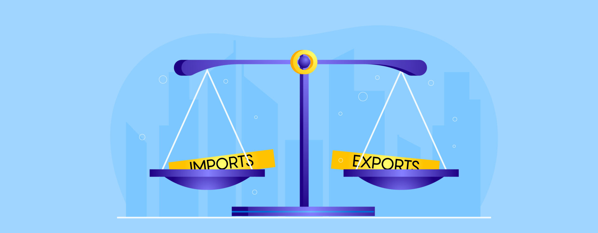

## Table of Contents

## What is balanced trade?

Balanced trade is when a country exports about the same amount of goods and services as it imports. This means that the money coming into the country from selling things to other countries is roughly equal to the money going out to buy things from other countries. When trade is balanced, it can help keep the economy stable because it prevents too much money from leaving or entering the country.

Sometimes, countries aim for balanced trade to avoid big trade deficits or surpluses. A trade deficit happens when a country imports more than it exports, and a trade surplus is the opposite. By keeping trade balanced, countries can protect their local industries and maintain a healthy economy. However, achieving perfect balance can be hard because global trade is influenced by many factors like currency values, economic policies, and international agreements.

## How is balanced trade different from free trade?

Balanced trade and free trade are two different ideas about how countries should trade with each other. Balanced trade means a country tries to make sure it sells about the same amount of things to other countries as it buys from them. This helps keep the money flowing in and out of the country even. Countries might use special rules or taxes to make sure their trade stays balanced, so they don't end up spending more money on imports than they earn from exports.

Free trade, on the other hand, is when countries let goods and services move across borders without many restrictions. This means countries don't put up a lot of rules or taxes that could make trading harder. The idea is that if countries trade freely, everyone can buy and sell things more easily, which can help grow the economy. But free trade can sometimes lead to trade imbalances, where one country buys a lot more from another than it sells to them.

So, the main difference is that balanced trade focuses on keeping the amount of imports and exports equal, while free trade focuses on making trade as easy as possible without worrying too much about balance. Both ideas have their own benefits and challenges, and countries often try to find a mix that works best for them.

## What are the key components of a balanced trade policy?

A balanced trade policy involves several key components that help a country keep its imports and exports at about the same level. One important part is using tariffs, which are taxes on imported goods. By making imports more expensive, tariffs can encourage people to buy more local products instead, which helps balance out trade. Another component is setting quotas, which are limits on how much of certain products can be imported. This can protect local industries from being overwhelmed by cheaper foreign goods, helping to maintain a balance in trade.

Another key component is negotiating trade agreements with other countries. These agreements can help set rules that make trade fairer and more balanced. For example, countries might agree to lower tariffs on each other's goods, which can help even out trade flows. Also, a balanced trade policy often includes monitoring the trade balance closely. This means keeping an eye on how much is being imported and exported, and adjusting policies if the balance starts to tip too far in one direction.

Lastly, currency management is another important part of a balanced trade policy. By keeping the value of their currency stable, countries can make their exports more competitive and their imports less so, which helps maintain a balanced trade. All these components work together to help a country achieve and maintain a balanced trade situation, ensuring that the economy stays healthy and stable.

## How is the balance of trade calculated?

The balance of trade is calculated by looking at the difference between the value of a country's exports and its imports over a certain period, usually a year. If a country exports more than it imports, it has a trade surplus. This means the country is selling more to other countries than it is buying from them. On the other hand, if a country imports more than it exports, it has a trade deficit. This means the country is buying more from other countries than it is selling to them.

To find out the exact balance, you add up the total value of all the goods and services the country exports and then subtract the total value of all the goods and services it imports. The result is the balance of trade. For example, if a country exports $500 billion worth of goods and imports $450 billion worth of goods, its balance of trade would be a surplus of $50 billion. Keeping track of this balance helps countries understand their economic health and make decisions about trade policies.

## What are the advantages of balanced trade for a country's economy?

Balanced trade can help a country's economy stay stable. When a country exports about the same amount as it imports, it means the money coming in and going out is even. This can prevent big problems that can happen if too much money leaves the country, like a weaker currency or more debt. It also helps local businesses because they can sell more at home instead of being outcompeted by cheaper imports. This can lead to more jobs and a stronger economy overall.

Another advantage is that balanced trade can help a country avoid relying too much on other countries. If a country imports a lot more than it exports, it can become too dependent on other countries for goods and services. This can be risky if those countries change their policies or if there are global economic problems. By keeping trade balanced, a country can protect itself better and have a more stable economy in the long run.

## Can balanced trade help reduce trade deficits?

Balanced trade can help reduce trade deficits. A trade deficit happens when a country imports more than it exports. By working to balance trade, a country can try to make its exports and imports more equal. This means they will sell more to other countries and buy less from them, which can slowly bring down the trade deficit. Countries might use things like tariffs or quotas to make their own products more appealing and reduce the amount of imports.

Balanced trade policies can also encourage local industries to grow. When a country focuses on balancing its trade, it often means supporting local businesses so they can compete better with foreign products. This can lead to more jobs and more money being made within the country. As these local industries grow, they can export more, which helps to close the gap between imports and exports. Over time, this can help reduce or even eliminate the trade deficit.

## What are the potential disadvantages of pursuing balanced trade?

Pursuing balanced trade can lead to some problems. One big issue is that it can make trade more complicated. Countries might have to put up tariffs or quotas to try and balance their trade. This can make it harder for people to buy things they need or want from other countries. It can also make other countries upset because they might not be able to sell as much to the country trying to balance its trade. This can lead to trade wars, where countries keep putting up more barriers against each other, making trade even harder.

Another disadvantage is that balanced trade can slow down economic growth. When countries focus too much on balancing trade, they might miss out on the benefits of free trade. Free trade can help businesses grow by letting them sell to more people in other countries. It can also help people get cheaper goods from other places. By trying to balance trade, a country might end up protecting businesses that are not very good at competing. This can keep the economy from growing as fast as it could if trade was more open.

## How do international trade agreements impact balanced trade?

International trade agreements can help or hurt a country's efforts to have balanced trade. These agreements often set rules about how much countries can tax imports or limit how many goods they can bring in. If the agreement makes it easier for a country to sell its goods to other places, it can help increase exports. This can move the country closer to balanced trade by making sure more money comes in from selling things. But, if the agreement lets other countries sell a lot to the country without many limits, it might lead to more imports and make it harder to keep trade balanced.

Sometimes, trade agreements can also cause problems for balanced trade. If a country agrees to lower its tariffs to join a trade deal, it might end up importing more than it exports. This can create a trade deficit instead of balanced trade. Countries have to be careful when making these agreements to make sure they don't hurt their goal of keeping trade balanced. They might need to negotiate terms that help protect their local industries while still allowing some trade to happen.

## What role do tariffs and quotas play in achieving balanced trade?

Tariffs and quotas are important tools countries use to try to reach balanced trade. Tariffs are like taxes that a country puts on things coming in from other countries. When a country adds tariffs, it makes those imported things more expensive. This can make people want to buy more things made at home instead, which helps the country sell more of its own stuff. By doing this, the country can try to make sure it's not buying a lot more from other places than it's selling to them, which helps balance trade.

Quotas are another way to control how much stuff comes into a country. A quota is a limit on how many of a certain thing can be imported. If a country sets a quota, it can stop too many of those things from coming in, which helps protect local businesses. When local businesses do better, they can sell more, both at home and to other countries. This can help the country export more and get closer to having balanced trade. Both tariffs and quotas are used to try to make sure a country isn't spending a lot more on imports than it's [earning](/wiki/earning-announcement) from exports.

## How does balanced trade affect global economic relationships?

Balanced trade can change how countries work together in the world economy. When a country tries to keep its trade balanced, it might put up tariffs or quotas on things coming in from other countries. This can make other countries upset because they can't sell as much to that country. If many countries start doing this, it can lead to trade wars where countries keep putting up more barriers against each other. This can make it hard for countries to work together and can slow down the world economy.

On the other hand, balanced trade can also help make global economic relationships more stable. When countries have balanced trade, they are not relying too much on other countries for goods and services. This means they are less likely to be hurt by changes in other countries' economies. For example, if one country's economy gets into trouble, a country with balanced trade won't be as affected because it's not buying too much from that country. This can lead to more stable and friendly relationships between countries because everyone is working to keep their own economies strong and balanced.

## What are some historical examples of countries implementing balanced trade policies?

One historical example of a country trying to implement balanced trade policies is Japan in the 1980s. Japan used a mix of tariffs and quotas to protect its local industries, like cars and electronics. By doing this, Japan made sure it was not buying too much from other countries while still selling a lot of its own products to the world. This helped Japan have a trade surplus, meaning it was selling more than it was buying. But, this also caused some problems with other countries, like the United States, which felt Japan was not playing fair in trade.

Another example is the United States in the early 2000s. The U.S. used tariffs on things like steel to try and protect its own steel industry. The idea was to make sure the U.S. was not importing too much steel and losing jobs at home. But, this led to some disagreements with countries like China and the European Union, who thought the U.S. was being too protective. Even though the U.S. wanted balanced trade, the tariffs caused tension with other countries and did not always work as planned.

## What are the challenges and criticisms faced by countries trying to maintain balanced trade?

Trying to keep trade balanced can be tough for countries. One big problem is that other countries might get upset when a country puts up tariffs or quotas to protect its own businesses. This can lead to trade fights where countries keep making it harder for each other to trade. Also, it's hard to keep track of all the imports and exports to make sure they stay even. Sometimes, things like changes in money values or global prices can mess up a country's plans for balanced trade. So, it takes a lot of work and can cause problems with other countries.

Another challenge is that some people think balanced trade policies can hurt the economy more than help. Critics say that by trying to make trade even, a country might miss out on the good things that come from free trade, like cheaper products and more choices for people. They also worry that protecting local businesses too much can make them lazy and not good at competing. If a country focuses too much on balancing trade, it might not grow as fast as it could if it let trade flow more freely. So, while balanced trade sounds good, it can be hard to do and might not always be the best choice for a country's economy.

## References & Further Reading

[1]: Felbermayr, G., & Jung, B. (2009). ["The World Economy: A Global Trade Analysis."](https://opus.uni-hohenheim.de/volltexte/2009/362/pdf/309.pdf) The World Economy.

[2]: James, J., & Mercier, P. (2002). ["A Portfolio Approach to Currency Overlay Management."](https://onlinelibrary.wiley.com/doi/abs/10.1111/j.1748-8583.2002.tb00065.x) Journal of Economic Surveys.

[3]: ["Algorithmic Trading: Winning Strategies and Their Rationale"](https://books.google.com/books/about/Algorithmic_Trading.html?id=CIwCTVqEj4oC) by Ernest P. Chan

[4]: ["High-Frequency Trading: A Practical Guide to Algorithmic Strategies and Trading Systems"](https://www.ahmetbeyefendi.com/wp-content/uploads/2020/07/High-Frequency-Trading-Irene-Aldridge.pdf) by Irene Aldridge

[5]: ["The Age of Deleveraging: Investment Strategies for a Decade of Slow Growth and Deflation"](https://www.amazon.com/Age-Deleveraging-Investment-Strategies-Deflation/dp/0470596368) by A. Gary Shilling