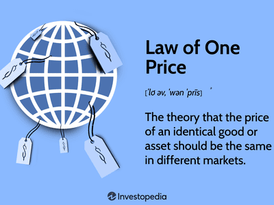

## Table of Contents

## What is the Balassa-Samuelson Effect?

The Balassa-Samuelson Effect is an economic theory that explains why some countries have higher inflation rates than others. It suggests that countries with faster productivity growth in their tradable sectors, like manufacturing, will see their currencies appreciate. This happens because higher productivity leads to higher wages, and these higher wages spread to the non-tradable sectors, like services, causing prices to rise.

This effect is important because it helps explain differences in inflation and exchange rates between countries. For example, if a country like Germany has faster productivity growth than a country like Greece, Germany's currency might become stronger. This can make German goods more expensive abroad and Greek goods cheaper, affecting their trade balance. Understanding the Balassa-Samuelson Effect helps economists and policymakers make better decisions about managing inflation and exchange rates.

## Who are Bela Balassa and Paul Samuelson, and what did they contribute to this theory?

Bela Balassa was a Hungarian economist who worked at Johns Hopkins University. He is famous for his work on international trade and development economics. In 1964, Balassa wrote a paper where he noticed that countries with higher productivity in manufacturing also had higher prices for services. This was because higher productivity led to higher wages, and these higher wages affected the whole economy, including the service sector.

Paul Samuelson was an American economist who won the Nobel Prize in Economics in 1970. He is known for his work in many areas of economics, including international trade. Samuelson built on Balassa's ideas in the 1960s. He explained how differences in productivity between countries could lead to changes in their exchange rates. Together, their work became known as the Balassa-Samuelson Effect, which helps explain why some countries have higher inflation and stronger currencies than others.

## How does the Balassa-Samuelson Effect explain differences in inflation rates between countries?

The Balassa-Samuelson Effect helps explain why some countries have higher inflation rates than others. It says that if a country's factories and businesses that make things like cars and computers get better at their jobs, they can make more stuff without using more workers. This means they can pay their workers more money. When these workers spend their higher wages, they also spend it on things like haircuts and meals at restaurants, which are services that can't be easily traded with other countries. Because more money is being spent on these services, their prices go up, which leads to higher inflation in that country.

This effect also shows why countries with faster-growing factories might have stronger money compared to other countries. If a country's workers are getting paid more because they're making more stuff, and if this higher pay also raises the prices of services, then people from other countries will need more of their own money to buy things from this country. This makes the first country's money worth more, or "stronger." So, the Balassa-Samuelson Effect explains both why some countries might see their prices go up faster and why their money might get stronger compared to other countries.

## What is the role of productivity differences in the Balassa-Samuelson Effect?

Productivity differences play a big role in the Balassa-Samuelson Effect. When a country's workers in factories and businesses get better at making things like cars and computers, they can produce more without needing more workers. This means the country can pay its workers more money. These higher wages then spread to other parts of the economy, like shops and restaurants, where workers also want to earn more. Because everyone is [earning](/wiki/earning-announcement) more, they can spend more on services, which makes the prices of these services go up.

This rise in service prices is what leads to higher inflation in the country. At the same time, because the country is making more stuff and paying its workers more, its money becomes worth more compared to other countries. This makes the country's money stronger. So, productivity differences between countries help explain why some countries have higher inflation and stronger money than others.

## Can you explain the distinction between tradable and non-tradable goods in the context of this effect?

In the Balassa-Samuelson Effect, tradable goods are things like cars and computers that can be easily bought and sold between countries. These goods are made in factories and businesses where workers can get better at their jobs over time. When workers become more productive, they can make more of these goods without needing more people. This means the country can pay its workers more money. Because these goods can be traded, their prices are affected by what's happening in other countries too.

Non-tradable goods, on the other hand, are things like haircuts and meals at restaurants that can't be easily bought and sold between countries. When workers in the tradable sector get paid more because they're making more stuff, they also spend more money on these non-tradable services. This extra spending pushes up the prices of these services, leading to higher inflation in the country. So, the Balassa-Samuelson Effect shows how productivity in making tradable goods can affect the prices of non-tradable services and overall inflation.

## How does the Balassa-Samuelson Effect impact exchange rates?

The Balassa-Samuelson Effect explains how exchange rates can change between countries. When workers in a country's factories and businesses get better at making things like cars and computers, they can make more without needing more people. This means the country can pay its workers more money. When these workers spend their higher wages, they also spend it on things like haircuts and meals at restaurants, which can't be easily traded with other countries. Because more money is being spent on these services, their prices go up, leading to higher inflation in that country.

This higher inflation and the fact that the country is making more stuff can make its money worth more compared to other countries. If people from other countries need more of their own money to buy things from this country, it means the first country's money is stronger. So, the Balassa-Samuelson Effect shows that if a country's workers get better at making things, it can lead to a stronger money compared to other countries.

## What empirical evidence supports the Balassa-Samuelson Effect?

Many studies have looked at the Balassa-Samuelson Effect and found evidence that it's real. For example, economists have compared countries with fast-growing factories to those with slower growth. They found that countries with faster factory growth often have higher prices for services like haircuts and meals at restaurants. This is because workers in these countries get paid more, and they spend their extra money on these services, pushing up their prices.

Another piece of evidence comes from looking at how exchange rates change between countries. When a country's factories get better at making things, its money often becomes worth more compared to other countries. This is because people from other countries need more of their own money to buy things from the country with the faster-growing factories. So, the Balassa-Samuelson Effect helps explain why some countries have stronger money and higher inflation than others.

## How do economists measure the Balassa-Samuelson Effect in practice?

Economists measure the Balassa-Samuelson Effect by looking at how fast factories and businesses in a country are getting better at making things. They compare this to how much prices are going up for things like haircuts and meals at restaurants. If a country's factories are growing fast and its workers are getting paid more, economists expect to see higher prices for these services. They use numbers to show how much productivity is growing in the factories and how much prices are going up for services, and then they see if these numbers match what the Balassa-Samuelson Effect says should happen.

Another way economists measure this effect is by looking at exchange rates. They check if countries with faster-growing factories have stronger money compared to other countries. If a country's workers are getting paid more because they're making more stuff, and if this higher pay also raises the prices of services, then people from other countries will need more of their own money to buy things from this country. Economists use numbers to see if the country's money is getting stronger, and if this matches what the Balassa-Samuelson Effect predicts.

## What are the limitations and criticisms of the Balassa-Samuelson Effect?

The Balassa-Samuelson Effect helps explain why some countries have higher prices and stronger money than others, but it has some problems. One big problem is that it doesn't always work perfectly in real life. For example, sometimes countries with fast-growing factories don't have much higher prices for services like haircuts and meals at restaurants. This could be because other things, like government rules or how much people want to buy things, can also change prices. So, the effect might not be as strong as the theory says it should be.

Another criticism is that the Balassa-Samuelson Effect can be hard to measure accurately. Economists need good numbers to see how fast factories are growing and how much prices are going up for services. But sometimes these numbers can be wrong or hard to get, especially in countries that don't keep good records. Also, the effect might be different in different countries because each country has its own special things going on. So, while the Balassa-Samuelson Effect gives us a good idea of what might happen, it's not perfect and needs to be used carefully.

## How does the Balassa-Samuelson Effect relate to economic convergence among countries?

The Balassa-Samuelson Effect helps explain how countries can get closer to each other in terms of how rich they are, which is called economic convergence. When a country's factories and businesses get better at making things like cars and computers, they can pay their workers more money. These higher wages then spread to other parts of the economy, like shops and restaurants, where workers also want to earn more. As these countries grow richer, they start to catch up with richer countries. This is because they can make more stuff and their money becomes worth more, which helps them buy things from other countries more easily.

However, the Balassa-Samuelson Effect also shows that this process of catching up can be slow and uneven. Not all countries grow at the same speed, and some might face problems like bad government rules or not having enough good workers. These problems can make it hard for them to catch up with richer countries. So, while the Balassa-Samuelson Effect gives us a way to understand how countries can become more equal in wealth, it also shows that it's not easy and can take a long time.

## Can the Balassa-Samuelson Effect be observed in emerging markets, and if so, how?

Yes, the Balassa-Samuelson Effect can be seen in emerging markets. When factories in these countries start making more stuff like cars and computers, they can pay their workers more money. These workers then spend their extra money on things like haircuts and meals at restaurants, which can't be easily bought and sold between countries. Because more money is being spent on these services, their prices go up. This means that emerging markets with fast-growing factories might see higher prices for services, just like the Balassa-Samuelson Effect says.

This effect can also make the money of these emerging markets worth more compared to other countries. If people from other countries need more of their own money to buy things from an emerging market with fast-growing factories, it means the emerging market's money is getting stronger. So, the Balassa-Samuelson Effect helps explain why some emerging markets might have higher prices and stronger money as they grow and get better at making things.

## What are the implications of the Balassa-Samuelson Effect for monetary policy and inflation targeting?

The Balassa-Samuelson Effect has important implications for how countries manage their money and try to control inflation. When a country's factories get better at making things, it can lead to higher prices for services like haircuts and meals at restaurants. This means that if a country is trying to keep inflation at a certain level, it might need to think about how fast its factories are growing. If the factories are growing fast, the country might need to be careful not to make its money too strong, because that could make it harder to sell things to other countries.

For countries that set a target for inflation, the Balassa-Samuelson Effect can make things tricky. If a country's factories are growing faster than other countries, it might see higher inflation even if it's doing everything right with its money. This means that the country might need to adjust its inflation target or use other tools to keep prices stable. Understanding the Balassa-Samuelson Effect helps countries make better decisions about their money and how to keep inflation under control.

## What is the Balassa-Samuelson Effect and how can it be understood?

The Balassa-Samuelson effect, introduced by economists Bela Balassa and Paul Samuelson, provides a significant explanation of how productivity disparities across countries impact exchange rates and wage levels. At its core, this economic theory suggests that countries with higher productivity in tradable goods tend to experience real currency appreciation. This phenomenon occurs because as productivity in the tradable sector increases, wages in that sector rise. Due to the necessity of maintaining competitive wages across sectors to prevent labor migration, the non-tradable sector also sees wage increases. However, productivity in the non-tradable sector remains relatively unchanged, leading to higher consumer prices in that sector.

This differential in price and wage levels means that higher productivity countries often exhibit apparent undervaluation of their currencies when evaluated against their actual economic productivity and development level. This undervaluation arises because the nominal exchange rate does not fully adjust to reflect the higher price levels induced by increased productivity.

Mathematically, the Balassa-Samuelson effect can be demonstrated by considering the real exchange rate $RER$, which is defined as:

$$
RER = \frac{E \cdot P^*}{P}
$$

Where:
- $E$ is the nominal exchange rate,
- $P^*$ is the price level in the foreign country,
- $P$ is the price level in the home country.

In a scenario where productivity in the home country’s tradable sector rises, $P$ increases compared to $P^*$, leading to an appreciation of the real exchange rate if $E$ does not adjust correspondingly.

The implications of the Balassa-Samuelson effect on international trade are significant. It suggests that countries with rapidly improving productivity may experience a decline in their trade competitiveness due to increased domestic costs. Moreover, the effect has implications for inflation dynamics. As wages in the non-tradable sector increase due to wage equalization pressures, consumer prices in that sector also rise, contributing to overall inflation within the economy.

Additionally, the Balassa-Samuelson effect highlights challenges in achieving purchasing power parity (PPP) since the nominal exchange rate may not accurately reflect the productivity-adjusted economic value of a currency. This discrepancy can lead to misrepresentations in economic analyses that rely on exchange rates as proxies for comparing economic development and productivity levels across countries.

Understanding these fundamental aspects of the Balassa-Samuelson effect is essential for comprehending how productivity influences economic variables broadly and for tailoring policies or strategies that address the resulting economic disparities.

## What is Purchasing Power Parity: A Conceptual Framework?

Purchasing Power Parity (PPP) is a foundational economic theory used to compare the economic productivity and living standards between different countries. It is predicated on the law of one price, which posits that in the absence of transportation costs and other barriers to trade, identical goods should command the same price globally if their prices are expressed in a common currency. This principle provides a key framework for assessing whether a currency is undervalued or overvalued relative to another.

The formula for PPP is given by:

$$
S = \frac{P_1}{P_2}
$$

where $S$ is the exchange rate of one currency to another, and $P_1$ and $P_2$ represent the price levels in countries 1 and 2, respectively. According to PPP, changes in exchange rates between two countries should reflect changes in the countries' relative price levels.

The PPP model finds its most straightforward application in the context of goods [arbitrage](/wiki/arbitrage), serving as a long-term equilibrium condition. If the actual exchange rate between two currencies deviate significantly from the PPP exchange rate, arbitrage opportunities should arise. Such deviations are expected to be corrected over time through adjustment processes in the goods and currency markets.

However, real-world application of PPP often encounters limitations. Factors such as transportation costs, trade barriers, and differences in consumption utility across regions can lead to persistent deviations from PPP values. Additionally, non-tradable goods and services, which do not have international markets, further complicate the application of PPP.

The Big Mac Index, introduced by The Economist, is an informal measure of PPP. It compares the price of a McDonald's Big Mac across countries to gauge currency valuation errors. Despite its simplicity, this index highlights how PPP can reveal disparities that may not be immediately apparent through nominal exchange rates alone.

PPP's role in currency valuation is pivotal, particularly for economists and policymakers aiming to understand long-term exchange rate trends. While its short-term predictive power might be limited due to market imperfections and speculative forces, PPP remains an indispensable tool for analyzing fundamental value and gauging market inefficiencies over protracted periods. Given these insights, it continues to inform economic strategies and decisions across global financial markets.

## References & Further Reading

[1]: Balassa, B. (1964). ["The Purchasing Power Parity Doctrine: A Reappraisal."](https://www.jstor.org/stable/1829464) Journal of Political Economy, 72(6), 584-596.

[2]: Kravis, I. B., & Lipsey, R. E. (1983). ["Toward an Explanation of National Price Levels."](https://www.nber.org/papers/w1034) NBER Working Paper No. 1034.

[3]: Samuelson, P. A. (1964). "Theoretical Notes on Trade Problems." Review of Economics and Statistics, 46(2), 145-154.

[4]: Rogoff, K. (1996). ["The Purchasing Power Parity Puzzle."](https://scholar.harvard.edu/rogoff/publications/purchasing-power-parity-puzzle) Journal of Economic Literature, 34(2), 647-668.

[5]: *The Economist*. ["The Big Mac Index."](https://www.economist.com/interactive/big-mac-index) 

[6]: Obstfeld, M., & Rogoff, K. (1995). ["Exchange Rate Dynamics Redux."](https://www.nber.org/papers/w4693) Journal of Political Economy, 103(3), 624-660.

[7]: Froot, K. A., & Rogoff, K. (1995). ["Perspectives on PPP and Long-Run Real Exchange Rates."](https://scholar.harvard.edu/rogoff/publications/perspectives-ppp-and-long-run-real-exchange-rates) NBER Working Paper No. 4952.