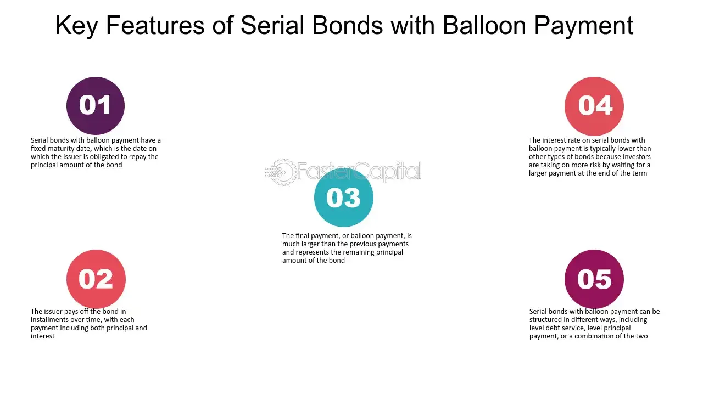

## Table of Contents

## What is balloon maturity?

Balloon maturity is a type of loan where you pay small amounts for a while, but then you have to pay a big amount at the end. It's like blowing up a balloon slowly and then it gets really big at the end. This big payment at the end is called the balloon payment. People or businesses might choose this kind of loan if they expect to have more money later or if they want smaller payments now.

Sometimes, balloon maturity can be risky. If you can't pay the big amount at the end, you might have to borrow more money or sell something to pay it off. It's important to plan carefully and make sure you can handle the big payment when it comes. But if you manage it well, it can help you get a loan with lower payments in the beginning.

## How does balloon maturity differ from other types of maturity?

Balloon maturity is different from other types of maturity because it has a big payment at the end of the loan. With other types of loans, like fixed-rate or adjustable-rate mortgages, you usually pay the same amount every month until the loan is fully paid off. But with balloon maturity, you pay smaller amounts for a while, and then you have to pay a large sum at the end. This big payment is called the balloon payment.

Other types of maturity, like fully amortizing loans, spread the cost evenly over time. This means each payment you make goes towards both the interest and the principal of the loan, gradually reducing what you owe until it's all paid off. In contrast, balloon maturity loans often have payments that only cover the interest or a small part of the principal, leaving a big chunk to pay at the end. This can be good if you need lower payments now, but it can be risky if you can't afford the big payment later.

## What are the basic mechanics behind balloon maturity?

Balloon maturity works by letting you pay smaller amounts on a loan for a while, and then you have to pay a big amount at the end. This big amount is called the balloon payment. The smaller payments you make might only cover the interest on the loan, or they might also pay off a little bit of the loan itself. But, the main thing is that you still owe a lot of money at the end of the loan term.

The idea behind balloon maturity is that it can help you get a loan with lower payments in the beginning. This can be useful if you expect to have more money later, like from selling something or getting a raise at work. But, it can be risky. If you can't pay the big balloon payment at the end, you might need to borrow more money or sell something to cover it. So, it's important to plan carefully and make sure you can handle the big payment when it comes.

## Can you explain the concept of balloon payments?

A balloon payment is a big payment you have to make at the end of a loan. It's called a balloon payment because it's like a balloon that gets bigger and bigger until it's time to pay it. When you take out a loan with a balloon payment, you pay smaller amounts for a while, but then you have to pay a large amount at the end. This can be helpful if you need lower payments now, but it can be risky if you can't afford the big payment later.

The way balloon payments work is that the smaller payments you make might only cover the interest on the loan, or they might also pay off a little bit of the loan itself. But, the main thing is that you still owe a lot of money at the end of the loan term. If you can't pay the balloon payment when it's due, you might have to borrow more money or sell something to cover it. So, it's important to plan carefully and make sure you can handle the big payment when it comes.

## What are the advantages of using balloon maturity in financial planning?

Using balloon maturity in financial planning can have some big advantages. One advantage is that it lets you have lower payments at the start of your loan. This can be really helpful if you need to save money now or if you don't have a lot of cash right away. For example, if you're starting a new business or buying a house, lower payments can help you manage your money better in the beginning.

Another advantage is that balloon maturity can be a good choice if you expect to have more money later on. Maybe you're planning to sell something valuable or you're expecting a big raise at work. With a balloon maturity loan, you can plan to use that money to make the big balloon payment at the end. This way, you can get the loan you need now and still have a plan to pay it off later.

## What are the potential risks associated with balloon maturity?

Balloon maturity can be risky because of the big payment you have to make at the end of the loan. If you can't pay this balloon payment, you might have to borrow more money or sell something valuable to cover it. This can be stressful and might put you in a tough financial spot. If you're not sure you'll have the money when the balloon payment is due, it's a big risk to take.

Another risk is that your financial situation might change. You might lose your job, have unexpected expenses, or not get the extra money you were counting on. If any of these things happen, you could find it hard to make the big payment at the end. It's important to think about these possibilities and have a backup plan in case things don't go as expected.

## How is the balloon amount calculated in a loan or bond?

The balloon amount in a loan or bond is the big payment you have to make at the end. To figure out this amount, you first look at how much money you borrowed in total. Then, you subtract all the smaller payments you made during the loan term. These smaller payments might have covered just the interest or a little bit of the loan itself. The balloon amount is what's left over after you subtract those payments from the original loan amount.

For example, if you borrowed $100,000 and made payments of $500 every month for 5 years, you would have paid $30,000 in total ($500 x 12 months x 5 years). If those payments only covered the interest, the balloon amount would still be the full $100,000. But if the payments also paid off some of the loan, say $20,000, then the balloon amount would be $80,000 ($100,000 - $20,000). It's important to know how your payments are applied to figure out what the balloon amount will be at the end.

## What are the typical scenarios where balloon maturity is used?

Balloon maturity is often used when someone needs lower payments at the start of a loan. This can be helpful for people or businesses that don't have a lot of money right away. For example, if you're starting a new business, you might use balloon maturity to get a loan with smaller payments at first. This way, you can use your money to grow your business instead of making big loan payments. Another common scenario is when someone is buying a house. They might choose a balloon maturity loan to keep their monthly payments low while they plan to sell the house or get a better job later.

Another situation where balloon maturity is used is when someone expects to have more money in the future. Maybe you're planning to sell something valuable, like a piece of land or another property, or you're expecting a big raise at work. With a balloon maturity loan, you can plan to use that money to make the big balloon payment at the end. This can be a smart way to get the loan you need now and still have a plan to pay it off later. But it's important to be sure you'll have the money when the balloon payment is due, because if you don't, it can be a big problem.

## How does balloon maturity affect the amortization schedule of a loan?

Balloon maturity changes the way you pay off a loan compared to a regular loan. In a regular loan, you pay the same amount every month, and each payment goes towards both the interest and the principal of the loan. This means that over time, the loan gets smaller and smaller until it's all paid off. But with a balloon maturity loan, you pay smaller amounts for a while, and these payments might only cover the interest or just a little bit of the principal. This means that the loan doesn't get paid off as quickly, and you still owe a lot of money at the end.

The big difference with balloon maturity is that there's a big payment at the end of the loan, called the balloon payment. This payment can be a lot of money, and it's what's left of the loan after you've made all your smaller payments. Because of this big payment, the amortization schedule of a balloon maturity loan looks different. Instead of seeing the loan balance go down to zero over time, it stays high until the end when you have to make the balloon payment. This can be good if you need lower payments now, but it's important to plan for the big payment at the end.

## What strategies can be used to manage the risks of balloon maturity?

To manage the risks of balloon maturity, it's important to have a clear plan for how you will pay the big balloon payment at the end of the loan. One strategy is to save money over time so you have enough to make the payment when it's due. You can set up a separate savings account and put money into it every month, just like you're making an extra loan payment. This way, when the balloon payment comes, you'll have the money ready. Another strategy is to make sure you have something valuable you can sell if you need to. This could be a piece of property, a car, or something else that you can turn into cash to cover the balloon payment.

Another way to manage the risks is to have a backup plan in case your financial situation changes. Life can be unpredictable, so it's smart to think about what you would do if you lost your job or had unexpected expenses. You might want to look into getting a new loan or refinancing the balloon payment if you can't pay it off. Some lenders offer options to extend the loan term or roll the balloon payment into a new loan with smaller payments. It's a good idea to talk to your lender about these possibilities early on, so you know what options you have if things don't go as planned.

Overall, managing the risks of balloon maturity means being prepared and having a plan. By saving money, having something to sell, and knowing your options for dealing with the balloon payment, you can make sure you're ready for the big payment at the end of the loan. This way, you can enjoy the benefits of lower payments now without worrying too much about the risks later.

## How do interest rates impact the mechanics of balloon maturity?

Interest rates have a big effect on balloon maturity loans. When you take out a loan with balloon maturity, the interest rate decides how much you have to pay each month before the big balloon payment at the end. If the interest rate is high, your monthly payments will be higher because you're paying more interest. But if the interest rate is low, your monthly payments will be lower. This can make a big difference if you're trying to keep your payments small at the start of the loan.

The interest rate also affects the size of the balloon payment at the end. If the interest rate is high, the balloon payment might be bigger because more of your monthly payments go towards interest instead of paying off the loan. On the other hand, if the interest rate is low, more of your payments can go towards the loan itself, which means the balloon payment might be smaller. It's important to think about interest rates when you're planning for a balloon maturity loan, because they can change how much you have to pay both now and later.

## What are advanced financial models used to predict outcomes of balloon maturity?

Advanced financial models help predict what might happen with balloon maturity loans by looking at different things like interest rates, how much you pay each month, and how long the loan lasts. These models use math to figure out the best way to handle the big balloon payment at the end. They can show you different scenarios, like what happens if interest rates go up or down, or if you can't make the balloon payment. By using these models, you can see how different choices might affect your loan and plan better for the future.

One common model is called the Monte Carlo simulation. It runs many different versions of your loan to see how likely it is that you'll be able to pay the balloon payment at the end. It takes into account things like changes in your income, the value of things you might sell, and even the economy. Another model is the discounted cash flow model, which looks at the value of your future payments and the balloon payment in today's money. These models help you understand the risks and make smart choices about using balloon maturity in your financial planning.

## What is Understanding Balloon Maturity Loan Repayment?

Balloon maturity refers to a loan structure where the borrower makes relatively small periodic payments throughout the loan term, followed by a significantly larger final payment to repay the remaining balance. This final payment is known as the "balloon payment." Balloon loans are common in both personal and corporate finance, often used in mortgages, commercial real estate, and other large capital expenditures.

The structure of a balloon loan is designed to reduce the borrower's regular payments, thereby easing their short-term financial burden. A typical balloon loan formula involves regular interest payments and a substantial principal repayment at the end, expressed as:

$$
\text{Final Payment} = P(1 + r)^n - \sum_{i=1}^{n} P \cdot r \cdot (1 + r)^{n-i}
$$

where:
- $P$ is the initial loan principal,
- $r$ is the periodic interest rate,
- $n$ is the total number of payment periods.

For example, a borrower may take out a $100,000 loan with a ten-year term. They might make annual interest payments based on a 5% [interest rate](/wiki/interest-rate-trading-strategies), with the $100,000 principal required to be paid at the end of the term.

The benefits of balloon loans often include lower initial payments, which can be advantageous for borrowers expecting future income increases or those planning to refinance the loan before the balloon payment is due. For businesses, balloon loans can facilitate investments in growth opportunities without straining their cash flow.

However, risks are inherent in balloon maturity loans. The most significant is the borrower's potential inability to make the balloon payment at the end of the loan. This vulnerability often depends on the borrower's financial planning and market conditions. Failure to secure refinancing or adequate funds for the final payment can result in default and loss of collateral. Furthermore, interest rate changes or shifts in a borrower's financial situation can make refinancing more challenging or costly than anticipated.

Balloon loans may be advantageous in scenarios such as expecting an inflow of substantial revenue before the balloon payment or utilizing the asset acquired with the loan to generate sufficient returns. Conversely, balloon loans become risky in volatile interest rate environments or when anticipated income does not materialize, as these factors can lead to financial strain.

In summary, while balloon maturity loans provide flexibility and reduced initial financial commitment, they require careful planning and assessment of market conditions to mitigate risks associated with large final payments.

## References & Further Reading

[1]: ["Advances in Financial Machine Learning"](https://www.amazon.com/Advances-Financial-Machine-Learning-Marcos/dp/1119482089) by Marcos Lopez de Prado

[2]: ["Algorithmic Trading and DMA: An Introduction to Direct Access Trading Strategies"](https://www.amazon.com/Algorithmic-Trading-DMA-introduction-strategies/dp/0956399207) by Barry Johnson

[3]: ["Fixed Income Securities"](https://www.investopedia.com/terms/f/fixed-incomesecurity.asp) by Bruce Tuckman and Angel Serrat

[4]: ["Pioneering Portfolio Management: An Unconventional Approach to Institutional Investment"](https://www.amazon.com/Pioneering-Portfolio-Management-Unconventional-Institutional/dp/1416544690) by David F. Swensen

[5]: ["Quantitative Trading: How to Build Your Own Algorithmic Trading Business"](https://www.amazon.com/Quantitative-Trading-Build-Algorithmic-Business/dp/1119800064) by Ernest P. Chan