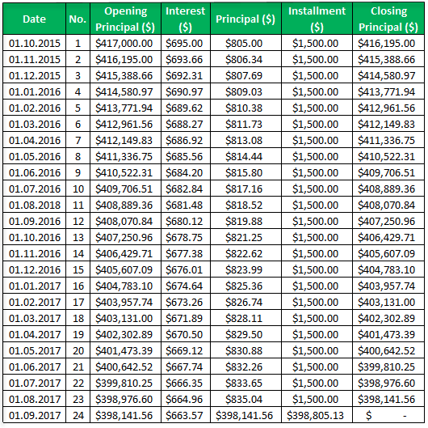

Balloon options are a type of exotic financial derivatives characterized by their distinctive payoff structures. These options are increasingly popular among investors due to the potential for tailored risk and return profiles, making them a vital addition to the landscape of financial instruments and investment strategies. What distinguishes balloon options from traditional options, such as American and European options, is their ability to adjust the strike price once the underlying asset breaches a predetermined threshold. This feature offers enhanced flexibility and potential for increased leverage, particularly appealing for investors seeking to manage assets in volatile markets.

The significance of balloon options is further pronounced with the advancement of algorithmic trading, commonly known as algo trading. Algo trading employs automated and pre-determined trading instructions, allowing balloon options to be executed when market conditions align with specified criteria. This automated approach facilitates rapid responses to fluctuating market conditions, thus integrating balloon options into a broader investment strategy can optimize performance by leveraging short-term market movements.



As the financial markets evolve, understanding how balloon options integrate into broader investment strategies becomes essential for modern investors. These options not only offer unique strategic opportunities but also challenge investors to comprehend complex risk factors. Therefore, mastering balloon options within the context of algo trading can provide investors with a robust toolkit to navigate contemporary financial landscapes. This article explores the mechanics of balloon options and their significance in cutting-edge algo trading strategies.

## Table of Contents

## What is a Balloon Option?

A balloon option is a type of exotic option characterized by a distinct feature where the strike price increases after the underlying asset reaches a predefined threshold. This unique structure allows balloon options to offer greater flexibility compared to traditional American and European options, making them particularly attractive for tailored investment strategies.

Balloon options are typically traded over-the-counter (OTC), a market known for its customization capabilities, as opposed to exchange-traded derivatives. This OTC nature enables these options to be designed to meet specific hedging requirements, particularly for volatile assets such as currencies. For example, a company with significant foreign exchange exposure may use balloon options to hedge against adverse currency fluctuations, adjusting the strike price as certain thresholds are met, thereby aligning the option's performance more closely with their risk management needs.

The potential of balloon options lies in their ability to increase leverage when certain asset price conditions are fulfilled. This feature can be mathematically defined. If $S$ is the price of the underlying asset, and $K_0$ is the initial strike price, the balloon option might increase to a new strike price $K_1$ when $S$ surpasses a predefined level $T$. This can be expressed as:

$$
K = 
\begin{cases} 
K_0, & \text{if } S < T \\
K_1, & \text{if } S \geq T 
\end{cases}
$$

This conditional structure allows investors to benefit from further amplifying potential returns once the underlying asset's price exceeds a certain point. Investors looking to maximize profits during volatile market conditions often find balloon options appealing because of this leverage amplification mechanism. However, this advantage comes with increased complexity and requires a nuanced understanding of market dynamics and option pricing.

## Balloon Options in Investment Strategies

Balloon options serve as a sophisticated instrument to enhance investment strategies, particularly in the area of risk management. By aligning the option's strike price dynamically with the asset's price movement, these tools can deliver higher returns when capitalized upon under favorable conditions. This dynamic adjustment allows investors to amplify their leverage and adapt to rapidly changing market landscapes. 

In volatile markets, balloon options provide a distinct advantage. The inherent characteristic of adjusting the strike price once the underlying asset breaches a specific threshold aligns well with the unpredictable nature of such markets. This flexibility enables investors to optimize their positions, taking advantage of price surges while minimizing exposure during downturns. 

Furthermore, integrating balloon options with other financial instruments allows traders to construct multi-faceted strategies that balance risk and return. For example, a trader might combine a balloon option with a protective put to cushion against downward price movements while still participating in potential upward movements. The following Python code snippet illustrates how such an integration might be structured:

```python
# Example of integrating a balloon option with a protective put
class Option:
    def __init__(self, strike, premium):
        self.strike = strike
        self.premium = premium

class BalloonOption(Option):
    def adjust_strike(self, new_threshold):
        # Adjusting strike price if the asset breaches the new threshold
        if asset_price > new_threshold:
            self.strike = new_threshold + delta

# Assume some initial variables
initial_strike = 100
premium = 10
asset_price = 105
delta = 5

# Create a balloon option and adjust its strike price
balloon_option = BalloonOption(initial_strike, premium)
balloon_option.adjust_strike(asset_price)

# Assume a protective put for added risk management
protective_put = Option(strike=95, premium=5)

print(f"Adjusted Balloon Strike Price: {balloon_option.strike}")
print(f"Protective Put Strike Price: {protective_put.strike}")
```

This example represents how an investor might set up a balloon option alongside a protective put, showcasing the flexibility and strategic depth these options bring to an investment portfolio. By leveraging these innovative financial instruments, traders can actively respond to market conditions, optimize their portfolios, and comprehensively manage risk. Balloon options, therefore, represent not only a means of potential profit maximization but also a tool for constructing more robust and adaptable investment strategies.

## Algo Trading and Balloon Options

Algorithmic trading, often called algo trading, utilizes automated and pre-programmed trading instructions to execute orders in financial markets with speed and precision. These algorithms are designed to analyze market conditions and make trading decisions based on pre-set criteria without direct human intervention. This technology significantly enhances trading efficiency and can lead to more profitable outcomes by executing large volumes of trades at optimal times.

Balloon options, a type of exotic option with variable strike prices based on certain predetermined conditions, are well-suited for integration into [algorithmic trading](/wiki/algorithmic-trading) strategies. These options adjust their strike prices after specific conditions, such as reaching a threshold value of the underlying asset, are met. This mechanism allows for dynamic management of investment positions, which is essential for responsive trading strategies.

The inclusion of balloon options in algo trading offers several advantages. Firstly, these options can be automatically executed when market conditions align with the specified criteria, such as price thresholds or [volatility](/wiki/volatility-trading-strategies) levels. This automation ensures that traders can swiftly capitalize on favorable market movements without the delays inherent in manual trading.

Furthermore, the adaptability of balloon options to changing market conditions enhances their appeal for algorithmic trading. The unique payoff structures allow for targeted exposure to potential market gains while managing downsides. By embedding these options into an algorithmic framework, traders can design strategies that automatically adjust positions based on market trends, maximizing returns while controlling risk.

A crucial benefit of using balloon options in an algo trading setup is the ability to execute complex trading strategies that blend different financial instruments. Algorithms can be programmed to identify situations where entering or exiting positions in balloon options could optimize the overall trading strategy. For instance, in markets characterized by high volatility, algorithms might deploy balloon options to hedge existing positions or exploit rapid price swings.

To implement balloon options within algo trading platforms, traders may use programming languages like Python to develop algorithms. Python's extensive libraries, such as NumPy for numerical computations and pandas for data manipulation, make it a preferred tool in financial applications. Here is a simple example of a Python code snippet designed to monitor market conditions and execute a balloon option strategy:

```python
import numpy as np

# Define parameters
initial_strike_price = 100  
threshold_price = 105      
premium_paid = 2            
contract_size = 100         

def execute_balloon_option(current_price):
    # Check if threshold is met
    if current_price >= threshold_price:
        new_strike_price = initial_strike_price * 1.1
        profit = max(0, current_price - new_strike_price) * contract_size - premium_paid
        return profit
    else:
        return -premium_paid

# Example usage
current_market_prices = np.array([102, 106, 108, 104, 107])
profits = [execute_balloon_option(price) for price in current_market_prices]
```

This simple model illustrates monitoring of market prices and automatic execution of a balloon option strategy when threshold conditions are met, showcasing the integration of balloon options into an algorithmic trading environment.

In summary, the rapid decision-making capabilities of algo trading platforms combined with the dynamic nature of balloon options make them highly effective in modern financial markets. By automating the execution of these exotic options, traders can better manage risk, optimize potential returns, and adapt quickly to changing market conditions.

## Risks and Considerations

Balloon options, with their inherent high leverage, present both opportunities and significant risks for investors. To effectively utilize these financial instruments, a deep understanding of their complex mechanics is required to manage potential risks successfully. 

One of the primary considerations when dealing with balloon options is the extreme sensitivity to market volatility. The option's payoff structure, characterized by an increasing strike price upon breaching a threshold, means that rapid price fluctuations in the underlying asset can greatly influence returns. For instance, in volatile markets, sudden changes in the price of the underlying asset could lead to significant losses or gains, depending on the investor's position. It's crucial for investors to be aware of the volatility and price behavior of the underlying asset, as it directly impacts the option's value and payoff.

Investors are advised to conduct a thorough and comprehensive analysis of the market conditions before engaging with balloon options. This analysis should include a detailed assessment of historical price movements, volatility levels, and potential future trends of the underlying asset. Additionally, understanding the macroeconomic factors and market-specific news that can cause price swings is crucial. For effective risk management, employing quantitative models to simulate various market scenarios can provide valuable insights into how the balloon option will perform under different conditions.

Moreover, since balloon options are usually over-the-counter (OTC) products, counterparty risk must also be considered. The absence of a centralized exchange guarantees means relying on the counterparty's ability to meet the contractual obligations, which could be problematic in the event of financial instability. Therefore, investors should carefully evaluate the creditworthiness of the counterparty involved in the transaction.

To sum up, while balloon options offer the allure of high leverage and flexibility, they necessitate a rigorous approach to risk management due to their complex nature and sensitivity to market conditions. Investors should prioritize a comprehensive analysis of market factors and counterparty credibility to safeguard their investments effectively.

## Conclusion

Balloon options represent an advanced tool in the financial instrument toolkit, offering both challenges and opportunities. By integrating these options with algorithmic trading, investors can devise more robust investment strategies that capitalize on dynamic market conditions. The interaction of balloon options with automated trading systems is particularly valuable, as these options are adept at leveraging specific price movements, making them an ideal fit for the fast-paced environment of algo trading.

As financial markets continue to evolve, understanding and leveraging the unique benefits of balloon options become increasingly important for investors seeking to enhance their portfolios. Balloon options' ability to adapt to changes in the underlying asset's price provides a strategic advantage, particularly in volatile markets. This adaptability can be a cornerstone for managing risk while seeking potential higher returns.

Future developments in technology and financial strategies are poised to further enhance the adoption and utility of balloon options. Advancements in algorithmic trading platforms and predictive analytics will allow for even more precise implementation of balloon options, optimizing their potential benefits. As these technologies become more sophisticated, investors will be better equipped to integrate balloon options effectively, thereby maximizing investment opportunities and managing exposure to risk.

In conclusion, the strategic use of balloon options promises to be an essential component of modern investment strategies, especially when combined with advancements in technology and trading methodologies. Their continued evolution will likely expand their role, providing investors with innovative ways to navigate and capitalize on the complexities of global financial markets.

## References & Further Reading

[1]: Alexander, C. (1999). ["Optimal Hedging Using Cointegration."](https://www.researchgate.net/publication/242031262_Optimal_hedging_using_cointegration) Philosophical Transactions of the Royal Society of London. Series A: Mathematical, Physical and Engineering Sciences.

[2]: Huynh, K., Kreinovich, V., & Sriboonchitta, S. (2016). ["Applications of Fuzzy Techniques: Advanced Information and Knowledge Processing."](https://www.springer.com/gp/book/9783319403436) Springer.

[3]: James, J. & Webber, N. (2000). ["Interest Rate Modelling."](https://archive.org/details/interestratemode0000jame) Wiley.

[4]: Pojarliev, M. & Levich, R. (2011). ["A New Look at Currency Investing."](https://rpc.cfainstitute.org/-/media/documents/book/rf-publication/2012/rf-v2012-n4-1-pdf.pdf) The Journal of Portfolio Management.

[5]: Taleb, N. (1997). ["Dynamic Hedging: Managing Vanilla and Exotic Options."](https://archive.org/details/dynamichedgingma0000tale) Wiley.