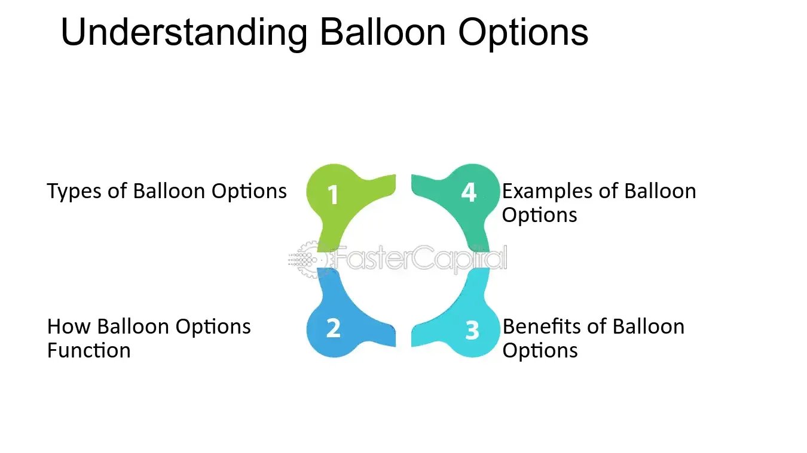

## Table of Contents

## What is a balloon option?

A balloon option is a type of loan where you pay small amounts for a while, but then you have to pay a big amount at the end. It's like blowing up a balloon slowly and then it gets really big at the end. People use balloon options for things like buying cars or houses because the small payments at the start make it easier to afford.

But, there's a risk with balloon options. If you can't pay the big amount at the end, you might have to find another loan or sell what you bought. It's important to think carefully before choosing a balloon option because the big payment at the end can be hard to handle if you're not ready for it.

## How does a balloon option work?

A balloon option is a loan where you pay small amounts for a while, but then you have to pay a big amount at the end. It's like having a small monthly bill for a few years, and then one day, you get a huge bill. People often use balloon options to buy things like cars or houses because the small payments at the start make it easier to afford the thing they want.

But, there's a risk with balloon options. If you can't pay the big amount at the end, you might have to find another loan or sell what you bought. It's important to think carefully before choosing a balloon option because the big payment at the end can be hard to handle if you're not ready for it. You need to plan ahead and make sure you can pay that big amount when it comes due.

## What are the key features of a balloon option?

A balloon option is a type of loan where you pay small amounts for a while, but at the end, you have to pay a big amount all at once. This big payment is called the balloon payment. People like balloon options because the small payments at the start make it easier to buy things like cars or houses without spending too much money right away.

But, balloon options can be risky. If you can't pay the big amount at the end, you might have to get another loan or sell what you bought. It's important to plan ahead and make sure you can pay that big amount when it's due. If you're not ready for it, a balloon option might not be the best choice for you.

## What are the benefits of using a balloon option?

A balloon option can be really helpful if you want to buy something big like a car or a house but you don't have a lot of money right now. With a balloon option, you can start with small payments that are easier to handle. This means you can get the thing you want without having to pay a lot of money all at once. It's like getting a little help to spread out the cost over time.

But, you need to be careful with a balloon option. At the end of the loan, you have to pay a big amount all at once. This big payment is called the balloon payment. If you plan well and save up for it, a balloon option can be a good choice. But if you're not ready for that big payment, it can be hard to handle. So, it's important to think ahead and make sure you can pay that big amount when it comes due.

## What are the potential risks associated with balloon options?

The biggest risk with a balloon option is the big payment at the end, called the balloon payment. If you can't pay this big amount when it's due, you might have to find another loan quickly or sell what you bought. This can be stressful and might put you in a tough spot if you're not ready for it. It's like having a small monthly bill for a while, but then suddenly getting a huge bill that you weren't expecting.

Another risk is that balloon options can be hard to understand. If you don't fully understand how they work, you might end up in a situation where you can't pay the big amount at the end. It's important to read all the details and ask questions so you know exactly what you're getting into. If you're not careful, you might find yourself in a financial mess because you didn't plan for the big payment at the end.

## How does the payoff structure of a balloon option differ from traditional options?

The payoff structure of a balloon option is different from traditional options because with a balloon option, you pay small amounts for a while and then a big amount at the end. It's like having a small monthly bill for a few years, but then one day you have to pay a huge bill. Traditional options, on the other hand, usually have you paying the same amount every month until the loan is paid off. There's no big surprise payment at the end.

This difference can be helpful if you need to buy something big but can't afford to pay a lot right away. The small payments at the start of a balloon option make it easier to get what you want without spending too much money upfront. But, you need to be careful because the big payment at the end can be hard to handle if you're not ready for it. With traditional options, you know exactly what you're paying each month and you don't have to worry about a big payment at the end.

## What are the common strategies for trading balloon options?

Trading balloon options can be a bit tricky, but some people use them to buy things like cars or houses without paying a lot of money right away. One common strategy is to plan ahead and save up for the big payment at the end. This means you need to know exactly when the balloon payment is due and make sure you have enough money saved up to cover it. If you can do this, a balloon option can be a good way to spread out the cost of something expensive over time.

Another strategy is to use a balloon option as a short-term solution. Some people might use it to buy a car or a house, and then plan to sell it before the big payment is due. This way, they can use the money from the sale to pay off the balloon payment. But, this can be risky because if you can't sell the thing you bought in time, you might still have to come up with the money for the big payment. It's important to think carefully and have a backup plan in case things don't go as expected.

## How do market conditions affect the pricing of balloon options?

Market conditions can really change how much a balloon option costs. When the economy is doing well and people feel good about spending money, the prices for balloon options might go up. This is because more people want to buy things like cars or houses, and they might choose balloon options to help them pay for it. On the other hand, if the economy is not doing so well and people are worried about money, the prices for balloon options might go down. Fewer people want to take on big payments at the end of a loan when times are tough.

Interest rates are also a big part of how market conditions affect balloon option prices. When interest rates are low, balloon options can be cheaper because it costs less for the lender to give out the loan. But when interest rates go up, the cost of the balloon option can go up too. This is because the lender needs to charge more to make up for the higher cost of borrowing money. So, keeping an eye on interest rates and the overall economy can help you understand why the price of a balloon option might change.

## What are the tax implications of trading balloon options?

When you trade balloon options, you need to think about taxes. If you make money from trading balloon options, you might have to pay capital gains tax. This is a tax on the profit you make when you sell something for more than you paid for it. The tax rate can be different depending on how long you held the option before selling it. If you held it for less than a year, it's usually taxed at a higher rate than if you held it for more than a year.

Also, if you use a balloon option to buy something like a car or a house, you might be able to deduct some of the interest you pay on the loan from your taxes. This can help lower the amount of taxes you owe. But, the rules about what you can deduct can be complicated and might change depending on where you live and the specific details of your loan. It's a good idea to talk to a tax professional to make sure you understand all the tax implications of trading balloon options.

## How can one hedge against the risks of balloon options?

One way to hedge against the risks of balloon options is to save money regularly so you can pay the big payment at the end. If you know when the balloon payment is due, you can set aside a little money each month to make sure you have enough when the time comes. This way, you won't be surprised by the big payment and you can handle it without stress. It's like putting money in a piggy bank for a special purpose, so you're ready when you need it.

Another way to hedge against the risks is to have a backup plan. You could plan to sell the thing you bought with the balloon option before the big payment is due. This way, you can use the money from the sale to pay off the balloon payment. But, this can be risky because if you can't sell it in time, you might still have to find the money for the big payment. It's important to think about what you'll do if your backup plan doesn't work out, so you're prepared for any situation.

## What advanced mathematical models are used to price balloon options?

To price balloon options, people often use a special kind of math called the Black-Scholes model. This model helps figure out how much an option should cost based on things like how long until it expires, how much the thing you're buying changes in price, and how much you have to pay for the big payment at the end. The Black-Scholes model is really good at predicting the price of options, but it can be a bit tricky to use because it involves a lot of math and you need to know a lot about the market.

Another model that's used is the Binomial model. This model breaks down the time until the balloon option expires into smaller pieces and looks at what might happen at each step. It's like playing a game where you guess what will happen next and see how it affects the price of the option. The Binomial model can be easier to understand than the Black-Scholes model because it's more like a step-by-step process, but it still needs a lot of information about the market and the thing you're buying. Both models help people make smarter choices about balloon options by giving them a better idea of what they might cost.

## How do regulatory frameworks impact the use of balloon options in different jurisdictions?

Regulatory frameworks can really change how people use balloon options in different places. In some countries, there are strict rules about balloon options because they can be risky. These rules might say that lenders have to tell people very clearly about the big payment at the end, or they might limit how much that big payment can be. This is to protect people from getting into financial trouble because they didn't understand the balloon option. In other places, the rules might be more relaxed, which can make it easier for people to use balloon options but also more risky if they're not careful.

In the United States, for example, the Consumer Financial Protection Bureau (CFPB) has rules to make sure people understand balloon options. They have to give clear information about the loan, including the big payment at the end. In Europe, the rules can be different from one country to another, but many have laws to protect consumers from unfair loans. These rules can affect how lenders offer balloon options and how much they cost. It's important for anyone thinking about using a balloon option to know the rules in their area so they can make a smart choice.

## What is a Balloon Option?

A balloon option is a type of exotic option characterized by a distinct feature where the strike price increases after the underlying asset reaches a predefined threshold. This unique structure allows balloon options to offer greater flexibility compared to traditional American and European options, making them particularly attractive for tailored investment strategies.

Balloon options are typically traded over-the-counter (OTC), a market known for its customization capabilities, as opposed to exchange-traded derivatives. This OTC nature enables these options to be designed to meet specific hedging requirements, particularly for volatile assets such as currencies. For example, a company with significant foreign exchange exposure may use balloon options to hedge against adverse currency fluctuations, adjusting the strike price as certain thresholds are met, thereby aligning the option's performance more closely with their risk management needs.

The potential of balloon options lies in their ability to increase leverage when certain asset price conditions are fulfilled. This feature can be mathematically defined. If $S$ is the price of the underlying asset, and $K_0$ is the initial strike price, the balloon option might increase to a new strike price $K_1$ when $S$ surpasses a predefined level $T$. This can be expressed as:

$$
K = 
\begin{cases} 
K_0, & \text{if } S < T \\
K_1, & \text{if } S \geq T 
\end{cases}
$$

This conditional structure allows investors to benefit from further amplifying potential returns once the underlying asset's price exceeds a certain point. Investors looking to maximize profits during volatile market conditions often find balloon options appealing because of this leverage amplification mechanism. However, this advantage comes with increased complexity and requires a nuanced understanding of market dynamics and option pricing.

## References & Further Reading

[1]: Alexander, C. (1999). ["Optimal Hedging Using Cointegration."](https://www.researchgate.net/publication/242031262_Optimal_hedging_using_cointegration) Philosophical Transactions of the Royal Society of London. Series A: Mathematical, Physical and Engineering Sciences.

[2]: Huynh, K., Kreinovich, V., & Sriboonchitta, S. (2016). ["Applications of Fuzzy Techniques: Advanced Information and Knowledge Processing."](https://www.springer.com/gp/book/9783319403436) Springer.

[3]: James, J. & Webber, N. (2000). ["Interest Rate Modelling."](https://archive.org/details/interestratemode0000jame) Wiley.

[4]: Pojarliev, M. & Levich, R. (2011). ["A New Look at Currency Investing."](https://rpc.cfainstitute.org/-/media/documents/book/rf-publication/2012/rf-v2012-n4-1-pdf.pdf) The Journal of Portfolio Management.

[5]: Taleb, N. (1997). ["Dynamic Hedging: Managing Vanilla and Exotic Options."](https://archive.org/details/dynamichedgingma0000tale) Wiley.