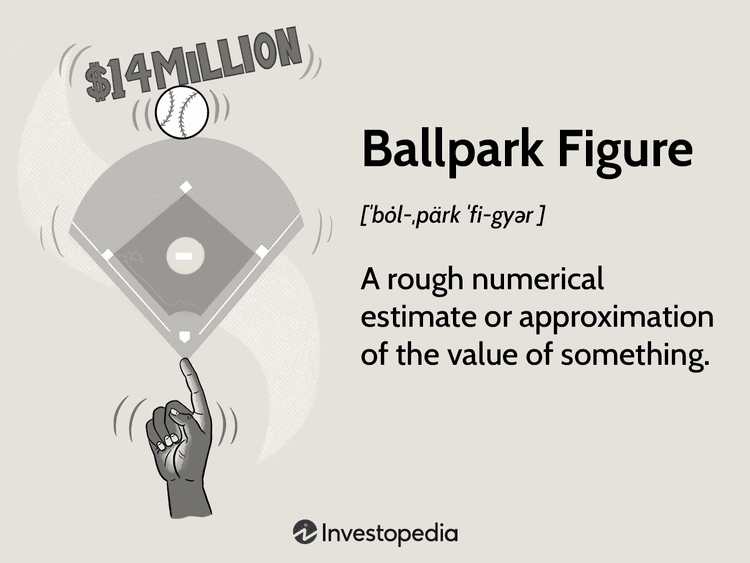

In the fast-paced world of algorithmic trading, precision and data-driven decisions are crucial. Algorithmic trading leverages computational techniques and extensive datasets to execute trades at speeds and accuracies unattainable by human traders alone. However, there are times when an exact figure isn't available or isn't necessary, and in such cases, traders rely on 'ballpark figures'. These estimates provide a general sense of value or scale, enabling traders to proceed with decision-making despite data limitations. 

Ballpark figures become an essential aspect of trading and financial strategies. They allow for flexible, yet informed, planning and can help to expedite decision-making processes in environments where time is of the essence. By applying ballpark figures effectively, traders can establish initial frameworks or expectations, which can then be refined as more precise data becomes available. This approach not only facilitates more agile responses to market changes but also supports the strategic planning necessary for executing successful algorithmic trades.

In utilizing ballpark figures, best practices are essential to ensure they contribute positively to a trading strategy. Recognizing their limitations and strengths ensures they serve as valuable tools in strategic planning, allowing for a balance between speed and accuracy. This article explores ballpark figures' role and how traders can effectively integrate them within their algorithmic trading processes for improved decision-making and strategy development.

## Table of Contents

## What is a Ballpark Figure?

A ballpark figure is a rough numerical estimate utilized as a placeholder when exact data is inaccessible. This approximation allows individuals or organizations to proceed with discussions or planning activities despite the lack of precise information. The concept of ballpark figures transcends various professional fields, offering utility in negotiations, budgeting, and project management by providing a general sense of scale or cost. 

In trading and financial markets, ballpark figures hold particular significance due to the dynamic nature of these industries. Uncertainty is inherent in trading, and often, precise data may not be immediately available for rapid decision-making or strategy evaluation. Ballpark figures help traders set initial frameworks or expectations. For example, when considering a new investment, a trader might use a ballpark figure to estimate potential returns based on historical performance or market conditions. Ballpark figures serve as temporary guideposts, offering a reference point to make preliminary decisions more swiftly and efficiently.

While these estimates are not meant to replace detailed analysis, they are instrumental in moving processes forward when time is of the essence or when data collection is ongoing. In essence, ballpark figures facilitate a pragmatic approach, enabling stakeholders to maintain [momentum](/wiki/momentum) in decision-making or negotiations despite the absence of detailed metrics.

## Importance of Ballpark Figures in Algorithmic Trading

In the landscape of [algorithmic trading](/wiki/algorithmic-trading), data integrity and precision are paramount. However, practitioners often encounter situations where precise figures are unavailable, yet decisions are still required. In these scenarios, ballpark figures serve as invaluable tools, offering a rough estimation that facilitates the decision-making process without demanding exhaustive data.

Ballpark figures are essential for framing discussions within algorithmic trading. These rough numerical estimates enable traders to set realistic initial expectations and parameters around which strategies can be structured. This is particularly important during the early stages of strategy development, where precise data might not be available, yet there is a tangible need to structure and define potential trading strategies.

Furthermore, the fast-paced nature of algorithmic trading demands quick decision-making. Time is often of the essence, and waiting for perfect data can result in missed opportunities. Ballpark figures allow for expedient decision-making by providing a rapid approximation of necessary data points. This speed is crucial in reacting to market conditions, where delays could lead to suboptimal executions or failure to act on profitable opportunities.

In essence, while algorithmic trading thrives on precision, the utility of ballpark figures lies in their ability to provide a starting point in uncertain situations. They enable traders to act swiftly and decisively in dynamic trading environments, ensuring that strategies remain adaptable and responsive to the ever-shifting market landscape. This capacity to facilitate initial assessments and spur action underscores the significance of ballpark figures as a strategic tool in algorithmic trading.

## Applications of Ballpark Figures in Algotrading

In the context of algorithmic trading, ballpark figures serve crucial functions at various stages of trade development. During strategy development, these estimates act as foundational elements that guide the formation of initial hypotheses and aid in the allocation of resources. By providing a generalized numerical basis, ballpark figures enable traders to conceptualize potential strategies under consideration and make informed decisions about which strategies warrant further exploration. This preliminary step is particularly vital given the limited time and computational resources often available in trading environments.

Within the framework of [backtesting](/wiki/backtesting), ballpark figures play a significant role in screening potential strategies and establishing performance benchmarks. Backtesting involves simulating a trading strategy on historical data to evaluate its effectiveness before applying it in live markets. By utilizing ballpark estimates, traders can efficiently filter out strategies that do not meet basic performance criteria. For example, a trader might use average historical returns as a ballpark figure to determine if a strategy's simulated returns are promising. This process helps ensure that resources are concentrated on strategies with the highest likelihood of success.

In the sphere of risk management, ballpark figures offer an initial assessment of potential risks associated with particular strategies. These estimates allow traders to gauge the possible [volatility](/wiki/volatility-trading-strategies) and exposure of a trading strategy without conducting an exhaustive risk analysis upfront. For instance, an algorithm might apply a ballpark figure derived from historical standard deviations to approximate the expected risk, supporting decision-making processes in determining appropriate hedge ratios or stop-loss levels. This preliminary risk insight is essential for maintaining risk at acceptable levels, especially before more precise risk evaluations can be performed.

Overall, the application of ballpark figures in algorithmic trading underscores their utility in the rapid and effective planning and evaluation of trading strategies, facilitating the initial stages of strategic development, backtesting, and risk management.

## Methods to Derive Ballpark Figures

Traders rely on several methods to derive ballpark figures, each carrying its own advantages and constraints. Historical averages stand out as a fundamental technique in estimating figures. This approach involves calculating the mean or median values from historical data to provide a baseline estimate. For instance, if a trader is attempting to estimate the average return of a stock, they might calculate the mean return over the past five years. This historical context helps provide an anchor point, assisting in framing expectations for future market behavior.

Comparable analysis serves as another critical method in deriving ballpark figures. This technique involves comparing the target entity with similar entities to infer values. In the context of algorithmic trading, this might involve comparing the performance metrics of similar trading strategies or financial instruments. For example, if a trader needs a ballpark figure for the expected volatility of a new financial instrument, they might look at similar instruments within the same sector to draw parallels.

The contribution of expert judgment and empirical rules of thumb is noteworthy in forming ballpark estimates. Experts in the financial markets leverage their experience to provide estimates where quantitative data might be sparse. These guidelines, though rooted in intuition and experience, often align closely with historical trends, creating a bridge between quantitative and qualitative insights.

While these methods prioritize simplicity, they inherently combine it with historical insights to deliver practical estimates. The effectiveness of these methods lies in their ability to provide traders with a useful estimate rapidly, ensuring quicker decision-making capabilities in fast-paced market conditions. Despite their approximative nature, when applied thoughtfully, they significantly enhance strategic planning and risk assessment endeavors.

## Limitations of Ballpark Figures

Ballpark figures, while useful for providing quick estimates in the absence of precise data, are inherently imprecise. This lack of precision is one of their primary limitations, and it is crucial for users to recognize this characteristic to avoid misapplication in algorithmic trading scenarios.

One of the significant risks associated with ballpark figures is the susceptibility to cognitive biases. Cognitive biases such as anchoring can distort decision-making processes when traders become overly reliant on these rough estimates. Anchoring occurs when individuals give disproportionate weight to an initial piece of information (the ballpark figure) when making subsequent judgments or decisions. In financial contexts, this could result in skewed assessments and suboptimal trading strategies.

Another limitation of ballpark figures is their inadequacy for critical decision-making. While they provide a useful starting point, they should not replace comprehensive and detailed analyses, especially in decisions requiring high precision or involving considerable financial stakes. Over-reliance on ballpark estimates can lead to underestimating risks or overlooking essential market factors, leading to potentially costly errors.

Recognizing the limitations of ballpark figures ensures they are applied correctly, serving their intended purpose purely as preliminary approximations. Employing them as definitive answers in complex trading environments can be detrimental; thus, they should be continuously revisited and refined as more detailed data becomes available. By maintaining awareness of these constraints, traders can better integrate ballpark figures with rigorous analyses to support effective decision-making.

## Best Practices for Using Ballpark Figures

When utilizing ballpark figures in algorithmic trading, it is essential to recognize their inherent nature as rough estimates. This understanding should be communicated clearly to all stakeholders to prevent misunderstandings and ensure informed decision-making processes. These figures serve as starting points in financial analysis, helping to shape initial strategies and expectations. However, their lack of precision necessitates caution and transparency.

One best practice is the regular updating of ballpark figures. As the trading environment evolves and new data becomes available, these figures must be revised to reflect current market conditions more accurately. This practice helps maintain their relevance and usefulness in strategic planning. For instance, traders might initially use historical averages to define a ballpark figure. As real-time data streams in, these estimates should be adjusted accordingly to ensure they remain a valuable tool in decision-making.

Incorporating ballpark figures alongside detailed analyses can significantly enhance the decision-making process. While ballpark estimates provide a high-level overview, detailed data analytics offer in-depth insights. By integrating both, traders can formulate strategies that are both broadly guided and intricately informed. For example, a trader might use a ballpark estimate to assess the potential return on an investment and then conduct a thorough risk analysis to refine their strategy.

In practice, this dual approach ensures that initial estimates do not lead to overconfidence or reliance on incomplete data. A prudent methodology involves beginning with a ballpark figure to spark discussions and direct preliminary resources, followed by comprehensive analysis to fine-tune the approach and confirm assumptions. This balanced strategy maximizes the efficiency and reliability of algorithmic trading operations.

## Conclusion

Ballpark figures serve as crucial tools in the early stages of financial decision-making, particularly in the context of algorithmic trading. These rough estimates offer a foundational understanding that aids traders in navigating the complexities of financial markets where exact numbers are not always critical or available. By accepting the inherent imprecision of ballpark figures, traders can act swiftly and decisively, which is vital in the fast-paced environment of algorithmic trading.

When employed thoughtfully, ballpark figures facilitate quicker decision-making by providing a useful starting point for strategic discussions and planning. This initial framework enables traders to allocate resources and test hypotheses efficiently. For instance, by using historical averages or basic empirical rules, traders can quickly gauge potential outcomes without the necessity for exhaustive initial data aggregation.

Furthermore, incorporating ballpark figures in a manner that complements detailed analytical processes enhances the robustness of trading strategies. They should be used not as final answers but as preliminary insights that inform deeper analysis. As more precise data becomes available, these initial estimates can be refined, ensuring that trading strategies are well-rounded and informed by a blend of quick assessments and comprehensive evaluations.

In summary, ballpark figures empower traders to maintain agility and responsiveness in their decision-making processes. Their prudent use, alongside rigorous analysis, ensures a balanced approach to crafting effective and strategic algorithmic trading plans.

## References & Further Reading

[1]: Bergstra, J., Bardenet, R., Bengio, Y., & Kégl, B. (2011). ["Algorithms for Hyper-Parameter Optimization."](https://dl.acm.org/doi/10.5555/2986459.2986743) Advances in Neural Information Processing Systems 24.

[2]: ["Advances in Financial Machine Learning"](https://www.amazon.com/Advances-Financial-Machine-Learning-Marcos/dp/1119482089) by Marcos Lopez de Prado

[3]: ["Evidence-Based Technical Analysis: Applying the Scientific Method and Statistical Inference to Trading Signals"](https://www.amazon.com/Evidence-Based-Technical-Analysis-Scientific-Statistical/dp/0470008741) by David Aronson

[4]: ["Machine Learning for Algorithmic Trading"](https://github.com/stefan-jansen/machine-learning-for-trading) by Stefan Jansen

[5]: ["Quantitative Trading: How to Build Your Own Algorithmic Trading Business"](https://www.amazon.com/Quantitative-Trading-Build-Algorithmic-Business/dp/1119800064) by Ernest P. Chan