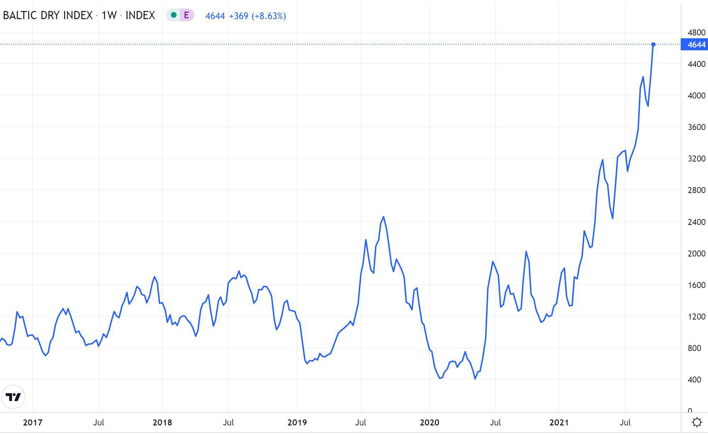

## Table of Contents

## What is the Baltic Dry Index (BDI)?

The Baltic Dry Index (BDI) is a number that tells us how much it costs to ship things like coal, iron ore, and grains across the world's oceans. It's important because it shows how healthy the global economy is. When the BDI goes up, it usually means more goods are being shipped, which can be a sign that the economy is doing well. When it goes down, it might mean fewer goods are being shipped, which could be a sign of economic trouble.

The BDI is calculated every day by the Baltic Exchange, which is a company in London. They ask ship brokers how much it would cost to rent different types of ships to carry goods on specific routes. Then, they use this information to figure out the average cost, which becomes the BDI. Because the BDI only looks at the cost of shipping dry bulk commodities, it's seen as a good, unbiased way to measure economic activity without being affected by things like oil prices or currency changes.

## How is the Baltic Dry Index calculated?

The Baltic Dry Index (BDI) is calculated every day by the Baltic Exchange in London. They ask ship brokers about the cost of renting different types of ships to carry goods on specific routes around the world. These routes are for dry bulk commodities like coal, iron ore, and grains. The brokers give their estimates, and the Baltic Exchange uses these to figure out the average cost of shipping these goods.

Once they have all the estimates, the Baltic Exchange puts them together to create the BDI. They use a special formula that takes into account the costs for different sizes of ships, like Capesize, Panamax, and Supramax. The final number, the BDI, shows the average cost of shipping these dry bulk commodities. This number changes every day based on the latest estimates from the ship brokers.

## What does the Baltic Dry Index measure?

The Baltic Dry Index (BDI) measures how much it costs to ship dry bulk commodities like coal, iron ore, and grains across the world's oceans. It's like a big number that tells us how much money shipping companies are charging to move these goods from one place to another. The BDI is calculated every day by the Baltic Exchange, which is a company in London. They ask ship brokers how much it would cost to rent different types of ships to [carry](/wiki/carry-trading) goods on specific routes, and then they use this information to figure out the average cost.

The BDI is important because it can show us how healthy the global economy is. When the BDI goes up, it usually means that more goods are being shipped, which can be a sign that the economy is doing well. When the BDI goes down, it might mean that fewer goods are being shipped, which could be a sign of economic trouble. Because the BDI only looks at the cost of shipping dry bulk commodities, it's seen as a good, unbiased way to measure economic activity without being affected by things like oil prices or currency changes.

## Why is the Baltic Dry Index important for global trade?

The Baltic Dry Index (BDI) is important for global trade because it tells us how much it costs to ship things like coal, iron ore, and grains all over the world. It's like a big number that shows us if shipping is getting more expensive or cheaper. When the BDI goes up, it means that shipping companies are charging more money to move goods, which can happen when more goods need to be shipped. This can be a sign that the global economy is doing well because more stuff is being bought and sold.

On the other hand, when the BDI goes down, it means that shipping is getting cheaper, which can happen when fewer goods need to be shipped. This can be a sign that the global economy is not doing so well because less stuff is being bought and sold. The BDI is a helpful tool for people who work in global trade because it gives them a quick way to understand what's happening in the world of shipping and how it might affect their business. It's like a thermometer for the health of the global economy.

## How does the Baltic Dry Index impact commodity prices?

The Baltic Dry Index (BDI) can affect commodity prices because it shows how much it costs to ship things like coal, iron ore, and grains around the world. When the BDI goes up, it means that shipping costs are getting more expensive. This can make the price of commodities go up too, because it costs more money to get them from one place to another. For example, if it costs more to ship coal from Australia to China, the price of coal in China might go up because the shipping cost is added to the price of the coal.

On the other hand, when the BDI goes down, it means that shipping costs are getting cheaper. This can help lower the price of commodities because it costs less money to ship them. If it's cheaper to ship iron ore from Brazil to Europe, the price of iron ore in Europe might go down because the lower shipping cost can be reflected in the final price of the commodity. So, the BDI is like a big number that can tell us if commodity prices might go up or down based on how much it costs to ship them around the world.

## What are the main factors that influence the Baltic Dry Index?

The Baltic Dry Index (BDI) is influenced by a few main things. One big thing is how much people want to buy and sell stuff like coal, iron ore, and grains. When more people want these things, more ships are needed to move them, and this can make shipping costs go up. Another thing that affects the BDI is how many ships are available to carry these goods. If there are a lot of ships, it might be cheaper to ship things because there's more competition among the ships. But if there aren't many ships, it can be more expensive because people have to pay more to use the ships that are available.

The weather can also play a part in the BDI. Bad weather can make it harder for ships to move goods, which can cause shipping costs to go up because it takes longer to get things from one place to another. Also, things like strikes or problems at ports can affect the BDI. If there are delays at ports, it can take longer to load and unload ships, which can make shipping costs go up too. All these things together help decide what the BDI number will be each day.

## Can the Baltic Dry Index predict economic trends?

The Baltic Dry Index (BDI) can give us clues about what might happen in the global economy. It shows how much it costs to ship things like coal, iron ore, and grains around the world. When the BDI goes up, it usually means that more goods are being shipped, which can be a sign that the economy is doing well. People might be buying and selling more stuff, so they need more ships to move it all. This can make people think that the economy will keep growing.

On the other hand, when the BDI goes down, it might mean that fewer goods are being shipped, which can be a sign that the economy is not doing so well. If people are buying and selling less stuff, they don't need as many ships to move it. This can make people think that the economy might slow down. But, the BDI is just one piece of the puzzle. It's helpful, but it's not perfect, and other things can affect the economy too.

## How does the Baltic Dry Index relate to shipping and logistics?

The Baltic Dry Index (BDI) is a big number that tells us how much it costs to ship things like coal, iron ore, and grains around the world. It's important for shipping and logistics because it shows how much money shipping companies are charging to move these goods. When the BDI goes up, it means that shipping costs are getting more expensive. This can happen when more goods need to be shipped, and there are not enough ships to carry everything. So, shipping companies can charge more money because people really need to move their stuff.

When the BDI goes down, it means that shipping costs are getting cheaper. This can happen when fewer goods need to be shipped, and there are more ships available than needed. So, shipping companies have to lower their prices to get people to use their ships. The BDI is like a big sign that tells people in shipping and logistics whether it's a good time to ship goods or if they should wait for prices to go down. It helps them make smart choices about when and how to move their stuff around the world.

## What historical events have significantly affected the Baltic Dry Index?

The Baltic Dry Index (BDI) has been affected by many big events in the past. One of the biggest was the global financial crisis in 2008. During this time, the BDI dropped a lot because fewer people were buying and selling things like coal and iron ore. This was because many businesses were struggling, and they didn't need to ship as much stuff. The BDI went from being very high to very low in just a few months, which showed how bad the economy was doing.

Another event that affected the BDI was the China slowdown in 2015. China is a big country that buys a lot of stuff like iron ore and coal, so when their economy slowed down, they didn't need to ship as much. This made the BDI go down because there were fewer ships needed to move goods. It was a big deal because China's economy is so important to the world, and when it slows down, it can affect shipping costs everywhere.

## How do investors and analysts use the Baltic Dry Index in their decision-making?

Investors and analysts use the Baltic Dry Index (BDI) to help them understand what's happening in the global economy. The BDI tells them how much it costs to ship things like coal, iron ore, and grains around the world. When the BDI goes up, it usually means that more goods are being shipped, which can be a sign that the economy is doing well. Investors might see this as a good time to buy stocks or other investments because they think the economy will keep growing. On the other hand, when the BDI goes down, it might mean that fewer goods are being shipped, which can be a sign that the economy is not doing so well. Analysts might use this information to be more careful with their investments, or even sell some of their stocks because they think the economy might slow down.

The BDI is also used by investors and analysts who are specifically interested in the shipping and logistics industry. They watch the BDI to see if shipping costs are going up or down, which can help them decide whether to invest in shipping companies. If the BDI is high, it might mean that shipping companies are making more money because they can charge more to move goods. This could be a good time to buy stocks in these companies. But if the BDI is low, it might mean that shipping companies are struggling because they have to charge less to move goods. In this case, investors might decide to wait or look for other investment opportunities.

## What are the limitations and criticisms of the Baltic Dry Index as an economic indicator?

The Baltic Dry Index (BDI) is not perfect and has some problems when people use it to understand the economy. One big problem is that it only looks at the cost of shipping dry bulk commodities like coal, iron ore, and grains. It doesn't tell us anything about other types of goods, like cars or electronics. So, if the economy is doing well because people are buying more of these other things, the BDI might not show it. Also, the BDI can be affected by things that don't have much to do with the economy, like bad weather or strikes at ports. These things can make shipping costs go up or down, even if the economy isn't changing.

Another criticism of the BDI is that it can be very up and down. It can change a lot from day to day, which makes it hard to use as a steady guide for the economy. Sometimes, the BDI might go up or down because of short-term changes in the shipping industry, not because of big changes in the economy. This can make it tricky for investors and analysts to use the BDI to make decisions. They have to be careful not to rely too much on the BDI alone and should look at other economic indicators too to get a fuller picture of what's happening.

## How has the Baltic Dry Index evolved over time, and what changes have been made to its methodology?

The Baltic Dry Index (BDI) has changed a lot since it started in 1985. At first, it was just a way for people in the shipping industry to know how much it cost to ship dry bulk commodities like coal, iron ore, and grains. Over time, more people started using the BDI to understand the global economy because it showed how much stuff was being shipped around the world. The BDI became really important during big events like the 2008 financial crisis, when it dropped a lot and showed how bad the economy was doing. Since then, the BDI has been watched closely by investors and analysts who want to know if the economy is growing or slowing down.

The way the BDI is calculated has also changed over time. In the beginning, the Baltic Exchange, which is the group that makes the BDI, used to ask ship brokers about the cost of renting different types of ships to carry goods on specific routes. They would then use this information to figure out the average cost, which became the BDI. But as the shipping industry grew and changed, the Baltic Exchange started to use more types of ships and routes to make the BDI more accurate. They also started to use a special formula that takes into account the costs for different sizes of ships, like Capesize, Panamax, and Supramax. These changes help make the BDI a better tool for understanding the global economy.

## References & Further Reading

[1]: Stopford, M. (2009). ["Maritime Economics"](https://www.taylorfrancis.com/books/mono/10.4324/9780203891742/maritime-economics-3e-martin-stopford). Routledge.

[2]: UNCTAD. (2020). ["Review of Maritime Transport 2020"](https://unctad.org/publication/review-maritime-transport-2020).

[3]: Wu, C., Schwabe, S., & Schroeder, W. (2020). ["Algorithmic Trading on the Commodity Markets."](https://virologyj.biomedcentral.com/articles/10.1186/s12985-024-02584-8) In 'Blockchain and Artificial Intelligence Technologies for Smart HealthCare.'

[4]: Alizadeh, A. H., & Nomikos, N. K. (2009). ["Shipping Derivatives and Risk Management."](https://link.springer.com/book/10.1057/9780230235809) Palgrave Macmillan.

[5]: Cornelius, P. (2009). ["The Baltic Dry Index: A Panacea for Market Timing?"](https://www.researchgate.net/publication/337584948_Oil_the_Baltic_Dry_index_market_illiquidity_and_business_cycles_evidence_from_net_oil-exportingoil-importing_countries) MPRA Paper No. 13571.