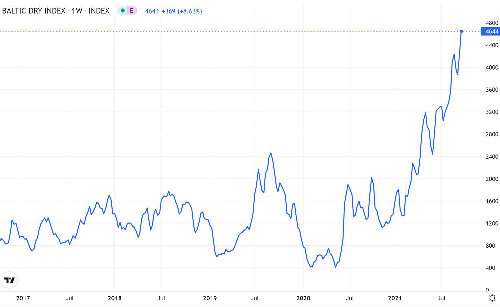

The shipping market has long been a cornerstone of global trade, enabling the movement of goods across international borders and oceans. This market is driven primarily by freight rates, which are influenced by a variety of factors, including demand, supply, and global economic conditions. Freight rates serve as critical indicators for the cost of transporting goods over sea, impacting the pricing and scheduling decisions within the global supply chain.

At the heart of the shipping market is the Baltic Exchange, a venerable institution based in London, which offers essential maritime shipping information. Established in 1744, the Baltic Exchange has become a reliable platform for setting benchmarks for freight rates, providing transparency and stability to the market. Its role is critical as it publishes major indices such as the Baltic Dry Index, which is used to assess the price of moving commodities like coal, iron ore, and grain across the globe.



In recent years, the landscape of freight trading has experienced significant changes due to the advent of algorithmic trading (algo trading). Algo trading involves the use of complex computer algorithms to manage trading activities. This approach is becoming increasingly prevalent in the shipping industry, where the ability to make rapid, data-driven decisions can lead to more accurate pricing and enhanced risk management strategies. Algorithmic trading introduces efficiencies by allowing market participants to process massive amounts of data for improved decision-making. However, it also presents challenges, such as issues of transparency and the need for regulatory oversight, as the rapid pace of technological advancement can sometimes outstrip existing regulatory frameworks.

The confluence of traditional institutions like the Baltic Exchange with modern technological innovations in algorithmic trading signifies a transformative phase in the shipping market. This evolution promises to enhance the efficiency and efficacy of freight trading, albeit with challenges that necessitate careful navigation by all stakeholders involved.

## Table of Contents

## Understanding the Baltic Exchange

The Baltic Exchange, established in 1744, has played a pivotal role in the global maritime shipping market by providing reliable and comprehensive maritime information. Initially functioning as a traditional marketplace where ship owners and merchants negotiated deals, it has transformed over the centuries into a leading institution for shipping market data and services. The Exchange's primary function is to facilitate the settlement of physical and derivative shipping contracts, thus ensuring market transparency and efficiency.

A significant aspect of the Baltic Exchange's offerings is its development and maintenance of various shipping indices, most notably the Baltic Dry Index (BDI). The BDI is a leading economic indicator that reflects the cost of transporting bulk raw materials such as coal, iron ore, and grain across the seas. It is comprised of several sub-indices, each representing different vessel sizes: Capesize, Panamax, Supramax, and Handysize. By tracking changes in the BDI, market participants gain insights into supply and demand dynamics within the bulk shipping sector.

The indices provided by the Baltic Exchange, like the BDI, serve as essential benchmarks for traders in both physical and derivative markets. These indices allow traders to assess market conditions, manage risks, and make informed decisions. The data collected and disseminated by the Baltic Exchange are widely used in constructing freight rate forecasts, crafting hedging strategies, and optimizing cargo logistics. These benchmarks offer transparency and a standardized metric for evaluating maritime trade, making the Baltic Exchange an indispensable institution in the shipping industry.

Moreover, the Exchange has embraced digital advancements to improve data accuracy and accessibility. Through collaborations with major technology providers, the Baltic Exchange has facilitated real-time data delivery, enhancing the decision-making capabilities of traders globally. This integration of technology underscores its commitment to maintaining its leadership in providing critical maritime information.

In conclusion, the Baltic Exchange stands as a cornerstone of the global shipping market. Its evolution from a historical marketplace to a provider of crucial shipping indices exemplifies its adaptability and enduring relevance. By offering transparent and standardized market data, the Exchange not only supports effective contract settlements but also empowers market participants to navigate the complexities of the maritime industry.

## The Role of Freight Rates in the Shipping Market

Freight rates are central to the shipping market, acting as the primary determinant of shipping costs and influencing various sectors, ranging from the global supply chain to retail pricing. These rates are the charges applied for the transportation of goods over a specified distance. They are calculated based on several key components, including the nature and [volume](/wiki/volume-trading-strategy) of the cargo, shipping route, and the type of vessel used.

A primary [factor](/wiki/factor-investing) affecting freight rates is fuel prices. Bunker fuel, the fuel used by ships, can account for a significant portion of operating costs. Fluctuations in oil prices, driven by geopolitical tensions or changes in supply and demand, can lead to corresponding changes in freight rates. For example, a rise in [crude oil](/wiki/crude-oil) prices typically results in increased freight rates as shipping companies pass on additional fuel costs to customers.

Shipping capacity, or the availability of vessels, also plays a crucial role in determining freight rates. When demand for shipping services exceeds available capacity, rates tend to rise due to heightened competition for space. Conversely, an oversupply of vessels can lead to lower rates as shipping companies are compelled to offer competitive pricing to secure cargo. This relationship between supply, demand, and price is analogous to basic economics, where:

$$
\text{Freight Rate} = \frac{\text{Demand for Shipping}}{\text{Supply of Shipping Capacity}}
$$

Regulatory changes can significantly impact freight rates as well. Stringent environmental regulations, such as the International Maritime Organization's (IMO) sulfur cap, which mandates a reduction in sulfur emissions from ships, have compelled shipping companies to invest in cleaner technologies or opt for more expensive low-sulfur fuel. These compliance costs often lead to higher freight rates. Additionally, changes in trade policies, tariffs, and international agreements can alter cargo flows and affect the cost of shipping.

The interaction of these factors creates a volatile environment where freight rates can experience rapid shifts. This [volatility](/wiki/volatility-trading-strategies) poses challenges and opportunities for businesses involved in international trade and logistics. Companies must develop strategies to manage these changes, such as employing hedging mechanisms or entering long-term contracts with shipping firms to stabilize transportation costs. Understanding the dynamics of freight rates is essential for stakeholders looking to navigate the complexities of the global shipping market effectively.

## Algorithmic Trading in the Shipping Market

Algorithmic trading, often referred to as algo trading, involves using computer algorithms to automate trading activities. In the shipping market, this approach is becoming more widespread due to its ability to enhance the efficiency of trading processes. By utilizing big data and predictive analytics, algorithms can process voluminous datasets much faster than human traders, thereby facilitating quicker decision-making and execution of trades. This speed can yield more competitive pricing and improved hedging strategies, vital for managing the volatile nature of freight rates.

The use of [algorithmic trading](/wiki/algorithmic-trading) in the shipping market allows traders and companies to efficiently manage risks associated with fluctuating freight rates. By leveraging mathematical models and statistical techniques, algo trading systems can identify patterns in market data, making predictions about future rate movements. For example, [machine learning](/wiki/machine-learning) algorithms can be trained on historical shipping data to forecast freight rate trends, helping traders anticipate price shifts and adjust their strategies accordingly.

A key advantage of algorithmic trading is its ability to execute trades based on pre-defined criteria without human intervention. This helps reduce transaction costs and minimize human error. Moreover, by executing trades at optimal times, algorithms can improve [liquidity](/wiki/liquidity-risk-premium) in the shipping markets, enabling smoother transactions and better market flows.

The implementation of algo trading also poses certain challenges. The reliance on data and complex models necessitates robust data management and high computational power. Additionally, the potential for systemic risk cannot be ignored, as algorithmic trading systems can react abruptly to market changes, exacerbating volatility.

In Python, for instance, traders might use libraries like pandas for data manipulation and scikit-learn for machine learning to develop and deploy trading algorithms. Here is a simplified example of how such a system might look when predicting freight rates using linear regression:

```python
import pandas as pd
from sklearn.model_selection import train_test_split
from sklearn.linear_model import LinearRegression
from sklearn.metrics import mean_squared_error

# Load historical shipping data
data = pd.read_csv('shipping_data.csv')

# Define features and target
features = data[['variable1', 'variable2', 'variable3']]  # Replace with actual feature names
target = data['freight_rate']

# Split data into training and testing sets
X_train, X_test, y_train, y_test = train_test_split(features, target, test_size=0.2, random_state=42)

# Train a linear regression model
model = LinearRegression()
model.fit(X_train, y_train)

# Predict using the model
predictions = model.predict(X_test)

# Evaluate the model
mse = mean_squared_error(y_test, predictions)
print(f"Mean Squared Error: {mse}")
```

In conclusion, while the adoption of algorithmic trading in the shipping market presents substantial benefits in terms of efficiency and risk management, it also requires comprehensive oversight to mitigate risks such as market manipulation and systemic instability. Ongoing advancements in data analytics and technology continue to enhance trading strategies, paving the way for a more sophisticated and dynamic shipping industry.

## The Interaction of the Baltic Exchange and Algo Trading

The Baltic Exchange is integral to the functioning of algorithmic trading within the shipping industry, primarily due to its provision of essential data services. These include indices like the Baltic Dry Index, which serve as critical benchmarks for assessing market conditions. Such data is indispensable for algorithmic trading systems, which rely on accurate, real-time information to execute trades effectively.

Algorithmic trading systems utilize advanced algorithms to process large volumes of data swiftly. These algorithms analyze patterns, historical data, and market conditions, such as those provided by the Baltic Exchange, to make informed trading decisions. By doing so, they enable faster and more efficient trading operations. The integration of Baltic Exchange-derived data into these algorithms is crucial for their accuracy and reliability in predicting freight rate movements and optimizing trade executions.

This interaction brings about significant efficiencies but also brings challenges, particularly regarding transparency and regulation. The automated nature of algorithmic trading can obscure the decision-making process, making it difficult for market participants to understand the rationale behind certain trades. This lack of transparency can lead to mistrust among stakeholders and poses a challenge to regulators, who need to ensure that market operations remain fair and open.

Regulation of algorithmic trading becomes imperative to mitigate risks such as market manipulation, where the automated execution of buy or sell orders may create artificial price movements. Ensuring these systems adhere to market rules while being transparent about their operations is a critical challenge that industry regulators must contend with.

Moreover, the Baltic Exchange and regulatory bodies must work collaboratively to establish standards that govern algorithmic trading practices. This includes developing protocols for data accuracy, timeliness, and the security of exchanged information to protect against fraud and ensure the reliability of market indicators. The synergy between the Baltic Exchange's data provisions and algorithmic trading's capabilities is set to transform the shipping freight market, but it requires careful regulation and transparency to avoid systemic risks.

## Benefits and Risks of Algorithmic Trading in Freight Markets

Algorithmic trading in the freight markets has become increasingly significant due to its potential benefits and inherent risks. By leveraging advanced computing technologies and sophisticated algorithms, traders can notably enhance the efficiency and effectiveness of their market strategies.

One primary advantage of algorithmic trading is the increased speed of trade execution. Automated systems can process data and execute trades in milliseconds, a task that would take significantly longer if performed manually. This rapid execution helps capitalize on fleeting market opportunities and mitigates the impact of market volatility. Additionally, the automation of trading strategies reduces human error, contributing to more precise and reliable trade execution.

Another benefit is the reduction of transaction costs. Algorithmic trading minimizes the costs associated with human intervention, such as fees for manual order processes and the potential costs of human error. Moreover, by leveraging predictive analytics and real-time data, traders can optimize their strategies to achieve better entry and [exit](/wiki/exit-strategy) points, further reducing transactional expenses.

Improved liquidity is another significant contribution of algorithmic trading to the freight markets. By ensuring that there are always orders being placed and executed, these automated systems enhance the overall liquidity of the market. Increased liquidity leads to tighter bid-ask spreads, benefiting all market participants by reducing the cost of trading.

However, algorithmic trading also introduces several risks. Market manipulation is a serious concern, as sophisticated algorithms can be used to create artificial market conditions, misleading other market participants and disrupting the natural supply-demand equilibrium. For instance, strategies like spoofing—where an algorithm places large orders with no intention of executing them—can distort market perception and falsely influence freight rates.

Moreover, there are systemic risks associated with the widespread adoption of algorithmic trading. The interconnectivity of trading platforms and the dependency on complex algorithms increase the vulnerability of markets to technical failures and cyber-attacks. A minor glitch or error in algorithm design can lead to significant financial losses, not just for individual participants but for the market as a whole.

To mitigate these risks, stringent monitoring and regulation are essential. Regulatory frameworks need to evolve alongside technological advancements to ensure fair and transparent trading practices. Implementing robust oversight mechanisms can help detect and prevent manipulative behaviors, while also safeguarding the market against systemic threats.

In conclusion, while the integration of algorithmic trading into the freight markets offers substantial benefits, it necessitates careful management and regulation to address its challenges. Balancing innovation with oversight will be crucial in harnessing the full potential of this technological advancement.

## Future Outlook for the Shipping Market with Algo Trading

The integration of algorithmic trading with the Baltic Exchange's established benchmarks is poised to enhance the shipping market's efficiency and dynamism. The Baltic Exchange, with its reliable and comprehensive indices, provides a strong foundation for market participants to engage in informed trading. These benchmarks are critical for algo traders who leverage them to develop sophisticated strategies based on real-time data analysis.

Algorithmic trading is becoming a vital component of the shipping market's future, offering potential for growth through advancements in technology. By utilizing machine learning and [artificial intelligence](/wiki/ai-artificial-intelligence), traders can create predictive models that anticipate market trends, optimize freight pricing, and execute transactions with greater precision.

However, this technological evolution is not without its challenges. Market regulation remains a critical issue, as the rapid pace of algorithmic trades can sometimes lead to discrepancies and market anomalies. Regulatory frameworks must evolve to address these challenges, ensuring transparency and fairness in trading activities. Additionally, the protection and security of data are paramount. As more trading activities become data-driven, robust cybersecurity measures are essential to safeguard sensitive information and maintain the integrity of the market.

Despite these challenges, the shipping market stands on the verge of significant transformation. The blend of established wisdom from the Baltic Exchange with cutting-edge algorithmic trading technologies signals a future where trading is faster, more efficient, and potentially more profitable. Stakeholders must continue to address these evolving dynamics, ensuring that the integration of technology and tradition supports a robust and innovative market environment.

## Conclusion

The shipping industry is undergoing a significant transformation with the integration of digital technologies, spearheaded by innovations such as algorithmic trading. This revolution is poised to redefine traditional operational paradigms, particularly by leveraging the long-established authority of institutions like the Baltic Exchange. The Exchange's provision of reliable benchmarks and extensive market data serves as a foundation on which new technological advancements can build.

As these digital tools become more entrenched in the industry, stakeholders are presented with both opportunities and challenges. The efficiencies brought by algorithmic trading, such as increased speed and improved data analytics, promise to enhance competitiveness and operational efficacy. However, they also introduce complexities related to market transparency, regulation, and cybersecurity, necessitating vigilant oversight.

Therefore, it becomes imperative for market participants and regulators to strategically adapt to these changes. This involves crafting policies that foster innovation while safeguarding market stability. Existing regulatory frameworks may require updates to effectively address the nuances of algorithm-driven trading environments.

In conclusion, the successful fusion of traditional maritime practices with cutting-edge technology hinges on a delicate balance. Stakeholders must engage in proactive dialogue and cooperation to ensure that the shipping market not only adapts to modern demands but thrives within them, sustaining long-term growth and stability.

## References & Further Reading

[1]: ["The Baltic Exchange: Its History, Development, and Membership"](https://www.balticexchange.com/en/who-we-are/history.html) by F.G.G. Bailey

[2]: Stopford, M. (2009). ["Maritime Economics"](https://www.taylorfrancis.com/books/mono/10.4324/9780203891742/maritime-economics-3e-martin-stopford). Routledge. 

[3]: Lopez de Prado, M. (2018). ["Advances in Financial Machine Learning"](https://www.amazon.com/Advances-Financial-Machine-Learning-Marcos/dp/1119482089). Wiley.

[4]: Narang, R. (2013). ["Inside the Black Box: A Simple Guide to Quantitative and High Frequency Trading"](https://onlinelibrary.wiley.com/doi/book/10.1002/9781118662717). Wiley.

[5]: "The Baltic Exchange and Shipsale.com: How indices are calculated." [Baltic Exchange](https://www.businesstimes.com.sg/companies-markets/transport-logistics/baltic-exchange-insights/baltic-exchange-shipping-116).