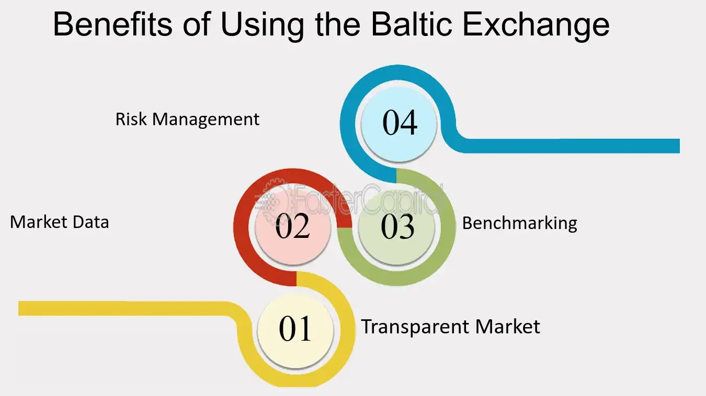

## Table of Contents

## What is the Baltic Exchange?

The Baltic Exchange is a place where people trade shipping and other maritime services. It started in 1744 in London, England. It's like a big marketplace where ship owners and people who need to move goods can make deals. They use something called the Baltic Dry Index to keep track of how much it costs to ship things around the world.

The Baltic Exchange is important because it helps set prices for shipping. When someone wants to move goods, they can look at the prices on the Baltic Exchange to see how much it might cost. This helps businesses plan and make decisions. The exchange also gives out information and news about the shipping industry, which helps everyone involved stay up to date.

## Where is the Baltic Exchange located?

The Baltic Exchange is located in London, England. It started in a coffee house in the city a long time ago, in 1744. Today, it is still in London, but it has moved to different places over the years.

The main office of the Baltic Exchange is now at 38 St Mary Axe, which is a big building in the heart of London's financial district. This location helps the exchange stay close to other important financial businesses and makes it easy for people to visit and do their trading.

## What is the history of the Baltic Exchange?

The Baltic Exchange started in 1744 in London, England. It began in a coffee house called the Virginia and Baltick, where merchants and ship owners met to trade. They talked about shipping goods across the seas, especially to and from the Baltic Sea. Over time, the exchange grew bigger and moved to different places in London. It became a very important place for the shipping industry, helping set prices for shipping services.

In the 20th century, the Baltic Exchange kept growing. It moved to a big building on St Mary Axe in 1903. This building was sadly damaged by a bomb in 1992, but the exchange continued its work. In 2006, the Baltic Exchange joined with a company called SGX, which helped it reach more people around the world. Today, the Baltic Exchange is still in London and helps people trade shipping services. It uses the Baltic Dry Index to show how much it costs to ship things, which is very useful for businesses.

## What types of commodities are traded on the Baltic Exchange?

The Baltic Exchange focuses on trading shipping services, not the actual commodities themselves. Instead, it deals with the costs and arrangements for moving goods by sea. This means that the exchange is more about the transportation of various commodities rather than trading the commodities directly. The main thing people look at on the Baltic Exchange is how much it costs to ship things, which is shown by the Baltic Dry Index.

The commodities that are typically moved using the services traded on the Baltic Exchange include coal, iron ore, grains, and other bulk goods. These are heavy and need big ships to move them. By using the Baltic Exchange, people who own these goods can find out how much it will cost to ship them from one place to another. This helps them plan their business and make decisions about buying and selling.

## How does the Baltic Exchange function as a marketplace?

The Baltic Exchange works like a big marketplace where people who own ships and people who need to move goods can meet and make deals. It's all about shipping services, not the actual things being shipped. People come to the Baltic Exchange to find out how much it will cost to move their goods from one place to another. They use something called the Baltic Dry Index to see these costs. This index helps everyone know the current prices for shipping, which is really important for planning and making business decisions.

The exchange started a long time ago in a coffee house in London, and it has grown a lot since then. Today, it's still in London, but it's part of a bigger company called SGX. People from all over the world use the Baltic Exchange to find the best deals for shipping their goods. They can talk to each other, share information, and agree on prices. This helps make sure that goods can be moved efficiently and at the right cost, which is good for everyone involved in the shipping business.

## What are the main indices provided by the Baltic Exchange?

The Baltic Exchange provides several important indices that help people understand the costs of shipping goods by sea. The most well-known index is the Baltic Dry Index (BDI). The BDI shows the average cost of shipping dry bulk commodities like coal, iron ore, and grains. It's a very important tool because it gives a quick snapshot of how much it costs to move these heavy goods around the world. When the BDI goes up, it means shipping costs are higher, and when it goes down, shipping costs are lower.

Another key index is the Baltic Capesize Index (BCI). This index focuses on the costs of shipping using the biggest ships, called Capesize vessels. These ships are used for moving very large amounts of dry bulk commodities. The BCI helps people who use these big ships to know how much it will cost to move their goods. There are also other indices like the Baltic Panamax Index (BPI) and the Baltic Supramax Index (BSI), which look at the costs for different sizes of ships. All these indices together give a full picture of the shipping market, helping businesses plan and make decisions.

## How are the Baltic Exchange indices calculated?

The Baltic Exchange calculates its indices by collecting data from a group of people called panelists. These panelists are experts who work in the shipping industry. They give information about the costs of shipping different types of goods on different routes every day. The Baltic Exchange uses this information to figure out the average cost of shipping. For example, the Baltic Dry Index (BDI) is calculated by looking at the costs of shipping dry bulk commodities like coal, iron ore, and grains on several important routes around the world.

Each index, like the Baltic Capesize Index (BCI) or the Baltic Panamax Index (BPI), focuses on a specific type of ship or route. The BCI looks at the costs for the biggest ships called Capesize vessels, while the BPI looks at costs for Panamax ships. The Baltic Exchange adds up all the costs given by the panelists and then divides them to find the average. This average is what becomes the index number for that day. By doing this every day, the Baltic Exchange can show how shipping costs change over time, helping businesses plan their shipping needs.

## What role does the Baltic Exchange play in the global shipping industry?

The Baltic Exchange is really important in the global shipping industry because it helps set prices for moving goods by sea. It's like a big meeting place where people who own ships and people who need to ship things can find each other and make deals. They use the Baltic Exchange to find out how much it will cost to ship heavy stuff like coal, iron ore, and grains. This helps businesses plan their shipping and make smart decisions about buying and selling goods.

The exchange gives out important information every day through its indices, like the Baltic Dry Index. This index tells everyone the average cost of shipping dry bulk commodities around the world. When this number goes up or down, it shows if shipping costs are getting more expensive or cheaper. This information is used by lots of people in the shipping industry to understand the market and make plans. The Baltic Exchange has been doing this for a long time, starting back in 1744, and it's still a key part of the shipping world today.

## How does the Baltic Exchange impact freight rates and shipping costs?

The Baltic Exchange has a big impact on freight rates and shipping costs. It's like a big scoreboard that shows how much it costs to ship things around the world. The main tool they use is called the Baltic Dry Index (BDI). This index tells everyone the average cost of shipping dry bulk stuff like coal, iron ore, and grains. When the BDI goes up, it means shipping costs are getting more expensive. When it goes down, shipping costs are getting cheaper. This helps people who need to ship things know how much they might have to pay.

Lots of businesses look at the Baltic Exchange to help them make decisions. If the BDI is high, a company might decide to wait a bit before shipping their goods, hoping the costs will go down. If it's low, they might ship right away to save money. The Baltic Exchange also has other indices like the Baltic Capesize Index and the Baltic Panamax Index, which focus on different types of ships. All these numbers together give a clear picture of what's happening in the shipping world. This helps everyone from ship owners to people who need to move goods plan better and keep costs under control.

## What are the differences between the Baltic Exchange and other commodity exchanges?

The Baltic Exchange is different from other commodity exchanges because it focuses on shipping services instead of trading the actual commodities. While places like the Chicago Mercantile Exchange or the New York Mercantile Exchange trade things like wheat, oil, or gold, the Baltic Exchange is all about the cost of moving those goods from one place to another. It's like a big meeting place where people who own ships and people who need to ship things can find each other and agree on prices for shipping.

Another big difference is how the Baltic Exchange works. It uses indices like the Baltic Dry Index to show how much it costs to ship dry bulk goods. These indices are calculated every day using information from experts in the shipping industry. Other commodity exchanges might use futures contracts, where people agree to buy or sell a commodity at a set price in the future. The Baltic Exchange doesn't do that. Instead, it helps people understand current shipping costs, which they can use to plan their business and make decisions about when to ship their goods.

## How can one invest in or use data from the Baltic Exchange?

You can't directly invest in the Baltic Exchange like you would with stocks or commodities. Instead, you can use the information from the Baltic Exchange to make smart decisions about shipping. The Baltic Exchange gives out daily numbers called indices, like the Baltic Dry Index, which show how much it costs to ship things. If you're a business that needs to move goods, you can look at these numbers to decide when it's a good time to ship. If the index is low, it might be cheaper to ship right away. If it's high, you might want to wait until costs go down.

Investors can also use the data from the Baltic Exchange to understand what's happening in the shipping industry. For example, if the Baltic Dry Index is going up, it might mean that more goods are being shipped and the economy is doing well. Some investors might use this information to make decisions about buying or selling stocks in shipping companies. There are also special funds, called shipping ETFs, that track the performance of shipping companies. By watching the Baltic Exchange's indices, investors can get a sense of whether these funds might be a good investment.

## What are the future trends and developments expected for the Baltic Exchange?

The Baltic Exchange is likely to keep growing and changing to meet the needs of the shipping industry. One big trend is the use of technology. The exchange might use more digital tools to make trading easier and faster. This could mean better ways to share information and make deals online. Another trend is focusing on sustainability. As the world tries to be more eco-friendly, the Baltic Exchange might start looking at how to make shipping greener. This could include new indices that show the environmental impact of shipping, helping businesses choose more sustainable options.

Another important development could be expanding the types of services the Baltic Exchange offers. Right now, it mainly deals with dry bulk shipping, but it might start including more types of shipping, like containers or liquid bulk. This would give a fuller picture of the shipping market and help more people use the exchange. Also, as global trade keeps growing, the Baltic Exchange might work more with other exchanges around the world. This could help create a more connected and efficient global shipping network, making it easier for businesses to move goods anywhere they need to go.

## What is the Role of Freight Rates in the Shipping Market?

Freight rates are central to the shipping market, acting as the primary determinant of shipping costs and influencing various sectors, ranging from the global supply chain to retail pricing. These rates are the charges applied for the transportation of goods over a specified distance. They are calculated based on several key components, including the nature and [volume](/wiki/volume-trading-strategy) of the cargo, shipping route, and the type of vessel used.

A primary [factor](/wiki/factor-investing) affecting freight rates is fuel prices. Bunker fuel, the fuel used by ships, can account for a significant portion of operating costs. Fluctuations in oil prices, driven by geopolitical tensions or changes in supply and demand, can lead to corresponding changes in freight rates. For example, a rise in [crude oil](/wiki/crude-oil) prices typically results in increased freight rates as shipping companies pass on additional fuel costs to customers.

Shipping capacity, or the availability of vessels, also plays a crucial role in determining freight rates. When demand for shipping services exceeds available capacity, rates tend to rise due to heightened competition for space. Conversely, an oversupply of vessels can lead to lower rates as shipping companies are compelled to offer competitive pricing to secure cargo. This relationship between supply, demand, and price is analogous to basic economics, where:

$$
\text{Freight Rate} = \frac{\text{Demand for Shipping}}{\text{Supply of Shipping Capacity}}
$$

Regulatory changes can significantly impact freight rates as well. Stringent environmental regulations, such as the International Maritime Organization's (IMO) sulfur cap, which mandates a reduction in sulfur emissions from ships, have compelled shipping companies to invest in cleaner technologies or opt for more expensive low-sulfur fuel. These compliance costs often lead to higher freight rates. Additionally, changes in trade policies, tariffs, and international agreements can alter cargo flows and affect the cost of shipping.

The interaction of these factors creates a volatile environment where freight rates can experience rapid shifts. This [volatility](/wiki/volatility-trading-strategies) poses challenges and opportunities for businesses involved in international trade and logistics. Companies must develop strategies to manage these changes, such as employing hedging mechanisms or entering long-term contracts with shipping firms to stabilize transportation costs. Understanding the dynamics of freight rates is essential for stakeholders looking to navigate the complexities of the global shipping market effectively.

## References & Further Reading

[1]: ["The Baltic Exchange: Its History, Development, and Membership"](https://www.balticexchange.com/en/who-we-are/history.html) by F.G.G. Bailey

[2]: Stopford, M. (2009). ["Maritime Economics"](https://www.taylorfrancis.com/books/mono/10.4324/9780203891742/maritime-economics-3e-martin-stopford). Routledge. 

[3]: Lopez de Prado, M. (2018). ["Advances in Financial Machine Learning"](https://www.amazon.com/Advances-Financial-Machine-Learning-Marcos/dp/1119482089). Wiley.

[4]: Narang, R. (2013). ["Inside the Black Box: A Simple Guide to Quantitative and High Frequency Trading"](https://onlinelibrary.wiley.com/doi/book/10.1002/9781118662717). Wiley.

[5]: "The Baltic Exchange and Shipsale.com: How indices are calculated." [Baltic Exchange](https://www.businesstimes.com.sg/companies-markets/transport-logistics/baltic-exchange-insights/baltic-exchange-shipping-116).