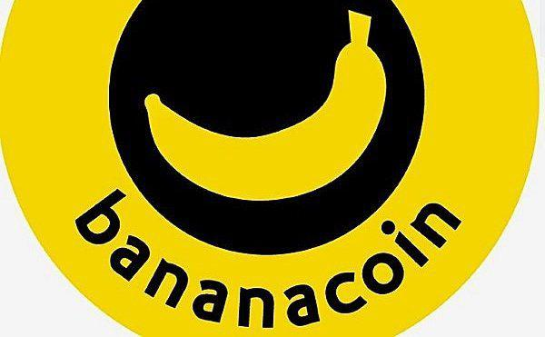

Blockchain technology has rapidly transformed the financial sector, primarily through the emergence of cryptocurrencies. Cryptocurrencies are digital or virtual currencies that utilize cryptography for security, enabling decentralized transactions that are verified by a network of nodes through blockchain. This technology facilitates transparency, security, and efficiency, reducing the need for intermediaries in financial transactions. Since the introduction of Bitcoin in 2009, the market has witnessed an exponential growth in the number of cryptocurrencies, heralding a new era in digital finance.

Among the various cryptocurrencies emerging in this dynamic landscape, Bananacoin represents a unique proposition. Unlike its counterparts, Bananacoin is designed with a distinctive value proposition: it is backed by the value of organic bananas cultivated using environmentally sustainable practices. This backing establishes Bananacoin as an intriguing option for investors interested in an ecologically conscious cryptocurrency. Its market position is enhanced by leveraging the blockchain to assert transparency and tractability in both the cryptocurrency and the agricultural sectors.

Alongside the evolution of cryptocurrencies, algorithmic trading has gained momentum as a transformative trend in financial markets, including cryptocurrency exchanges. Algorithmic trading involves using complex algorithms to execute trades based on pre-defined criteria, such as timing, price, and volume. It offers advantages like speed, accuracy, and the ability to handle large trading volumes without human intervention, eliminating emotional biases from trading decisions. This approach is particularly valuable in the volatile and fast-paced cryptocurrency markets.

This article aims to explore the unique place Bananacoin occupies within the cryptocurrency domain, the technological backbone supporting it, and the influence of algorithmic trading on its market dynamics. By understanding these elements, we can better appreciate the future potential and challenges facing Bananacoin and similar digital assets.

## Table of Contents

## Understanding Bananacoin: A Unique Cryptocurrency

Bananacoin is a cryptocurrency that uniquely combines blockchain technology with agricultural finance. Developed to address the financial needs of banana plantation projects in Laos, Bananacoin aims to create a transparent and efficient system for funding agricultural initiatives. Bananacoin was launched in late 2017 by a team of entrepreneurs who sought to leverage the popularity of cryptocurrencies to draw investment into the production of organically grown bananas.

The underlying technology of Bananacoin is based on Ethereum blockchain, which allows it to utilize smart contracts for operational efficiency and transactional reliability. These smart contracts ensure secure and automated execution of agreements without the need for intermediaries, ensuring transparency and reducing operational costs. By integrating these contracts, Bananacoin facilitates direct interaction between investors and the banana plantation operations, enhancing the traceability of funds and project progress.

Market-wise, Bananacoin establishes itself as a niche player compared to conventional cryptocurrencies like Bitcoin and Ethereum. Its value proposition lies in backing each Bananacoin token by 1 kilogram of bananas, creating a tangible link between the [cryptocurrency](/wiki/cryptocurrency) and a physical asset. This backing introduces an element of stability compared to more volatile cryptocurrencies that lack intrinsic asset value. Furthermore, its focus on sustainable agriculture appeals to environmentally conscious investors, differentiating Bananacoin in a market dominated by decentralized finance applications and speculative trading.

Investing in Bananacoin offers several potential benefits. Firstly, it provides an opportunity for diversification within the digital asset portfolio by tying investment to an agricultural commodity. Secondly, Bananacoin supports sustainable agricultural practices, which can attract stakeholders interested in ethical and socially responsible investments. Lastly, the potential appreciation of the cryptocurrency is tied to the increasing global demand for organic products, offering a unique growth vector beyond conventional cryptocurrencies.

Overall, Bananacoin represents innovation within the cryptocurrency space, extending its utility beyond traditional financial transactions to include agricultural finance and sustainability. Its distinct market position and value proposition offer compelling reasons for investors to consider its potential as a component of a diversified and forward-thinking investment portfolio.

## Blockchain Technology Behind Bananacoin

Blockchain technology is foundational to the functioning of cryptocurrencies, including Bananacoin. At its core, blockchain is a distributed ledger system that provides a secure, transparent, and immutable record of transactions. This distributed nature ensures that no single entity has control, promoting decentralization—a fundamental principle in the cryptocurrency world.

Bananacoin, like many cryptocurrencies, leverages blockchain to ensure the integrity and security of its transactions. Each Bananacoin transaction is broadcast to a network of nodes, where it undergoes verification through consensus algorithms before being added to the blockchain as a new block. This process, often based on technologies like Proof of Work (PoW) or Proof of Stake (PoS), ensures that only legitimate transactions are recorded, providing security against fraud and double-spending.

Security and transparency in Bananacoin are further enhanced via cryptographic techniques. Public-key cryptography allows users to own Bananacoin securely: each user has a public key for receiving tokens and a private key for signing transactions. The transparency is achieved through a publicly accessible ledger where all transactions can be viewed, though only pseudonymous addresses are exposed rather than personal identities.

Scalability and efficiency are crucial for any blockchain, and Bananacoin aims to address these through various innovative approaches. Bananacoin's blockchain may employ mechanisms such as sharding or layer-two solutions like state channels to increase transaction throughput and lower fees. Sharding divides the blockchain into smaller parts, allowing parallel processing of transactions, while state channels keep transactions off the primary blockchain, reducing congestion and enhancing speed.

Smart contracts are a vital component of the Ethereum blockchain, on which Bananacoin might be based. These are self-executing contracts with terms directly written into code, enabling automated and secure execution of contractual agreements without intermediaries. For Bananacoin, smart contracts can manage processes like token sales, dividend distributions, and more, increasing functionality and reducing the need for trust between parties.

Overall, Bananacoin's implementation of blockchain technology enhances its robustness as a cryptocurrency. By ensuring secure, scalable, and transparent transactions while leveraging smart contracts, Bananacoin not only upholds fundamental blockchain tenets but also augments its utility and attractiveness to investors and users alike.

## The Role of Algorithmic Trading in Cryptocurrency Markets

Algorithmic trading, often referred to as algo trading, is a method of executing orders using automated and pre-programmed trading instructions to account for variables such as time, price, and [volume](/wiki/volume-trading-strategy). In the context of cryptocurrency, [algorithmic trading](/wiki/algorithmic-trading) is rapidly gaining popularity due to its ability to handle the volatile and fast-moving digital asset markets with precision and speed. This form of trading leverages algorithms and statistical models to make trading decisions, often eliminating the human element from the process.

The primary benefits of algorithmic trading in the cryptocurrency market include enhanced speed and precision. Algorithms can process a vast amount of data and execute thousands of trades in milliseconds, a speed unattainable by humans. This capability allows for the exploitation of even minuscule price discrepancies between exchanges, known as [arbitrage](/wiki/arbitrage) opportunities. Moreover, algorithms operate with precision, following their coded instructions without deviation, ensuring that trade executions are consistent with defined strategies.

Another significant advantage of algorithmic trading is the reduction of emotional trading decisions. Human traders are often influenced by emotions such as fear and greed, which can lead to irrational decision-making and suboptimal trading outcomes. Algo trading removes these emotions from the equation, as trades are executed based on objective criteria and statistical data rather than gut feelings.

For seasoned investors, algorithmic trading offers a method to optimize portfolio management by efficiently balancing and rebalancing their cryptocurrency holdings according to predefined rules. Similarly, for new entrants in the cryptocurrency market, algorithms provide an accessible entry point, allowing them to participate without needing extensive market knowledge or experience.

However, despite its advantages, algorithmic trading in cryptocurrency markets also presents several challenges and risks. The high [volatility](/wiki/volatility-trading-strategies) of cryptocurrencies can lead to significant price swings in short periods, which, if not anticipated by the algorithm, could result in substantial losses. Furthermore, technical glitches or errors in algorithms can also lead to incorrect trades. Ensuring the reliability and accuracy of these trading systems is crucial to minimizing such risks.

Another notable risk is the potential for increased market fragmentation and competition. As more traders adopt algorithmic trading, the competitive landscape becomes more complex, requiring continuous refinement and innovation in trading strategies to maintain an edge. Additionally, adverse events, such as market crashes or sudden regulatory changes, can pose unforeseen risks to algorithmic traders, necessitating contingency measures within their trading strategies.

Overall, algorithmic trading is becoming an indispensable element of cryptocurrency markets, driven by its ability to operate with speed, precision, and emotionless objectivity. While it provides unique opportunities for both experienced and novice traders, understanding the accompanying risks is essential for leveraging its full potential in the ever-evolving landscape of digital assets.

## How Bananacoin Benefits from Algorithmic Trading

Bananacoin benefits from algorithmic trading primarily through the enhancement of efficiency, precision, and decision-making in trading activities. The application of algorithmic trading to Bananacoin involves the use of pre-programmed instructions or algorithms to execute trades based on a wide array of market variables, thereby optimizing returns and reducing human error. 

Algorithmic trading strategies for Bananacoin typically include trend-following strategies, arbitrage opportunities, and market-making. Trend-following strategies analyze historical price data and volumes to predict future price movements, enabling traders to capitalize on upward or downward trends. Arbitrage strategies exploit price discrepancies of Bananacoin across different exchanges, purchasing the coin on a platform where it is undervalued and selling it on another where it is overvalued. Market-making involves placing concurrent buy and sell orders to profit from bid-ask spread differences.

Certain case studies highlight successful implementations of algorithmic trading in the Bananacoin market. For example, a medium-sized trading firm could deploy a trend-following strategy using Python-coded algorithms that react to certain market conditions, such as moving averages or trade volumes. The algorithm might identify when Bananacoin is experiencing a [breakout](/wiki/breakout-trading) and execute buy orders before a significant upward movement in price, later selling when the market shows signs of reversal. Such strategies can yield substantial returns by leveraging speed and statistical analysis that far surpass human capabilities.

Several tools and platforms support algorithmic trading for Bananacoin. Platforms like MetaTrader and TradingView allow the [backtesting](/wiki/backtesting) of strategies using historical data, while cryptocurrency exchanges such as Binance provide APIs for executing automated trades. Additionally, toolkits in Python, such as NumPy for numerical calculations and Pandas for data manipulation, are commonly used to develop and refine trading algorithms tailored to specific market conditions associated with Bananacoin.

In conclusion, by embracing algorithmic trading, Bananacoin traders can benefit from more strategic, data-driven approaches that minimize emotional trading and maximize efficiency and potential profits. As more investors recognize these advantages, the integration of algorithmic trading in Bananacoin transactions will likely continue to grow.

## Future Prospects of Bananacoin in the Cryptocurrency Space

Predictions for the future of Bananacoin in the cryptocurrency market are contingent on current market trends, technological advancements, and socio-economic factors. As a digital asset centered around a real-world commodity—an organic banana plantation—Bananacoin presents a novel intersection of cryptocurrency and agricultural finance. The global push towards sustainable practices and environmentally conscious investments could potentially bolster the attractiveness of Bananacoin, as consumers and investors increasingly favor assets linked to sustainable causes. Consequently, the demand for Bananacoins might rise, positively impacting its valuation.

Regulatory changes have an inherent influence on cryptocurrencies, shaping their development and usability. Bananacoin, like other digital currencies, might be impacted by impending regulations aimed at increasing transparency, consumer protection, and market stability. For example, the enforcement of anti-money laundering (AML) and know-your-customer (KYC) procedures could affect how Bananacoin is traded. Moreover, regulatory frameworks that specifically address crypto assets tied to real-world goods might emerge, providing both opportunities and challenges for Bananacoin. Positive regulatory recognition can lead to increased investor confidence, while stringent controls might pose operational hurdles.

From a technological standpoint, Bananacoin has substantial opportunities for innovation and expansion. Integrating cutting-edge blockchain solutions could enhance transaction speeds, transparency, and security. The implementation of advanced smart contract functionalities could allow for more sophisticated financial products or services linked to Bananacoin, such as automated dividend distributions based on banana harvest yields. Moreover, scalable blockchain infrastructure can accommodate an increasing number of users and transactions, ensuring Bananacoin remains competitive as the crypto landscape evolves.

The community and investor sentiment play a crucial role in shaping the trajectory of Bananacoin. A supportive community that actively participates in governance, development initiatives, and marketing efforts can significantly elevate Bananacoin's standing in the market. Positive sentiment, coupled with strategic partnerships and collaborative projects, can lead to wider adoption and integration of Bananacoin into mainstream financial systems. Conversely, negative sentiment stemming from unmet expectations, security breaches, or market volatility can hinder its growth prospects.

In conclusion, the future prospects of Bananacoin are influenced by a confluence of market trends, regulatory changes, technological advancements, and community engagement. Its unique value proposition tied to sustainable agriculture positions it favorably among eco-conscious investors. However, navigating regulatory landscapes and fostering positive investor sentiment will be key in ensuring its longevity and success in the cryptocurrency space.

## Conclusion

Bananacoin represents a distinctive cryptocurrency that capitalizes on both blockchain technology and algorithmic trading. Throughout the article, we explored the unique qualities of Bananacoin, from its origins and market niche to the technological underpinnings that support its function. The blockchain infrastructure provides a secure and transparent method for recording and validating transactions, ensuring that Bananacoin remains a robust participant in the cryptocurrency market. Additionally, the integration of smart contracts within its system enhances its utility and potential applications.

Algorithmic trading plays a significant role in optimizing the trading of Bananacoin by offering benefits such as increased speed and precision while reducing emotional decision-making that can lead to suboptimal trades. Yet, navigating the volatility of the cryptocurrency market remains a challenge, necessitating careful strategy and risk management.

The potential advantages of Bananacoin include innovative technological solutions and active engagement within the crypto community. However, challenges such as market volatility and regulatory uncertainties need to be carefully evaluated. Looking forward, Bananacoin may continue to evolve, benefiting from market innovations and increased community involvement.

Assessing Bananacoin as a digital asset, it shows potential as a lucrative investment. However, like all cryptocurrencies, it involves risks. Due diligence and strategic thinking are crucial for prospective investors. We encourage readers to explore further into the nuanced landscape of cryptocurrencies, analyzing market dynamics, technological advancements, and regulatory environments to make informed investment decisions.

## References & Further Reading

[1]: Bergstra, J., Bardenet, R., Bengio, Y., & Kégl, B. (2011). ["Algorithms for Hyper-Parameter Optimization."](https://papers.nips.cc/paper/4443-algorithms-for-hyper-parameter-optimization) Advances in Neural Information Processing Systems 24.

[2]: ["Advances in Financial Machine Learning"](https://www.amazon.com/Advances-Financial-Machine-Learning-Marcos/dp/1119482089) by Marcos Lopez de Prado

[3]: ["Evidence-Based Technical Analysis: Applying the Scientific Method and Statistical Inference to Trading Signals"](https://www.wiley.com/en-us/Evidence+Based+Technical+Analysis%3A+Applying+the+Scientific+Method+and+Statistical+Inference+to+Trading+Signals-p-9780470008744) by David Aronson

[4]: ["Machine Learning for Algorithmic Trading"](https://github.com/PacktPublishing/Machine-Learning-for-Algorithmic-Trading-Second-Edition) by Stefan Jansen

[5]: ["Quantitative Trading: How to Build Your Own Algorithmic Trading Business"](https://www.amazon.com/Quantitative-Trading-Build-Algorithmic-Business/dp/0470284889) by Ernest P. Chan