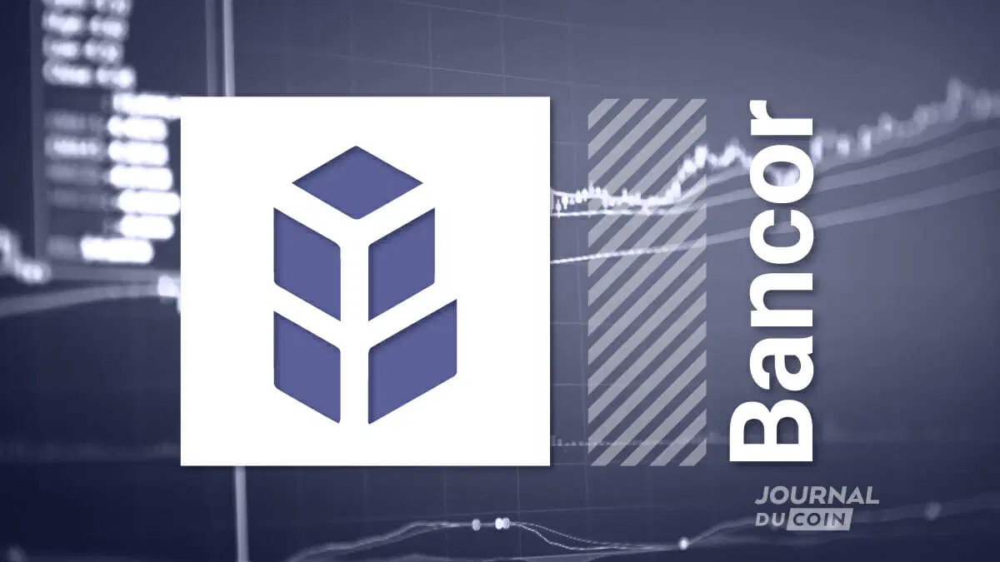

## Table of Contents

## What is Bancor?

Bancor is a platform that helps people exchange different cryptocurrencies easily. It uses a special system called "automated market makers" which means you can swap one type of crypto for another without needing someone else to trade with you directly. This makes it simpler and faster to trade cryptocurrencies.

The idea for Bancor started in 2017 when two people, Galia Benartzi and Guy Benartzi, wanted to make it easier for people to use cryptocurrencies. They created a token called BNT, which is used within the Bancor system. This token helps keep the value stable when people are trading different cryptocurrencies on the platform.

## Who founded Bancor and when was it launched?

Bancor was founded by Galia Benartzi and Guy Benartzi. They are a brother and sister team who wanted to make it easier for people to trade cryptocurrencies. They came up with the idea because they saw that trading cryptocurrencies could be complicated and they wanted to simplify it.

Bancor was launched in 2017. The platform uses a special system called "automated market makers" which helps people swap different types of cryptocurrencies without needing someone else to trade with them directly. This makes trading faster and easier for everyone using the platform.

## What is the main purpose of Bancor?

The main purpose of Bancor is to make it easy for people to trade different types of cryptocurrencies. It does this by using a special system called "automated market makers." This system lets people swap one type of crypto for another without needing someone else to trade with them directly. This makes trading faster and simpler for everyone using the platform.

Bancor was created by Galia Benartzi and Guy Benartzi, who are brother and sister. They wanted to solve the problem of complicated cryptocurrency trading. They launched Bancor in 2017 and introduced a token called BNT. This token helps keep the value stable when people are trading different cryptocurrencies on the platform.

## How does Bancor's liquidity pool system work?

Bancor's liquidity pool system is a special way to help people trade cryptocurrencies easily. Instead of needing someone else to trade with you, Bancor uses pools of different cryptocurrencies. When you want to trade, you swap your crypto with the pool. The pool always has enough of each type of crypto, so you can trade anytime without waiting for another person.

The system works by keeping a balance in the pools. Each pool has two types of cryptocurrencies, and they work together to keep the value stable. When you trade, the amount of each crypto in the pool changes a little, but the system makes sure it stays balanced. This way, the price stays fair for everyone, and you can always trade quickly and easily.

## What is the BNT token and what is its role in the Bancor ecosystem?

The BNT token, short for Bancor Network Token, is a special type of cryptocurrency used in the Bancor system. It helps keep everything running smoothly when people are trading different cryptocurrencies. BNT is important because it's used to connect all the different pools of cryptocurrencies together. This means when you want to trade one type of crypto for another, BNT helps make sure the trade can happen easily and fairly.

In the Bancor ecosystem, BNT plays a key role in maintaining the balance of the liquidity pools. When someone trades, the amount of each cryptocurrency in the pool changes, but BNT helps keep the value stable. This way, even if lots of people are trading at the same time, the prices stay fair and everyone can trade quickly without any problems. BNT is like the glue that holds the whole system together, making sure everyone can trade smoothly and efficiently.

## How does Bancor facilitate token-to-token exchanges?

Bancor makes it easy for people to swap one type of cryptocurrency for another without needing someone else to trade with them. It does this using a system called "automated market makers." This means there are pools of different cryptocurrencies, and when you want to trade, you swap your crypto with the pool. The pool always has enough of each type of crypto, so you can trade anytime without waiting.

The BNT token is important in this process. It helps keep the value of the cryptocurrencies in the pools stable. When you trade, the amount of each crypto in the pool changes a little, but BNT makes sure it stays balanced. This way, the price stays fair for everyone, and you can always trade quickly and easily. BNT connects all the pools together, making sure the whole system works smoothly.

## What are the advantages of using Bancor for liquidity provision?

Using Bancor for liquidity provision has several benefits. One big advantage is that it's easy and quick to add your cryptocurrencies to the liquidity pools. When you do this, you help make trading smoother for everyone. Plus, you get to earn rewards for providing liquidity. This means you can make some money just by letting others use your crypto for trading.

Another advantage is that Bancor's system keeps things balanced and fair. The BNT token helps keep the value of the cryptocurrencies in the pools stable. This means you don't have to worry about big price swings messing up your earnings. It's a safe way to provide liquidity because the system works to keep everything in check, so you can feel good about helping others trade while also making some rewards for yourself.

## What are some of the criticisms faced by Bancor?

Some people have criticized Bancor because they think it's too complicated to understand. They say the system with liquidity pools and the BNT token can be hard for new users to figure out. This might make it difficult for people who are just starting with cryptocurrencies to use Bancor comfortably. Also, some people worry about the safety of their money on the platform. They're concerned that if something goes wrong with the pools or the BNT token, they might lose their cryptocurrencies.

Another criticism is about the fees that Bancor charges. Some users feel that the fees are too high, which can eat into their profits when they trade or provide liquidity. They think that lower fees would make Bancor more attractive and competitive with other platforms. Additionally, there have been concerns about the stability of the platform. Some people point out that even though BNT is meant to keep things balanced, there can still be times when the prices in the pools change a lot, which can be risky for people using the system.

## How has Bancor evolved since its initial launch?

Since Bancor first started in 2017, it has made a lot of changes to make it easier and safer for people to use. One big change was adding something called "v2" of their system. This new version made it easier for people to add their cryptocurrencies to the pools and earn rewards for doing so. They also made the system work better with other platforms, which means people can use Bancor with more types of cryptocurrencies. These changes helped Bancor grow and become more popular.

Another important way Bancor has changed is by focusing on making things more secure. They've added new ways to protect people's money and make sure the prices in the pools stay fair. They also listen to what users say and keep updating the platform to fix problems and add new features. All these changes show that Bancor is always trying to get better and make it easier for people to trade and use cryptocurrencies.

## What are the security measures implemented by Bancor to protect users' funds?

Bancor has put in place several security measures to keep users' funds safe. One important thing they do is use smart contracts, which are like special computer programs that automatically follow certain rules. These smart contracts help make sure that trades happen correctly and that no one can cheat the system. Bancor also works with security experts to check their system and find any weak spots. This helps them fix problems before they can cause trouble for users.

Another way Bancor keeps things secure is by using something called multi-signature wallets. This means that to move money out of the system, more than one person has to agree and sign off on it. This makes it much harder for anyone to steal money because they would need to trick several people at the same time. Bancor also keeps most of the money in the system in a special kind of wallet called a "cold wallet," which is not connected to the internet. This makes it very safe from hackers because it's harder to reach.

## How does Bancor compare to other decentralized exchanges (DEXs)?

Bancor stands out among other decentralized exchanges (DEXs) because of its unique system called "automated market makers." This means you can trade cryptocurrencies without needing someone else to trade with you. Instead, you swap your crypto with a pool of different cryptocurrencies. This makes trading quick and easy. Another big thing about Bancor is its BNT token, which helps keep the value of the cryptocurrencies in the pools stable. This makes it safer for people to trade and provide liquidity. Compared to other DEXs, Bancor's system is often seen as easier to use, especially for people new to cryptocurrencies.

However, Bancor also has some differences from other DEXs. For example, some other DEXs might have lower fees, which can be a big deal for people who trade a lot. Also, while Bancor has worked hard to make its platform secure, some users still worry about the safety of their money because of the complicated system with pools and the BNT token. Other DEXs might use different methods to keep things safe, like different types of smart contracts or security checks. So, while Bancor has many good things going for it, like its easy-to-use system and focus on liquidity, it's not perfect and people might choose other DEXs based on their needs and worries.

## What future developments are planned for Bancor?

Bancor is always working on new things to make its platform better. They want to make it even easier for people to trade different types of cryptocurrencies. They are planning to add more features that will help people add their cryptocurrencies to the pools and earn rewards more easily. They also want to connect Bancor with more other platforms so people can use even more types of cryptocurrencies. These changes will help Bancor grow and become more useful for everyone.

Another big focus for Bancor is making the platform safer. They are working on new ways to protect people's money and make sure the prices in the pools stay fair. They will keep working with security experts to check the system and find any weak spots. They also want to keep listening to what users say and update the platform to fix problems and add new features. All these plans show that Bancor is always trying to get better and make it easier and safer for people to trade and use cryptocurrencies.

## References & Further Reading

[1]: Benartzi, G., Benartzi, G., Hertzog, E., & Rosenzweig, Y. (2017). ["Bancor Protocol: Continuous Liquidity for Cryptographic Tokens Through their Smart Contract Connectors"](https://www.semanticscholar.org/paper/Bancor-Protocol-Continuous-Liquidity-for-Tokens-Hertzog-Benartzi/33a0e8d78ccef17adaba0d9df3446c5d466c36c9). Bancor Whitepaper.

[2]: Bonneau, J., Felten, E.W., Goldfeder, S., Kroll, J.A., Narayanan, A., & Miller, A. (2015). ["SoK: Research Perspectives and Challenges for Bitcoin and Cryptocurrencies"](https://ieeexplore.ieee.org/document/7163021). 2015 IEEE Symposium on Security and Privacy.

[3]: Buterin, V. (2018). ["Notes on Blockchain Governance"](https://hackernoon.com/notes-on-blockchain-governance-ob65o3pod). Vitalik Buterin's Personal Blog. 

[4]: Zhang, R., Xue, R., & Liu, L. (2019). ["Security and Privacy on Blockchain"](https://dl.acm.org/doi/10.1145/3316481). ACM Computing Surveys.

[5]: Calomiris, C. W. (2019). ["Cryptocurrencies and the Future of Money"](https://arxiv.org/abs/2109.10177). Journal of Economic Perspectives, 33(1), 57-72.