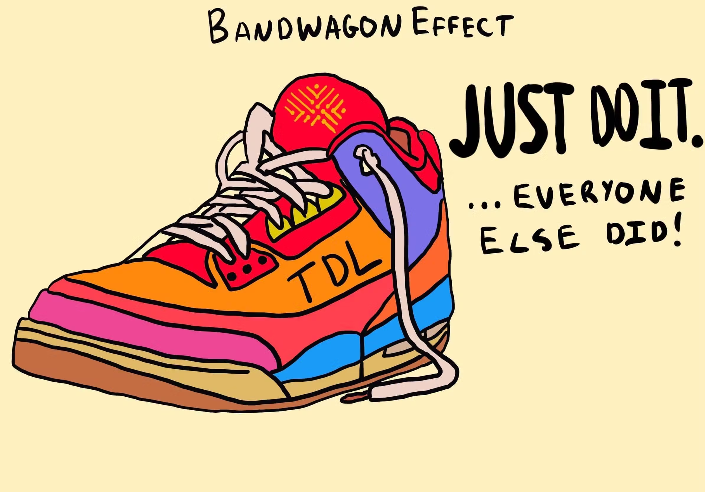

## Table of Contents

## What is the bandwagon effect?

The bandwagon effect is when people do something because many others are doing it. It's like jumping on a bandwagon that's already moving. People might choose a popular product, vote for a candidate, or follow a trend just because it's popular. They might not even think about if it's the best choice for them. They just want to be part of the crowd.

This effect can be seen in many places, like in fashion, politics, and social media. For example, if a lot of people start wearing a certain type of shoe, others might want to wear them too, even if they don't really like the shoes. In elections, people might vote for someone just because they see that person is leading in the polls. On social media, a video or post can become very popular quickly because many people share it, and others join in without really knowing why it's popular.

## How does the bandwagon effect influence individual decision-making?

The bandwagon effect can make people choose things just because they see others doing it. Instead of thinking about what they really want or need, they might go with what's popular. This can happen with things like buying a phone, picking a movie to watch, or even deciding what to believe. If a lot of people are doing something, it might seem like the right choice, even if it's not the best for the person making the decision.

This effect can lead people to follow trends without questioning them. For example, if everyone at school is wearing a certain brand of shoes, a student might feel pressure to buy those shoes too, even if they can't afford them or don't like them. In bigger decisions, like voting, people might support a candidate just because they're popular, without looking at their policies. This can make people feel like they fit in, but it might not lead to the best choices for them personally.

## Can you provide examples of the bandwagon effect in everyday life?

The bandwagon effect can be seen in everyday life when people start using a new app because everyone else is talking about it. For example, when a new social media platform becomes popular, many people might sign up just because their friends are using it, even if they don't really need another app. They see everyone jumping on the bandwagon and feel like they should too, without thinking if it's really useful for them.

Another example is in fashion. If a certain style of clothing becomes trendy, like wearing oversized sweaters, people might start buying them just because they see celebrities and influencers wearing them. They might not even like the style, but they want to fit in and be part of the trend. This shows how the bandwagon effect can make people follow what's popular without thinking about their own preferences.

In the world of sports, the bandwagon effect is clear when a team starts winning a lot. Suddenly, more people start supporting that team, wearing their jerseys, and cheering for them, even if they weren't fans before. They jump on the bandwagon because the team is doing well and it feels good to be part of a winning group. This shows how the bandwagon effect can influence people's choices in many different areas of life.

## What is crowd behavior and how does it relate to the bandwagon effect?

Crowd behavior is what happens when a group of people do things together. It can be things like cheering at a concert, running away from danger, or even starting a riot. When people are in a crowd, they might act differently than they would by themselves. They might feel more excited, scared, or brave because they are part of a group. This is because people in a crowd can influence each other a lot.

The bandwagon effect is closely related to crowd behavior. It's when people start doing something because they see others doing it. In a crowd, the bandwagon effect can make people join in on what everyone else is doing, even if they didn't plan to. For example, if a crowd starts cheering, others might start cheering too, just because everyone else is. This shows how the bandwagon effect can make crowd behavior stronger, as people feel the pressure to go along with what the group is doing.

## How do social media platforms amplify the bandwagon effect?

Social media platforms make the bandwagon effect bigger because they show what lots of people are doing or liking. When a post, video, or trend gets a lot of likes, shares, or comments, it can seem more important or cool. People might see this and want to join in, even if they don't really care about the thing itself. They just want to be part of what everyone else is doing. This is how social media can make things go viral really fast, as more and more people jump on the bandwagon.

Also, social media can show what's popular in real-time, making the bandwagon effect even stronger. If a lot of people start using a new hashtag or challenge, others might feel like they have to do it too, just to fit in. This can make trends spread quickly across the platform, as people see what's popular and want to be part of it. Social media makes it easy for people to see what others are doing and feel pressure to follow along, even if they don't really want to.

## What psychological mechanisms drive the bandwagon effect?

The bandwagon effect is driven by a few key psychological mechanisms. One is the desire to fit in and be part of a group. People often want to feel like they belong, so they might do what others are doing just to feel included. This is called social conformity. Another mechanism is the belief that if many people are doing something, it must be the right or best thing to do. This is called social proof. When people see others choosing something, they might think it's a good choice without looking into it themselves.

Another psychological mechanism is the fear of missing out, or FOMO. When people see others enjoying something or getting benefits from it, they might worry about missing out on those experiences or advantages. This can push them to join in, even if they're not sure they want to. All these mechanisms together make the bandwagon effect stronger, as people feel pressure from different sides to follow the crowd.

## How can the bandwagon effect be observed in political elections?

The bandwagon effect can be seen in political elections when people decide to vote for a candidate just because they see that candidate is leading in the polls. They might think that if a lot of people are choosing that person, they must be the best choice. This can make the leading candidate even more popular, as more people jump on the bandwagon without really thinking about the candidate's policies or ideas.

In elections, the media can also help make the bandwagon effect stronger. When news stories and polls show one candidate way ahead, it can make people feel like that candidate is going to win for sure. This might make some voters want to support the winner, even if they don't really agree with them. They just want to be on the winning side, so they vote for the popular candidate without thinking too much about it.

## What are the ethical implications of using the bandwagon effect in marketing?

Using the bandwagon effect in marketing can be tricky because it might not be fair to customers. When companies make it seem like everyone is buying their product, people might feel pressured to buy it too, even if they don't really need it or like it. This can lead to people spending money on things they don't want just because they want to fit in. It's not right to trick people into buying things by making them feel left out if they don't.

On the other hand, using the bandwagon effect can also be seen as just showing what's popular. If a product is really good and many people like it, it's okay to let others know. But companies should be honest and not exaggerate how popular their product is just to sell more. It's important for marketers to think about how their ads might affect people and try to be fair and honest.

## How can individuals resist the bandwagon effect?

People can resist the bandwagon effect by thinking about what they really want and need. Instead of just following what everyone else is doing, they should take time to think about their own choices. For example, if everyone is buying a new phone, someone should ask themselves if they really need that phone or if they just want it because it's popular. By focusing on their own needs and preferences, people can make choices that are better for them, even if it means going against the crowd.

Another way to resist the bandwagon effect is to look for information from different places. Instead of just listening to what's popular, people can read reviews, talk to friends, or do their own research. This can help them see if something is really good or if it's just popular because of the bandwagon effect. By being careful and looking at all the facts, people can make smarter decisions and not just follow what everyone else is doing.

## What research methods are used to study the bandwagon effect and crowd behavior?

Researchers use different methods to study the bandwagon effect and crowd behavior. One common method is surveys and polls. They ask people questions about their choices and why they made them. This helps researchers see if people are following what's popular or if they have other reasons for their choices. Another method is experiments, where researchers might set up situations to see how people act when they see others doing something. For example, they might show people fake popularity numbers for a product and see if it makes them want to buy it too.

Another way to study these effects is through observational studies. Researchers watch how people behave in real-life situations, like at a concert or during a political event. They take notes on how people act when they're in a crowd and if they start doing what others are doing. This helps them understand crowd behavior better. Researchers also use data analysis, looking at things like social media trends or voting patterns to see if the bandwagon effect is happening. By studying this data, they can find patterns and learn more about why people follow the crowd.

## How does the bandwagon effect impact financial markets and investment decisions?

The bandwagon effect can have a big impact on financial markets and investment decisions. When a lot of people start buying a certain stock or cryptocurrency because it's getting popular, others might want to buy it too, even if they don't know much about it. They see the price going up and think they should join in to make money. This can make the price go up even more, but it can also create a bubble. If everyone is buying something just because it's popular, the price might not be based on how good the investment really is. When the bubble bursts, people who jumped on the bandwagon can lose a lot of money.

In investment decisions, the bandwagon effect can make people follow trends without doing their own research. For example, if a lot of people are talking about a new tech company, others might want to invest in it too, just because it's the hot thing. But if they don't look into the company's financials and future plans, they might be making a risky choice. It's important for investors to think about what they're buying and why, instead of just following what everyone else is doing. By making their own decisions based on facts, they can avoid the risks that come with the bandwagon effect.

## What are the differences between the bandwagon effect and other social influence phenomena like conformity and peer pressure?

The bandwagon effect, conformity, and peer pressure are all ways that people can be influenced by others, but they work a bit differently. The bandwagon effect happens when people do something because they see a lot of others doing it. It's like jumping on a moving bandwagon. People might choose a popular product or follow a trend just because it's popular, without really thinking about if it's the best choice for them. Conformity is when people change their behavior or beliefs to fit in with a group. They might go along with what the group is doing because they want to be accepted or avoid standing out. Conformity can happen even if the group isn't very big, as long as the person feels pressure to fit in.

Peer pressure is another type of social influence, but it's more direct. It happens when friends or people close to you try to get you to do something. They might tease you or make you feel left out if you don't do what they want. Peer pressure can make people do things they wouldn't normally do, just to keep their friends happy. While the bandwagon effect is about following what's popular in a larger group or society, peer pressure is more about the influence of a smaller, closer group of people. All these phenomena show how much other people can affect our choices, but they work in different ways.

## References & Further Reading

[1]: Cialdini, R. B. (2009). ["Influence: Science and Practice"](https://www.researchgate.net/publication/229067982_Influence_Science_and_Practice). Pearson.

[2]: Soros, G. (1987). ["The Alchemy of Finance: Reading the Mind of the Market"](https://www.amazon.com/Alchemy-Finance-Reading-Mind-Market/dp/0471043133). John Wiley & Sons.

[3]: Shiller, R. J. (2000). ["Irrational Exuberance"](https://www.jstor.org/stable/j.ctt1287kz5). Princeton University Press.

[4]: Malkiel, B. G. (1999). ["A Random Walk Down Wall Street: Including a Life-Cycle Guide to Personal Investing"](https://www.semanticscholar.org/paper/A-random-walk-down-Wall-Street-%3A-including-a-guide-Malkiel/983eeda65caaebfd4f95682ae4bda9b7f13d7493). W. W. Norton & Company.

[5]: Taleb, N. N. (2007). ["The Black Swan: The Impact of the Highly Improbable"](https://www.jstor.org/stable/23045073). Random House.