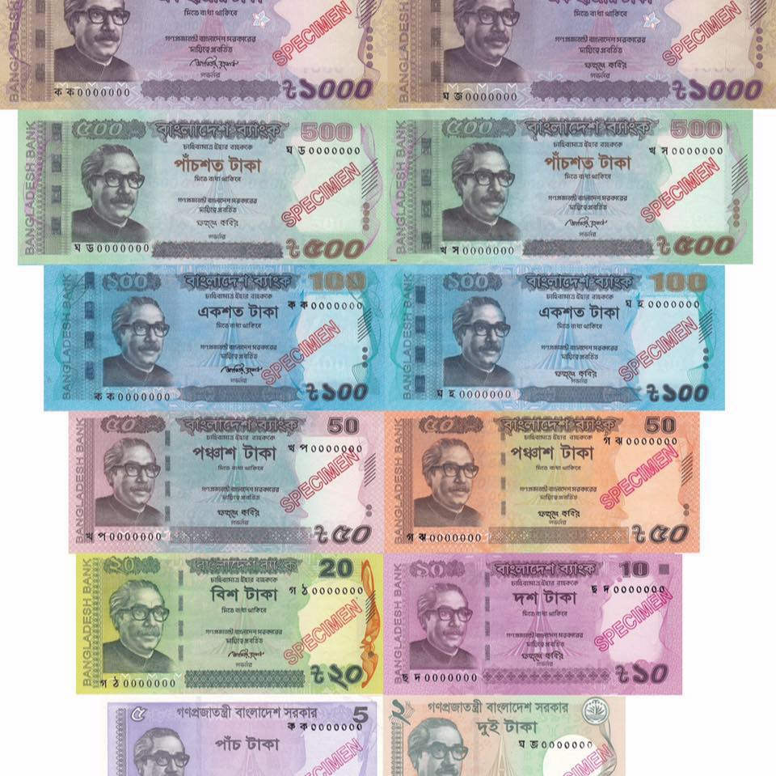

## Table of Contents

## What is the Bangladeshi Taka and why is it important?

The Bangladeshi Taka is the official currency of Bangladesh. It is used every day by people in Bangladesh to buy things like food, clothes, and other necessities. The symbol for the Taka is ৳, and it is divided into 100 smaller units called paisa. The word "Taka" comes from the Sanskrit word "tankah," which means "money."

The Taka is important because it helps the economy of Bangladesh run smoothly. When people use the Taka to buy and sell things, it helps businesses grow and creates jobs. The value of the Taka compared to other countries' money can affect how much things cost in Bangladesh and how much Bangladeshi products can be sold in other countries. This makes the Taka a key part of everyday life and the country's economic health.

## How is the Bangladeshi Taka used in daily transactions in Bangladesh?

In Bangladesh, people use the Taka for all kinds of daily transactions. When someone goes to the market to buy vegetables, they pay with Taka. If they take a bus or a rickshaw, they use Taka to pay the fare. People also use Taka to buy things like clothes, electronics, and even to pay for services like haircuts or doctor visits. In shops and stores, you will see prices listed in Taka, and people use Taka notes and coins to make their purchases.

Even online, the Taka is used for transactions. Many people in Bangladesh use mobile banking services like bKash or Rocket to send and receive money, pay bills, and shop online. These services make it easy to use Taka digitally, without needing to [carry](/wiki/carry-trading) cash. Whether it's buying something from a street vendor or paying for a subscription service, the Taka is the currency that makes these everyday transactions possible in Bangladesh.

## What are the denominations of the Bangladeshi Taka?

The Bangladeshi Taka comes in different sizes of money, called denominations. For paper money, you can find notes of 2, 5, 10, 20, 50, 100, 200, 500, and 1000 Taka. These are the big pieces of money that people use for larger purchases. The smallest paper money is the 2 Taka note, and the biggest is the 1000 Taka note.

For smaller amounts, there are coins. The coins come in 1, 2, 5, 10, 25, and 50 paisa, and also 1, 2, and 5 Taka. The paisa coins are very small and not used much anymore, but you can still find them. The 1 Taka coin is the most common coin you will see. People use coins for small purchases or to give exact change.

## How can one exchange foreign currency to Bangladeshi Taka?

To exchange foreign currency to Bangladeshi Taka, you can visit a bank or a money exchange office in Bangladesh. Many banks in the country have currency exchange services where you can go with your foreign money and they will give you Taka in return. You will need to show your passport or another form of ID, and sometimes fill out a form. The bank will then tell you how much Taka you will get based on the current exchange rate.

Another option is to use money exchange offices, which are often found at airports, hotels, and in busy areas of cities. These places can be convenient, especially when you first arrive in Bangladesh. Just like at a bank, you will need to show your ID and they will exchange your money for you. It's a good idea to compare the exchange rates at different places to make sure you are getting a fair deal.

## What is the current exchange rate of the Bangladeshi Taka against major currencies like the US Dollar, Euro, and British Pound?

The exchange rate of the Bangladeshi Taka against major currencies like the US Dollar, Euro, and British Pound can change every day. As of the latest update, 1 US Dollar is equal to about 110 Taka. This means if you have 1 US Dollar, you will get around 110 Taka when you exchange it. The exchange rate can go up or down depending on many things like the economy of Bangladesh and the world.

For the Euro, 1 Euro is equal to about 120 Taka. So, if you have 1 Euro, you will get around 120 Taka. The British Pound is a bit higher, with 1 British Pound being equal to about 140 Taka. These rates are just examples and can change, so it's always a good idea to check the current rate before you exchange your money.

## How has the exchange rate of the Bangladeshi Taka fluctuated over the past year?

Over the past year, the exchange rate of the Bangladeshi Taka against major currencies like the US Dollar has seen some changes. At the beginning of the year, 1 US Dollar was worth around 85 Taka. As the year went on, the value of the Taka went down a bit, and by the end of the year, 1 US Dollar was worth about 110 Taka. This means the Taka got weaker compared to the Dollar over the year.

The Euro and the British Pound also saw similar changes against the Taka. At the start of the year, 1 Euro was worth about 95 Taka, but by the end of the year, it was worth around 120 Taka. The British Pound started the year at around 115 Taka and ended at about 140 Taka. These changes show that the Taka lost some value against these major currencies over the past year.

## What factors influence the exchange rate of the Bangladeshi Taka?

The exchange rate of the Bangladeshi Taka can change because of many things. One big thing is the economy of Bangladesh. If the country is doing well, with lots of people buying and selling things, the Taka might get stronger. But if the economy is not doing so well, the Taka might get weaker. Another thing is the amount of money the government spends and how much money it gets from other countries. If Bangladesh gets a lot of money from other countries, like through exports or loans, the Taka can get stronger. But if the government spends too much money without getting enough back, the Taka can get weaker.

Also, the exchange rate can be affected by what is happening in the world. If the US Dollar or other big currencies get stronger, the Taka might get weaker compared to them. Things like wars, big changes in oil prices, or problems in other countries can also change how strong the Taka is. The Bangladesh Bank, which is like the country's money manager, can also do things to try to keep the Taka's value steady. They might buy or sell Taka to make sure it doesn't change too much, but even they can't control everything that happens.

## How does the government of Bangladesh manage the value of the Taka?

The government of Bangladesh, through the Bangladesh Bank, works hard to keep the value of the Taka steady. They do this by buying and selling Taka in the money market. When they think the Taka is getting too weak, they might sell some of their foreign money, like US Dollars, to buy Taka. This makes the Taka stronger because there are more people wanting to buy it. If the Taka is getting too strong, they might buy foreign money with Taka, which makes the Taka weaker because there are more Taka out there.

Another way the government manages the Taka is by setting rules about how much money can come in and go out of the country. They might limit how much Taka people can take out when they travel or how much foreign money businesses can bring in. This helps keep the Taka's value from changing too fast. The government also looks at the whole economy to decide what to do. If the economy is growing and people are making more money, the Taka might get stronger. But if the economy is not doing well, the government might need to do more to keep the Taka's value steady.

## What are the historical trends of the Bangladeshi Taka's exchange rate over the last decade?

Over the last ten years, the Bangladeshi Taka has seen a lot of changes in its value against major currencies like the US Dollar. At the start of the decade, around 2013, 1 US Dollar was worth about 80 Taka. Over the years, the Taka slowly got weaker. By 2018, 1 US Dollar was worth about 85 Taka, and by 2020, it was around 86 Taka. But then, things changed more quickly. In 2021, the Taka weakened more, with 1 US Dollar reaching about 88 Taka. By the end of 2023, the exchange rate was around 110 Taka for 1 US Dollar. This shows that the Taka lost value over the decade, especially in the last few years.

The Taka also changed against other big currencies like the Euro and the British Pound. At the beginning of the decade, 1 Euro was worth about 105 Taka. By 2018, it was around 110 Taka, and by 2020, it reached about 112 Taka. By the end of 2023, 1 Euro was worth about 120 Taka. The British Pound followed a similar path. It started at around 125 Taka in 2013, went up to about 130 Taka by 2018, and was around 135 Taka by 2020. By the end of 2023, 1 British Pound was worth about 140 Taka. Overall, the Taka weakened against these currencies over the last ten years, with a more noticeable drop in the last few years.

## How do economic policies in Bangladesh affect the Taka's exchange rate?

Economic policies in Bangladesh can make the Taka stronger or weaker. When the government decides to spend a lot of money on things like roads, schools, or helping people, it can affect how much Taka is out there. If they spend too much without getting enough money back, the Taka might get weaker because there are more Taka around. The government also sets rules about how much money can come into or go out of the country. If they make it hard for people to take Taka out, it can help keep the Taka strong. But if they let a lot of Taka go out, the Taka might get weaker.

The Bangladesh Bank, which is like the country's money manager, also does things to help the Taka. They can buy or sell Taka to keep its value steady. If they think the Taka is getting too weak, they might sell some of their foreign money, like US Dollars, to buy Taka. This makes the Taka stronger because more people want to buy it. If the Taka is getting too strong, they might buy foreign money with Taka, which makes the Taka weaker because there are more Taka out there. These actions by the government and the Bangladesh Bank show how economic policies can change the Taka's exchange rate.

## What are the predictions for the future exchange rate trends of the Bangladeshi Taka?

Predicting the future exchange rate of the Bangladeshi Taka can be tricky, but experts look at many things to guess what might happen. If Bangladesh keeps doing well with its exports, like clothes and other things, the Taka might get stronger. Also, if the government keeps spending money carefully and doesn't let too much Taka go out of the country, the Taka could stay steady or even get a bit stronger. But if there are big problems in the world, like wars or big changes in oil prices, the Taka might get weaker.

In the next few years, the Taka might keep getting a bit weaker against big currencies like the US Dollar, Euro, and British Pound. This is because other countries' economies might do better than Bangladesh's, making their money stronger. But the Bangladesh Bank will try to keep the Taka's value from changing too fast by buying and selling Taka and setting rules about money coming in and out. So, while the Taka might not get much stronger, it should not get too weak if everything goes well.

## How does the exchange rate of the Bangladeshi Taka impact international trade and investment in Bangladesh?

The exchange rate of the Bangladeshi Taka plays a big role in how much Bangladesh can trade with other countries. When the Taka is weak compared to other currencies, like the US Dollar, it can make Bangladeshi products cheaper for people in other countries to buy. This can help Bangladesh sell more things, like clothes, to other countries. But it also means that things Bangladesh needs to buy from other countries, like machines or oil, become more expensive. So, a weak Taka can help exports but make imports more costly.

The Taka's exchange rate also affects how much other countries want to invest in Bangladesh. If the Taka is strong, it might attract more investors because they think their money will be worth more when they want to take it back. But if the Taka is weak, investors might be worried about losing money if they change their money back to their own country's currency. The government and the Bangladesh Bank try to keep the Taka's value steady to make sure it doesn't scare away investors or make it hard for Bangladesh to trade with other countries.

## References & Further Reading

[1]: Bergstra, J., Bardenet, R., Bengio, Y., & Kégl, B. (2011). ["Algorithms for Hyper-Parameter Optimization."](https://papers.nips.cc/paper/4443-algorithms-for-hyper-parameter-optimization) Advances in Neural Information Processing Systems 24.

[2]: ["Advances in Financial Machine Learning"](https://www.amazon.com/Advances-Financial-Machine-Learning-Marcos/dp/1119482089) by Marcos Lopez de Prado

[3]: ["Evidence-Based Technical Analysis: Applying the Scientific Method and Statistical Inference to Trading Signals"](https://www.amazon.com/Evidence-Based-Technical-Analysis-Scientific-Statistical/dp/0470008741) by David Aronson

[4]: ["Machine Learning for Algorithmic Trading"](https://github.com/stefan-jansen/machine-learning-for-trading) by Stefan Jansen

[5]: ["Quantitative Trading: How to Build Your Own Algorithmic Trading Business"](https://github.com/LucindaYa/quant-resources/blob/master/Quantitative%20Trading%20How%20to%20Build%20Your%20Own%20Algorithmic%20Trading%20Business.pdf) by Ernest P. Chan