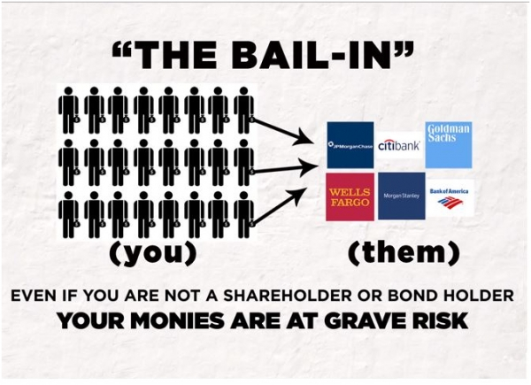

The global financial landscape has been significantly influenced by diverse economic policies, particularly since the financial crisis of 2007-2008. During this period, financial bailouts emerged as a critical mechanism, wherein governments injected capital into failing financial institutions to prevent a systemic collapse. This intervention typically involved the deployment of taxpayer funds to stabilize the institutions considered "too big to fail." The objective was to protect the broader economy from the potentially devastating impacts of major bank failures, although this approach raised concerns about moral hazard, where institutions might engage in risky behavior, assuming future government support.

In parallel, an alternative mechanism known as the bank bail-in was developed, gaining prominence with regulatory frameworks such as the Dodd-Frank Act. Unlike bailouts, bail-ins require banks to draw on their internal resources, including creditors and depositors, to stabilize their operations. This shift aims to reduce taxpayer burdens and enhance accountability by transferring financial risk to the institutions' stakeholders.



Concurrently, the advent of algorithmic trading has marked a technological revolution in financial markets. Algorithmic trading involves using advanced computer algorithms to automate trading processes, thereby increasing market efficiency. However, it also introduces complexities and risks, such as the potential for flash crashes, where market anomalies result in rapid price decreases.

This article provides a comprehensive analysis of these critical elements—bailouts, bail-ins, and algorithmic trading—and examines their implications within modern economic frameworks. Understanding their individual and collective impacts is vital for maintaining systemic stability and ensuring the resilience of global financial systems.

## Table of Contents

## Understanding Financial Bailouts

Financial bailouts are a mechanism through which government authorities intervene to provide financial assistance to faltering financial institutions or industries. This intervention typically involves the use of taxpayer funds and is performed with the objective of stabilizing the financial system. The rationale behind bailouts is to prevent the ripple effects that the failure of a significant financial entity might have on the broader economy, thereby maintaining systemic stability.

The financial crisis of 2007-2008 serves as a quintessential example of how and why bailouts are employed. During this period, the global financial system faced unprecedented stress, leading to the collapse of several prominent institutions, most notably Lehman Brothers. The crisis illuminated the concept of institutions being “too big to fail”—a term that underscores the predicament in which a bank's failure could lead to catastrophic economic consequences.

To prevent a total financial meltdown, governments worldwide initiated massive bailout programs. In the United States, programs such as the Troubled Asset Relief Program (TARP) were launched, allocating up to $700 billion to stabilize banks, insurance companies, and automotive industries. The rationale for these bailouts was predicated on the belief that the costs associated with the failure of these institutions would vastly outweigh the cost of providing them with financial support. By injecting capital into the financial system, the government aimed to restore confidence, ensure [liquidity](/wiki/liquidity-risk-premium), and avert a deep recession.

However, while bailouts can effectively prevent economic collapse, they also introduce the problem of moral hazard. Moral hazard arises when businesses or individuals are incentivized to take on greater risks because they expect that they will be rescued if things go awry. In the context of financial institutions, being deemed "too big to fail" can encourage reckless behavior, as the repercussions of failure are mitigated by the assurance of government intervention. This poses significant challenges for policymakers who must balance the immediate need for stabilization with the long-term incentive structures within the financial industry.

In conclusion, financial bailouts play a critical role in safeguarding the economy against systemic risks. Still, they necessitate careful consideration and regulation to minimize moral hazards and ensure that financial institutions operate within a framework that encourages prudent risk management.

## The Shift to Bank Bail-ins

The Dodd-Frank Wall Street Reform and Consumer Protection Act, enacted in 2010, marked a significant regulatory shift in handling failing financial institutions. It aimed to prevent the need for taxpayer-funded bailouts by institutionalizing bank bail-ins. A bail-in enables a bank to recapitalize itself by converting its creditors' claims into equity, effectively allowing the institution to internally restructure its balance sheet without external financial assistance. This mechanism contrasts with bailouts, where external funds, often from the government, are used to stabilize the bank.

Under the bail-in framework, banks are mandated to hold a sufficient amount of convertible debt or contingent convertible bonds (CoCos), which can be used to absorb losses during financial distress. These instruments convert automatically into equity if a bank's capital falls below a certain threshold, providing a built-in buffer for absorbing financial shocks. This approach to recapitalization not only alleviates the financial burden on taxpayers but also aligns the interests of the bank's creditors with the institution's health, as they have a direct stake in its continued solvency.

The implementation of bail-ins has implications for financial stability. By imposing potential losses on creditors and depositors, rather than taxpayers, bail-ins promote greater market discipline. Creditors become more vigilant about the risks they are exposed to, incentivizing them to monitor bank activities more closely. Furthermore, this shift encourages banks to adopt more prudent risk management practices, knowing they cannot solely rely on government interventions during crises.

However, the introduction of bail-ins requires meticulous regulatory oversight to ensure smooth execution and prevent market disruptions. The Financial Stability Board (FSB) endorses the Total Loss-Absorbing Capacity (TLAC) standard, which sets a minimum threshold of loss-absorbing instruments that globally significant banks must maintain. This standardization facilitates a more predictable and transparent bail-in process, crucial for maintaining investor confidence.

Ultimately, the transition to bail-ins is designed to enhance financial system resilience by redistributing the risk of bank failures away from the public sector. While this regulatory innovation promotes accountability among financial institutions, it also necessitates ongoing evaluation to address potential systemic risks, such as interconnected exposures and the adequacy of loss-absorbing capacities within the banking sector.

## The European Experience with Bail-ins

Following the financial crisis of 2007-2008 and the subsequent European debt crisis, the European Union (EU) sought mechanisms to reduce the fiscal burden on taxpayers caused by failing financial institutions. The shift towards bank bail-ins gained [momentum](/wiki/momentum), aiming to avoid the direct use of public funds during financial institution rescues. This approach was notably implemented after the Cyprus banking crisis of 2012-2013, which marked a critical juncture in EU financial regulation.

In a bank bail-in, instead of using taxpayer money, the losses of a failing bank are absorbed by creditors and depositors. This mechanism fundamentally alters the risk landscape, shifting the onus from public coffers to private stakeholders. The EU established the Bank Recovery and Resolution Directive (BRRD) to facilitate the orderly resolution of failing banks. Under the BRRD, financial stability is maintained while minimizing the impact on public funding. The directive provides tools for early intervention and resolution planning, ensuring that shareholders and creditors bear an appropriate share of the losses.

A key component of the bail-in process is the hierarchy of claims, where liabilities are written down or converted into equity. This hierarchy typically prioritizes uninsured deposits and unsecured creditors, ensuring that systemic risk is minimized while protecting insured depositors. The European Central Bank (ECB) and the Single Resolution Board (SRB) coordinate these efforts, managing cross-border bank failures within the EU.

While bail-ins aim to protect taxpayers, they present unique challenges and risks. One significant challenge is maintaining depositor confidence; the perception of increased risk to deposits could lead to withdrawals and potential bank runs. Clear communication and robust regulatory measures are essential to prevent panic. Additionally, the complexity of executing bail-ins across different jurisdictions within the EU raises logistical and legal issues that must be addressed to ensure uniform application and avoid regulatory [arbitrage](/wiki/arbitrage).

The effectiveness of the EU's bail-in policy continues to be scrutinized as financial institutions navigate the post-crisis landscape. While the Cyprus precedent showcased the potential for bail-ins to handle failing banks without direct taxpayer involvement, ongoing evaluation and adaptation of these policies are critical. The balance between financial stability, depositor protection, and minimizing taxpayer exposure remains a focal point for European financial authorities. External factors, such as global economic conditions and market confidence, also play critical roles in shaping the outcome of bail-in strategies.

## Algorithmic Trading: Revolutionizing Financial Markets

Algorithmic trading, often referred to as 'algo trading', involves the use of complex algorithms to automate trading decisions and processes in financial markets. This technology leverages mathematical models and computational tools to execute orders at speeds and frequencies that are impossible for a human trader. By systematically reviewing various market conditions, algorithms determine optimal trading strategies, thereby increasing the efficiency of markets by narrowing spreads, enhancing liquidity, and stabilizing prices over the long term.

The core advantage of [algorithmic trading](/wiki/algorithmic-trading) lies in its ability to process massive volumes of data at unprecedented speeds. Algorithms can swiftly analyze market trends, execute large orders across multiple trading venues, and adjust strategies in response to real-time data. This capacity for rapid response helps to reduce transaction costs, minimizing the price impact on financial markets and offering institutional investors an effective way to manage large portfolios.

Despite these efficiencies, algorithmic trading introduces significant risks, notably flash crashes. These are sudden, severe market crashes caused by the rapid execution of a high [volume](/wiki/volume-trading-strategy) of orders, often exacerbated by unforeseen interactions between various trading algorithms. The infamous May 6, 2010, Flash Crash, during which the Dow Jones Industrial Average plummeted nearly 1,000 points in minutes before recovering, highlighted the vulnerabilities of algorithms to market anomalies and technical failures.

To illustrate how these algorithms function, consider a simplified example in Python that demonstrates a basic algorithmic trading strategy using moving averages:

```python
import pandas as pd
import numpy as np

# Load historical stock price data
data = pd.read_csv('historical_stock_prices.csv')

# Calculate moving averages
data['MA_50'] = data['Close'].rolling(window=50).mean()
data['MA_200'] = data['Close'].rolling(window=200).mean()

# Define trading signals
data['Signal'] = np.where(data['MA_50'] > data['MA_200'], 1, 0)

# Generate trading signals
data['Position'] = data['Signal'].diff()

# Output the trading decisions
print(data[['Close', 'MA_50', 'MA_200', 'Signal', 'Position']].tail())
```

This code computes a simple moving average crossover strategy, where the trading signal is generated when the short-term moving average (50-day) crosses above the long-term moving average (200-day), signaling a potential buy opportunity. Conversely, a cross below indicates a sell signal. Although rudimentary, this kind of logic forms the basis for more sophisticated trading strategies employed by hedge funds and financial institutions.

Algorithmic trading fits within the broader economic policy landscape by shaping market dynamics and influencing the behavior of central banks and regulatory bodies. Market participants demand new policy measures to address the risks associated with high-frequency trading, ensuring robust safeguards against systemic threats. Regulators have responded by exploring circuit breakers, trade cancellation policies, and financial transaction taxes to mitigate the fallout from algorithmic [volatility](/wiki/volatility-trading-strategies).

In summary, algorithmic trading represents a paradigm shift in modern financial markets, offering both opportunities for increased market efficiency and challenges associated with heightened volatility. As financial systems continue to adapt to technological innovations, regulators and market participants must balance the benefits of automation with the need for stability and transparency.

## Interplay Between Economic Policies and Market Dynamics

Economic policies concerning bailouts and bail-ins significantly influence market confidence and financial stability. Bailouts, by providing governmental support to faltering institutions, often instill a sense of security among investors and market participants, as they mitigate the fear of systemic collapse. However, these measures may also introduce a moral hazard, as institutions perceive less risk in engaging in high-stake ventures, knowing potential government support is available.

Conversely, bail-ins redirect the focus towards internal solutions during financial distress, mandating banks to seek capital from within their own resources, prominently through creditors and depositors. This approach is intended to enhance accountability and reduce taxpayer burden. The shift from bailouts to bail-ins underscores a move towards a more sustainable financial practice, although it might also cause concern among depositors regarding the security of their investments, potentially impacting market sentiment.

The integration of algorithmic trading adds another layer of complexity to this interplay. Algorithmic trading uses sophisticated algorithms to automate trading decisions, enabling transactions at speeds and volumes beyond human capacity. While this technological advancement has increased the efficiency of markets through tighter spreads and improved liquidity, it also introduces new risks. Notably, flash crashes—sudden, drastic drops in security prices followed by a quick recovery—have been partly attributed to the accelerating automation and interconnectivity of trading systems.

This intricate relationship between economic policies and market dynamics necessitates a keen understanding from both investors and policymakers. Investors must assess policy impacts on market stability and incorporate these insights into risk management strategies. Policymakers, in turn, are tasked with the challenge of crafting regulations that harmonize the benefits of algorithmic innovation with the overarching goal of financial stability. Such regulations should aim to discourage overly risky behaviors while fostering an environment where technological advancements can enhance market operations without compromising system integrity.

A balanced approach combining sound regulatory frameworks with robust monitoring systems is essential to safeguard against potential instabilities. This vigilance ensures that while leveraging technological progress, the financial system remains resilient and capable of withstanding both existing and emergent challenges in a dynamic economic environment.

## The Role of Regulatory Frameworks

Effective regulation is critical in managing the risks associated with financial bail-ins and algorithmic trading. Regulatory frameworks like the Dodd-Frank Wall Street Reform and Consumer Protection Act and Basel III have been established to enhance the resilience of the financial system by addressing systemic vulnerabilities exposed in previous financial crises.

The Dodd-Frank Act, enacted in response to the 2008 financial crisis, introduced comprehensive measures to increase transparency and oversight in financial markets. A key component of Dodd-Frank is the Orderly Liquidation Authority, which allows for the resolution of failing financial institutions without resorting to taxpayer-funded bailouts. It emphasizes bank accountability by requiring these institutions to prepare a "living will," outlining strategies for rapid and orderly resolution in bankruptcy. This reduces the likelihood of government interventions and enhances the discipline in managing financial risks.

Basel III, developed by the Basel Committee on Banking Supervision, extends this regulatory framework by introducing stricter capital and liquidity requirements. It mandates higher Tier 1 capital ratios, ensuring that banks maintain sufficient high-quality capital to absorb shocks from financial and economic stress. Basel III also introduces the Liquidity Coverage Ratio (LCR) and Net Stable Funding Ratio (NSFR) to ensure that banks have adequate liquidity to withstand short-term and medium-term disruptions.

Despite these robust frameworks, challenges remain. One limitation of Dodd-Frank is its complexity, which can lead to significant compliance costs for financial institutions. Moreover, although living wills and the Orderly Liquidation Authority are intended to mitigate the risk of bank failures, the interconnectivity of global banks means systemic risk remains a concern. The rapid pace of financial innovation, particularly in algorithmic trading, adds layers of complexity that regulators must continually adapt to.

Algorithmic trading, while enhancing market efficiency and liquidity, presents unique challenges. The speed and automation of these trades can exacerbate market volatility and lead to events such as flash crashes. Regulators must balance facilitating innovation with mitigating these risks. Recent regulatory approaches have focused on measures like circuit breakers and volatility interruption mechanisms to curb excessive volatility caused by high-frequency trades.

In conclusion, regulatory frameworks like Dodd-Frank and Basel III have significantly strengthened the financial system's resilience. However, the evolving landscape of financial markets, particularly with advancements in algorithmic trading, necessitates ongoing adaptation of these regulatory measures. Ensuring robust oversight while fostering innovation remains an essential but challenging task for policymakers and regulators globally.

## Conclusion

As financial markets continue to evolve, economic policies must adapt to ensure stability and robustness. The intricate balancing act between financial bailouts, bank bail-ins, and technological advancements such as algorithmic trading represents an ongoing challenge for policymakers. Each of these components plays a critical role in shaping the future of global financial systems, and their interaction must be carefully managed to mitigate risks while capitalizing on potential benefits.

Financial bailouts and bank bail-ins serve as contrasting mechanisms to address the challenges posed by distressed financial institutions. Bailouts, while effective in providing immediate stability, often lead to moral hazard and an increased fiscal burden on taxpayers. Conversely, bail-ins aim to reinforce accountability among banks and place the financial strain primarily on creditors and shareholders. This shift reduces taxpayer exposure, but it also necessitates robust regulatory oversight to ensure transparency and protect smaller depositors.

The rise of algorithmic trading further complicates this landscape. As algorithms increasingly dominate trading floors, they bring enhancements in market liquidity and efficiency. However, they concurrently introduce new risks, such as flash crashes and systemic vulnerabilities. This underscores the necessity for policies that not only accommodate technological advancements but also guard against their potential to destabilize markets.

Future policymaking must consider these complexities, fostering an environment where economic and technological innovations do not compromise financial stability. Regulatory frameworks such as Dodd-Frank and Basel III have laid the groundwork, promoting resilience in financial systems. Nevertheless, constant vigilance and adaptation are paramount as markets and technologies evolve. Innovative policy solutions must be devised to balance economic growth with risk management, ensuring the safety and soundness of global financial systems for years to come.

## References & Further Reading

[1]: Philippon, T., & Reshef, A. (2014). ["An International Look at the Growth of Modern Finance."](https://www.jstor.org/stable/pdf/23391691.pdf?addFooter=false) Journal of Economic Perspectives, 27(2), 73-96.

[2]: Bolton, P., Santos, T., & Scheinkman, J. A. (2016). ["Cream-Skimming in Financial Markets."](https://www.jstor.org/stable/43869116) National Bureau of Economic Research.

[3]: Pirrong, C. (2013). ["The Economics of Flash Crashes."](https://scholar.google.com/citations?user=tsVlN9QAAAAJ&hl=en) International Review of Financial Analysis, 30, 11-17.

[4]: Lo, A. W. (2012). ["Reading About the Financial Crisis: A 21-Book Review."](https://dspace.mit.edu/bitstream/handle/1721.1/75360/Lo_Reading%20about.pdf) Journal of Economic Literature, 50(1), 151-178.

[5]: Financial Stability Board. (2015). ["Principles on Loss-absorbing and Recapitalisation Capacity of G-SIBs in Resolution Total Loss-absorbing Capacity (TLAC) Term Sheet."](https://www.fsb.org/uploads/TLAC-Principles-and-Term-Sheet-for-publication-final.pdf) 

[6]: Brunnermeier, M. K., & Pedersen, L. H. (2009). ["Market Liquidity and Funding Liquidity."](https://www.nber.org/papers/w12939) The Review of Financial Studies, 22(6), 2201-2238.