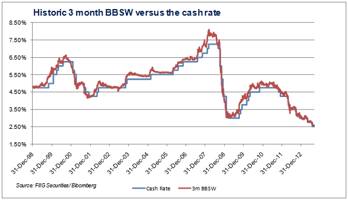

The Bank Bill Swap Bid Rate (BBSY) stands as a fundamental financial benchmark within the Australian financial system, exerting substantial influence across a broad spectrum of financial instruments. As a key component in the financial landscape, the BBSY is central to interest rate swaps and financial derivatives, providing a reference point that is crucial for financial institutions and investors alike to comprehend. Its significance is underscored by its frequent use in pricing mechanisms and valuation models.

A thorough understanding of the BBSY is essential for assessing its impact on the financial market. Its role extends beyond national boundaries, interacting with global benchmarks like LIBOR and EURIBOR, reflecting its pivotal position not only locally but also within the global financial system. This article will examine how financial products are priced and valued using the BBSY and assess its interaction with algorithmic trading practices, highlighting its prominence in modern finance.



The mechanics of the BBSY are intricate, influencing a range of pricing models due to its sensitivity to various economic factors such as monetary policy, market sentiment, and liquidity levels. These dynamics are crucial for financial models, influencing how derivatives are priced and risk is managed. As such, understanding the factors affecting BBSY rates is indispensable for market participants looking to predict trends and align their financial strategies.

Finally, the role of BBSY in algorithmic trading exemplifies the intricate connection between traditional financial benchmarks and cutting-edge technology. The precision and stability of BBSY make it an attractive component for automated trading strategies, highlighting the intersection of finance and technology where BBSY plays a critical role.

## Table of Contents

## Understanding the Bank Bill Swap Bid Rate (BBSY)

The Bank Bill Swap Bid Rate (BBSY) is a significant financial benchmark in the Australian markets, primarily used for pricing and valuing short-term securities. It acts as a reference point for determining the interest rates on a diverse array of financial instruments. Derived from the Bank Bill Swap Rate (BBSW), BBSY represents the average bid rate of leading banks for a bank bill swap transaction. While BBSW is the average mid-rate for bank bill transactions, BBSY incorporates the bid component, making it crucial for setting floating interest rates.

Financial institutions employ BBSY as a benchmark to establish interest rates on various financial products, including loans and derivative instruments. The rate is published daily and reflects the market conditions, offering insights into the cost of borrowing for a defined period. Typically linked to tenors ranging from one month to a year, BBSY helps gauge the banks' cost for unsecured funds, thereby influencing pricing structures.

Understanding how BBSY is calculated is vital for market participants. It involves averaging the bid rates submitted by a panel of significant banks engaged in the interbank market. These submissions reflect the rates at which these institutions are willing to lend funds to one another. The reliability and transparency of BBSY as a benchmark rely on strict adherence to specific guidelines and oversight provided by the Australian Financial Markets Association (AFMA), ensuring accuracy in its reflection of current market conditions.

BBSY serves a broader role in the financial landscape by instilling confidence among investors and institutions. Its consistent use in setting interest rates aids in maintaining [liquidity](/wiki/liquidity-risk-premium) and stability within the financial system. For market participants, staying informed about BBSY trends and their influencing factors is crucial for making informed financial decisions.

## The Role of BBSY in Derivatives Trading

The Bank Bill Swap Bid Rate (BBSY) is an integral component of the derivatives market in Australia, serving as a fundamental reference rate for various financial instruments, including [interest rate](/wiki/interest-rate-trading-strategies) swaps and futures. Its influence extends across the entire spectrum of derivative pricing and valuation, making it a critical tool in the risk management strategies employed by financial institutions.

In derivatives trading, BBSY's influence is most notably seen in interest rate swaps, where it functions as a benchmark for determining periodic swap payments. Interest rate swaps typically involve the exchange of fixed interest rate payments for floating rate payments. Here, BBSY is utilized to set these floating rates, reflecting current market conditions and expectations. This alignment with BBSY allows traders to construct hedge strategies that mitigate risks associated with fluctuating interest rates. For instance, if a corporation has a loan with a variable interest rate and anticipates a rise in rates, they might enter into a swap agreement, using BBSY as a reference, to lock in current rates and control future interest expenses.

Moreover, BBSY affects the valuation of futures contracts. Futures are standardized agreements to buy or sell an asset at a predetermined future date and price. The pricing of such contracts is naturally tied to expected future interest rates, making BBSY an essential guide for traders. By referencing BBSY, traders can effectively manage exposure to potential interest rate changes, adjusting their portfolios to optimize risk and return. 

The strategic use of BBSY in derivatives trading is enabled by its capacity to accurately mirror the consensus of market expectations regarding interest rates. Traders leverage this attribute to synchronize their financial contracts with projected rate movements. For instance, as BBSY reflects anticipated shifts in monetary policy or economic conditions, derivatives traders align their strategies accordingly, avoiding mispricings and potential losses.

The integration of BBSY into these financial instruments underscores its role not only as an interest rate indicator but as a pivotal standard in aligning market expectations. Consequently, it assists in maintaining equilibrium in the derivatives market, enabling participants to devise informed and effective risk management strategies. The continued reliance on BBSY illustrates its critical importance in supporting the complex architecture of modern-day financial markets.

## Factors Influencing BBSY and Its Impact on Pricing Models

The Bank Bill Swap Bid Rate (BBSY) is a vital interest rate benchmark extensively utilized within the Australian financial market, where it plays a crucial role in the valuation and pricing of derivatives. Several critical factors influence the BBSY, thereby affecting the underlying pricing models used by financial institutions.

**Monetary Policy:** Monetary policy, enacted by the Reserve Bank of Australia (RBA), is a primary determinant of BBSY fluctuations. The central bank's interest rate decisions, open market operations, and other monetary tools directly influence short-term interest rates. When the RBA adjusts the cash rate, it often triggers a corresponding adjustment in the BBSY, which in turn impacts the cost of borrowing and the valuation of interest rate-sensitive instruments.

**Market Sentiment:** Investor perceptions and market sentiment can significantly influence BBSY. For instance, expectations about future economic conditions, geopolitical events, or significant financial news can cause market participants to reevaluate their risk positions, affecting short-term interest rates. A positive economic outlook may result in decreased risk premiums, while uncertainty can elevate them, altering BBSY rates.

**Credit Risk:** The perception of credit risk among financial institutions also plays a role in shaping BBSY. If market participants perceive increased risk associated with interbank lending, they may demand higher rates to compensate for the elevated risk, thereby pushing up the BBSY. Conversely, a stable or improving credit environment could lead to lower rates. Monitoring credit spreads, such as those between Australian bank notes and treasury securities, provides insights into perceived credit risk levels.

**Liquidity:** The availability of liquidity in the financial markets is a significant factor affecting BBSY. A high level of liquidity typically leads to lower interest rates as banks are more willing to lend at competitive rates, thereby reducing the BBSY. Conversely, tighter liquidity conditions can lead to higher rates and an elevated BBSY as financial institutions become more conservative in their lending practices.

These factors—monetary policy, market sentiment, credit risk, and liquidity—interact in complex ways to shape the BBSY. Understanding these elements is essential for financial institutions and investors to maintain robust pricing models for derivatives. Accurate prediction of BBSY trends requires comprehensive analysis of these contributing factors. By incorporating these influences into pricing models, financial strategists can make informed decisions, aligning with market expectations and optimizing risk management practices.

## Comparing BBSY with Other Benchmark Rates

The Bank Bill Swap Bid Rate (BBSY) serves as a significant benchmark in Australia, akin to other key financial benchmarks like the London Interbank Offered Rate (LIBOR) and the Euro Interbank Offered Rate (EURIBOR) used in different parts of the world. Each of these benchmarks plays an essential role in their respective regional financial markets, influencing everything from loan interest rates to derivative pricing. 

While all these rates serve as reference points for financial transactions, their underlying differences reflect distinct regional market dynamics and regulatory environments. BBSY, specifically used within the Australian framework, is derived from the Bank Bill Swap Rate (BBSW) and typically serves as a short-term interest rate benchmark. In contrast, LIBOR and EURIBOR are used more broadly across multiple currencies and regions. LIBOR, for instance, has been a global standard for decades, impacting a vast spectrum of financial products from mortgages to complex derivatives. However, its method of calculation, based largely on estimates rather than actual transactions, has led to significant scrutiny and eventual phasing out in favor of more transaction-based benchmarks like the Secured Overnight Financing Rate (SOFR).

EURIBOR, on the other hand, represents the average interest rate at which Eurozone banks offer to lend unsecured funds to other banks in the euro wholesale money market. Its reliance on a panel of banks differentiates it from BBSY, which is more closely tied to the actual trading activities in the Australian bank bill market.

Understanding these differences is crucial for financial institutions engaged in global markets. The specificity of each benchmark corresponds to its local market practices, reflecting various factors such as credit risk, liquidity, and economic policies particular to each region. For example, BBSY's value emanates primarily from the Australian bank bills market, whose dynamics are distinct from those governing the Eurozone's banking sector, thereby affecting its [volatility](/wiki/volatility-trading-strategies) and impact on derivative pricing.

These variations necessitate that financial institutions develop a comprehensive understanding of how these benchmarks affect their international financial operations. As trading becomes more global and interconnected, understanding the nuances of these rates, such as BBSY's dependence on Australia’s economic conditions versus EURIBOR’s reflection of Eurozone market trends, becomes imperative. Institutions must consider these varying benchmarks to align their financial strategies effectively, optimally managing exchange rate risks, pricing loans and investments, and integrating derivative products across different jurisdictions. 

Through this critical comparison, we see how benchmarks like BBSY not only influence local economic activities but also play a role in the broader context of global financial systems, underlining the necessity for nuanced awareness among financial participants to navigate the complexities of a globally integrated marketplace.

## Challenges and Risks Associated with BBSY

The Bank Bill Swap Bid Rate (BBSY) plays a significant role in Australia's financial landscape, but it is not without its challenges and risks. One major concern surrounding BBSY is the potential for market manipulation. Market manipulation can occur when there is insufficient transparency or oversight, leading to distorted rates that do not accurately reflect the true market conditions. Such manipulations can have extensive repercussions, affecting the pricing of a myriad of financial products linked to BBSY, including loans, derivatives, and securities.

Liquidity issues also pose substantial challenges for BBSY. In times of market stress or economic uncertainty, maintaining adequate liquidity levels becomes increasingly difficult. A lack of liquidity can lead to increased volatility in the BBSY rates, complicating the efforts of financial institutions to set accurate interest rates and manage risks effectively. Inadequate liquidity can further exacerbate the challenges faced by market participants, leading to wider spreads and potentially mispriced financial instruments.

To mitigate these risks, regulatory oversight plays a crucial role. Regulatory bodies aim to enhance transparency and implement stringent controls to prevent market manipulation and ensure the reliability of BBSY as a benchmark rate. This includes regular audits, mandatory reporting, and the establishment of robust governance frameworks among financial institutions involved in setting and reporting BBSY.

Despite these measures, market participants must remain vigilant. Navigating these risks successfully involves implementing rigorous internal controls, adopting best practices in risk management, and staying informed about regulatory changes and market dynamics. Financial institutions relying on BBSY should continuously assess their exposure to these risks and develop contingency strategies to address potential disruptions.

Furthermore, the integration of technological solutions, such as real-time data analytics and automated monitoring systems, can aid in early detection of anomalies or manipulative activities. These tools can help institutions respond promptly to unusual market behavior, thus minimizing their risk exposure related to BBSY fluctuations.

In conclusion, while BBSY remains a vital benchmark in the Australian financial markets, understanding and addressing its associated challenges is crucial for maintaining stability and integrity in financial operations. The combination of regulatory oversight and proactive risk management strategies can help mitigate the inherent risks and ensure the continued reliability of BBSY as an essential financial instrument.

## Evolving Trends in BBSY and Algorithmic Trading

Technological advancements have significantly transformed financial trading, predominantly through the use of [machine learning](/wiki/machine-learning) and [artificial intelligence](/wiki/ai-artificial-intelligence) (AI). The Bank Bill Swap Bid Rate (BBSY) plays a pivotal role in this transformation, particularly within [algorithmic trading](/wiki/algorithmic-trading) frameworks. Algorithmic trading relies on the precision and predictability of BBSY, which are critical for executing trades efficiently and effectively. The inherent stability and reliability of BBSY allow traders to design algorithms that can predict and react swiftly to market movements, enhancing their ability to generate profit.

Machine learning models, such as regression analysis and neural networks, are employed to analyze the historical data of BBSY and uncover patterns that may predict future changes. These models are capable of processing vast amounts of historical market data to discern subtle trends that human traders might overlook. The following Python code snippet illustrates a simple regression analysis using historical BBSY data to predict future rates:

```python
import pandas as pd
from sklearn.model_selection import train_test_split
from sklearn.linear_model import LinearRegression
from sklearn.metrics import mean_squared_error

# Load historical BBSY data
data = pd.read_csv('bbsy_historical_data.csv')

# Pre-process and prepare data
X = data[['previous_rate', '[volume](/wiki/volume-trading-strategy)', 'market_sentiment']]  # Features
y = data['current_rate']  # Target variable

# Split data into training and test sets
X_train, X_test, y_train, y_test = train_test_split(X, y, test_size=0.2, random_state=42)

# Initiate and train the regression model
model = LinearRegression()
model.fit(X_train, y_train)

# Predict future BBSY rates
predictions = model.predict(X_test)

# Evaluate the model
mse = mean_squared_error(y_test, predictions)
print(f'Mean Squared Error: {mse}')
```

Incorporating BBSY into algorithmic models illustrates a dynamic merge of finance and technology, setting the stage for more nuanced trading strategies. Advanced AI algorithms, such as Reinforcement Learning, are devised for more sophisticated trading scenarios where the systems are trained to make decisions that maximize returns based on BBSY fluctuations. These technologies learn to adjust strategies in real-time, offering banks and financial institutions an unprecedented competitive edge.

Moreover, algorithmic trading systems leveraging BBSY are optimized for speed and precision, essential attributes in today's high-frequency trading environments. The accurate capture of BBSY movements facilitates trades that align closely with market demand and offer better pricing models.

As AI technologies continue to evolve, their integration with reliable financial benchmarks like BBSY will drive further innovations in trading strategies. This integration not only enhances trading efficiencies but also mitigates risks associated with human errors in trade execution. Therefore, the relationship between BBSY and algorithmic trading represents a significant advancement for the financial sector, underscoring the transformative impact of technology on market operations and strategy implementations.

## Conclusion

The Bank Bill Swap Bid Rate (BBSY) continues to be a fundamental element within the financial markets of Australia, with extensive interactions on a global scale. Its significance is underscored by its pervasive role in derivatives trading and its influence on pricing models. As a benchmark for interest rates, BBSY shapes the strategic landscape for financial institutions, informing their approach to risk management and investment decisions.

In derivatives trading, BBSY is used as a reference rate, providing a foundation for the pricing and valuation of various financial products like interest rate swaps and futures. These instruments rely heavily on the predictability and stability offered by BBSY, enabling traders to align financial contracts with market expectations of future interest rates. This alignment is crucial for managing risks associated with interest rate fluctuations, ensuring institutions can maintain profitability while safeguarding against market volatility.

The evolving trends in BBSY applications, particularly within the context of algorithmic trading, are of paramount importance. The rise of technology such as machine learning and artificial intelligence has transformed financial trading, making it imperative for market participants to integrate BBSY accurately and effectively within their algorithmic strategies. Algorithmic trading depends on the precision of data inputs to execute trades efficiently and cost-effectively. BBSY provides this precision, making it a valuable component in digital trading models and strategies.

In summary, mastering the dynamics of BBSY is not just beneficial but essential for financial institutions aiming to stay competitive. Understanding how BBSY influences financial products and adapting to technological advancements in trading can significantly enhance a firm’s strategic positioning. Institutions that effectively leverage BBSY will not only optimize their interest rate exposure but also strengthen their participation in both domestic and international markets, ensuring resilience in a rapidly evolving financial landscape.

## References & Further Reading

[1]: ["The Bank Bill Swap Rate and its role in the financial marketplace"](https://fastercapital.com/content/Benchmark-rates--The-significance-of-the-Bank-Bill-Swap-Bid-Rate.html) by the Australian Financial Markets Association (AFMA)

[2]: ["Monetary Policy Implementation: Principles and Practice"](https://www.federalreserve.gov/monetarypolicy/monetary-policy-principles-and-practice.htm) by the Reserve Bank of Australia

[3]: ["Algorithmic Trading & DMA: An introduction to direct access trading strategies"](https://www.amazon.com/Algorithmic-Trading-DMA-introduction-strategies/dp/0956399207) by Barry Johnson

[4]: Duffie, D., & Singleton, K. J. (2003). ["Credit Risk: Pricing, Measurement, and Management"](https://press.princeton.edu/books/hardcover/9780691090467/credit-risk) Princeton University Press.

[5]: ["Interest Rate Swaps and their Derivatives: A Practitioner's Guide"](https://onlinelibrary.wiley.com/doi/book/10.1002/9781118267967) by Amir Sadr

[6]: ["Global Financial Stability Report, April 2022: Shockwaves from the War in Ukraine"](https://www.imf.org/en/Publications/GFSR/Issues/2022/04/18/Global-Financial-Stability-Report-April-2022-516158) by the International Monetary Fund

[7]: ["Interest Rate Markets: A Practical Approach to Fixed Income"](https://onlinelibrary.wiley.com/doi/book/10.1002/9781119200949) by Siddhartha Jha