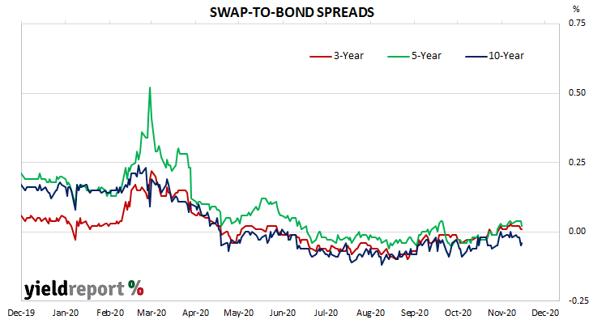

## Table of Contents

## What is the Bank Bill Swap Rate (BBSW)?

The Bank Bill Swap Rate (BBSW) is an interest rate that banks in Australia use as a benchmark for short-term loans. It's like a standard rate that helps banks decide how much interest they should charge each other when they borrow money for a short time, usually less than a year. The BBSW is calculated every day by looking at the rates that banks are willing to lend and borrow money at.

This rate is important because it affects many other interest rates, like those for home loans, business loans, and savings accounts. When the BBSW goes up, it usually means that other interest rates will go up too, making borrowing more expensive. When it goes down, borrowing becomes cheaper. So, the BBSW is a key number that helps everyone from banks to regular people understand the cost of borrowing money.

## Why is the BBSW important in financial markets?

The BBSW is really important in financial markets because it acts like a guide for setting interest rates on many different kinds of loans and financial products. When banks and other financial institutions need to borrow money from each other for a short time, they look at the BBSW to decide what interest rate to use. This rate helps keep things fair and clear in the market. It's like a common language that everyone in finance understands, making it easier for them to do business with each other.

Because the BBSW affects so many other interest rates, it has a big impact on the whole economy. For example, if the BBSW goes up, banks might raise the interest rates on home loans and business loans, which can make borrowing more expensive for people and companies. On the other hand, if the BBSW goes down, borrowing becomes cheaper, which can encourage more spending and investment. This way, the BBSW helps to shape how the economy grows and changes over time.

## How is the BBSW used in financial transactions?

The BBSW is used in financial transactions as a reference rate for setting interest rates on many different kinds of loans and financial products. When banks lend money to each other for a short time, they use the BBSW to decide what [interest rate](/wiki/interest-rate-trading-strategies) to charge. This helps make sure that the rates are fair and everyone understands what's going on. For example, if a bank wants to borrow money from another bank for three months, they might agree to pay an interest rate that's a little bit more than the BBSW for that period.

The BBSW also affects the interest rates that people and businesses see when they take out loans or put money in savings accounts. For instance, if you're getting a home loan, the bank might set your interest rate by adding a certain percentage to the BBSW. So, if the BBSW goes up, your loan might get more expensive. On the other hand, if you have a savings account, the interest you earn might go up when the BBSW increases. This way, the BBSW helps to guide the cost of borrowing and saving for everyone in the economy.

## What are the key components needed to calculate the BBSW?

To calculate the BBSW, banks in Australia submit their rates for short-term loans to a special group called the Australian Financial Markets Association (AFMA). These rates show how much interest the banks are willing to pay to borrow money from each other for different periods, like one month or three months. The AFMA then takes these rates and throws out the highest and lowest ones to make sure the calculation is fair and not influenced by any extreme numbers.

After removing the highest and lowest rates, the AFMA averages the remaining rates to find the BBSW. This average rate becomes the benchmark that everyone in the financial market uses to set interest rates for short-term loans. By doing it this way, the BBSW reflects what's really happening in the market and helps keep things clear and fair for everyone involved.

## Can you explain the process of calculating the BBSW?

To calculate the BBSW, banks in Australia tell a group called the Australian Financial Markets Association (AFMA) how much interest they would pay to borrow money from other banks for different periods, like one month or three months. These rates are important because they show what's happening in the market. Once AFMA gets all these rates, they throw out the highest and lowest ones. This is done to make sure the calculation is fair and not affected by any extreme numbers.

After removing the highest and lowest rates, AFMA takes the remaining rates and averages them. This average becomes the BBSW, which is used as a benchmark for short-term loans. By calculating it this way, the BBSW gives a clear and fair picture of what interest rates should be, helping banks and other financial institutions set their own rates for loans and savings accounts.

## Who are the main participants in the BBSW market?

The main participants in the BBSW market are the big banks in Australia. These banks, like Commonwealth Bank, Westpac, ANZ, and NAB, are the ones who send in their rates to the Australian Financial Markets Association (AFMA). They do this because they often need to borrow money from each other for short periods, and the BBSW helps them decide what interest rate to use.

Besides the banks, other financial institutions and companies also use the BBSW. They might not be directly involved in setting the rate, but they look at the BBSW to figure out the interest rates for their own loans and savings products. This way, the BBSW affects everyone in the financial market, from big banks to smaller businesses and even regular people who take out loans or save money.

## How does the BBSW differ from other benchmark rates like LIBOR?

The BBSW, or Bank Bill Swap Rate, is used in Australia as a benchmark for short-term loans between banks, while LIBOR, or the London Interbank Offered Rate, was used globally for the same purpose until it was phased out in 2023. One big difference is where they are used: BBSW is specific to Australia, and LIBOR was used all over the world. Another difference is how they are calculated. BBSW is calculated by taking the average of the middle rates that Australian banks submit, after removing the highest and lowest rates. LIBOR, on the other hand, was based on the rates that banks said they would charge to lend money to other banks, without removing the highest and lowest rates.

Both BBSW and LIBOR are important because they help set interest rates for many different kinds of loans and financial products. But because LIBOR was used globally, it affected a lot more markets than BBSW, which is mainly used in Australia. Also, LIBOR faced a lot of problems because some banks were not honest about the rates they submitted, which led to it being replaced by other rates like SOFR (Secured Overnight Financing Rate) in the U.S. and SONIA (Sterling Overnight Index Average) in the U.K. BBSW, however, has been seen as more reliable and continues to be used in Australia.

## What are the typical maturities for BBSW?

The BBSW, or Bank Bill Swap Rate, comes in different time periods, or maturities. The most common ones are one month, two months, three months, four months, five months, and six months. These different time periods help banks and other financial institutions choose the right length for their short-term loans.

Each of these maturities has its own rate, which is calculated every day. This means that the interest rate for a three-month loan might be different from the rate for a one-month loan. By having these different time periods, the BBSW can be used for a variety of financial needs, making it a useful tool for setting interest rates in the Australian market.

## How has the methodology for calculating BBSW evolved over time?

The way the BBSW is calculated has changed over time to make it more accurate and fair. In the past, the BBSW was based on the rates that banks said they would charge each other for short-term loans. These rates were submitted to the Australian Financial Markets Association (AFMA), which then calculated the BBSW by averaging the middle rates after removing the highest and lowest ones. This method was used to make sure the rate was a good reflection of what was happening in the market.

In 2013, the calculation method was updated to improve its reliability. Now, instead of just using the rates that banks say they would charge, the BBSW is calculated based on actual trades in the market. This new method looks at real transactions to find the rate, making it more reflective of what's really happening. By using real trades, the BBSW has become more transparent and trusted by everyone in the financial market.

## What are the regulatory requirements for BBSW?

The BBSW is regulated by the Australian Securities and Investments Commission (ASIC) to make sure it's fair and accurate. Banks have to follow strict rules when they send in their rates for the BBSW. They need to use real information from the market and not make up numbers. This helps keep the BBSW honest and reliable. ASIC also watches over the whole process to make sure everything is done right.

In 2013, the way BBSW is calculated changed to make it even better. Now, it's based on actual trades in the market, not just what banks say they would charge. This new method helps make the BBSW more transparent and trustworthy. ASIC keeps a close eye on these changes to make sure the new rules are followed and that the BBSW stays a good benchmark for interest rates.

## How does BBSW impact the pricing of financial products?

The BBSW, or Bank Bill Swap Rate, is really important for setting the prices of many financial products in Australia. When banks want to borrow money from each other for a short time, they use the BBSW to decide how much interest they should charge. This rate then affects other loans and financial products, like home loans, business loans, and even savings accounts. If the BBSW goes up, the interest rates on these products usually go up too, making borrowing more expensive. When the BBSW goes down, borrowing becomes cheaper, which can encourage more spending and investment.

Because the BBSW is used as a benchmark, it helps keep things fair and clear in the financial market. Banks and other financial institutions use the BBSW to set their own interest rates, which means it influences the cost of borrowing and saving for everyone. For example, if you're taking out a loan, the interest rate might be set by adding a certain percentage to the BBSW. If you have a savings account, the interest you earn might be based on the BBSW too. This way, the BBSW plays a big role in how much people and businesses pay for loans and how much they earn on their savings.

## Can you provide a real-world example of how BBSW is applied in a financial contract?

Imagine you're a small business owner in Australia who needs a loan to buy new equipment. You go to your bank, and they offer you a variable rate loan. The interest rate on this loan is set by adding a certain percentage, called a margin, to the BBSW. Let's say the BBSW for a three-month period is 1.5%, and the bank adds a margin of 2%. That means the interest rate on your loan would be 3.5% for the next three months. Every three months, the bank looks at the new BBSW rate and adjusts your loan's interest rate accordingly. If the BBSW goes up to 2%, your new interest rate would be 4%.

This example shows how the BBSW directly affects the cost of borrowing for you. If the BBSW goes up, your loan payments could get more expensive, and if it goes down, your payments could become cheaper. This way, the BBSW helps set a fair and clear interest rate that changes with the market, making sure both you and the bank know what to expect. It's like a guide that keeps everything in the financial world running smoothly and fairly.

## References & Further Reading

[1]: ["How the Bank Bill Swap Rate (BBSW) Works"](https://www.investopedia.com/terms/b/bank-bill-swap-rate-bbsw.asp) - Investopedia

[2]: ["ASX Benchmarks"](https://www.asx.com.au/connectivity-and-data/information-services/benchmarks) - Australian Securities Exchange (ASX)

[3]: RBA (2023). ["Financial Benchmark Reforms"](https://www.brightlaw.com.au/reserve-bank-reforms-bill-passed/) - Reserve Bank of Australia

[4]: ["Algorithmic and High-Frequency Trading"](https://www.amazon.com/Algorithmic-High-Frequency-Trading-Mathematics-Finance/dp/1107091144) by Álvaro Cartea, Sebastian Jaimungal, and Jose Penalva

[5]: ["Interest Rates and Financial Markets"](https://finfoc.com/interest-rates-and-financial-markets/) by Mansoor Dailami and Dinesh Kumar