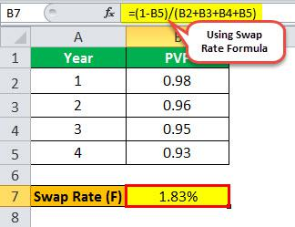

In today's dynamic financial world, understanding key benchmarks and financial instruments is crucial both for institutions and individual investors. One such benchmark that holds significant importance in the Australian financial markets is the Bank Bill Swap Rate (BBSR), also known as the Bank Bill Swap Reference Rate. The BBSR is used extensively in financial calculations, influencing the pricing of a wide array of financial products, from loans and bonds to derivatives, particularly those involving the Australian dollar. 

This article aims to provide a comprehensive overview of various facets of the BBSR, covering its calculation and its pivotal role in financial products and markets. The BBSR is not only a cornerstone in the context of traditional financial activities but also significantly impacts algorithmic trading strategies. Algorithmic trading, which leverages advanced quantitative models and automated processes, uses benchmarks like the BBSR to refine trades and manage risks more effectively.



In the subsequent sections, we will explain how the BBSR is calculated, delve into its importance in the financial ecosystem, explore its applications across different financial products, and examine its implications for algorithmic traders who rely on precise and timely data to optimize their trading strategies. Understanding these elements is essential for market participants aiming to make informed investment decisions and manage financial risk efficiently.

## Table of Contents

## Understanding the Bank Bill Swap Rate (BBSR)

The Bank Bill Swap Rate (BBSR) serves as a crucial short-term interest rate benchmark within the Australian financial landscape, primarily influencing the pricing mechanisms of Australian dollar derivatives and securities. This rate is particularly significant for floating rate bonds, as it directly affects their interest calculations. The BBSR functions as an essential component of the financial system in Australia, impacting a broad spectrum of financial instruments and products.

Essentially, the BBSR is the reference interest rate derived from the observable rate in the bank bill market. The bank bill market is a subset of the money market where banks trade short-term instruments, usually up to six months, to manage their liquidity needs and interest rate exposure. The BBSR reflects the average interest rate that Australian banks charge each other for lending and borrowing these bank bills. This interbank lending rate becomes a foundational benchmark for various financial products, facilitating more accurate pricing models and helping to manage interest rate risk.

Understanding the mechanics of the BBSR is invaluable for investors and institutions aiming to make strategically informed financial decisions. As BBSR acts as a reference for a wide range of financial instruments, any fluctuations in its value can influence borrowing costs, investment decisions, and risk management strategies. Familiarity with BBSR allows financial market participants to evaluate economic conditions more reliably and to predict the impact of interest rate movements on their portfolios.

Given its systemic relevance, the BBSR's ripple effects can also extend beyond immediate financial transactions, affecting broader economic activities, corporate financing, and individual investment returns. Consequently, the BBSR not only aids in pricing financial products efficiently but also serves as a barometer for the overall [interest rate](/wiki/interest-rate-trading-strategies) environment in Australia, making it an indispensable point of reference for both market participants and policymakers.

## Calculation and Role of BBSR in Financial Products

The Bank Bill Swap Rate (BBSR) is an essential component in the pricing architecture of financial products in Australia. It is calculated as the average rate of bank bills, representing short-term debt instruments, across various maturities. These maturities typically range from one month to one year. The rate is meticulously maintained and published by the Australian Securities Exchange (ASX), which consolidates data submitted by contributing banks. 

The BBSR serves as an independent reference rate frequently utilized as a benchmark in the structuring and valuation of numerous financial instruments including loans, bonds, and derivatives. Such usage underscores its pivotal role in financial markets, offering a standardized measure against which floating interest rates are often set. Its reliability and standardized nature make it a preferred choice for both leasers and investors in evaluating interest rate exposure and transaction costs.

In practice, the BBSR is derived through a weighted average of actual market-based bank bill yields. Participating financial institutions submit their borrowing rates, and the ASX aggregates these to ascertain the mean, ensuring an unbiased estimate of the market's status. A small credit risk premium is frequently added to the base BBSR to reflect the inherent risks when compared to a theoretically risk-free rate, such as that of government securities. This adjustment helps in accounting for fluctuations and potential credit risks, providing a more comprehensive representation of possible market conditions.

Incorporating the BBSR into financial products enables firms to hedge against interest rate changes effectively. By associating floating rates to the BBSR benchmark, institutions can manage risks associated with variable interest rate markets, offering investors predictable revenue streams aligned with prevailing market conditions. Consequently, the BBSR becomes an indispensable tool in constructing financial products that are both competitive and responsive to economic changes.

## BBSR in Automated and Algorithmic Trading

Algorithmic trading has revolutionized the financial markets, employing quantitative strategies and automation to enhance transaction efficiency and achieve superior margins. At the heart of this sophisticated trading approach lies the Bank Bill Swap Rate (BBSR), serving as a crucial benchmark. Traders utilize the BBSR to understand the current interest rate landscape, enabling them to adjust their trading algorithms effectively.

The robustness of [algorithmic trading](/wiki/algorithmic-trading) is inherently linked to the precision and promptness of the data it leverages. The BBSR offers timely and accurate data that is indispensable for executing trades swiftly and managing risks. This rate provides a snapshot of the short-term interest rate environment, allowing algorithms to make informed decisions about entering or exiting positions. As a floating benchmark, the BBSR reflects the market’s credit risk perceptions and serves as a critical input for dynamic trading strategies.

Algorithmic traders analyze BBSR trends to infer market sentiment and potential fluctuations in borrowing costs. As the BBSR shifts, it signals varying levels of [liquidity](/wiki/liquidity-risk-premium) and credit risk. Therefore, algorithms are programmed to monitor BBSR changes and respond in real-time, minimizing potential losses and optimizing returns. The following python snippet illustrates a simplified algorithm using BBSR data:

```python
def adjust_strategy(bbsr):
    if bbsr > threshold_high:
        # Reduction in long positions due to high borrowing costs
        return "Sell"
    elif bbsr < threshold_low:
        # Increase long positions as borrowing is cheaper
        return "Buy"
    else:
        # Maintain current strategy
        return "Hold"

# Example BBSR data point
bbsr_current = 0.015  # BBSR value
strategy_decision = adjust_strategy(bbsr_current)
print(f"Strategy decision based on BBSR: {strategy_decision}")
```

This strategy considers the BBSR as an indicator to determine trading actions. By integrating such logic into sophisticated trading models, algorithmic traders harness the BBSR to maintain an edge in fast-paced financial markets. Consequently, the BBSR's role in algorithmic trading is indispensable, facilitating informed decision-making and enhancing the profitability and reliability of trading operations.

## Impact of BBSR Changes on Market Conditions

A shift in the Bank Bill Swap Rate (BBSR) signifies alterations in credit risk perceptions and the expense of short-term borrowing in financial markets. The BBSR is a critical indicator of the prevailing economic environment. When BBSR values rise, it often indicates tighter financial conditions. This uptick suggests an increase in the perceived credit risk and borrowing costs, leading to a reduction in the ease of acquiring short-term capital. In contrast, lower BBSR values imply a more liquid market, where credit risk is perceived as lower, and borrowing costs decrease, facilitating easier access to funds.

Being attuned to these fluctuations is vital for investors and institutions, particularly those engaged in trading activities. Both manual and algorithmic trading systems can greatly benefit from understanding the nuances of BBSR changes to refine their investment strategies. In markets where the BBSR is on an upward trend, traders might adopt more conservative strategies, potentially by decreasing leverage or shifting to safer asset classes to mitigate risk. Conversely, when the BBSR trends downward, there might be an inclination toward more aggressive strategies, taking advantage of favorable borrowing conditions to leverage investments.

Algorithmic trading systems can especially harness the precision of BBSR data, integrating real-time changes into optimization algorithms to dynamically adjust trading tactics according to the current economic landscape. For instance, an algorithm might employ a simple decision tree to determine investment levels based on BBSR inputs:

```python
def adjust_strategy(bbsr_value):
    if bbsr_value > threshold_high:
        return 'Conservative Strategy: Reduce Leverage'
    elif bbsr_value < threshold_low:
        return 'Aggressive Strategy: Increase Leverage'
    else:
        return 'Stable Strategy: Maintain Position'

# Example usage
current_bbsr = 1.75  # hypothetical current BBSR
strategy = adjust_strategy(current_bbsr)
```

In this scenario, the algorithm aids in dictating whether to pursue a conservative or aggressive trading strategy, aligning with the liquidity conditions denoted by the BBSR.

Ultimately, recognizing the implications of BBSR movements informs not only the immediate transaction environment but also aids in forecasting macroeconomic trends, allowing traders and financial institutions to implement strategies that align with future market expectations.

## Limitations and Risks of Using the BBSR

In the financial landscape, the Bank Bill Swap Rate (BBSR) serves as a crucial benchmark. However, like other reference rates, it is not without limitations. Market disruptions can significantly impact its reliability, leading to potential fluctuations in the rate that do not accurately reflect the underlying market conditions. This sensitivity to market disturbances can pose challenges for those relying heavily on the BBSR for financial calculations and decision-making.

The potential for manipulation is a notable risk. The BBSR, although maintained independently, can be influenced by the submissions of participating banks. If these banks were to provide skewed data intentionally, it could lead to a rate that benefits particular entities at the expense of others. Historical instances in global markets have shown that benchmark rates can be manipulated, causing considerable market distortions and financial losses.

Moreover, the lack of transaction depth can impact the BBSR's robustness. The rate is based on a relatively limited pool of data points, particularly at times of reduced trading activity. This sparse data foundation can make the BBSR susceptible to anomalies, as even a few atypical transactions may disproportionately affect the calculated rate.

Due to these inherent limitations and risks, it's prudent to complement BBSR data with other market indicators when conducting risk assessments or financial analysis. Blending the BBSR with additional financial data, such as government bond yields or alternative interest rate benchmarks, can provide a more nuanced view of market conditions, thereby improving decision-making processes. For instance, employing a Python script to aggregate and analyze multiple benchmarks can help identify outliers and cross-validate the integrity of the BBSR data. Here is a basic example of such an approach:

```python
import numpy as np
import pandas as pd

def compare_benchmarks(bbsr_data, other_benchmark_data):
    # Assuming bbsr_data and other_benchmark_data are pandas DataFrames with the same date index
    combined_data = pd.concat([bbsr_data, other_benchmark_data], axis=1)
    combined_data.columns = ['BBSR', 'OtherRate']

    # Calculate correlation to understand alignment
    correlation = combined_data.corr().iloc[0, 1]

    # Identify periods of significant deviation
    deviation = combined_data['BBSR'] - combined_data['OtherRate']
    significant_deviation = deviation[np.abs(deviation) > deviation.std()]

    return correlation, significant_deviation

bbsr_data = pd.DataFrame({'Rate': [2.5, 2.6, 2.55, 2.7]}, index=pd.date_range(start='2023-10-01', periods=4))
other_benchmark_data = pd.DataFrame({'Rate': [2.4, 2.55, 2.6, 2.75]}, index=pd.date_range(start='2023-10-01', periods=4))

correlation, deviations = compare_benchmarks(bbsr_data, other_benchmark_data)

print(f'Correlation: {correlation}')
print(f'Significant Deviations: {deviations}')
```

In summary, while the BBSR serves as a valuable tool in financial markets, it is essential to remain vigilant about its inherent risks and limitations. Utilizing complementary data sources and advanced analytical techniques can mitigate these risks, providing a more holistic view of the market and supporting more informed financial decisions.

## Conclusion

The Bank Bill Swap Rate (BBSR) is instrumental in Australia's financial landscape, serving as a dependable benchmark for a wide array of financial undertakings. As a key component in the toolbox of algorithmic traders, the BBSR aids in crafting strategies through its insights into prevailing interest rates. This assists not only in optimizing transactions but also in managing risks effectively. By anchoring trading algorithms to the BBSR, traders gain the ability to make informed decisions aligned with the current interest rate environment, thereby enhancing trade efficiency.

Despite its importance, the BBSR is not devoid of limitations. The potential for market disruptions can impede its functionality, while concerns regarding its susceptibility to manipulation raise questions about its absolute reliability. Moreover, the depth of transactions underpinning the BBSR can sometimes be limited, which may impact its representativeness during turbulent market conditions. 

Nevertheless, by combining BBSR data with other market indicators and assessments, investors and traders can achieve a holistic view of the financial landscape. This approach ensures that the BBSR remains a pivotal reference point, aiding stakeholders in understanding market dynamics and executing robust trading strategies. The integration of the BBSR into decision-making processes continues to be a valuable tool for those navigating the complexities of modern financial markets.

## References & Further Reading

[1]: ["How the Bank Bill Swap Rate (BBSW) Works"](https://www.investopedia.com/terms/b/bank-bill-swap-rate-bbsw.asp) - Investopedia

[2]: ["ASX Benchmarks"](https://www.asx.com.au/connectivity-and-data/information-services/benchmarks) - Australian Securities Exchange (ASX)

[3]: RBA (2023). ["Financial Benchmark Reforms"](https://www.brightlaw.com.au/reserve-bank-reforms-bill-passed/) - Reserve Bank of Australia

[4]: ["Algorithmic and High-Frequency Trading"](https://www.amazon.com/Algorithmic-High-Frequency-Trading-Mathematics-Finance/dp/1107091144) by Álvaro Cartea, Sebastian Jaimungal, and Jose Penalva

[5]: ["Interest Rates and Financial Markets"](https://finfoc.com/interest-rates-and-financial-markets/) by Mansoor Dailami and Dinesh Kumar