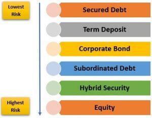

## Table of Contents

## What is bank capital?

Bank capital is the money that a bank has to keep to make sure it can handle risks and keep running smoothly. It acts like a safety net, helping the bank to cover losses if things go wrong, like if loans don't get paid back. This money comes from the bank's own funds, like money from shareholders or profits that the bank keeps instead of giving out as dividends.

Having enough bank capital is important because it shows that the bank is strong and can be trusted. Regulators, like government agencies, set rules on how much capital a bank needs to have. This helps to protect customers and the overall economy. If a bank doesn't have enough capital, it might have to cut back on lending or even fail, which can cause big problems.

## Why is bank capital important?

Bank capital is really important because it helps keep banks safe and strong. It's like a cushion that protects the bank from losing too much money if things go wrong, like if people can't pay back their loans. This safety net makes sure the bank can keep going even when there are problems. Without enough capital, a bank might have to stop lending money or could even go out of business, which would be bad for everyone who uses the bank.

Having enough bank capital also makes people trust the bank more. When customers know that a bank has a good amount of capital, they feel more confident that their money is safe. This trust is important for the whole economy because it keeps money moving and helps businesses grow. Regulators make rules about how much capital banks need to have to make sure they are strong and to protect the people who use the banks.

## What are the basic types of bank capital?

Bank capital comes in two main types: Tier 1 and Tier 2. Tier 1 capital is the most important kind because it's the strongest and most reliable. It includes money from the bank's shareholders, like stocks they've bought, and the bank's own profits that it keeps instead of giving away. This type of capital is super important because it shows how strong and stable the bank is. If a bank has a lot of Tier 1 capital, it means the bank can handle big problems without falling apart.

Tier 2 capital is like a backup plan. It's not as strong as Tier 1, but it still helps. Tier 2 capital includes things like special kinds of loans that the bank can use if it needs to, and some other types of money that aren't as permanent as Tier 1. While Tier 2 capital isn't the first line of defense, it adds an extra layer of protection for the bank. Together, Tier 1 and Tier 2 capital make sure the bank has enough money to stay safe and keep running smoothly, even when things get tough.

## How is bank capital regulated?

Bank capital is regulated by government agencies to make sure banks are safe and can handle risks. These agencies, like the Federal Reserve in the U.S., set rules that tell banks how much capital they need to have. The rules are based on the size of the bank and the kinds of risks it takes, like making loans or investing in certain things. The idea is to make sure banks have enough money to cover losses if things go wrong, so they can keep serving their customers and not cause problems for the economy.

The main rules that banks have to follow come from something called the Basel Accords, which are international agreements about bank capital. These agreements say that banks need to have a certain amount of Tier 1 and Tier 2 capital, and they explain how to measure it. Regulators check the banks regularly to make sure they are following these rules. If a bank doesn't have enough capital, the regulators can make the bank get more money or even take over the bank to protect customers and the economy.

## What is Tier 1 capital and what does it include?

Tier 1 capital is the most important type of bank capital because it's the strongest and most reliable. It's like the bank's core strength, showing how stable and healthy the bank is. Tier 1 capital comes from the money that shareholders put into the bank by buying its stocks, and from the profits that the bank decides to keep instead of giving out as dividends. This kind of capital is crucial because it helps the bank handle big problems without falling apart.

The main parts of Tier 1 capital are common equity and some other types of securities. Common equity is the money from shareholders who buy the bank's stocks, and it's the most important part of Tier 1 capital. The other part can include certain securities that have special features, like being able to absorb losses if the bank gets into trouble. Together, these elements make up Tier 1 capital, which is essential for keeping the bank strong and able to protect itself from financial shocks.

## What is Tier 2 capital and how does it differ from Tier 1?

Tier 2 capital is like a backup plan for banks. It's not as strong as Tier 1 capital, but it still helps keep the bank safe. Tier 2 capital includes things like special kinds of loans that the bank can use if it needs to, and some other types of money that aren't as permanent as Tier 1. While Tier 2 capital isn't the first line of defense, it adds an extra layer of protection for the bank.

The big difference between Tier 1 and Tier 2 capital is how reliable and strong they are. Tier 1 capital is the most important because it comes from the bank's own money, like what shareholders put in and the profits the bank keeps. This makes it very stable and reliable. On the other hand, Tier 2 capital is more like a safety net that the bank can use in emergencies. It's less reliable because it includes things that might not always be available or as strong as Tier 1 capital. Together, both types of capital help make sure the bank stays safe and can keep running smoothly, even when things get tough.

## What role does bank capital play in financial stability?

Bank capital is really important for keeping the financial system stable. It acts like a safety cushion for banks, helping them handle risks and losses. If a bank has enough capital, it can keep going even if some loans don't get paid back or if there are other financial problems. This helps prevent banks from failing, which is good for everyone because it means people can still use their bank accounts and get loans when they need them.

Having strong bank capital also helps keep the whole economy stable. When banks are safe and people trust them, money keeps moving around. This means businesses can borrow money to grow, and people can save and spend without worrying about their bank going under. Regulators make sure banks have enough capital to keep this trust and stability, which helps prevent big financial problems that can affect everyone.

## How do banks manage their capital ratios?

Banks manage their capital ratios by keeping a close eye on how much money they have compared to the risks they take. They do this by making sure they have enough Tier 1 and Tier 2 capital to meet the rules set by regulators. If a bank sees that its capital is getting low, it might decide to keep more of its profits instead of giving them out as dividends. Or, it might ask shareholders to put in more money by buying more stocks. Banks also look at the kinds of loans and investments they make, trying to balance riskier ones with safer ones to keep their capital strong.

Sometimes, banks might need to change what they do to manage their capital ratios better. For example, if a bank is growing quickly and making a lot of new loans, it might need more capital to cover the extra risk. In that case, the bank could slow down its lending or sell some of its loans to other banks or investors. This helps keep the bank's capital ratio healthy. By doing all these things, banks make sure they have enough money to stay safe and keep serving their customers, even when things get tough.

## What are the implications of inadequate bank capital?

If a bank doesn't have enough capital, it can run into big trouble. Without enough money to cover losses, the bank might have to stop lending or even go out of business. This can hurt people who have money in the bank because they might not be able to get their money back. It can also make it harder for businesses to grow because they can't get loans when they need them. When one bank has problems, it can make people worry about other banks too, which can lead to a bigger financial crisis.

Having inadequate bank capital can shake up the whole economy. When people lose trust in banks, they might take their money out, which can make the situation even worse. Regulators keep a close eye on banks to make sure they have enough capital to avoid these problems. If a bank doesn't meet the rules, regulators can step in and make the bank get more money or take other steps to fix the problem. This helps keep the financial system stable and protects everyone who uses the banks.

## How do international standards like Basel III affect bank capital requirements?

Basel III is an international set of rules that banks around the world have to follow. These rules were made to make banks stronger and safer, especially after the big financial crisis in 2008. Basel III says that banks need to have more capital than before, especially Tier 1 capital, which is the strongest kind. This means banks have to keep more of their own money to cover any losses, which helps make sure they can keep going even if things go wrong.

These new rules also change how banks measure risk and how much capital they need to keep for different kinds of loans and investments. Basel III makes banks be more careful about the risks they take and how much money they lend out. This helps keep the whole financial system more stable because banks are better prepared for problems. By following these rules, banks can help prevent big financial crises and keep people's trust in the banking system.

## What are the advanced strategies banks use to optimize their capital structure?

Banks use different smart ways to make their capital structure better. One way is by using something called Risk-Weighted Assets (RWA) management. This means banks look at how risky their loans and investments are and try to balance them out. They might decide to make fewer risky loans and more safe ones, so they don't need as much capital to cover losses. Banks also use fancy computer models to figure out how much risk they're taking and how much capital they need to keep things safe. By doing this, they can make sure they have just the right amount of capital to stay strong without having too much money sitting around.

Another strategy is called capital planning and stress testing. Banks make plans for the future, guessing how much money they'll make and how much capital they'll need. They also do stress tests, which are like practice runs to see what would happen if things went really bad, like if a lot of people couldn't pay back their loans all at once. By doing these tests, banks can see if they need more capital to be safe. If they do, they might keep more of their profits or ask shareholders for more money. This helps banks stay ready for tough times and keep their capital structure strong and healthy.

## How does the concept of economic capital differ from regulatory capital, and why is it important?

Economic capital and regulatory capital are two different ways to think about how much money a bank needs to stay safe. Economic capital is about the amount of money a bank thinks it needs to cover the risks it takes. Banks figure this out by using special math models and looking at how likely it is that something bad might happen, like people not paying back their loans. This helps banks make sure they have enough money to keep going, even if things get tough. It's important because it helps banks plan for the future and make smart decisions about how much risk they can handle.

Regulatory capital, on the other hand, is the amount of money that banks are told they must have by government rules. These rules, like the Basel Accords, say how much Tier 1 and Tier 2 capital banks need to keep. The idea is to make sure all banks are safe and can be trusted, no matter what. Regulatory capital is important because it helps keep the whole financial system stable. If banks follow these rules, it makes people feel more confident that their money is safe, which helps the economy run smoothly. Both types of capital are important for different reasons, but they work together to keep banks strong and protect everyone who uses them.

## References & Further Reading

[1]: BCBS. (2010). [Basel III: A global regulatory framework for more resilient banks and banking systems](https://www.bis.org/publ/bcbs189_dec2010.htm). Bank for International Settlements.

[2]: Hull, J.C. (2018). ["Risk Management and Financial Institutions"](https://books.google.com/books/about/Risk_Management_and_Financial_Institutio.html?id=1J1QDwAAQBAJ). Wiley Finance.

[3]: Hendershott, T., Jones, C. M., & Menkveld, A. J. (2011). [Does Algorithmic Trading Improve Liquidity?](https://onlinelibrary.wiley.com/doi/full/10.1111/j.1540-6261.2010.01624.x). The Review of Financial Studies, 24(5), 1465–1489.

[4]: MacKenzie, D. (2014). ["Be Grateful for Drizzle"](https://www.lrb.co.uk/the-paper/v36/n17/donald-mackenzie/be-grateful-for-drizzle). Journal of Cultural Economy, 7(1), 1-2.

[5]: Vaitilingam, R. (2013). [The Financial Crisis: A Guide to Understanding the Causes and Consequences](https://www.academia.edu/124354698/Understanding_Financial_Crises_Causes_Consequences_and_Policy_Responses). Centre for Economic Policy Research.

[6]: Treleaven, P., Galas, M., & Lalchand, V. (2013). [Algorithmic Trading Review](https://dl.acm.org/doi/10.1145/2500117). Journal of Trading, 8(3), 5-6.