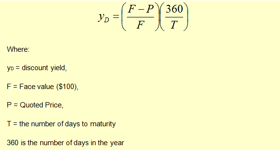

## Table of Contents

## What is the Bank Discount Basis?

The Bank Discount Basis is a way to calculate the interest on a short-term loan or investment, like a Treasury bill. It's different from other interest calculations because it uses the face value of the bill, not the actual amount you pay for it. The interest is figured out as a percentage of the face value, and it's taken off the price you pay upfront. This means you get less money when you buy the bill, but you get the full face value when it matures.

This method can make the yield seem higher than it really is because it's based on the face value, not the actual money you invest. For example, if you buy a $1,000 Treasury bill for $980, the bank discount rate is calculated on the $1,000, not the $980 you actually spent. This can be confusing, but it's important to understand because it affects how much you earn from your investment.

## How is the Bank Discount Basis different from other yield calculations?

The Bank Discount Basis is different from other yield calculations because it uses the face value of a security, like a Treasury bill, to figure out the interest. Most other methods use the actual price you pay for the security. For example, if you buy a $1,000 Treasury bill for $980, the Bank Discount Basis calculates the interest on the $1,000, not the $980 you paid. This makes the yield seem higher because it's based on a bigger number.

Another difference is that the Bank Discount Basis takes the interest out of the price you pay upfront. So, when you buy the security, you get less money right away, but you get the full face value when it matures. Other yield calculations might add the interest to the price you paid over time. This can make it harder to compare the Bank Discount Basis to other methods because it changes how and when you see the interest.

## What are the key components needed to calculate the Bank Discount Basis?

To calculate the Bank Discount Basis, you need to know three main things: the face value of the security, the purchase price, and the time until the security matures. The face value is the amount you will get back when the security matures. The purchase price is how much you pay for the security upfront. The time until maturity is how long you have to wait before you get the face value back.

The Bank Discount Basis is figured out by taking the difference between the face value and the purchase price, then dividing that by the face value. After that, you multiply by the number of days in a year (usually 360 days) and divide by the number of days until the security matures. This gives you the Bank Discount Rate, which shows the interest as a percentage of the face value.

## Can you provide a simple example of how to calculate the Bank Discount Basis?

Let's say you want to buy a Treasury bill that has a face value of $1,000 and you can buy it for $980. The bill will mature in 90 days. To find the Bank Discount Basis, you first figure out the difference between the face value and the purchase price, which is $1,000 - $980 = $20. Then, you divide that difference by the face value: $20 / $1,000 = 0.02.

Next, you need to take into account the time until the bill matures. You multiply the result from the first step (0.02) by the number of days in a year (we'll use 360 days for this example) and then divide by the number of days until maturity (90 days). So, it's 0.02 * 360 / 90 = 0.08, or 8%. This means the Bank Discount Basis for this Treasury bill is 8%.

## What is the formula for calculating the Bank Discount Basis?

The formula for calculating the Bank Discount Basis is pretty straightforward. You start by finding the difference between the face value of the security and the price you pay for it. Then, you divide that difference by the face value. This gives you a number that shows how much of the face value is the interest.

Next, you need to think about the time until the security matures. You take the number you got from the first step and multiply it by the number of days in a year, which is usually 360 days. After that, you divide by the number of days until the security matures. The final number you get is the Bank Discount Basis, which is the [interest rate](/wiki/interest-rate-trading-strategies) as a percentage of the face value.

## How does the Bank Discount Basis affect the pricing of short-term financial instruments?

The Bank Discount Basis affects the pricing of short-term financial instruments like Treasury bills by changing how the interest is figured out. When you buy a Treasury bill, you don't pay the full face value. Instead, you pay less because the interest is taken off the price upfront. This means the price you pay is lower than the face value, and the difference between what you pay and the face value is the interest you earn.

This way of calculating interest can make the yield seem higher than it really is because it's based on the face value, not the actual money you spend. For example, if you buy a $1,000 Treasury bill for $980, the Bank Discount Basis calculates the interest on the $1,000, not the $980 you paid. This can make it tricky to compare the returns of different short-term investments because the Bank Discount Basis shows a higher yield than other methods that use the actual purchase price.

## What are the limitations of using the Bank Discount Basis for yield calculations?

Using the Bank Discount Basis for yield calculations can be tricky because it makes the yield look higher than it really is. This happens because the Bank Discount Basis calculates the interest based on the face value of the security, not the actual price you pay. For example, if you buy a $1,000 Treasury bill for $980, the Bank Discount Basis uses the $1,000 to figure out the interest, not the $980 you spent. This can make it hard to compare the returns of different investments because the Bank Discount Basis shows a higher yield than other methods that use the actual purchase price.

Another limitation is that the Bank Discount Basis doesn't take into account the time value of money. This means it doesn't consider that money you get back sooner is worth more than money you get later. Also, the Bank Discount Basis uses a 360-day year, which can be different from other methods that might use a 365-day year. This difference can make it even harder to compare yields across different types of investments. So, while the Bank Discount Basis is useful for some short-term securities, it has its limits and might not give you the full picture of your investment's return.

## How does the Bank Discount Basis compare to the Coupon Equivalent Rate?

The Bank Discount Basis and the Coupon Equivalent Rate are two different ways to figure out the interest on short-term investments like Treasury bills. The Bank Discount Basis calculates the interest based on the face value of the security, not the actual price you pay. For example, if you buy a $1,000 Treasury bill for $980, the Bank Discount Basis uses the $1,000 to find the interest, which makes the yield seem higher. On the other hand, the Coupon Equivalent Rate calculates the interest based on the actual price you pay for the security. So, in the same example, the Coupon Equivalent Rate would use the $980 you paid to figure out the interest, giving you a more accurate picture of your investment's return.

The main difference between these two methods is how they handle the interest and the price. The Bank Discount Basis takes the interest out of the price you pay upfront, so you get less money when you buy the security, but you get the full face value when it matures. This method can make it hard to compare the returns of different investments because it shows a higher yield than other methods. The Coupon Equivalent Rate, however, adds the interest to the price you paid over time, which gives a more realistic view of the yield. This makes it easier to compare the returns of different investments because it's based on the actual money you spend.

## What are the implications of using the Bank Discount Basis for investors?

Using the Bank Discount Basis can make things a bit tricky for investors. This method calculates the interest on a short-term investment like a Treasury bill using the face value, not the actual price you pay. For example, if you buy a $1,000 Treasury bill for $980, the Bank Discount Basis uses the $1,000 to figure out the interest. This makes the yield look higher than it really is. So, investors might think they're getting a better deal than they actually are. It's important for investors to understand this because it can affect how they compare different investments and make choices about where to put their money.

Another thing to keep in mind is that the Bank Discount Basis doesn't consider the time value of money. This means it doesn't take into account that money you get back sooner is worth more than money you get later. Also, it uses a 360-day year instead of a 365-day year, which can make it even harder to compare yields across different types of investments. So, while the Bank Discount Basis can be useful for some short-term securities, it has its limits. Investors need to be aware of these limitations to get a full picture of their investment's return and make the best decisions for their money.

## How can the Bank Discount Basis be used to assess the profitability of short-term investments?

The Bank Discount Basis can help investors figure out how profitable a short-term investment like a Treasury bill might be. It does this by calculating the interest as a percentage of the face value of the security. For example, if you buy a $1,000 Treasury bill for $980, the Bank Discount Basis uses the $1,000 to find the interest. This makes the yield look higher than it really is because it's based on the face value, not the actual money you spend. So, when you see a high yield using the Bank Discount Basis, it might seem like a good deal, but you need to remember that the actual return is based on the $980 you paid, not the $1,000 face value.

However, there are some things to keep in mind when using the Bank Discount Basis to assess profitability. It doesn't take into account the time value of money, which means it doesn't consider that money you get back sooner is worth more than money you get later. Also, it uses a 360-day year, which can be different from other methods that might use a 365-day year. These differences can make it hard to compare the profitability of different investments. So, while the Bank Discount Basis can give you an idea of how profitable a short-term investment might be, it's important to look at other factors and use other methods to get a full picture of your investment's return.

## What adjustments might be necessary when converting Bank Discount Basis to other yield measures?

When you want to convert the Bank Discount Basis to other yield measures, you need to make some adjustments. The Bank Discount Basis calculates the interest using the face value of the security, not the actual price you pay. So, to convert it to a yield measure like the Coupon Equivalent Rate, you need to use the actual price you paid instead of the face value. This means you'll divide the interest by the purchase price, not the face value, and then adjust for the time until the security matures. This gives you a more accurate picture of the yield because it's based on the money you actually spent.

Another thing to consider is the time value of money, which the Bank Discount Basis doesn't take into account. Other yield measures might use a 365-day year instead of the 360-day year used by the Bank Discount Basis. To convert, you'll need to adjust the number of days in the year to match the other yield measure. This can make a big difference in how the yield looks. So, when converting the Bank Discount Basis to other yield measures, you need to think about the actual price paid, the time value of money, and the number of days in the year to get a true comparison of the investment's return.

## In what scenarios would the Bank Discount Basis be the most appropriate yield measure to use?

The Bank Discount Basis is most useful when you're dealing with short-term investments like Treasury bills. It's a simple way to figure out the interest on these securities because it uses the face value, which is easy to understand. If you're buying a Treasury bill, you'll see the interest as a percentage of the face value, which can help you quickly compare different bills. This method is especially handy for people who need a quick and straightforward way to see how much they might earn from their investment.

However, the Bank Discount Basis might not be the best choice for all situations. It's not great for comparing investments that use different yield measures because it can make the yield look higher than it really is. If you're looking at a mix of investments, you might want to use other yield measures like the Coupon Equivalent Rate, which gives a more accurate picture of the return based on the actual money you spend. So, while the Bank Discount Basis is good for quick comparisons of short-term securities, it's important to know its limits and use other methods when you need a fuller understanding of your investment's profitability.

## What is the Understanding of Bank Discount Basis?

The bank discount basis is a crucial concept in the field of finance, particularly in the valuation and pricing of fixed-income securities such as Treasury bills, commercial paper, and municipal notes. These financial instruments are commonly issued at a discount to their face value, meaning they are sold at a price lower than their nominal or par value. Upon maturity, the difference between the purchase price and the face value represents the investor's profit.

This methodology employs a 360-day count convention for annualizing yields, which simplifies the calculation of expected returns from these investments. The choice of a 360-day year is standard in money markets as it facilitates easier comparison across different securities due to its simplicity in dividing into monthly periods. The calculation is based on the following formula:

$$
\text{Discount Yield} = \left( \frac{\text{Face Value} - \text{Purchase Price}}{\text{Face Value}} \right) \times \left( \frac{360}{\text{Days to Maturity}} \right)
$$

This formula reflects the annualized percentage return of the security, essentially providing the annual percentage loss in value from holding the security until maturity, assuming no other gains or losses.

Fixed-income securities are attractive to investors because they typically offer low risk with decent yield expectations due to their government or corporate backing. For example, Treasury bills are backed by the U.S. government, which significantly reduces credit risk. Commercial papers, on the other hand, are issued by corporations to finance short-term liabilities and are usually unsecured, implying some level of credit risk. Lastly, municipal notes are debt securities issued by local and state governments.

The bank discount basis provides a uniform way to quote and compare yields across these different types of financial securities, aiding investors and financial professionals in making informed decisions based on expected returns. Understanding this method is essential for accurately evaluating the profit potential of short-term securities and ensuring that predictions and comparisons are consistent across the market.

## How do you calculate the bank discount rate?

The bank discount rate is an essential measure used to determine the expected yield of fixed-income securities sold at a discount, such as Treasury bills. It signifies the investor's return based on the discrepancy between the purchase price and the face value of the security. To calculate the bank discount rate, the formula is defined as:

$$
\text{Bank Discount Rate} = \left( \frac{\text{Discount from Par Value}}{\text{Par Value}} \right) \times \left( \frac{360}{\text{Days to Maturity}} \right)
$$

**Step-by-Step Calculation**

1. **Identify the Discount from Par Value**: The discount from par value is the difference between the security's face value (par value) and its purchase price. This amount represents the profit the investor expects to earn.

2. **Determine the Par Value**: The par value is the amount that the issuer agrees to pay back upon maturity. It is the nominal or face value of the security.

3. **Calculate Days to Maturity**: Determine the number of days remaining until the security matures. This involves calculating the number of calendar days from the purchase date to the maturity date.

4. **Apply the Formula**: Plug the values into the formula to find the bank discount rate. This provides an annualized yield based on a 360-day year convention, which is typical for money market instruments.

**Example Calculation**

Consider a Treasury bill with a par value of $100,000 that is purchased for $98,000, with 180 days remaining until maturity. Using the information provided:

- **Discount from Par Value** = $100,000 - $98,000 = $2,000
- **Par Value** = $100,000
- **Days to Maturity** = 180

Substitute these values into the formula:

$$
\text{Bank Discount Rate} = \left( \frac{2,000}{100,000} \right) \times \left( \frac{360}{180} \right)
$$

$$
\text{Bank Discount Rate} = 0.02 \times 2 = 0.04 \text{ or } 4\%
$$

Thus, the bank discount rate for this Treasury bill is 4%, providing the investor with an annualized yield based on the discount from the par value and the time to maturity. This calculation allows investors to evaluate and compare the anticipated returns on short-term investments, thereby aiding in more informed decision-making.

## What is the comparison between Discount Yield and Bond Accretion?

While discount yield and bond accretion are both financial concepts used in the evaluation of bonds, they address different aspects of bond pricing and yield calculation. Understanding these differences is essential for investors aiming to optimize their returns from fixed-income securities.

### Discount Yield

Discount yield pertains to the annualized yield on securities purchased below their face value, such as Treasury bills, commercial paper, and municipal notes. The metric is derived from the difference between the par value and the purchase price. The yield is expressed on a 360-day basis, facilitating uniform comparisons between securities:

$$
\text{Discount Yield} = \left( \frac{\text{Par Value} - \text{Purchase Price}}{\text{Par Value}} \right) \times \frac{360}{\text{Days to Maturity}}
$$

This formula helps investors estimate the return they can expect when buying a security at a discount and holding it until maturity.

### Bond Accretion

Bond accretion, on the other hand, involves the gradual increase of a bond's book value over time. This process reflects the movement of the discount into income, accrued periodically and expensed over the life of the bond. Accretion applies to zero-coupon bonds and other discount bonds where the interest is not paid out annually but instead builds up until maturity or redemption.

The accretion amount is gradually added to the bond's carrying value on the balance sheet, increasing from its initial purchase price to its par value at maturity. This increase in value is recognized as interest income for the bondholder. The constant yield method is commonly employed to calculate the accretion, ensuring that the bondholder receives a consistent yield over the bond's life.

### Key Differences

The primary distinction between discount yield and bond accretion lies in their focus and timing of income recognition. Discount yield is concerned with the immediate return potential from the purchase of discounted securities, useful for short-term trading and valuation. In contrast, bond accretion deals with the long-term recognition of income, aligning with accrual accounting principles.

Investors must account for both concepts in strategic planning. Discount yield provides a quick snapshot of potential returns, while bond accretion offers insight into the gradual income recognition over time. Balancing these elements can enhance investment strategies, aiding in achieving targeted financial objectives.

## References & Further Reading

[1]: ["Advances in Financial Machine Learning"](https://www.amazon.com/Advances-Financial-Machine-Learning-Marcos/dp/1119482089) by Marcos Lopez de Prado

[2]: ["Machine Learning for Algorithmic Trading"](https://www.amazon.com/Machine-Learning-Algorithmic-Trading-alternative/dp/1839217715) by Stefan Jansen

[3]: ["Quantitative Trading: How to Build Your Own Algorithmic Trading Business"](https://github.com/LucindaYa/quant-resources/blob/master/Quantitative%20Trading%20How%20to%20Build%20Your%20Own%20Algorithmic%20Trading%20Business.pdf) by Ernest P. Chan

[4]: Fabozzi, Frank J. (2007). ["Fixed Income Analysis."](https://www.amazon.com/Fixed-Income-Analysis-Frank-Fabozzi/dp/047005221X) CFA Institute Investment Series, 2nd Edition.

[5]: ["U.S. Treasury Securities: The Basics"](https://www.investopedia.com/articles/investing/073113/introduction-treasury-securities.asp) - U.S. Department of the Treasury.