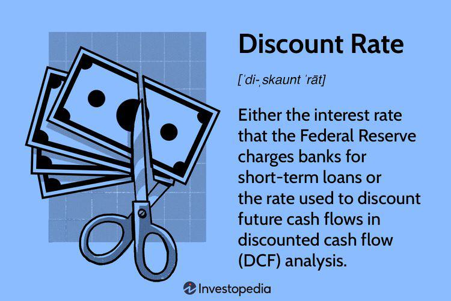

## Table of Contents

## What is the bank discount rate?

The bank discount rate is the interest rate that banks charge each other for short-term loans. It's also known as the discount rate or the base rate. This rate is important because it helps control the amount of money in the economy. When the discount rate is high, banks borrow less from each other, which means less money is available for loans to businesses and people. When the rate is low, banks borrow more, and more money is available for loans.

The central bank, like the Federal Reserve in the United States, sets the discount rate. They use it as a tool to manage economic growth and inflation. If the economy is growing too fast and causing inflation, the central bank might raise the discount rate to slow things down. If the economy is slow and needs a boost, they might lower the rate to encourage more borrowing and spending. This way, the discount rate helps keep the economy stable.

## How is the bank discount rate calculated?

The bank discount rate is not calculated by banks themselves but is set by the central bank of a country, like the Federal Reserve in the United States. The central bank decides on this rate based on the overall economic conditions. They look at things like inflation rates, employment levels, and economic growth. If they want to slow down the economy and reduce inflation, they might increase the discount rate. If they want to encourage borrowing and stimulate the economy, they might lower it.

When a bank needs to borrow money from the central bank, it uses the discount rate as the interest rate for that loan. The calculation of the actual interest a bank pays is straightforward. If a bank borrows $100,000 at a discount rate of 2%, and the loan is for one year, the bank will pay $2,000 in interest at the end of the year. The formula is simple: Interest = Principal x Discount Rate x Time. So, for shorter or longer periods, the interest would be adjusted accordingly.

## What is the difference between the bank discount rate and the interest rate?

The bank discount rate and the interest rate are two different things. The bank discount rate is the rate set by the central bank, like the Federal Reserve in the U.S., for loans it gives to other banks. It's like a special rate just for banks to borrow money from the central bank. This rate helps control how much money is in the economy. When the central bank changes the discount rate, it can make banks borrow more or less, which affects how much money is available for people and businesses to borrow.

On the other hand, the interest rate is what banks charge their customers for loans, like car loans, home loans, or credit card balances. These rates can be different for each type of loan and can change based on many things, like how risky the loan is or how much competition there is between banks. The interest rate you get from a bank can be influenced by the bank discount rate, but it's not the same thing. When the bank discount rate goes up or down, it can push interest rates in the same direction, but they don't always move together exactly.

## Why is the bank discount rate important for financial institutions?

The bank discount rate is important for financial institutions because it affects how much it costs them to borrow money from the central bank. If the discount rate is low, banks can borrow money more cheaply, which means they have more money to lend to people and businesses. This can help the economy grow because more people can borrow money to buy things or start businesses. On the other hand, if the discount rate is high, it costs banks more to borrow, so they might lend less money. This can slow down the economy because there's less money available for loans.

The discount rate also helps banks manage their cash flow. Sometimes, banks need extra money quickly to meet their customers' demands, like when a lot of people want to withdraw money at once. By borrowing from the central bank at the discount rate, banks can get this money fast and keep their operations running smoothly. This is crucial because if banks can't meet their customers' needs, it could lead to bigger problems in the financial system. So, the discount rate acts like a safety net for banks, helping them stay stable and keep the economy running smoothly.

## How does the bank discount rate affect the economy?

The bank discount rate is like a control knob for the economy. When the central bank changes this rate, it affects how much money banks have to lend. If the discount rate goes down, banks can borrow money from the central bank more cheaply. This means they can lend more money to people and businesses. When more money is available for loans, people can buy more things or start new businesses, which helps the economy grow.

On the other hand, if the discount rate goes up, it costs banks more to borrow money from the central bank. This makes banks more careful about lending, so they might lend less money. When less money is available for loans, people might not buy as many things or start as many businesses. This can slow down the economy and help control inflation, which is when prices go up too fast. So, the discount rate is a tool that the central bank uses to keep the economy balanced, making sure it doesn't grow too fast or too slow.

## What are the typical ranges for the bank discount rate?

The bank discount rate can change a lot depending on the country and what's happening in the economy. In the United States, the Federal Reserve's discount rate has been between 0.25% and 6.5% in recent years. It's usually set a bit higher than the federal funds rate, which is another important rate that banks use. When the economy is doing well and prices are going up too fast, the discount rate might be on the higher side to slow things down. But if the economy is struggling and needs a boost, the rate might be very low to encourage borrowing and spending.

In other countries, the range can be different. For example, in Europe, the European Central Bank's rates have been known to go as low as -0.5% in recent times, which means banks actually get paid to keep money with the central bank. This is done to encourage banks to lend more money. On the other hand, some countries with high inflation might have discount rates much higher than 6.5%. The exact range depends on the specific economic conditions and goals of each country's central bank.

## How often does the bank discount rate change?

The bank discount rate doesn't change all the time, but it can change when the central bank thinks it's needed. In the United States, the Federal Reserve might change the discount rate a few times a year. They look at things like how fast the economy is growing, if prices are going up too fast, and if people are losing their jobs. If they see that the economy needs a little push or if it's growing too fast, they might change the rate to help keep things balanced.

In other countries, how often the discount rate changes can be different. Some central banks might change it more often if their economy is going through a lot of ups and downs. Others might keep it the same for a long time if things are pretty stable. It all depends on what the central bank thinks is best for their country's economy at that time.

## What factors influence changes in the bank discount rate?

The bank discount rate changes based on what's happening in the economy. The central bank looks at things like how fast prices are going up, which is called inflation. If prices are going up too fast, they might raise the discount rate to slow things down. They also look at how many people have jobs. If a lot of people are out of work, they might lower the rate to help the economy grow and create more jobs. Another thing they watch is how fast the economy is growing. If it's growing too fast, they might raise the rate to cool things off, but if it's not growing enough, they might lower it to give it a boost.

Sometimes, the central bank also looks at what's happening in other countries. If other countries are changing their rates, it might affect their own economy, so they might change their discount rate too. They also think about how much money banks are borrowing from them. If banks are borrowing a lot, it might mean they need more money to lend, so the central bank might keep the rate low. But if banks aren't borrowing much, it might mean they have enough money, so the central bank might raise the rate. All these things help the central bank decide when and how to change the discount rate to keep the economy stable.

## Can you explain the relationship between the bank discount rate and Treasury bills?

The bank discount rate and Treasury bills are connected because they both deal with how much it costs to borrow money. The bank discount rate is set by the central bank and is the rate at which banks can borrow money from the central bank. When this rate changes, it can affect the interest rates on Treasury bills, which are short-term loans that the government sells to investors. If the bank discount rate goes up, it usually means that the interest rates on Treasury bills will go up too, because investors will want a higher return to lend their money.

Treasury bills are often used as a benchmark for other interest rates in the economy. When the bank discount rate changes, it can signal to investors and banks that the central bank is trying to either slow down or speed up the economy. If the discount rate is lowered, it can make Treasury bills less attractive because their interest rates might not be as high as other investments. On the other hand, if the discount rate is raised, Treasury bills might become more attractive because their rates go up, making them a safer and more profitable place to park money. So, the bank discount rate can influence the demand for Treasury bills and the overall cost of borrowing in the economy.

## How do businesses use the bank discount rate in their financial planning?

Businesses keep an eye on the bank discount rate because it can affect how much it costs them to borrow money. If the discount rate goes down, it usually means that interest rates on loans will go down too. This can be good for businesses because they can borrow money more cheaply to buy new equipment, expand their operations, or hire more people. When borrowing is cheaper, businesses might decide to take on more projects or invest in growth, which can help them make more money in the long run.

On the other hand, if the discount rate goes up, borrowing money becomes more expensive. This might make businesses think twice about taking out loans. They might decide to hold off on big purchases or expansion plans until interest rates go down again. Businesses also use the discount rate as a signal to understand what the central bank thinks about the economy. If the rate is going up, it might mean the economy is growing too fast and could overheat, so businesses might plan more cautiously. If the rate is going down, it might mean the economy needs a boost, so businesses might look for opportunities to grow.

## What are the implications of a high versus a low bank discount rate for investors?

When the bank discount rate is high, it means that banks have to pay more to borrow money from the central bank. This usually leads to higher interest rates for everyone, including investors. If you're an investor, higher interest rates can be good if you're putting your money into things like bonds or savings accounts because you'll get more money back in interest. But it can be bad if you're borrowing money to invest, like buying stocks on margin, because it'll cost you more. Also, when rates are high, businesses might borrow less, which can slow down the economy and affect stock prices. So, investors might be more careful and look for safer places to put their money.

On the other hand, when the bank discount rate is low, it means that banks can borrow money more cheaply. This usually leads to lower interest rates for everyone. For investors, this can be good if you're borrowing money to invest because it'll cost you less. It can also encourage businesses to borrow more and grow, which can be good for the stock market. But if you're putting your money into things like bonds or savings accounts, you'll get less money back in interest. So, investors might look for riskier investments that could give them higher returns. Overall, a low discount rate can make investors feel more confident and willing to take on more risk.

## How does the bank discount rate compare to other monetary policy tools used by central banks?

The bank discount rate is one of several tools that central banks use to control the economy. It's the interest rate that banks pay when they borrow money from the central bank. When the central bank changes the discount rate, it can affect how much money banks have to lend and how much it costs for businesses and people to borrow money. Other tools that central banks use include open market operations, where they buy or sell government bonds to change the amount of money in the economy, and reserve requirements, which tell banks how much money they need to keep on hand and not lend out. Each tool works in a different way to help the central bank reach its goals, like keeping prices stable and helping the economy grow.

Another important tool is the federal funds rate in the U.S., which is the rate banks charge each other for overnight loans. This rate is closely watched by investors and can affect other interest rates in the economy. Central banks also use forward guidance, where they tell everyone what they plan to do with interest rates in the future. This helps businesses and investors plan ahead. All these tools work together to help the central bank manage the economy. The bank discount rate is just one part of a bigger picture, and it's used along with these other tools to make sure the economy stays balanced and healthy.

## What is the Bank Discount Rate and how can it be understood?

The bank discount rate is a concept central to the valuation of short-term money market instruments such as commercial paper and Treasury bills. This rate is utilized to determine the present value of these instruments, highlighting the cost of borrowing or the yield received from lending money with these securities over a specified period.

Mathematically, the bank discount rate (BDR) is expressed as:

$$
BDR = \left( \frac{D}{F} \right) \times \left( \frac{360}{t} \right)
$$

where:
- $D$ is the discount, which is the difference between the face value and the purchase price,
- $F$ is the face value of the instrument,
- $t$ is the time to maturity in days.

This formula reflects how the discount rate is based on the par value (face value) and the discount amount. By comparing the discount to the instrument's par value and annualizing it based on a 360-day year (a convention in money markets), investors can gauge the implied annualized yield of holding the instrument.

The bank discount rate is significant because it provides investors with an easy-to-understand measure of the yield. However, it differs from the coupon rate, which is the stated [interest rate](/wiki/interest-rate-trading-strategies) on a bond or other debt security. The coupon rate is applied to the bond's face value to calculate interest payments, whereas the discount rate calculates the return based purely on the discount relative to the par value.

To better illustrate, consider a Treasury bill with a face value of $100,000, purchased for $98,000, maturing in 180 days. The discount rate would be:

$$
BDR = \left( \frac{100,000 - 98,000}{100,000} \right) \times \left( \frac{360}{180} \right) = 0.02 \times 2 = 0.04 \text{ or } 4\%
$$

While this provides an annualized discount rate, it should be noted that the effective annual yield or investment rate can differ due to the pricing basis and use of actual days in a year for accrual calculation—reflecting differences seen with the bond equivalent yield (BEY). Understanding these differences is crucial for investors as they assess potential investment gains and compare short-term securities to alternatives with regular coupon payments.

In practice, the choice between using discount rates and periodically-paid coupon rates depends on the investor's preference for how returns are structured and timing of cash flows. While the discount rate provides a quick snapshot of yield, it’s essential to consider the broader context, including varying maturities and potential tax implications, when designing an investment strategy.

## What is the impact of interest rates?

Interest rates play a critical role in shaping economic stability and influencing investor behavior by affecting borrowing costs, investment returns, and overall economic activity. There are several types of interest rates, each with distinct characteristics and implications for financial decision-making. Two fundamental types are simple interest and compound interest.

Simple interest is calculated on the original principal amount of a loan or investment and can be represented by the formula:

$$
\text{Simple Interest} = P \times r \times t
$$

where $P$ is the principal amount, $r$ is the annual interest rate, and $t$ is the time in years. Simple interest is straightforward, providing a constant rate of return based on the principal amount alone.

Compound interest, on the other hand, is calculated on the initial principal along with any accumulated interest from previous periods. The formula for compound interest is:

$$
A = P \times (1 + \frac{r}{n})^{n \times t}
$$

where $A$ is the amount of money accumulated after n years, including interest, $P$ is the principal investment amount, $r$ is the annual interest rate, $n$ is the number of times that interest is compounded per year, and $t$ is the time in years. Compound interest allows for the reinvestment of interest, leading to exponential growth and having a significant impact on long-term financial outcomes.

Changes in interest rates can have profound effects on market dynamics and investor decisions. For example, when central banks raise interest rates, borrowing costs increase, which can dampen consumer spending and business investments. Conversely, lower interest rates reduce the cost of borrowing, encouraging spending and investment, stimulating economic growth. Central bank policies related to interest rates are critical in managing inflation, unemployment, and economic growth.

Investor behavior is also closely tied to interest rate fluctuations. Higher interest rates can make fixed-income investments like bonds more attractive, as they offer better returns. Conversely, lower interest rates may drive investors to seek higher returns through equities or other riskier assets. Traders often adjust their strategies based on anticipated central bank actions on interest rates, using complex models and economic indicators to predict market trends.

In summary, understanding the types and implications of interest rates is vital for developing effective borrowing and investment strategies. The responsiveness of traders to interest rate changes highlights the dynamic nature of financial markets, where interest rate policies are a pivotal tool for economic management.

## How can financial concepts be integrated into trading strategies?

Integrating financial concepts such as bank discount rates and interest rates into trading strategies can significantly enhance financial performance by providing a more comprehensive analysis of market dynamics. These rates serve as fundamental indicators for assessing the economic environment, affecting how traders interpret data and make decisions. Understanding these concepts helps in developing strategies that leverage core market insights.

Bank discount rates, typically employed for short-term instruments like Treasury bills, offer a direct measure of the expected return relative to the face value of these investments. By considering the bank discount rate formula:

$$
\text{Discount Rate} = \left(\frac{\text{Face Value} - \text{Purchase Price}}{\text{Face Value}}\right) \times \frac{360}{\text{Days to Maturity}}
$$

investors can assess the yield on short-term investments, aligning it with broader interest rate movements to optimize their portfolios.

Interest rates broadly affect borrowing costs and returns on savings, influencing both personal finance and institutional investment strategies. As central banks adjust interest rates, the impact cascades through the economy, altering the cost of capital and consequently the valuation of securities. Understanding this dynamic is critical for traders, especially when employing [algorithmic trading](/wiki/algorithmic-trading) strategies.

Algorithmic trading, enabled by advances in big data and [machine learning](/wiki/machine-learning), allows for precise and rapid market actions based on real-time data inputs. Incorporating financial concepts into these algorithms can enhance their efficiency and accuracy. For example, a machine learning model might predict interest rate changes based on macroeconomic indicators, enabling traders to preemptively adjust their portfolios. A simple Python code snippet to simulate such a prediction could look like this:

```python
import pandas as pd
from sklearn.ensemble import RandomForestRegressor
from sklearn.model_selection import train_test_split

# Sample data: Load your economic indicators dataset
data = pd.read_csv('economic_indicators.csv') 
features = data.drop(columns=['interest_rate'])
target = data['interest_rate']

# Split the data into train and test sets
X_train, X_test, y_train, y_test = train_test_split(features, target, test_size=0.2, random_state=42)

# Initialize and train the model
model = RandomForestRegressor()
model.fit(X_train, y_train)

# Make predictions
predictions = model.predict(X_test)
```

Success stories in trading often highlight this synergy between sophisticated financial understanding and technology. A notable case is Renaissance Technologies, a [hedge fund](/wiki/hedge-fund-trading-strategies) known for employing these methods to achieve impressive returns. They utilize large datasets and integrate nuanced financial metrics to continuously refine their trading models, serving as a testament to the potential of such an approach.

In conclusion, integrating financial concepts with modern trading technologies paves the way for optimized investment strategies. The use of emerging tools like big data analytics and machine learning further supports enhanced decision-making by processing complex economic indicators efficiently. For traders and investors, the ability to merge these financial insights with technological approaches is increasingly indispensable to achieving success in contemporary markets.

## What is the conclusion?

This article has explored essential financial concepts that underpin modern trading environments. A firm grasp of financial terms, such as bank discount rates and interest rates, provides the foundational knowledge necessary for investors to understand the mechanics of financial markets. The bank discount rate, which is derived from the formula:

$$
\text{Bank Discount Rate} = \frac{\text{Discount Value}}{\text{Face Value}} \times \frac{360}{\text{Days to Maturity}}
$$

offers insight into the cost of money and informs decisions regarding short-term investments. Meanwhile, interest rates, including simple and compound interest, influence borrowing costs and investment returns, highlighting their pivotal role in shaping market activities.

Furthermore, the integration of algorithmic trading signifies a shift towards leveraging technology to enhance trading precision and efficiency. Algorithmic strategies, executed through code such as Python, automate trade executions based on predefined criteria:

```python
import pandas as pd

def moving_average_strategy(data, short_window=40, long_window=100):
    signals = pd.DataFrame(index=data.index)
    signals['signal'] = 0.0

    signals['short_mavg'] = data['Close'].rolling(window=short_window, min_periods=1, center=False).mean()
    signals['long_mavg'] = data['Close'].rolling(window=long_window, min_periods=1, center=False).mean()

    signals['signal'][short_window:] = np.where(signals['short_mavg'][short_window:] 
                                                > signals['long_mavg'][short_window:], 1.0, 0.0)    

    signals['positions'] = signals['signal'].diff()

    return signals
```

The sophistication of these tools underscores the importance of technological proficiency in the trading process.

Staying informed and adaptable in this rapidly evolving financial landscape is crucial. Market participants must continuously update their strategies to reflect shifts in economic indicators and advancements in technology, such as AI and blockchain. By leveraging an understanding of financial concepts and employing cutting-edge trading technologies, traders and investors can strategically navigate and succeed in the complexities of contemporary financial markets.

## References & Further Reading

- **Books:**
  - *"The Intelligent Investor"* by Benjamin Graham: A comprehensive guide on investing principles and strategies that incorporates various financial concepts, offering insights into long-term market success.
  - *"A Random Walk Down Wall Street"* by Burton G. Malkiel: This book explores market trends and investment strategies, providing an understanding of financial markets and principles.
  - *"Algorithmic Trading: Winning Strategies and Their Rationale"* by Ernie Chan: A practical guide that breaks down algorithmic trading strategies and fundamental concepts, making it a valuable resource for traders.

- **Research Papers:**
  - Lo, Andrew W., and A. Craig MacKinlay. "Stock Market Prices Do Not Follow Random Walks: Evidence from a Simple Specification Test." This paper challenges the efficient market hypothesis by examining the behavior of stock market prices.
  - Bertsimas, Dimitris, and Andrew W. Lo. "Optimal Control of Execution Costs." This paper discusses the impact of algorithmic trading on execution costs and strategies to minimize these costs effectively.

- **Online Articles:**
  - Investopedia - An extensive online resource for definitions and explanations of financial terms, concepts, and trading strategies, such as bank discount rates and interest rates.
  - "How to Build a Trading Algorithm" on Medium.com: An article that outlines the steps and considerations involved in developing a robust trading algorithm, from initial research to practical implementation.

- **Online Courses and Platforms:**
  - Coursera offers courses like "Financial Markets" by Yale University, which cover fundamental financial concepts and market structures, suitable for deepening understanding of complex topics.
  - edX provides a course titled "Algorithmic Trading and Finance Models with Python, R, and Stata," which guides learners through developing trading models using programming languages.

- **Websites:**
  - QuantInsti: A training platform that focuses on algorithmic and quantitative trading, offering valuable insights and training materials to enhance understanding and practical skills.
  - Investopedia: A well-established educational website that offers detailed articles and tutorials about financial concepts, trading strategies, and market behavior.

