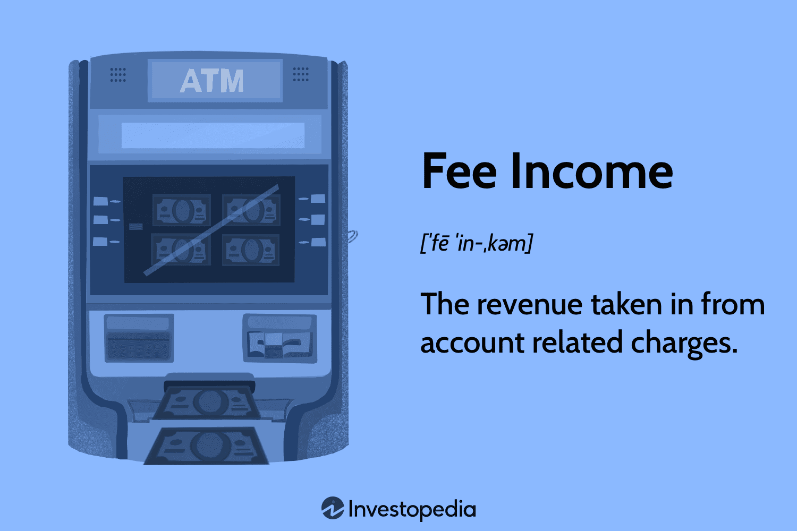

## Table of Contents

## What are bank fees and why do banks charge them?

Bank fees are charges that banks put on different services they offer. These can include fees for using an ATM that is not from your bank, fees for having your account overdrawn, or fees for monthly maintenance of your account. Banks charge these fees to make money and to cover the costs of running the bank.

Banks need to make a profit to stay open, just like any other business. The fees help them earn money to pay for things like employee salaries, building rent, and technology systems. Sometimes, banks also use fees to encourage customers to use certain services more often or to keep a minimum balance in their accounts. This helps the bank manage its money better and serve its customers more efficiently.

## How do bank fees contribute to a bank's revenue?

Bank fees are an important way for banks to make money. When customers use services like ATMs from other banks, overdraw their accounts, or keep their accounts open, they might have to pay fees. These fees add up and become a big part of the bank's income. This money helps the bank cover its costs and make a profit.

Fees also help banks manage their money better. For example, if a bank charges a fee for using another bank's ATM, it might encourage customers to use their own ATMs more often. This saves the bank money because they don't have to pay other banks for using their machines. By setting fees, banks can also encourage customers to keep more money in their accounts, which the bank can then use for other financial activities.

## What are the most common types of bank fees?

Some of the most common types of bank fees are ATM fees, overdraft fees, and monthly maintenance fees. ATM fees are charged when you use an ATM that is not from your bank. This fee can be from your bank or the ATM owner. Overdraft fees happen when you spend more money than you have in your account. The bank might let you go over your balance, but they will charge you a fee for doing so. Monthly maintenance fees are charged just for keeping your account open. Banks might waive these fees if you keep a certain amount of money in your account or use other bank services.

Another common fee is the account closure fee, which is charged if you close your account before a certain time period. There are also wire transfer fees, which are charged when you send money electronically to another account. These fees can vary depending on whether the transfer is domestic or international. Lastly, banks might charge fees for paper statements if you choose to receive your account statements in the mail instead of online. These fees help banks cover the costs of printing and mailing the statements.

## How can individuals avoid or minimize bank fees?

People can avoid or minimize bank fees by choosing the right bank account and understanding the fees that come with it. Many banks offer accounts with no monthly fees if you keep a certain amount of money in your account or use direct deposit. It's a good idea to read the account details carefully and pick an account that fits how you use your money. For example, if you often use ATMs, look for a bank that has a lot of ATMs or refunds ATM fees.

Another way to minimize fees is to keep track of your account balance and avoid overdrafts. You can set up alerts from your bank to tell you when your balance is low. This can help you avoid spending more money than you have and getting charged an overdraft fee. Also, using online banking and electronic statements can help you avoid fees for paper statements. By understanding and managing your account well, you can save money on bank fees.

## What is the impact of bank fees on customer satisfaction and retention?

Bank fees can make customers unhappy and less likely to stay with a bank. When people see fees on their bank statements, they might feel frustrated or annoyed. This is especially true if the fees are high or if they come as a surprise. Customers might start to think that the bank is not looking out for their best interests. This can lead them to switch to another bank that offers lower fees or better services.

On the other hand, banks that are clear about their fees and offer ways to avoid them can keep their customers happy. If a bank tells customers how to dodge fees, like keeping a certain amount of money in their account or using online banking, customers might feel more in control. This can make them more loyal to the bank. In the end, how a bank handles its fees can really affect whether customers stay or go.

## How do regulations affect the structure and transparency of bank fees?

Regulations play a big role in how banks set up their fees and how clear they are about them. Governments make rules that banks have to follow. These rules can say what kinds of fees banks can charge and how much they can charge. For example, some countries have laws that limit how much a bank can charge for using an ATM that is not from their bank. These rules help make sure that fees are fair and do not surprise customers.

Regulations also make banks tell customers about their fees in a clear way. Banks have to show their fees on their websites, in their branches, and on account statements. This helps customers know what they might have to pay before they use a service. When banks are clear about their fees, customers can make better choices about which bank to use and how to manage their money. This can lead to happier customers and more trust in the banking system.

## What strategies do banks use to optimize revenue generation through fees?

Banks use different strategies to make more money from fees. One way is by setting up fees that encourage customers to use certain services more often. For example, a bank might charge a fee for using an ATM from another bank. This can make customers use their own bank's ATMs more, which saves the bank money because they don't have to pay other banks for using their machines. Banks also might charge monthly fees for keeping an account open. But they might not charge this fee if customers keep a certain amount of money in their account or use other services like direct deposit. This way, banks can get more money from customers who use their services a lot.

Another strategy is to make sure customers know about the fees and how to avoid them. Banks might tell customers how to keep their account balance high enough to avoid monthly fees or how to set up alerts to avoid overdraft fees. By being clear about their fees, banks can keep customers happy and loyal. This can lead to more customers staying with the bank and using more of its services, which means more revenue for the bank. Banks also look at what other banks are doing and might change their fees to stay competitive. This way, they can attract more customers and make more money from fees.

## How do different types of banks (e.g., commercial, investment) utilize fees differently?

Commercial banks, which are the ones most people use for everyday banking, often rely on a wide variety of fees to make money. They charge fees for things like using ATMs, overdrawing accounts, and monthly maintenance of accounts. These fees help commercial banks cover their costs and make a profit. They might also use fees to encourage customers to use certain services more often, like using their own ATMs or keeping more money in their accounts. By setting up their fees in this way, commercial banks can manage their money better and keep their customers happy.

Investment banks, on the other hand, focus more on fees from services like underwriting, mergers and acquisitions, and managing assets. These fees are usually much larger than the fees charged by commercial banks because the services are more complex and involve big amounts of money. Investment banks might charge a percentage of the total amount of money they are working with, which can add up to a lot. They use these fees to make money and to pay for the high costs of their specialized services. While commercial banks deal with everyday banking, investment banks use fees to make money from big financial deals.

## What role do technology and digital banking play in the evolution of bank fees?

Technology and digital banking have changed how banks charge fees. With online banking, people can do many things without going to a bank branch, like checking their balance or paying bills. This can help them avoid fees for things like paper statements or teller services. Banks also use technology to make it easier for customers to see and understand their fees. They can show fees clearly on their websites and in their apps, which helps customers know what they might have to pay. This can make customers happier and more likely to stay with the bank.

Digital banking also lets banks offer new services that can come with new fees. For example, some banks charge for premium digital services like advanced budgeting tools or faster transfers. These fees can help banks make more money. But technology also makes it easier for customers to compare fees from different banks. This means banks have to be careful about how much they charge, or they might lose customers to other banks with lower fees. Overall, technology and digital banking have made fees more clear and given banks new ways to make money, but they also have to be careful to keep their customers happy.

## How do global economic conditions influence bank fee structures?

Global economic conditions can change how banks set their fees. When the economy is doing well, people and businesses have more money to spend and save. Banks might lower their fees to attract more customers and get more of their money. But when the economy is not doing well, like during a recession, banks might raise their fees to make up for less money coming in. They might charge more for services or add new fees to keep making a profit.

Different countries can also affect bank fees. If a country's money is worth less compared to other countries, banks might charge more for services like international transfers. This helps them cover the costs of doing business in different currencies. Also, if a country has strict rules about what banks can charge, banks might have to change their fees to follow those rules. So, global economic conditions and rules from different countries can really change how banks set their fees.

## What are the ethical considerations surrounding bank fees and revenue generation?

When banks charge fees, they need to think about what is right and fair. It's important for banks to be clear about their fees so customers know what they might have to pay. If banks hide fees or make them hard to understand, customers might feel tricked and lose trust in the bank. Banks should also think about how their fees affect different people. Some people might not have a lot of money, and high fees can make it hard for them to use banking services. Banks need to find a balance between making money and being fair to their customers.

Another big issue is how banks use fees to make more money. It's okay for banks to charge fees to cover their costs and make a profit, but they should not use fees in a way that takes advantage of people. For example, charging very high fees for small mistakes like overdrawing an account can be seen as unfair. Banks should also offer ways for customers to avoid fees, like keeping a certain amount of money in their account. By being fair and clear about their fees, banks can keep their customers happy and maintain trust in the banking system.

## How can advanced data analytics be used to predict and set optimal fee structures?

Advanced data analytics can help banks predict and set the best fee structures by looking at a lot of information about how customers use their services. Banks can use this data to see which fees bring in the most money and which ones make customers unhappy. For example, they might find out that a lot of people use ATMs from other banks and are willing to pay a small fee for it. By setting the right fee, banks can make more money without losing customers. They can also use data to see if certain fees, like overdraft fees, make people leave the bank. This way, they can change those fees to keep customers happy and still make a profit.

Banks can also use data analytics to test different fee structures before they put them into place. They can try out different fees with a small group of customers to see how they react. If the new fees work well, the bank can use them for everyone. This helps banks find the best balance between making money and keeping customers happy. By using advanced data analytics, banks can make smart choices about their fees and keep their business strong.

## How does interest income impact banking profits?

Interest income continues to serve as the main pillar of banking profitability, predominantly derived from loans and mortgages. Banks lend out deposits at higher interest rates than they pay on those deposits, generating what is known as interest income. This income not only supports the bank’s operations but also significantly impacts its profitability and financial health.

A critical measure of this profitability is the Net Interest Margin (NIM), calculated as the difference between the interest income a bank earns from its lending activities and the interest it pays out to depositors, divided by the average [earning](/wiki/earning-announcement) assets. Mathematically, this can be represented as:

$$
\text{NIM} = \frac{\text{Interest Income} - \text{Interest Expenses}}{\text{Average Earning Assets}}
$$

A higher NIM indicates that a bank is efficiently managing its assets and liabilities to produce significant returns from its lending activities. However, the NIM is sensitive to [interest rate](/wiki/interest-rate-trading-strategies) changes, which can affect both the income generated from loans and the expenses incurred from deposits. During periods of low interest rates, banks may struggle to maintain a high NIM, thereby impacting overall profits.

Effective risk management is crucial in maintaining and maximizing interest income. This involves managing credit risk, which is the risk of loss arising from a borrower’s failure to repay a loan. Banks deploy various risk management strategies such as stringent credit assessments and diversified loan portfolios to mitigate such risks. Additionally, interest rate risk, the risk that changes in interest rates will affect the bank's income, is managed through interest rate swaps and other hedging tools.

By balancing risk and optimizing their interest-related activities, banks can sustain profitability even amid fluctuating economic conditions. Understanding these dynamics is vital for gauging the economic impact and stability of banking institutions in the financial landscape.

## References & Further Reading

[1]: Lopez de Prado, M. (2018). ["Advances in Financial Machine Learning."](https://www.amazon.com/Advances-Financial-Machine-Learning-Marcos/dp/1119482089) John Wiley & Sons.

[2]: Jansen, S. (2020). ["Machine Learning for Algorithmic Trading."](https://github.com/stefan-jansen/machine-learning-for-trading) Packt Publishing.

[3]: Aronson, D. R. (2007). ["Evidence-Based Technical Analysis: Applying the Scientific Method and Statistical Inference to Trading Signals."](https://www.amazon.com/Evidence-Based-Technical-Analysis-Scientific-Statistical/dp/0470008741) John Wiley & Sons.

[4]: Chan, E. P. (2009). ["Quantitative Trading: How to Build Your Own Algorithmic Trading Business."](https://github.com/ftvision/quant_trading_echan_book) John Wiley & Sons.

[5]: Juniper Research. (2020). ["Digital Banking: Banking-as-a-Service & Digital Transformation 2020-2024."](https://www.juniperresearch.com/press/digital-banking-users-to-exceed-3-6-billion) 

[6]: Bergstra, J., Bardenet, R., Bengio, Y., & Kégl, B. (2011). ["Algorithms for Hyper-Parameter Optimization."](https://dl.acm.org/doi/10.5555/2986459.2986743) Advances in Neural Information Processing Systems 24.