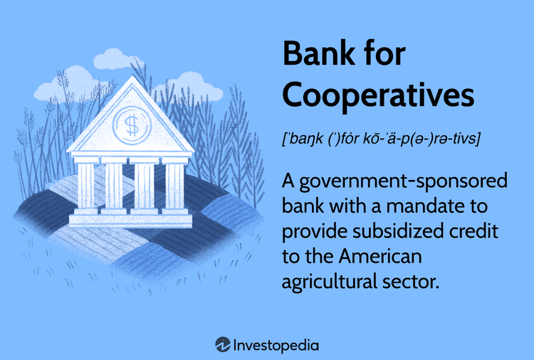

The landscape of financial institutions encompasses a diverse array of entities, with cooperative banking being a significant component of the global economy. Cooperative banking institutions are designed to serve the interests of their members rather than external shareholders. As member-owned entities, they offer a range of services aimed at promoting financial growth and stability. These services typically include savings accounts, loans, and other financial products that are tailored to meet the needs of the members, particularly within specific sectors such as agriculture.

One of the prominent cooperative banking institutions is the Bank for Cooperatives, which has a crucial role within the Farm Credit System. This system is dedicated to providing credit to the agricultural sector, highlighting the cooperative emphasis on serving community-specific needs. Unlike traditional profit-driven banks, cooperative banks focus on maximizing the benefits for their members, prioritizing sustainability and equitable financial outcomes.



In recent years, cooperative banking institutions have begun to integrate modern technological advancements to enhance their operational efficiency and service offerings. A significant development in this arena is the utilization of algorithmic trading. Algorithmic trading involves the use of automated systems to execute trades based on pre-defined criteria and sophisticated algorithms. This approach offers a technological edge by enabling rapid and accurate trading decisions, reducing human error, and improving transaction efficiency.

The amalgamation of cooperative banking with algorithmic trading heralds a promising evolution in financial operations. By leveraging advanced technology, cooperative banks can enhance their financial strategies and outcomes for their members. This synergy could lead to more efficient and profitable results, ensuring that cooperative banking institutions remain competitive and continue to fulfill their foundational mission of supporting their members' financial well-being.

## Table of Contents

## Understanding Cooperative Banking Financial Institutions

Cooperative financial institutions are unique entities in the financial landscape as they are owned and operated by the members they serve, who are also their primary beneficiaries. These institutions prioritize the financial well-being of their members, focusing on delivering services that cater to their needs rather than maximizing profits. As a result, cooperative banks offer a broad spectrum of financial products, including savings accounts, loans, mortgage products, and insurance services, all tailored to support the economic growth and stability of their member base.

Among these institutions is the Bank for Cooperatives, which forms a crucial component of the Farm Credit System. Established to meet the financing needs of the American agricultural sector, the Bank for Cooperatives provides essential credit services that enable farmers, agribusinesses, and cooperatives to thrive. This focus on the agricultural community underscores the cooperative bank's role in supporting industries that are fundamental to the economy.

One distinguishing characteristic of cooperative banks, as opposed to traditional banking institutions, is their commitment to maximizing the benefits for their members. Unlike conventional banks that prioritize profit generation for shareholders, cooperative institutions reinvest earnings to enhance services for their members. This member-first approach ensures that the benefits are distributed equitably among members, often resulting in better rates and lower fees compared to commercial banks.

The sustainability and appeal of cooperative financial institutions have seen significant growth, particularly in the aftermath of the global financial crisis of 2007-2008. This period highlighted the vulnerabilities of conventional banking systems and reinforced the value of the more community-focused, stable models offered by cooperatives. Consequently, there has been an increased interest in and reliance on cooperative banks due to their resilience in challenging economic climates and their ability to provide continuous, member-focused financial services. 

In conclusion, cooperative financial institutions have proven resilient and beneficial, emphasizing the importance of member-focused financial strategies that contribute to their sustainability and increasing popularity in the global financial system.

## The Role of the Bank for Cooperatives

The Bank for Cooperatives was established as a critical financial entity aimed at providing subsidized credit specifically to the American agricultural sector. Its inception was motivated by the necessity to offer tailored financial services that address the unique needs of agriculture, ensuring that farming cooperatives and agribusinesses have access to affordable credit. This approach was pivotal in fostering the economic development of rural communities across the United States, where agriculture is a cornerstone of the local economy.

In a significant development in 1989, most Banks for Cooperatives consolidated to form CoBank. This merger was a strategic move to streamline services and enhance the provision of financial support to agribusinesses, cooperatives, and rural utilities. Today, CoBank stands as a prominent entity within the Farm Credit System, which is a nationwide network of banks and associations providing dependable credit and financial services to rural America.

CoBank's operations transcend mere financial transactions; it actively contributes to the economic stability and growth of rural communities. By maintaining a consistent flow of credit, it empowers local economies to remain robust and competitive. Additionally, CoBank's mission extends beyond credit provision. It includes offering training and advocacy programs focused on sustainable agricultural practices. This educational component is essential for ensuring that agricultural practices not only meet present needs but also safeguard environmental and community health for future generations.

Through these multidimensional roles, CoBank epitomizes the principles of cooperative financial institutions by prioritizing the needs and well-being of its members. The bank's persistent commitment to serving the agricultural sector ensures that its members have access to necessary resources, thereby supporting the wider objectives of community welfare and sustainable economic growth.

## Algorithmic Trading: A Technological Edge

Algorithmic trading involves the implementation of automated systems to execute trades based on pre-defined criteria and algorithms. This modern approach utilizes sophisticated computer programs that make trading decisions, initiate orders, and manage trades at speeds and frequencies impossible for a human trader. The essential components of such systems include data analysis, [machine learning](/wiki/machine-learning), and high-frequency trading.

The integration of [algorithmic trading](/wiki/algorithmic-trading) into cooperative banking presents significant opportunities for improving operational efficiency and reducing human error. By automating trading processes, cooperative banks can execute trades faster and more accurately, allowing for streamlined operations that benefit all members. According to studies, algorithmic trading systems can handle vast amounts of data and recognize patterns that are invisible to the human eye, facilitating precise trading decisions made in fractions of a second ([Vidyamurthy, 2004](https://www.amazon.com/Pairs-Trading-Quantitative-Statistical-Finance/dp/0471215547)).

Machine learning and data analysis play a crucial role in enhancing algorithmic trading systems. These technologies analyze historical and real-time market data to forecast future price movements and devise optimal trading strategies. By employing statistical models, such as linear regression or neural networks, cooperative banks can adapt quickly to market changes and optimize their portfolios. For instance, Python code can be used to implement a simple linear regression model to predict stock prices:

```python
from sklearn.linear_model import LinearRegression
import numpy as np

# Sample data: historical stock prices and corresponding market index
stock_prices = np.array([[100], [102], [105], [107], [110]])
market_index = np.array([1050, 1070, 1100, 1120, 1150])

# Creating and fitting the model
model = LinearRegression()
model.fit(market_index.reshape(-1, 1), stock_prices)

# Predicting future stock prices
future_index = np.array([[1160], [1180]])
predicted_prices = model.predict(future_index)
print(predicted_prices)
```

Algorithmic trading can also enhance risk management and portfolio optimization within cooperative banks. By analyzing risk factors comprehensively, algorithmic systems can mitigate potential losses and ensure that investment portfolios are optimized for performance and stability. Techniques such as Value at Risk (VaR) and Monte Carlo simulations are frequently used to gauge investment risks and develop robust trading strategies ([Glasserman, 2003](https://www.amazon.com/Monte-Carlo-Methods-Financial-Engineering/dp/0387004513)).

This technological approach aligns perfectly with the mission of cooperative banks to provide cost-effective and cutting-edge services to their members. By embracing algorithmic trading, cooperative banks can continue to deliver financial solutions that meet the dynamic needs of their members, while also remaining competitive in a rapidly evolving financial landscape. The use of technology not only enhances operational efficiency but also contributes to maintaining the sustainability and growth of cooperative banks and their members’ financial well-being.

## CoBank and the Future of Algo Trading in Cooperative Banking

CoBank, a prominent cooperative bank, is actively integrating algorithmic trading technologies to enhance its financial services. As a member of the Farm Credit System, CoBank's adoption of algorithmic trading represents an effort to modernize its operations while maintaining its commitment to supporting the agricultural sector. Algorithmic trading, which automates trade execution through predefined algorithms, allows CoBank to offer competitive financial services to its members by improving efficiency and reducing potential human errors in trading operations.

The competitive advantage of algorithmic trading lies in its ability to process large volumes of data and execute trades at high speeds. By leveraging data analysis and machine learning, algo trading systems can make insightful trading decisions quickly, thereby optimizing portfolio management and risk mitigation. For CoBank, this technological evolution means not only enhancing financial returns for its members but also upholding its commitment to cost-effective and sophisticated financial solutions.

As CoBank embraces algorithmic trading, it aligns its operations with the changing landscape of financial services, which increasingly relies on technology to deliver member-centric benefits. This shift towards advanced trading technologies underscores CoBank's dedication to evolving alongside new market trends and meeting the diverse needs of its members. The ongoing development and implementation of algorithmic trading are pivotal in ensuring that CoBank can continue offering tailored and scalable financial solutions.

Looking forward, advancements in algorithmic trading technology could empower cooperative banks like CoBank to provide more personalized services. The potential for customization, driven by refined algorithms and enhanced data analytics, can lead to more efficient allocation of resources, optimizing financial outcomes for members. The integration of these sophisticated tools promises to equip CoBank with robust strategies that are proactive, adaptive, and aligned with cooperative values. As a result, CoBank can maintain its mission of fostering economic growth while delivering innovative financial solutions to its members.

## Conclusion

Cooperative banking institutions such as CoBank have become pivotal in fostering economic development by providing specialized financial services that cater to the unique needs of their members. These institutions are fundamentally different from traditional banks because they prioritize member benefits over profits, ensuring that financial strategies align with the cooperatives' core values of sustainability and mutual assistance.

The adoption of algorithmic trading within cooperative banks marks a transformative advancement towards modernizing financial strategies. By harnessing sophisticated technologies, cooperative banks are better equipped to enhance operational efficiency and reduce human errors. Algorithmic trading allows for the swift execution of trades based on pre-set algorithms, ensuring decisions are data-driven and optimizing financial outcomes. In the context of cooperative banking, this technological edge supports the banks' mission to provide cost-effective and cutting-edge financial services.

As the financial industry continues to evolve, cooperative banks are positioned to keep pace with these changes through continuous innovation. Embracing new technologies like algorithmic trading enables cooperative banks to remain agile and responsive to members' needs, ensuring they remain relevant amidst the dynamic demands of the market. This approach allows them to uphold their commitment to promoting the financial health and sustainability of their member communities.

The integration of cooperative values with algorithmic efficiency offers a promising blueprint for strengthening cooperative banking's future. This synergy not only enhances the financial robustness of these institutions but also ensures that they can deliver personalized and scalable solutions. As a result, cooperative banks are likely to witness exponential growth, while staying true to their founding principles of mutual benefit and member-centricity.

## References & Further Reading

[1]: Vidyamurthy, G. (2004). ["Pairs Trading: Quantitative Methods and Analysis."](https://www.wiley.com/en-us/Pairs+Trading%3A+Quantitative+Methods+and+Analysis-p-9780471460671) John Wiley & Sons.

[2]: Glasserman, P. (2003). ["Monte Carlo Methods in Financial Engineering."](https://link.springer.com/book/10.1007/978-0-387-21617-1) Springer.

[3]: Farmers Cooperative Service, & United States. Farm Credit Administration. (1985). ["Farm Credit System: A History of Financial Self-help within Agriculture."](https://www.fca.gov/about/historical-highlights-of-fca-and-the-fcs) United States Government Printing Office.

[4]: Lennon, T. J. (1986). ["The Benefits and Costs of the Federal Farm Credit System."](https://fee.org/articles/the-farm-credit-crisis/) American Journal of Agricultural Economics, 68(2).

[5]: ["Farm Credit Administration: Farm Credit System Overview."](https://www.fca.gov/) Farm Credit Administration.