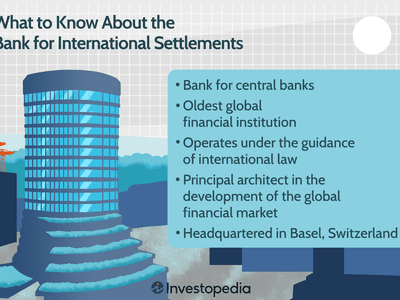

## Table of Contents

## What is the Bank for International Settlements (BIS)?

The Bank for International Settlements (BIS) is an international organization that helps central banks work together. It was created in 1930 and is based in Basel, Switzerland. The BIS helps central banks manage their money and make sure that international payments go smoothly. It also provides a place for central bankers to meet and talk about important issues.

The BIS does a lot of research and gives advice to central banks around the world. It helps them understand the global economy and how to make good decisions. The BIS also works on rules and standards that help make the financial system safer and more stable. By doing these things, the BIS helps keep the world's economy running smoothly.

## When and why was the BIS established?

The BIS was set up in 1930. It was made to help countries pay back money they owed after World War I. Germany had to pay a lot of money to other countries as part of the Treaty of Versailles. The BIS was created to manage these payments and make sure they were done fairly and on time.

Over time, the BIS grew to do more than just handle these payments. It became a place where central banks from different countries could work together. The BIS helps them share information, make rules, and keep the global economy stable. It's like a club for central banks where they can meet and solve problems together.

## Where is the BIS headquartered?

The BIS is headquartered in Basel, Switzerland. Basel is a city in the north of Switzerland, close to the borders with Germany and France.

The BIS chose Basel because it is easy to get to from many different countries. It is a good place for central bankers from around the world to meet and work together.

## What are the main functions of the BIS?

The BIS helps central banks work together and manage their money. It gives them a place to meet and talk about important things that affect the world's economy. The BIS also helps central banks share information and make rules that keep the financial system safe and stable. This helps make sure that money can move easily between countries.

The BIS also does a lot of research to help central banks understand the global economy better. It gives them advice on how to make good decisions. The BIS was first made to help countries pay back money after World War I, but now it does much more. It helps central banks from all over the world work together to keep the economy running smoothly.

## Who are the member countries of the BIS?

The BIS has 63 member countries. These countries come from all over the world, including places like the United States, China, Japan, Germany, and many others. Each member country has its own central bank, and these central banks work together at the BIS.

The BIS also has some countries that are not full members but still work with the BIS in different ways. These countries are called "non-member countries with which the BIS has agreements." They can join in on some of the BIS's activities and meetings, but they don't have the same rights as full members. This helps the BIS work with even more countries to keep the global economy stable.

## How does the BIS facilitate international financial cooperation?

The BIS helps central banks from different countries work together by giving them a place to meet and talk about important things. It's like a club where central bankers can share ideas and solve problems together. When they meet at the BIS, they can make rules and plans that help money move smoothly between countries. This makes the world's economy more stable and helps countries trust each other more.

The BIS also does a lot of research and gives advice to central banks. It helps them understand what's happening in the global economy and how to make good decisions. By sharing this information, the BIS makes sure that central banks are working with the same facts. This helps them make better choices and work together more effectively.

## What role does the BIS play in global financial stability?

The BIS helps keep the world's money system stable by helping central banks from different countries work together. It gives them a place to meet and talk about important things that can affect the global economy. When central bankers meet at the BIS, they can make rules and plans that help money move smoothly between countries. This makes the world's economy more stable and helps countries trust each other more.

The BIS also does a lot of research and gives advice to central banks. It helps them understand what's happening in the global economy and how to make good decisions. By sharing this information, the BIS makes sure that central banks are working with the same facts. This helps them make better choices and work together more effectively to keep the financial system safe and stable.

## How does the BIS contribute to the development of banking regulations and standards?

The BIS helps make banking rules and standards better by working with central banks from all over the world. It gives them a place to meet and talk about what rules are needed to keep the money system safe. When central bankers meet at the BIS, they can share ideas and work together to make new rules that help prevent problems in the banking system. These rules are important because they help banks be more stable and trustworthy.

The BIS also does research and gives advice on how to make these rules work well. It studies how the global economy is doing and what changes might be needed to keep banks safe. By sharing this information with central banks, the BIS helps them understand what's happening and how to make good decisions about banking rules. This way, the BIS helps make sure that the rules are strong and that they help keep the world's money system stable.

## What are some key historical events that have shaped the BIS?

The BIS was created in 1930 to help countries pay back money they owed after World War I. Germany had to pay a lot of money to other countries as part of the Treaty of Versailles. The BIS was set up to manage these payments and make sure they were done fairly and on time. This was a big job, and it helped the BIS become important in the world of money.

Over time, the BIS grew to do more than just handle these payments. It became a place where central banks from different countries could work together. During and after World War II, the BIS played a role in helping rebuild the world's economy. It helped central banks share information and make rules to keep the financial system stable. The BIS also started doing research and giving advice to help central banks make good decisions. These events helped the BIS become a key part of the global financial system.

## How has the role of the BIS evolved since its inception?

The BIS started in 1930 to help countries pay back money they owed after World War I. At that time, its main job was to manage these payments and make sure they were done fairly and on time. This was important because Germany had to pay a lot of money to other countries as part of the Treaty of Versailles. The BIS helped make sure these payments went smoothly, which was a big job and helped the BIS become important in the world of money.

Over time, the BIS's role grew to include more than just handling these payments. It became a place where central banks from different countries could meet and work together. The BIS helped them share information, make rules, and keep the global economy stable. It also started doing research and giving advice to help central banks make good decisions. These changes helped the BIS become a key part of the global financial system, working to keep the world's money system safe and stable.

## What are the major publications and research outputs of the BIS?

The BIS puts out many important reports and studies that help central banks understand the world's economy. One of the main publications is the "BIS Quarterly Review," which comes out every three months. This report looks at what's happening in the world of money and banking, and it gives central banks good information to help them make decisions. The BIS also publishes the "BIS Annual Economic Report," which gives a big picture of the global economy and talks about important issues that central banks need to think about.

Another important part of the BIS's work is its research papers. These papers are written by experts at the BIS and cover many different topics, like how to make banks safer, how money moves around the world, and what new rules might be needed. The BIS also has a series called "BIS Working Papers," which shares new ideas and research that can help central banks do their jobs better. All of these publications help the BIS share its knowledge and help keep the world's money system stable.

## What criticisms or controversies have been associated with the BIS?

The BIS has faced some criticism over the years. One big criticism is that it is too secretive. Some people think that the BIS does not share enough information about what it does and how it makes decisions. This makes some people worried that the BIS might be doing things that are not good for everyone. Another criticism is that the BIS is too powerful. Some people think that because it works with central banks from all over the world, it might have too much control over the global economy. They worry that the BIS could make decisions that are not fair to some countries.

There have also been controversies about the BIS's history. During World War II, the BIS was criticized for working with countries that were at war. Some people thought that the BIS should not have been working with these countries and that it should have stopped its activities during the war. After the war, the BIS faced more criticism because it was seen as a reminder of the old financial system that had caused problems. Over time, the BIS has tried to address these criticisms by being more open and working to make the world's money system fairer and more stable.

## References & Further Reading

[1]: ["Bank for International Settlements (BIS)"](https://www.bis.org/) - Official website of BIS with resources and publications on international banking and financial stability.

[2]: Goodhart, C. A. E. (2011). ["The Basle Committee on Banking Supervision: A History of the Early Years 1974-1997."](https://centerforfinancialstability.org/research/Goodhart_front_matter.pdf) Cambridge University Press.

[3]: Carney, M. (2013). ["The UK at the heart of a renewed globalisation."](https://www.bis.org/review/r131025g.pdf) Speech at the Lord Mayor’s Banquet for Bankers and Merchants of the City of London at the Mansion House.

[4]: Harford, J. (2005). ["What drives merger waves?"](https://www.sciencedirect.com/science/article/pii/S0304405X04002041) Journal of Financial Economics, Volume 77, Issue 3.

[5]: ["Basel Committee on Banking Supervision"](https://www.bis.org/bcbs/index.htm) - The Basel Committee's page providing insights into the Basel Accords and international banking regulations.

[6]: Aldridge, I. (2013). ["High-Frequency Trading: A Practical Guide to Algorithmic Strategies and Trading Systems"](https://onlinelibrary.wiley.com/doi/pdf/10.1002/9781119203803.fmatter) Wiley.