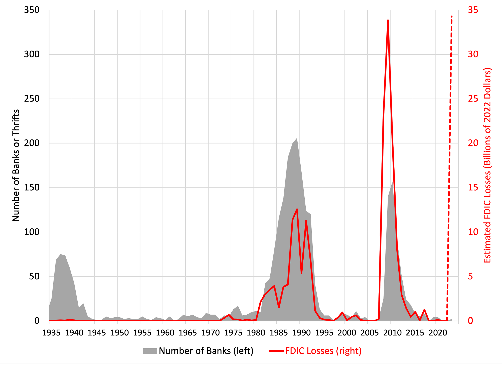

## Table of Contents

## What is the Bank Insurance Fund (BIF)?

The Bank Insurance Fund (BIF) is a part of the Federal Deposit Insurance Corporation (FDIC) in the United States. It was created to protect people's money in banks. If a bank fails, the BIF helps make sure that customers can still get their money back, up to a certain amount. This helps keep people's trust in the banking system.

The BIF was set up in 1989 after a law called the Financial Institutions Reform, Recovery, and Enforcement Act (FIRREA) was passed. Before that, there was just one fund for all types of banks. But with BIF, the FDIC could focus on insuring deposits in commercial banks separately from savings banks. This made the system more organized and helped protect people's savings better.

## What is the purpose of the Bank Insurance Fund?

The Bank Insurance Fund (BIF) is a special part of the FDIC that helps keep people's money safe in banks. It was made to make sure that if a bank goes out of business, people can still get their money back, up to a certain limit. This is important because it helps people trust banks more, knowing their savings are protected.

The BIF started in 1989 after a law called the Financial Institutions Reform, Recovery, and Enforcement Act was passed. Before that, there was just one fund for all banks. But with BIF, the FDIC could focus on protecting money in commercial banks separately from savings banks. This made the system clearer and helped protect people's savings better.

## How does the Bank Insurance Fund protect depositors?

The Bank Insurance Fund (BIF) helps keep people's money safe in banks. If a bank fails, the BIF makes sure that people can still get their money back, up to a certain amount. This amount is set by the FDIC, and it's usually up to $250,000 per depositor, per bank. By doing this, the BIF helps people feel more secure about keeping their money in banks.

The BIF was created in 1989 to focus on protecting money in commercial banks. Before that, there was just one fund for all types of banks. By having a separate fund for commercial banks, the FDIC can better manage and protect the money people put in these banks. This helps keep the banking system strong and trustworthy.

## Who manages the Bank Insurance Fund?

The Bank Insurance Fund (BIF) is managed by the Federal Deposit Insurance Corporation (FDIC). The FDIC is a government agency in the United States that works to keep people's money safe in banks. They do this by making sure banks follow rules and by having funds like the BIF to help if a bank fails.

The FDIC uses the BIF to pay back people's money if their bank goes out of business. They can pay back up to $250,000 per depositor, per bank. This helps people trust banks more because they know their money is protected. The FDIC keeps the BIF running smoothly to make sure it can help people when they need it.

## How is the Bank Insurance Fund financed?

The Bank Insurance Fund (BIF) is financed mainly through the money that banks pay as insurance premiums. Banks that are part of the BIF have to pay these premiums regularly. The amount they pay depends on how much risk the FDIC thinks the bank has. If a bank is seen as more likely to fail, it might have to pay more.

Besides the premiums, the BIF can also get money from other sources. For example, if the FDIC sells the assets of a failed bank, the money from those sales can go into the BIF. Also, the BIF can borrow money from the U.S. Treasury if it needs more funds to cover losses. This way, the BIF can keep enough money to help people if their bank fails.

## What types of accounts are covered by the Bank Insurance Fund?

The Bank Insurance Fund (BIF) covers different types of bank accounts to keep people's money safe. This includes checking accounts, where people keep money they use every day, and savings accounts, where people save money for the future. It also covers money market deposit accounts, which are a bit like savings accounts but can earn more interest, and certificates of deposit (CDs), which are savings accounts that you leave alone for a set time to earn more interest.

The BIF also protects other types of accounts like NOW accounts, which are interest-bearing checking accounts, and certain retirement accounts like Individual Retirement Accounts (IRAs). But there are some accounts that the BIF does not cover, like stocks, bonds, mutual funds, and life insurance policies. The BIF helps make sure that if a bank fails, people can get their money back from these covered accounts, up to $250,000 per depositor, per bank.

## What are the coverage limits of the Bank Insurance Fund?

The Bank Insurance Fund (BIF) has a coverage limit of up to $250,000 per depositor, per bank. This means if you have money in a bank that is part of the BIF and the bank fails, you can get back up to $250,000 of your money. This limit applies to each person, so if you have different types of accounts at the same bank, like a checking account and a savings account, the total coverage for all those accounts together is still $250,000.

However, if you have accounts at different banks, each bank's coverage is separate. So, you could have up to $250,000 covered at one bank and another $250,000 covered at a different bank. This helps people feel safer about keeping their money in banks because they know there's a limit to how much they can lose if a bank fails.

## How does the Bank Insurance Fund handle bank failures?

When a bank fails, the Bank Insurance Fund (BIF) steps in to help. The BIF is part of the FDIC, and its job is to make sure people can get their money back if their bank goes out of business. The FDIC takes over the failed bank and uses the money in the BIF to pay back depositors. They can pay back up to $250,000 per person, per bank. This helps people feel safe about keeping their money in banks because they know they won't lose it all if the bank fails.

The FDIC also tries to find another healthy bank to take over the failed bank. If they can do this, it's called a "purchase and assumption" deal. The new bank takes over the old bank's good loans and deposits, and people can keep using their accounts like nothing happened. If they can't find a new bank, the FDIC might just pay people back directly from the BIF. Either way, the BIF helps make sure people's money is protected and the banking system stays strong.

## What is the historical background of the Bank Insurance Fund?

The Bank Insurance Fund (BIF) was created in 1989 as part of the Federal Deposit Insurance Corporation (FDIC). It came about because of a law called the Financial Institutions Reform, Recovery, and Enforcement Act (FIRREA). Before the BIF, there was just one fund for all types of banks. But with the BIF, the FDIC could focus on protecting money in commercial banks separately from savings banks. This made the system more organized and helped protect people's savings better.

The BIF was important because it helped make sure people's money was safe if their bank failed. If a bank went out of business, the BIF would help pay back people's money, up to $250,000 per person, per bank. This made people feel more secure about keeping their money in banks. The BIF also helped keep the banking system strong and trustworthy by managing the funds needed to protect depositors.

## How does the Bank Insurance Fund differ from other deposit insurance systems globally?

The Bank Insurance Fund (BIF) is part of the FDIC in the United States and focuses on protecting money in commercial banks. Unlike some global deposit insurance systems, the BIF has a specific limit of $250,000 per depositor, per bank. This clear limit helps people know exactly how much of their money is protected. In other countries, the coverage limits might be different. For example, in Canada, the limit is around $100,000, while in the UK, it's around £85,000. These different limits show how countries set their own rules based on what they think is best for their people.

Another way the BIF differs is that it's managed by the FDIC, which is a government agency. This means the U.S. government backs the BIF, giving people more trust in the system. In other countries, deposit insurance might be managed by different organizations, like private companies or other government bodies. For instance, in Germany, deposit insurance can be handled by private banks themselves, while in Australia, it's managed by the Australian Prudential Regulation Authority. These differences show how countries choose to organize their systems to protect people's money in banks.

## What reforms have been made to the Bank Insurance Fund in recent years?

In recent years, the Bank Insurance Fund (BIF) has seen some important changes to make sure it keeps working well. One big change was in 2006 when the FDIC merged the BIF with another fund called the Savings Association Insurance Fund (SAIF). This made things simpler because now there's just one fund, called the Deposit Insurance Fund (DIF), to protect money in all types of banks. This merger helped the FDIC manage the money better and make sure they could pay back people if a bank failed.

Another important reform happened after the financial crisis in 2008. The FDIC raised the coverage limit from $100,000 to $250,000 per depositor, per bank. This change was made to give people more trust in banks during tough times. The FDIC also started to be more careful about how they checked banks to make sure they were safe. These reforms helped keep the BIF, now part of the DIF, strong and ready to protect people's money.

## What are the current challenges and future prospects for the Bank Insurance Fund?

The Bank Insurance Fund (BIF), now part of the Deposit Insurance Fund (DIF), faces some challenges today. One big challenge is keeping enough money in the fund to cover possible bank failures. Banks pay money into the fund, but if too many banks fail at once, it could be hard to have enough money to pay everyone back. Another challenge is keeping up with new types of banking, like online banking. The FDIC needs to make sure the fund can protect people's money even if they use new ways to bank. Also, the FDIC has to watch out for risks from things like cyber attacks that could hurt banks and the fund.

Looking to the future, the BIF, as part of the DIF, has good prospects. The FDIC keeps working to make sure the fund stays strong and can handle any problems that come up. They might need to change some rules or how they check banks to make sure they're safe. The FDIC also keeps an eye on new banking technologies and makes sure the fund can protect people's money no matter how they bank. By staying ready and making smart changes, the BIF can keep helping people feel safe about keeping their money in banks.

## References & Further Reading

[1]: FDIC: Federal Deposit Insurance Corporation. (2006). ["The Deposit Insurance Fund: Reform and Merger of BIF and SAIF."](https://www.fdic.gov/resources/deposit-insurance/deposit-insurance-fund/dif-historical/dif-reform-2005.html)

[2]: Federal Deposit Insurance Corporation. (1997). ["A Brief History of Deposit Insurance in the United States."](https://www.fdic.gov/resources/publications/brief-history-of-deposit-insurance/book/brief-history-deposit-insurance.pdf)

[3]: Marcos Lopez de Prado. (2018). ["Advances in Financial Machine Learning"](https://www.amazon.com/Advances-Financial-Machine-Learning-Marcos/dp/1119482089).

[4]: U.S. Securities and Exchange Commission (SEC). (2014). ["Equity Market Structure Literature Review: Algorithmic Trading"](https://www.sec.gov/marketstructure/research/hft_lit_review_march_2014.pdf)

[5]: Ernest P. Chan. (2009). ["Quantitative Trading: How to Build Your Own Algorithmic Trading Business"](https://onlinelibrary.wiley.com/doi/pdf/10.1002/9781119203377.fmatter).

[6]: Lennard Zinn. (2001). ["Crisis and Reform: 'Savings and Loan' Crisis of the 1980s."](https://en.wikipedia.org/wiki/Savings_and_loan_crisis) 

[7]: Stefan Jansen. (2020). ["Machine Learning for Algorithmic Trading: Predictive Models to Extract Signals from Market and Alternative Data for Systematic Trading Strategies with Python"](https://github.com/stefan-jansen/machine-learning-for-trading)

[8]: U.S. Government Publishing Office. (2010). ["Dodd-Frank Wall Street Reform and Consumer Protection Act."](https://www.govinfo.gov/app/details/COMPS-9515)