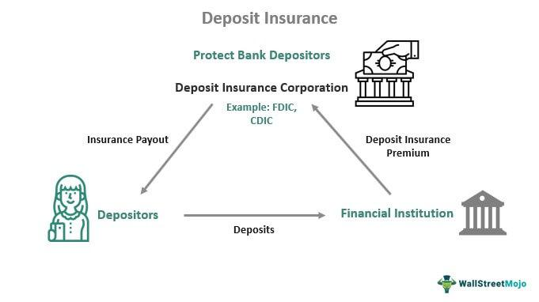

Bank insurance plays a pivotal role in safeguarding the financial system by instilling confidence among depositors and ensuring stability during financial upheavals. The assurance that funds are protected against bank failures is critical in maintaining public trust and preventing bank runs, which can severely destabilize economies. The concept of bank insurance materialized in the United States with the establishment of funds and mechanisms designed to protect depositors and absorb financial shocks.

A significant entity in this landscape was the Bank Insurance Fund (BIF), which was integral to maintaining depositor confidence during periods of bank distress. Established as part of the Federal Deposit Insurance Corporation (FDIC) framework, the BIF was created in response to widespread bank failures, notably during the savings and loan crisis of the 1980s and early 1990s. This crisis highlighted the vulnerabilities in the banking system and the need for robust protective measures to shield savers from potential losses.

The BIF evolved over time, transforming and adapting to meet the changing needs of the banking sector. Its evolution encompassed legislative changes and strategic mergers, enhancing its capability to safeguard depositor interests more effectively.

In parallel, modern banking has seen significant advancements in technology, particularly with the advent of algorithmic trading. Algorithmic trading, which involves the use of computer algorithms to execute trading orders, uses advanced mathematical models and sophisticated software to make high-speed trading decisions. It has become an essential component of contemporary banking by optimizing trading processes, improving efficiency, and reducing transaction costs.

Algorithmic trading is particularly relevant in modern banking because it provides a competitive edge by harnessing data-driven insights and executing trades at speeds and volumes beyond human capability. The execution strategies can range from statistical arbitrage to high-frequency trading, each with specific functionalities tailored to exploit market inefficiencies. The integration of cutting-edge technologies, such as machine learning and artificial intelligence, further enhances these capabilities, providing banks with robust tools to navigate the complexities of today's financial markets.

As the banking landscape continues to evolve, understanding and adapting to both the historical and modern mechanisms that safeguard financial stability remains crucial. The interplay between established insurance frameworks like the BIF and innovative trading technologies ensures a resilient financial system capable of enduring future challenges.

## Table of Contents

## Understanding the Bank Insurance Fund (BIF)

The Bank Insurance Fund (BIF) was a pivotal component within the Federal Deposit Insurance Corporation (FDIC) framework, aimed at safeguarding the deposits in banks and maintaining financial stability. Established as a fundamental response to the savings and loan crisis in the 1980s, the BIF's primary purpose was to insure deposits at Federally insured banks, providing a safety net to depositors and fostering confidence in the financial system.

Historically, the BIF's inception was a direct consequence of the savings and loan crisis. This crisis was characterized by a massive number of savings and loan associations failing due to improper lending practices, risky investments, and [interest rate](/wiki/interest-rate-trading-strategies) [volatility](/wiki/volatility-trading-strategies). The crisis highlighted significant flaws in the deposit insurance system of the time, leading to widespread bank failures and subsequent loss of public trust in financial institutions. In response, Congress created the BIF under the FDIC to specifically address these vulnerabilities and to stabilize the banking sector by offering insurance coverage for depositor funds.

The BIF played an instrumental role in maintaining depositor confidence during bank failures. When a bank failed, the BIF, through the FDIC, guaranteed depositor funds up to a certain limit, thus averting bank runs and ensuring the stability of the banking system. The protection provided by the BIF not only reassured depositors but also encouraged a more robust economic environment by preventing the domino effects of bank insolvencies.

The effectiveness of the BIF was determined by its ability to assess and mitigate risks associated with insured banks, by collecting and managing insurance premiums, and by ensuring that adequate reserves were available to cover deposit insurance claims. Through these mechanisms, the BIF contributed significantly to the resilience of the U.S. banking system throughout its operational tenure, until it was merged into the Deposit Insurance Fund (DIF) in 2006, continuing its legacy under a more comprehensive and unified insurance structure.

## The Evolution and Merger: From BIF to Deposit Insurance Fund

The Bank Insurance Fund (BIF) and the Savings Association Insurance Fund (SAIF) were pivotal components of the United States' financial safety net, designed to protect depositors in the event of bank failures. The BIF was established in the aftermath of the savings and loan crisis of the late 20th century, which underscored the necessity for a robust insurance system to maintain depositor confidence and stabilize the banking sector. The legislative developments leading to the creation and evolution of these funds are crucial for understanding their merger and transformation.

The BIF was initially created as part of the Federal Deposit Insurance Corporation (FDIC) framework, with a focus on insuring commercial bank deposits. On the other hand, the SAIF was tasked with the same function for savings institutions. Despite their similar objectives, maintaining separate insurance funds for different types of financial institutions led to inefficiencies and administrative complexities. This dual structure prompted legislative action to streamline operations and consolidate resources.

The Federal Deposit Insurance Reform Act of 2005 was a significant legislative change that facilitated the merger of the BIF and SAIF. This act aimed to improve the efficiency and management of deposit insurance funds by consolidating them into a single fund, thus optimizing resource allocation and minimizing systemic risks. The merger required careful consideration of the existing obligations and reserves of both funds to ensure a seamless transition.

With the enactment of this reform, the BIF and SAIF were combined into the Deposit Insurance Fund (DIF) in 2006. The DIF was designed to serve as a comprehensive safety net for all FDIC-insured financial institutions, irrespective of their type. This transformation marked a critical step toward simplifying the deposit insurance structure and enhancing the FDIC's ability to respond to financial crises. The DIF's creation enabled the FDIC to more effectively manage the risks associated with bank failures and maintain public confidence in the financial system.

The merger into the DIF also necessitated changes in the assessment processes and reserve management. The unified fund allowed for more flexible and dynamic management of resources, adapting to changes in the economic environment and financial sector needs. By merging the BIF and SAIF, the FDIC achieved a more resilient deposit insurance framework, better equipped to handle the complexities of modern banking and finance.

In conclusion, the evolution and merger of the Bank Insurance Fund and the Savings Association Insurance Fund into the Deposit Insurance Fund represent a pivotal development in the United States' financial regulatory landscape. The legislative changes spearheaded by the Federal Deposit Insurance Reform Act facilitated this transformation, enabling the FDIC to safeguard the nation's banking system more effectively. This consolidation reflects a forward-thinking approach to financial stability, ensuring that the deposit insurance framework can adapt to evolving challenges and support a robust economic environment.

## Algorithmic Trading in Banking

Algorithmic trading, a pivotal component in contemporary banking, involves the use of computer algorithms to automate trading decisions, facilitating the rapid buying and selling of financial instruments. Its importance in the banking sector is underscored by the efficiency and precision it brings to market operations, enabling institutions to capitalize on fleeting opportunities and optimize execution speed.

### Types of Algorithms and Their Functionalities

Algorithmic trading employs various types of algorithms, each designed to serve specific purposes in trading:

1. **Execution Algorithms**: These algorithms focus on executing trades with minimal market impact. Examples include:
   - **TWAP (Time-Weighted Average Price)**: Breaks up a large order and releases smaller portions at evenly spaced intervals over time, aiming to achieve the average price for the period.
   - **VWAP (Volume-Weighted Average Price)**: Similar to TWAP but considers the volume of trades, executing trades that reflect average market activity volumes.

2. **Statistical Arbitrage Algorithms**: Utilize statistical methods to find pricing inefficiencies in markets. They rely on complex models to identify patterns and make trades to exploit temporary price differences between securities.

3. **Market-Making Algorithms**: These algorithms provide liquidity to the market by continuously offering buy and sell quotes. By capturing the bid-ask spread, these algorithms profit from high-frequency trading operations.

4. **Sentiment-Based Algorithms**: Incorporate data from news articles, social media, and other sources to gauge market sentiment and predict future price movements, making them vital in the digital age with the proliferation of information.

5. **Momentum Algorithms**: Take advantage of existing market trends, buying securities that have shown an upward price trend or selling those on a downward trajectory. These algorithms are essential for trend-following strategies.

### Role of Advanced Technologies

Advancements in technology have significantly enhanced trading efficiencies. High-Frequency Trading ([HFT](/wiki/high-frequency-trading-strategies)), a subset of [algorithmic trading](/wiki/algorithmic-trading), exemplifies how powerful computing and telecommunications technologies can achieve trades within microseconds, crucial in competitive markets where speed is paramount.

Machine learning and [artificial intelligence](/wiki/ai-artificial-intelligence) (AI) further empower these algorithms by processing vast datasets beyond human capability, identifying patterns, and making predictive analyses to refine trading strategies. Technologies such as natural language processing (NLP) enhance sentiment-based algorithms by accurately analyzing textual data.

Moreover, cloud computing and big data analytics offer scalability and the ability to back-test algorithmic strategies over historical data, allowing banks to optimize and validate their strategies before live deployment. Quantum computing stands on the horizon as another potential leap forward, promising to solve complex problems at unprecedented speeds, thus redefining trading paradigms.

In conclusion, algorithmic trading stands as a cornerstone of modern banking operations, with its continued evolution crucial for maintaining a competitive edge in financial markets. Through the integration of cutting-edge technologies, it provides sophisticated tools for executing trades with superior efficiency and precision, ensuring that banks remain at the forefront of financial innovation.

## Legal and Regulatory Framework

The legal and regulatory framework surrounding bank insurance and trading practices plays a crucial role in maintaining the stability and integrity of the financial system. Several regulatory acts have been introduced to oversee the operations of the Bank Insurance Fund (BIF) and to regulate trading practices within banks, particularly with the rise of algorithmic trading.

The Dodd-Frank Wall Street Reform and Consumer Protection Act, enacted in 2010, significantly impacted bank insurance and trading practices. This comprehensive piece of legislation was introduced in response to the 2008 financial crisis and aimed to reduce the risk in the financial system. Within the context of bank insurance, the Dodd-Frank Act led to increased scrutiny on large financial institutions, ensuring more robust oversight and enhanced consumer protection measures. It mandated that the Federal Deposit Insurance Corporation (FDIC) oversee the health and strategic importance of banks more rigorously, thereby indirectly influencing the actions and scope of insurance funds like the BIF.

One of the key components of the Dodd-Frank Act concerning bank insurance was the establishment of the Orderly Liquidation Authority, which gave regulators enhanced power to liquidate failing financial institutions that posed a risk to the broader economy, thus protecting taxpayers from the costs of such failures. This reinforced the safety and soundness of the deposit insurance system by minimizing potential liabilities for insurance funds.

In algorithmic trading, compliance necessities have become increasingly stringent. Algorithmic trading involves the use of complex algorithms and high-speed data analysis to execute trades automatically. Regulators, recognizing the potential risks associated with these practices, have required banks to adhere to strict compliance measures. This includes implementing robust risk management strategies, ensuring the algorithms are compliant with market regulations, and maintaining transparency in trading activities.

Banks engaging in algorithmic trading must ensure their systems are resilient against potential market disruptions and avoid practices that could manipulate market conditions, such as "quote stuffing" or "layering," which artificially impact the market by flooding it with orders that are quickly canceled. Ensuring compliance with these practices often involves significant investment in technological infrastructure and risk assessment capabilities.

Overall, the regulatory landscape for both bank insurance and trading practices continues to evolve, reflecting the dynamic nature of the financial sector. Regulatory bodies remain vigilant, adapting to new challenges and technological advancements to maintain the stability and security of the financial system.

## Challenges and Considerations

The Bank Insurance Fund (BIF) faces a variety of challenges in the context of contemporary banking crises. One significant concern is the potential strain on the fund's resources during bank failures, particularly in periods of economic downturn. When multiple banks face financial difficulties simultaneously, the demand on the BIF to cover depositor losses can escalate, straining its capacity to fulfill its obligations. This situation necessitates constant monitoring and management of the fund’s reserve ratio, which is the proportion of assets held in reserve relative to insured deposits.

Algorithmic trading, although enhancing efficiency and [liquidity](/wiki/liquidity-risk-premium) in financial markets, poses its own set of risks that must be managed carefully. Key concerns include:

1. **Market Volatility**: Algorithmic trading can exacerbate market volatility. During rapid market movements, algorithms might trigger cascading orders that amplify price swings, potentially destabilizing markets. 

2. **Flash Crashes**: The reliance on algorithms in high-frequency trading can lead to flash crashes, where abrupt price drops occur within minutes. These incidents expose vulnerabilities in market structure and necessitate systems to halt trading during extreme volatility.

3. **Systemic Risk**: The interconnectedness of algorithmic trading systems means that a malfunction or erroneous trading strategy at a single firm can have broader implications for the market, potentially leading to systemic risk.

To manage these risks, financial institutions employ various strategies, including robust risk management systems, circuit breakers to halt trading during extreme movements, and thorough testing of algorithms before deployment. Regulatory frameworks also require banks to implement compliance protocols to ensure trading activities do not jeopardize financial stability.

The impact of global financial changes on U.S. bank insurance funds like the BIF cannot be overlooked. Economic conditions worldwide influence U.S. banks' health due to their international operations and foreign investment portfolios. For instance, economic crises or regulatory shifts in significant economies can affect U.S. banks' profitability and, subsequently, their risk profiles. Additionally, globalization means that U.S. banks are exposed to currencies, regulatory environments, and economic cycles of other countries. 

Consequently, the BIF must adapt by analyzing global economic trends and regulatory developments promptly. Adequately preparing for these influences can involve stress testing against various international scenarios and adjusting reserve policies accordingly to protect against unforeseen global events impacting domestic financial stability.

In conclusion, while the BIF provides foundational security against banking failures, continuous evaluation and enhancement of risk management strategies for both insurance funds and algorithmic trading practices are crucial in maintaining confidence and stability in the financial system.

## Future Prospects

Potential future developments in bank insurance and trading are set to be shaped extensively by technological advancements and adjustments in the economic and regulatory landscapes. The fusion of innovative technologies and adaptive strategies offers numerous opportunities to enhance financial stability and efficiency in banking systems.

Emerging technologies such as artificial intelligence (AI), blockchain, and [machine learning](/wiki/machine-learning) are expected to revolutionize bank insurance and trading. AI and machine learning algorithms provide the ability to process vast amounts of data, allowing for more accurate risk assessments and efficient claims processing in bank insurance. They can also optimize trading strategies by detecting patterns and trends that are not immediately obvious to human traders. These technologies could improve decision-making processes, leading to more effective risk management and potentially higher returns.

Blockchain technology presents another significant development, particularly in increasing transparency and security within financial transactions. Its decentralized nature could pave the way for more reliable and tamper-proof record-keeping systems, thereby reducing fraud risks and enhancing trust among stakeholders. Smart contracts, facilitated by blockchain, can automate claim processing in bank insurance, reducing costs and increasing efficiency.

In adapting to evolving economic and regulatory landscapes, financial institutions must devise strategies that encompass technological integration with compliance and risk management. This involves developing robust cybersecurity frameworks to protect against increasing threats as more systems become digitized. Moreover, banks must ensure compliance with emerging regulations, which may include comprehensive data protection acts and updated financial oversight regulations.

To successfully navigate these changes, financial institutions might focus on the following strategies:

1. **Investment in Technology**: Continuous investment in cutting-edge technology is crucial. Building in-house capabilities or partnerships with tech firms can ensure banks remain at the forefront of innovation.

2. **Agile Regulatory Compliance**: The ability to quickly adapt to new regulations will become increasingly important. Implementing flexible compliance frameworks that can be adjusted as regulations evolve will be vital for staying compliant without stifling innovation.

3. **Collaborative Ecosystems**: Building ecosystems that encourage collaboration between traditional financial institutions, fintech startups, and regulatory bodies can foster innovation and facilitate smoother adaptation to new technologies and regulations.

4. **Continuous Education and Training**: Keeping workforce skills up to date with technological advancements ensures that employees are equipped to handle new systems and processes efficiently.

In conclusion, the integration of emerging technologies alongside proactive strategies to address regulatory changes and economic shifts can significantly bolster the resilience and efficiency of bank insurance and trading systems. Financial institutions that embrace these developments while effectively managing associated risks are likely to see enhanced stability and performance in the future.

## Conclusion

The Bank Insurance Fund (BIF) has played a fundamental role in reinforcing the stability of the financial system by ensuring depositor confidence, especially during bank failures. As a mechanism for mitigating risk and promoting trust in financial institutions, the BIF, now part of the broader Deposit Insurance Fund (DIF), serves as a vital safeguard against systemic risk. This assurance is crucial in maintaining the functioning of the economic infrastructure and protecting the interests of depositors.

In parallel, algorithmic trading has emerged as a transformative force in modern banking. It enhances trading efficiencies through the application of sophisticated algorithms and advanced technologies. The precision and speed offered by algorithmic trading contribute to the liquidity and robustness of financial markets. By efficiently processing large volumes of transactions, these algorithms balance the scales of supply and demand, maintain price stability, and reduce transaction costs.

Adaptability within financial systems is essential to address the rapidly changing landscape of banking and finance. The evolution of the BIF into the DIF illustrates the necessity of adapting to legislative and economic shifts to ensure continued protection and relevance. Similarly, the dynamic nature of algorithmic trading requires banks to perpetually evolve with technological advancements and regulatory requirements. These sectors must remain vigilant to potential market changes and evolving risks, ensuring agility and resilience.

Furthermore, ongoing research and development are pivotal in these areas. An inquiry into innovative insurance structures and the continuous improvement of trading algorithms promises enhanced stability and efficiency. Investment in these domains fosters an environment conducive to growth and resilience amid global financial upheavals. Collaboration between industry stakeholders, regulators, and researchers is essential to navigate the complexities of emerging economic realities and secure a stable banking future.

## References & Further Reading

[1]: FDIC: Federal Deposit Insurance Corporation. (2006). ["The Deposit Insurance Fund: Reform and Merger of BIF and SAIF."](https://www.fdic.gov/resources/deposit-insurance/deposit-insurance-fund/dif-historical/dif-reform-2005.html)

[2]: Federal Deposit Insurance Corporation. (1997). ["A Brief History of Deposit Insurance in the United States."](https://www.fdic.gov/resources/publications/brief-history-of-deposit-insurance/book/brief-history-deposit-insurance.pdf)

[3]: Marcos Lopez de Prado. (2018). ["Advances in Financial Machine Learning"](https://www.amazon.com/Advances-Financial-Machine-Learning-Marcos/dp/1119482089).

[4]: U.S. Securities and Exchange Commission (SEC). (2014). ["Equity Market Structure Literature Review: Algorithmic Trading"](https://www.sec.gov/marketstructure/research/hft_lit_review_march_2014.pdf)

[5]: Ernest P. Chan. (2009). ["Quantitative Trading: How to Build Your Own Algorithmic Trading Business"](https://onlinelibrary.wiley.com/doi/pdf/10.1002/9781119203377.fmatter).

[6]: Lennard Zinn. (2001). ["Crisis and Reform: 'Savings and Loan' Crisis of the 1980s."](https://en.wikipedia.org/wiki/Savings_and_loan_crisis) 

[7]: Stefan Jansen. (2020). ["Machine Learning for Algorithmic Trading: Predictive Models to Extract Signals from Market and Alternative Data for Systematic Trading Strategies with Python"](https://github.com/stefan-jansen/machine-learning-for-trading)

[8]: U.S. Government Publishing Office. (2010). ["Dodd-Frank Wall Street Reform and Consumer Protection Act."](https://www.govinfo.gov/app/details/COMPS-9515)