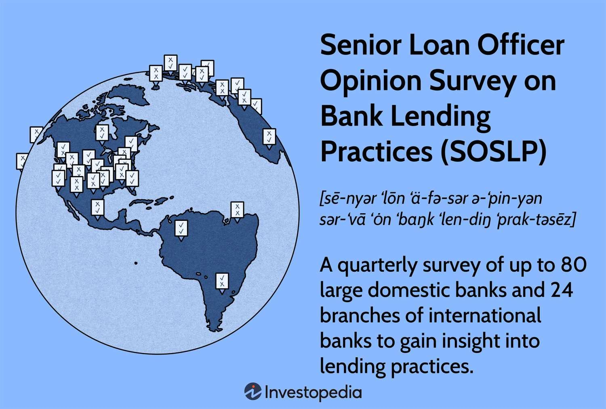

In recent years, the financial landscape has evolved rapidly, influenced by technological advancements and shifts in regulatory frameworks. This transformation has underscored the importance of understanding bank lending practices, credit assessment, and the deployment of algorithms in trading. Bank lending surveys have emerged as critical tools in economic and financial analysis, offering insights into lending standards and credit availability. These surveys help central banks in regulating and supervising the banking system, ensuring financial stability.

Algorithmic trading has revolutionized financial markets by leveraging complex algorithms to execute trades at speeds and frequencies that are beyond human capabilities. It has increased market liquidity and has been instrumental in price discovery, but it also introduces risks, such as market volatility and flash crashes.



Machine learning continues to intersect with traditional financial analysis to enhance credit assessment models. By utilizing vast datasets, machine learning algorithms improve the precision of credit risk predictions, enhancing decision-making processes for lenders and optimizing credit offerings for borrowers. The purpose of this article is to provide a comprehensive overview of these developments, highlighting their implications, challenges, and future prospects in the field of finance. Through this exploration, we aim to illustrate how integrating traditional financial analysis with modern technologies can equip institutions with the tools needed to navigate the complexities of today's financial environment.

## Table of Contents

## Understanding Bank Lending Surveys

Bank lending surveys are structured questionnaires distributed to financial institutions to gather data on lending practices and conditions. These surveys are essential tools for central banks and regulatory bodies to gauge the lending climate and make informed decisions regarding monetary policy and financial stability. Their primary purpose is to provide insights into the credit standards and terms applied by banks, which, in turn, reflect the broader economic conditions and forecast future economic activities.

Central banks utilize the data collected from bank lending surveys to monitor and regulate the banking sector effectively. By analyzing trends and changes in lending practices, central banks can identify potential risks in the financial system and ensure sound banking operations. The surveys offer a macroeconomic perspective on credit availability, which is crucial for maintaining economic equilibrium. For instance, a tightening of credit conditions might signal economic downturns or increasing risk aversion among banks, prompting central banks to adjust interest rates or implement other policy measures.

A typical bank lending survey contains a variety of questions designed to extract detailed information about current and intended lending activities. These questions often cover topics such as changes in credit standards, likely reasons for tightening or loosening these standards, shifts in demand for loans, and the impact of specific regulatory or economic factors on lending behavior. The surveys are conducted periodically, allowing a continuous assessment of trends over time.

Among the most notable bank lending surveys, the Federal Reserve's Senior Loan Officer Opinion Survey on Bank Lending Practices is widely recognized. This survey is pivotal in the United States for understanding how recent financial conditions are influencing lending practices. It provides valuable information to both policymakers and market participants by summarizing responses from loan officers at major banks. The survey includes questions about changes in the standards and terms for bank loans to businesses and households, as well as questions on the demand for loans within the reporting periods.

Overall, bank lending surveys serve as crucial instruments for financial surveillance and economic forecasting, aiding central banks in crafting policies to sustain financial stability and encourage economic growth.

## Financial Analysis and Credit Assessment

Financial analysis is crucial in the context of credit assessment as it aids banks in evaluating the creditworthiness of potential borrowers. The process involves examining various financial statements and metrics to assess the ability of a borrower to repay their debts. This analysis provides the foundation for determining lending conditions such as interest rates, loan amounts, and repayment schedules.

### Determining Lending Conditions

Banks utilize financial analysis to set lending conditions by examining several key financial indicators. These include [liquidity](/wiki/liquidity-risk-premium) ratios, which measure a borrower's ability to meet short-term obligations, and solvency ratios, which assess long-term financial stability. Fundamental analysis also incorporates cash flow analysis to evaluate the sustainability of income streams.

For instance, if a borrower demonstrates a high current ratio and steady cash flow, they may be deemed low risk, leading to favorable lending terms. Conversely, borrowers with unstable income or poor liquidity levels might face stricter conditions. The quantitative formula commonly used is:

$$
\text{Interest Rate} = f(\text{Credit Score}, \text{Debt-to-Income Ratio}, \text{Collateral Value})
$$

Python can be employed to implement such calculations, as shown below:

```python
def calculate_interest_rate(credit_score, debt_to_income, collateral_value):
    base_rate = 0.05
    score_modifier = (700 - credit_score) * 0.0001
    dti_modifier = debt_to_income * 0.001
    collateral_modifier = 0.001 / collateral_value
    return base_rate + score_modifier + dti_modifier + collateral_modifier

# Example usage
interest_rate = calculate_interest_rate(680, 0.4, 100000)
print(f"Calculated interest rate: {interest_rate:.2f}")
```

### Importance of Accurate Credit Assessment

For lenders, accurate credit assessment is essential to mitigate the risk of default and ensure the profitability of their lending operations. For borrowers, it provides a transparent process that can help secure better loan conditions. An accurate credit assessment also promotes fair access to credit, fostering broader economic stability.

### Challenges and Limitations

Traditional credit assessment faces several challenges. It often relies heavily on historical financial data, which may not accurately predict future performance, especially in volatile markets. Furthermore, there is a risk of human error in manual analysis, and biases can sometimes influence assessment outcomes.

Additionally, traditional models may not adequately account for non-financial factors such as management quality, market competition, or broader economic conditions, which can impact a borrower's ability to repay. The lack of integration of real-time data further limits the precision and responsiveness of traditional credit assessments.

Such constraints necessitate advancements in credit risk modeling, integrating innovative technologies and embracing data-driven approaches to enhance accuracy and efficiency in credit evaluations.

## Algorithmic Trading and its relation to Financial Markets

Algorithmic trading, a method of executing orders using automated, pre-programmed trading instructions, has become a cornerstone in modern financial markets. It is grounded in computational technology to optimize trading processes, minimize costs, and reduce human error. This technology integrates vast amounts of market data, enabling traders to make informed decisions based on quantitative models and statistical analysis rather than on intuition alone. Algorithmic trading is essential for maintaining liquidity and ensuring the rapid adjustment of financial positions in the markets.

One of the key methodologies in [algorithmic trading](/wiki/algorithmic-trading) is high-frequency trading ([HFT](/wiki/high-frequency-trading-strategies)), which involves executing a large number of orders at extremely high speeds. Common algorithms include statistical [arbitrage](/wiki/arbitrage), which exploits inefficiencies in the market pricing, and the market-making algorithm that places both buy and sell orders to profit from the bid-ask spread. Trend-following strategies and mean-reversion algorithms are also widely used, predicting price movements based on historical patterns and the assumption that asset prices will revert to their historical means, respectively.

The relationship between algorithmic trading and credit assessment is evolving. With the advent of sophisticated algorithms, financial institutions can better assess credit risks by analyzing real-time data alongside historical credit information. This enhances the precision of credit risk models and facilitates more effective decision-making regarding loan approvals and [interest rate](/wiki/interest-rate-trading-strategies) adjustments. Algorithmic trading models can predict market trends that might affect an entity's creditworthiness, thus providing more comprehensive risk assessments.

Despite its significant advantages, algorithmic trading poses certain risks. The reliance on algorithms can lead to market distortions, as evidenced by events like the "Flash Crash" of 2010, where stock markets plummeted and rebounded within minutes due to algorithmic trading errors. Additionally, these algorithms can exacerbate market [volatility](/wiki/volatility-trading-strategies) and create systemic risks if not properly managed. On the positive side, algorithmic trading contributes to enhanced liquidity, reduced transaction costs, and more efficient markets.

The balance of potential risks and benefits necessitates rigorous oversight and continuous refinement of algorithmic strategies. As technology evolves, so too will the landscape of algorithmic trading, demanding increased sophistication in both its regulation and application.

## Machine Learning in Credit Risk Prediction

Artificial intelligence (AI) and [machine learning](/wiki/machine-learning) (ML) have revolutionized the field of credit risk assessment, enabling financial institutions to more accurately predict potential defaults and assess borrower creditworthiness. Traditional credit risk assessment models often relied on historical financial data and static variable analysis, offering limited flexibility. However, the integration of machine learning algorithms provides a dynamic approach that enhances predictive accuracy.

### Commonly Used Machine Learning Algorithms for Predicting Credit Risk

Several ML algorithms are particularly effective for credit risk prediction:

1. **Logistic Regression**: A statistical model that estimates the probability of a binary outcome, such as default or no default. Despite its simplicity, logistic regression models are still widely used due to their interpretability and effectiveness in linear relationship scenarios.

2. **Decision Trees and Random Forests**: Decision trees are intuitive models that split the data based on feature thresholds, making them useful for identifying non-linear relationships. Random forests, an ensemble of decision trees, improve predictive accuracy and reduce overfitting by averaging multiple tree outcomes.

3. **Gradient Boosting Machines (GBM)**: An ensemble technique that builds trees sequentially, each correcting errors of its predecessor. GBM models are powerful due to their ability to capture complex patterns.

4. **Support Vector Machines (SVM)**: Useful for classification tasks, SVMs identify the hyperplane that best separates classes in a high-dimensional space. While effective, they require careful tuning of parameters and kernel selection.

5. **Neural Networks**: Capable of modeling highly non-linear relationships through interconnected layers of nodes, neural networks are potent in situations with voluminous and complex data. Deep learning models, a subset of neural networks, have further advanced credit risk assessment capabilities.

### Case Studies and Examples

One application of machine learning in credit risk involves the enhancement of scoring models. A study by [Nguyen et al. (2020)](https://doi.org/10.1016/j.jfs.2019.100806) at a major European bank showed that the integration of ensemble learning techniques resulted in a decrease in prediction errors by over 20%. Similarly, the use of [deep learning](/wiki/deep-learning) models by [Experian](https://www.experian.com/blogs/news/2019/06/the-increased-use-of-ai-for-credit-risk-prediction/) demonstrated improved precision and recall metrics, enhancing the identification of high-risk borrowers.

### Challenges in Implementing Machine Learning Models

Despite their advantages, several challenges arise when integrating machine learning into credit risk assessment:

- **Data Quality and Availability**: High-quality, comprehensive data is pivotal for effective model training. Incomplete or biased datasets can lead to inaccurate predictions.

- **Model Explainability**: Complex models, particularly deep learning networks, often function as "black boxes," providing limited insight into decision-making processes. This lack of transparency can hinder model adoption in sectors requiring accountability.

- **Regulatory Compliance**: Ensuring ML models comply with financial regulations can be challenging, given the evolving legal landscape surrounding AI use.

- **Model Risk Management**: Continuous monitoring and validation of ML models are necessary to mitigate risks associated with model drift and unforeseen economic changes.

In conclusion, machine learning presents transformative opportunities for credit risk assessment, enabling more nuanced and accurate predictions. Although challenges exist, the continued improvement of ML technologies and strategies for overcoming these obstacles hold promise for enhancing the robustness of credit risk models.

## Future of Financial Analysis

As financial analysis continually evolves, emerging trends driven by technology are reshaping the industry, particularly in the domains of credit assessment and decision-making. One such trend is the growing reliance on data-driven decision-making processes in financial markets. This approach leverages vast datasets and sophisticated analytical tools to enhance the precision of financial decisions, providing a competitive edge in rapidly changing market conditions. 

Machine learning and [artificial intelligence](/wiki/ai-artificial-intelligence) (AI) are at the forefront of these advancements, enabling predictive analytics that identify patterns and trends that historical data alone might miss. Algorithms trained on extensive datasets can predict credit risk with increased accuracy, minimizing default rates and enhancing lending terms. This data-driven model allows financial institutions to tailor their offerings to individual client profiles, optimizing returns and reducing risk exposure.

Technological advancements also present opportunities for improving bank lending surveys and algorithmic trading. Traditional bank lending surveys can be augmented with real-time data analysis, providing more timely and accurate insights into market sentiments and lender behaviors. This integration can result in more dynamic lending environments, where interest rates and credit terms can be adjusted in response to real-time economic indicators rather than historical data alone.

Algorithmic trading, increasingly driven by machine learning, benefits by incorporating real-time data feeds, enhanced computational power, and advanced predictive models. This approach reduces latency in trades, allowing for split-second decision-making that capitalizes on fleeting market opportunities. However, it's essential to remain cognizant of potential over-reliance on technology, which can lead to systemic risks if models are not continuously adapted to reflect current market dynamics.

The shift towards enhanced financial analytics has significant implications for economic policies. As financial institutions become more reliant on advanced analytics, policymakers may need to adjust regulatory frameworks to ensure these practices contribute positively to economic stability. Enhanced analytics can also inform monetary policies, as better data results in more accurate economic forecasts, leading to more effective policy measures.

In conclusion, the future of financial analysis is poised for significant transformation as technology continues to drive innovative solutions. Data-driven insights and machine learning will redefine traditional credit assessment, bank lending, and trading practices, prompting a shift towards more agile and adaptive financial systems. The onus is on financial institutions and policymakers to harness these advancements responsibly, ensuring they deliver on their promise of enhanced accuracy and stability in financial markets.

## Conclusion

This article has explored the multifaceted landscape of financial analysis, highlighting the crucial convergence of traditional methods with cutting-edge technologies. A comprehensive understanding of bank lending practices, the role of bank lending surveys, and the integration of algorithmic trading alongside machine learning in credit risk prediction sets a foundation for future innovation in economic and financial strategies.

Throughout the discussion, it has become evident that merging traditional financial analysis with emerging technologies such as machine learning can dramatically enhance the accuracy and efficiency of credit assessment processes. By leveraging bank lending surveys, institutions gain insights pivotal for regulatory purposes and informed decision-making. Moreover, algorithmic trading exemplifies how advancements in technology revolutionize market interactions by offering sophisticated, data-driven strategies.

Looking ahead, the future trajectory of financial analysis, bank lending, and credit assessment promises to be shaped significantly by these technological advancements. As artificial intelligence continues to evolve, it is anticipated that its integration in credit risk assessment will lead to more robust predictive models and preemptive strategies, thereby reducing financial risk.

Financial institutions are encouraged to embrace these innovative solutions, maximizing their potential benefits through investment in technological infrastructure and expertise. By doing so, they not only keep pace with evolving market conditions but also enhance their decision-making processes, fostering a more resilient and dynamic financial landscape. This strategic alignment with technology ensures that institutions remain competitive and capable of thriving in an ever-changing economic environment.

## References & Further Reading

[1]: ["Senior Loan Officer Opinion Survey on Bank Lending Practices."](https://www.federalreserve.gov/data/sloos.htm) Board of Governors of the Federal Reserve System.

[2]: Nguyen, T., Bellettre, J., & Soritori, M. (2020). "[Ensemble Component Analysis in Credit Risk Prediction.](https://www.researchgate.net/publication/369197511_Machine_Learning_Approach_to_Credit_Risk_Prediction_A_Comparative_Study_Using_Decision_Tree_Random_Forest_Support_Vector_Machine_and_Logistic_Regression)" Journal of Financial Stability.

[3]: Lopez de Prado, M. (2018). ["Advances in Financial Machine Learning."](https://www.amazon.com/Advances-Financial-Machine-Learning-Marcos/dp/1119482089) John Wiley & Sons.

[4]: Chan, E. P. (2008). ["Quantitative Trading: How to Build Your Own Algorithmic Trading Business."](https://github.com/ftvision/quant_trading_echan_book) John Wiley & Sons.

[5]: Hathaway, N. (2019). ["The Increased Use of AI for Credit Risk Prediction."](https://www.researchgate.net/publication/375034680_The_Role_of_Artificial_Intelligence_Financial_and_Non-Financial_Data_in_Credit_Risk_Prediction_Literature_Review) Experian News Blog. 

[6]: Aronson, D. R. (2006). ["Evidence-Based Technical Analysis: Applying the Scientific Method and Statistical Inference to Trading Signals."](https://www.amazon.com/Evidence-Based-Technical-Analysis-Scientific-Statistical/dp/0470008741) John Wiley & Sons.

[7]: Jansen, S. (2018). ["Machine Learning for Algorithmic Trading."](https://github.com/stefan-jansen/machine-learning-for-trading) Packt Publishing.