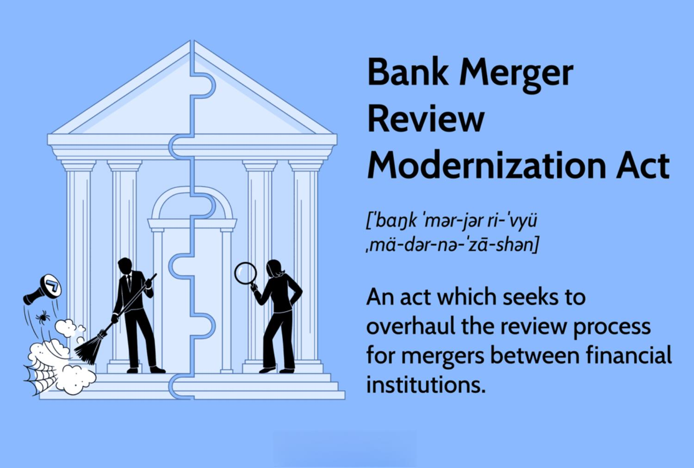

## Table of Contents

## What is the Bank Merger Review Modernization Act?

The Bank Merger Review Modernization Act is a law that aims to update the way bank mergers are looked at in the United States. It was introduced to make sure that when banks want to merge, the process is fair and takes into account the needs of the community and the overall economy. The act focuses on improving transparency and accountability in the merger process, which means that the public can see and understand how decisions about bank mergers are made.

This law also tries to make sure that the effects of bank mergers on competition are carefully considered. It wants to prevent big banks from getting too powerful and harming smaller banks. By doing this, the act helps to keep the banking industry balanced and competitive. Overall, the Bank Merger Review Modernization Act is important because it helps protect consumers and the economy by making sure bank mergers are handled in a responsible way.

## When was the Bank Merger Review Modernization Act introduced?

The Bank Merger Review Modernization Act was introduced in the United States Congress on March 17, 2022. This act was proposed by a group of lawmakers who wanted to update the rules about how banks can merge with each other. They felt that the old rules were not good enough to protect the community and the economy.

The main goal of this act is to make the process of reviewing bank mergers more open and fair. It wants to make sure that when banks merge, it does not harm competition or hurt smaller banks. By doing this, the act helps keep the banking industry balanced and protects consumers.

## Who proposed the Bank Merger Review Modernization Act?

The Bank Merger Review Modernization Act was proposed by a group of lawmakers in the United States Congress. The main people behind this act were Senators Elizabeth Warren and Sheldon Whitehouse, along with Representative Jesús "Chuy" García. They wanted to update the rules about how banks can merge with each other because they felt the old rules were not good enough to protect the community and the economy.

This group of lawmakers believed that the process of reviewing bank mergers needed to be more open and fair. They wanted to make sure that when banks merge, it does not harm competition or hurt smaller banks. By proposing this act, they aimed to keep the banking industry balanced and to protect consumers from the negative effects of big bank mergers.

## What are the main goals of the Bank Merger Review Modernization Act?

The Bank Merger Review Modernization Act aims to make the process of reviewing bank mergers fairer and more open. It wants to make sure that when banks decide to merge, the public can see and understand how decisions are made. This means that the process will be more transparent, so people can trust that the right choices are being made for their community and the economy.

Another big goal of the act is to protect competition in the banking industry. It wants to stop big banks from getting too powerful and hurting smaller banks. By doing this, the act helps keep the banking industry balanced and makes sure that smaller banks have a chance to compete. This is important because it helps protect consumers and keeps the economy healthy.

## How does the Bank Merger Review Modernization Act affect existing bank merger regulations?

The Bank Merger Review Modernization Act changes how banks are allowed to merge by making the process more open and fair. Before this act, the rules for bank mergers were not as clear, and it was hard for the public to understand how decisions were made. The new act makes it easier for everyone to see what is happening when banks want to merge. It asks for more information to be shared, so people can trust that the decisions are good for their community and the economy.

The act also makes sure that big banks do not get too powerful and harm smaller banks. It wants to keep competition strong in the banking world. This is important because it helps protect consumers and keeps the economy healthy. By making these changes, the Bank Merger Review Modernization Act helps to create a fairer and more balanced banking industry.

## What specific changes does the Bank Merger Review Modernization Act propose to the merger review process?

The Bank Merger Review Modernization Act wants to make the process of looking at bank mergers more open and fair. It asks for more information to be shared with the public so everyone can see and understand how decisions about bank mergers are made. This means that the government will have to explain why they approve or reject a merger, which helps people trust that the right choices are being made for their community and the economy.

The act also focuses on keeping competition strong in the banking world. It does this by making sure that big banks do not get too powerful and harm smaller banks. When a merger is being reviewed, the act requires a closer look at how it might affect competition. This helps to stop big banks from taking over and keeps the banking industry balanced, which is important for protecting consumers and keeping the economy healthy.

## How might the Bank Merger Review Modernization Act impact small banks?

The Bank Merger Review Modernization Act could help small banks by making sure big banks don't get too powerful. When big banks want to merge, the act makes the government look closely at how it might hurt competition. This means small banks have a better chance to keep doing business and not get pushed out by bigger banks. The act helps keep the banking world fair, so small banks can compete and serve their communities.

The act also makes the merger process more open. This means that when banks want to merge, the public can see and understand what is happening. Small banks can use this information to make sure their voices are heard. They can tell the government about the good things they do for their communities, which might help stop mergers that could hurt them. Overall, the act gives small banks a better chance to stay strong and keep helping their customers.

## What are the potential economic implications of the Bank Merger Review Modernization Act?

The Bank Merger Review Modernization Act could have big effects on the economy. By making the process of looking at bank mergers more open and fair, the act helps keep competition strong in the banking world. This means that small banks have a better chance to keep doing business and not get pushed out by bigger banks. When small banks can compete, they can keep helping their communities by offering loans and services. This can lead to more jobs and better economic growth in local areas.

The act also makes sure that when banks merge, it does not hurt the economy in a bad way. By looking closely at how mergers might affect competition, the government can stop big banks from getting too powerful. This helps keep the banking industry balanced, which is important for the overall health of the economy. If big banks were allowed to get too big, they might charge higher fees or offer fewer services, which could hurt consumers and slow down economic growth. So, the act helps protect consumers and keep the economy strong.

## How does the Bank Merger Review Modernization Act align with international banking standards?

The Bank Merger Review Modernization Act aims to make the process of looking at bank mergers more open and fair. This is similar to what many countries around the world are doing. They want to make sure that when banks merge, it is done in a way that helps the economy and does not harm competition. By making the process more transparent, the act follows international standards that encourage openness and fairness in banking regulations.

The act also focuses on keeping competition strong in the banking world. This is important because it helps protect consumers and keeps the economy healthy. Many countries have rules that try to stop big banks from getting too powerful and hurting smaller banks. The Bank Merger Review Modernization Act aligns with these international standards by looking closely at how mergers might affect competition. This helps to keep the banking industry balanced and supports economic growth, which is a goal shared by many countries around the world.

## What are the criticisms and support arguments surrounding the Bank Merger Review Modernization Act?

Some people do not like the Bank Merger Review Modernization Act. They say it might make it harder for banks to merge, which could slow down the economy. They think that if banks cannot merge easily, they might not be able to grow and help the economy as much. Also, some critics worry that the act will make the process of looking at mergers too complicated and slow. They believe that this could hurt banks and make it harder for them to do business.

On the other hand, many people support the Bank Merger Review Modernization Act. They think it is important to make the process of looking at bank mergers more open and fair. Supporters believe that this will help protect competition and stop big banks from getting too powerful. They say that by keeping the banking industry balanced, the act will help protect consumers and keep the economy healthy. They also think that the act will make sure that when banks merge, it is done in a way that is good for the community and the economy.

## How has the public and financial sector responded to the Bank Merger Review Modernization Act?

The public has had mixed feelings about the Bank Merger Review Modernization Act. Many people like that it makes the process of looking at bank mergers more open and fair. They believe this will help keep competition strong and protect consumers. However, some people worry that the act might make it harder for banks to merge, which could slow down the economy. They think that if banks cannot grow easily, it might hurt local communities and jobs.

The financial sector has also had different reactions to the act. Some banks and financial experts support it because they think it will create a more balanced banking industry. They believe that by stopping big banks from getting too powerful, the act will help smaller banks compete and serve their communities better. On the other hand, some in the financial sector are concerned that the act will make the merger process too complicated and slow. They worry that this could hurt their ability to do business and grow.

## What are the next steps for the Bank Merger Review Modernization Act to become law?

The next steps for the Bank Merger Review Modernization Act to become law involve going through the legislative process in Congress. First, the act needs to be reviewed by committees in both the House of Representatives and the Senate. These committees will hold hearings where experts and the public can share their thoughts on the act. After the hearings, the committees might make changes to the act. Once they are happy with it, they will vote on whether to send it to the full House and Senate for a vote.

If the act passes in both the House and the Senate, it will go to the President. The President can then decide to sign the act into law or veto it. If the President signs it, the Bank Merger Review Modernization Act will become law. If the President vetoes it, Congress can try to override the veto with a two-thirds majority vote in both the House and the Senate. If they succeed, the act will still become law even without the President's approval.

## References & Further Reading

[1]: Basel Committee on Banking Supervision. (2011). ["Basel III: A global regulatory framework for more resilient banks and banking systems."](https://www.bis.org/publ/bcbs189.htm) Bank for International Settlements.

[2]: U.S. Securities and Exchange Commission. ["Algorithmic Trading: Regulators' Guide."](https://www.sec.gov/) Accessed October 2023.

[3]: Financial Stability Board. (2022). ["The Implications of Recent Developments in Bank Mergers and Acquisitions."](https://www.fsb.org/2022/11/promoting-global-financial-stability-2022-fsb-annual-report/)

[4]: Mishkin, Frederic S., & Strahan, Philip E. (1999). ["What Will Technology Do to Financial Structure?"](https://www.nber.org/papers/w6892) National Bureau of Economic Research Working Paper No. 6892.

[5]: Financial Services Modernization Act of 1999 (Gramm-Leach-Bliley Act), Public Law 106-102.

[6]: European Central Bank. (2023). ["Guide to Assessments of Mergers Involving Banks."](https://www.ecb.europa.eu/press/annual-reports-financial-statements/annual/html/ecb.ar2023~d033c21ac2.en.html)

[7]: Arnuk, Sal, & Saluzzi, Joseph. (2012). ["Broken Markets: How High-Frequency Trading and Predatory Practices on Wall Street are Destroying Investor Confidence and Your Portfolio."](https://www.amazon.com/Broken-Markets-Frequency-Destroying-Confidence/dp/0133993507) FT Press.

[8]: Organization for Economic Cooperation and Development (OECD). ["Financial Market Trends: Recent Financial Industry Developments."](https://www.oecd.org/)