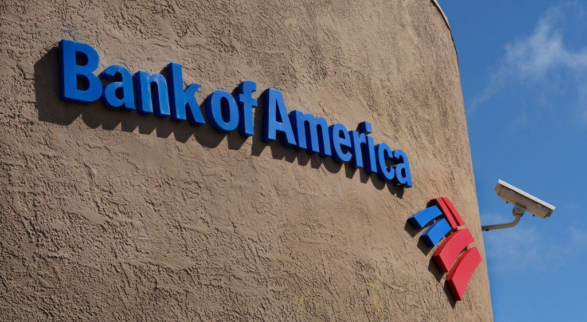

## Table of Contents

## What is Bank of America?

Bank of America is a big bank in the United States. It helps people and businesses with their money. They have many branches all over the country where you can go to deposit or take out money. They also have services online and on your phone, so you can manage your money from anywhere.

The bank offers many different services. You can open a checking or savings account, get a credit card, or take out a loan. They also help businesses with things like managing their money and getting loans. Bank of America is one of the largest banks in the world and has been around for a long time, so many people trust them with their money.

## Who are the main competitors of Bank of America?

Bank of America has several big competitors in the United States. Some of the main ones are JPMorgan Chase, Wells Fargo, and Citibank. These banks are also very large and offer similar services like checking and savings accounts, credit cards, and loans. They all have many branches across the country and strong online and mobile banking options.

JPMorgan Chase is known for its wide range of financial services and is often seen as the biggest competitor to Bank of America. It has a strong presence in investment banking and wealth management, which makes it a popular choice for both individuals and businesses. Wells Fargo, on the other hand, is known for its extensive network of branches and focus on customer service. Citibank, part of Citigroup, is another major player with a global reach, offering services not just in the U.S. but around the world.

These competitors are always trying to offer better services and deals to attract customers away from Bank of America. They compete on things like interest rates, fees, and the quality of their customer service. This competition helps keep banks on their toes and can benefit customers by giving them more choices and better services.

## How does Bank of America compare to its competitors in terms of market share?

Bank of America is one of the biggest banks in the United States, but it is not the biggest. In terms of market share, it ranks behind JPMorgan Chase, which is the largest bank in the country. JPMorgan Chase has a larger share of the market because it has more assets and a wider range of financial services. Bank of America still has a big piece of the market, but it is slightly smaller than JPMorgan Chase.

Wells Fargo and Citibank are also big competitors, but they have smaller market shares compared to Bank of America. Wells Fargo has a strong presence in the western part of the United States and focuses a lot on customer service. Citibank, on the other hand, has a global reach and offers services around the world, but its U.S. market share is smaller than Bank of America's. Even though Bank of America is not the biggest, it remains a strong player in the banking industry.

Overall, Bank of America holds a significant portion of the U.S. banking market, but it faces stiff competition from other major banks like JPMorgan Chase, Wells Fargo, and Citibank. Each of these banks has its own strengths and areas where they focus, but Bank of America continues to be a top choice for many customers because of its wide range of services and strong presence across the country.

## What types of services do Bank of America's competitors offer?

Bank of America's competitors like JPMorgan Chase, Wells Fargo, and Citibank offer many of the same services as Bank of America. They all provide basic banking services such as checking and savings accounts, which let you deposit and withdraw money easily. They also offer credit cards, which you can use to buy things and pay later, and loans, which you can use to buy a house or a car. These banks also help businesses manage their money, offering services like business accounts, loans, and payment solutions.

Each of these competitors has some special features too. JPMorgan Chase is known for its investment banking and wealth management services, which are great for people who have a lot of money to invest. Wells Fargo focuses a lot on customer service and has many branches, especially in the western part of the U.S., making it easy for people to visit a bank in person. Citibank, on the other hand, has a global reach, so it can help customers not just in the U.S. but all over the world. All these services make these banks strong competitors to Bank of America.

## How do the fee structures of Bank of America's competitors differ from Bank of America?

The fee structures of Bank of America's competitors, such as JPMorgan Chase, Wells Fargo, and Citibank, can vary a bit from Bank of America's. For example, Bank of America might charge a monthly fee for some checking accounts, but you can avoid it by meeting certain conditions like having a certain amount of money in the account or using your debit card a lot. JPMorgan Chase might have similar fees but different conditions for waiving them. Wells Fargo might offer some accounts with no monthly fee at all if you meet certain requirements, like direct deposit.

Citibank might have higher fees for some services, but they often offer ways to avoid them too. For instance, they might waive fees if you keep a high balance in your account. Each bank also has its own fees for things like using an ATM that's not part of their network, overdraft fees if you spend more money than you have, and fees for wire transfers. The key thing is that while the types of fees might be similar across these banks, the amounts and the ways to avoid them can be different. So, it's a good idea to compare them to see which one is the best fit for you.

## What are the customer satisfaction ratings for Bank of America compared to its competitors?

Bank of America's customer satisfaction ratings are often compared to those of its big competitors like JPMorgan Chase, Wells Fargo, and Citibank. According to surveys like the ones done by J.D. Power, Bank of America's ratings can vary. Some years, Bank of America does well and gets good scores for things like customer service and online banking. But other years, it might not do as well, especially when compared to JPMorgan Chase, which often gets high marks for its services and how it treats customers.

Wells Fargo and Citibank also have their ups and downs in customer satisfaction. Wells Fargo has been working hard to improve its ratings, especially after some problems a few years ago. They focus a lot on making their customers happy, which can show in their scores. Citibank, with its global reach, sometimes gets lower scores in the U.S. because its services can be a bit more complex. Overall, while Bank of America does well in many areas, its competitors can sometimes do better in customer satisfaction, depending on the year and the specific services being looked at.

## How has Bank of America's stock performance compared to its competitors over the last five years?

Over the last five years, Bank of America's stock performance has been pretty good, but it has had its ups and downs just like its competitors. Bank of America's stock has generally followed the trends of the overall market and the banking industry. It has seen growth, but it's not always the best performer among its big rivals like JPMorgan Chase, Wells Fargo, and Citibank. Sometimes, Bank of America's stock does better than these competitors, and sometimes it doesn't. It really depends on what's happening in the economy and how well the bank is doing with its business.

JPMorgan Chase often does a bit better than Bank of America over the long term because it's a bigger bank with a lot of different services, especially in investment banking. Wells Fargo's stock has had some rough times because of problems they've had, but it's been trying to bounce back. Citibank, which is part of Citigroup, has also had its share of ups and downs, but it's a strong player in the global market. Overall, Bank of America's stock performance is solid, but it's always important to look at how it's doing compared to other big banks to get the full picture.

## What technological innovations have Bank of America's competitors implemented that Bank of America has not?

Bank of America's competitors have been working on new technology to make banking easier and better for their customers. For example, JPMorgan Chase has been using [artificial intelligence](/wiki/ai-artificial-intelligence) (AI) to help with things like fraud detection and customer service. They have a system that can spot unusual activity in your account and warn you about possible fraud. Bank of America uses AI too, but JPMorgan Chase has put a lot of effort into making their AI even smarter and quicker at finding problems. Also, Wells Fargo has been focusing on improving their mobile app to make it easier for people to do their banking on their phones. They have added features like quick transfers and better ways to see your spending, which Bank of America has not done yet.

Citibank, on the other hand, has been working on blockchain technology to make international money transfers faster and cheaper. They have been testing ways to use blockchain to send money around the world without having to go through lots of different banks, which can slow things down and add fees. Bank of America has been looking into blockchain too, but Citibank has been moving faster with it. Overall, while Bank of America is always trying to use new technology to help its customers, its competitors have been coming up with some different and sometimes more advanced ideas to stay ahead in the race to make banking better.

## How do the global operations of Bank of America's competitors compare to Bank of America's?

Bank of America does a lot of business in the United States, but it also has some operations in other countries. However, its global reach is not as big as some of its competitors. For example, Citibank, which is part of Citigroup, has a very strong presence all over the world. They have branches and services in many different countries, and they help people and businesses move money from one country to another easily. This makes Citibank a big player in global banking, and it has more international operations than Bank of America.

JPMorgan Chase also has a lot of business outside of the U.S. They have offices and services in many countries, and they are known for their work in investment banking and helping big companies with their money around the world. While Bank of America does some international business, it's not as big as JPMorgan Chase's global operations. Wells Fargo, on the other hand, focuses more on the U.S. market and has less global reach compared to Bank of America, Citibank, and JPMorgan Chase. So, while Bank of America has some global operations, its competitors like Citibank and JPMorgan Chase have a bigger presence in the international market.

## What are the major regulatory challenges faced by Bank of America and its competitors?

Bank of America and its competitors face a lot of rules and regulations that they need to follow. These rules come from different government groups like the Federal Reserve and the Consumer Financial Protection Bureau. One big challenge is making sure they follow all the rules about how they lend money and treat their customers. For example, they have to be careful about not charging too much interest or fees, and they need to make sure they are not treating some customers unfairly. If they break these rules, they can get in big trouble and have to pay a lot of money in fines.

Another big challenge is keeping up with new rules that change over time. The government can make new laws about things like how banks handle people's private information or how they manage their money to stay safe. This means that Bank of America and its competitors have to keep learning and changing how they do things to follow these new rules. It can be hard to keep up, and if they don't, they can face more fines and problems. So, staying on top of all these regulations is a big job for all these big banks.

## How do the corporate social responsibility efforts of Bank of America's competitors compare to Bank of America's?

Bank of America does a lot to help the community and the environment, which is called corporate social responsibility. They give money to charities, help with education, and work on projects to fight climate change. They also try to make sure their business practices are fair and good for everyone. But their competitors, like JPMorgan Chase, also do a lot in this area. JPMorgan Chase gives money to help small businesses grow and supports programs that help people learn new skills. They also have big goals to reduce their impact on the environment, like using less energy and making their buildings more eco-friendly.

Wells Fargo and Citibank are also working hard on their corporate social responsibility. Wells Fargo focuses a lot on helping neighborhoods and schools. They give money to help build homes and support education programs. They also have plans to use more green energy and reduce waste. Citibank, on the other hand, is known for its efforts to help with global issues like fighting poverty and improving health around the world. They also have goals to reduce their carbon footprint and help protect the environment. Overall, while Bank of America does a lot of good things, its competitors are also very active in their corporate social responsibility efforts, each focusing on different areas but all aiming to make a positive impact.

## What future trends might impact the competitive landscape for Bank of America and its competitors?

In the future, technology will keep changing the way banks like Bank of America and its competitors do business. More people will use their phones and computers to do banking, so banks will need to make their apps and websites even better and safer. They might use more artificial intelligence to help customers quickly and to stop fraud. Also, new kinds of money like cryptocurrencies could become more popular, and banks will need to figure out how to work with them. If they don't keep up with these changes, they might lose customers to new companies that are better at using technology.

Another big trend will be how banks deal with the environment and social issues. People are paying more attention to things like climate change and fair treatment of everyone, so banks will need to show they are helping with these problems. They might put more money into green projects and make sure they are treating all their customers fairly. If a bank does a good job with these things, more people might want to use their services. But if they don't, they could lose customers to banks that are doing more to help the world.

## References & Further Reading

[1]: Bergstra, J., Bardenet, R., Bengio, Y., & Kégl, B. (2011). ["Algorithms for Hyper-Parameter Optimization."](https://dl.acm.org/doi/10.5555/2986459.2986743) Advances in Neural Information Processing Systems 24.

[2]: ["Advances in Financial Machine Learning"](https://www.amazon.com/Advances-Financial-Machine-Learning-Marcos/dp/1119482089) by Marcos Lopez de Prado

[3]: ["Evidence-Based Technical Analysis: Applying the Scientific Method and Statistical Inference to Trading Signals"](https://www.amazon.com/Evidence-Based-Technical-Analysis-Scientific-Statistical/dp/0470008741) by David Aronson

[4]: ["Machine Learning for Algorithmic Trading"](https://github.com/stefan-jansen/machine-learning-for-trading) by Stefan Jansen

[5]: ["Quantitative Trading: How to Build Your Own Algorithmic Trading Business"](https://www.amazon.com/Quantitative-Trading-Build-Algorithmic-Business/dp/1119800064) by Ernest P. Chan