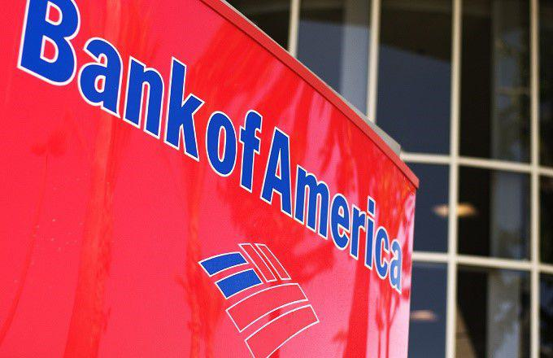

## Table of Contents

## What is Bank of America Corporation?

Bank of America Corporation is a big bank in the United States. It helps people and businesses with their money. They have many services like checking accounts, savings accounts, and loans. People can also use their credit cards and invest their money through the bank.

The bank started a long time ago in 1904. It has grown a lot since then and now has many branches all over the world. Bank of America helps customers in many countries and has a lot of employees. They work hard to make sure their customers' money is safe and they can help them reach their financial goals.

## When was Bank of America founded?

Bank of America was founded in 1904. It started as the Bank of Italy in San Francisco. The founder was Amadeo Giannini. He wanted to help people who were not served by other banks.

Over time, the bank grew bigger. In 1928, it became the Bank of America and Italy. Later, it was just called Bank of America. Today, it is one of the largest banks in the United States and helps people all over the world with their money.

## Who are the founders of Bank of America?

The founder of Bank of America is Amadeo Giannini. He started the bank in 1904 in San Francisco. At that time, it was called the Bank of Italy. Giannini wanted to help people who were not served by other banks. He believed in helping regular people and small businesses.

The bank grew a lot over the years. In 1928, it changed its name to Bank of America and Italy. Later, it became just Bank of America. Today, it is one of the biggest banks in the United States. It helps people all over the world with their money.

## What are the main services offered by Bank of America?

Bank of America offers many services to help people and businesses with their money. They have checking and savings accounts where people can keep their money safe. They also offer credit cards that people can use to buy things and pay later. Bank of America helps people get loans, like home loans or car loans, so they can buy big things they need.

The bank also helps people invest their money. They have services where people can buy and sell stocks, bonds, and other investments. Bank of America has financial advisors who can help people make good choices about their money. They also offer online and mobile banking so people can manage their money from anywhere, anytime.

## How many branches does Bank of America have?

Bank of America has a lot of branches all over the world. In the United States, they have more than 4,000 branches. This means that many people can find a Bank of America branch close to where they live or work.

Outside of the United States, Bank of America also has branches in many other countries. They help people in places like Canada, Europe, and Asia. This way, people in different parts of the world can use their services and get help with their money.

## In which countries does Bank of America operate?

Bank of America mainly operates in the United States. They have more than 4,000 branches across the country. This means that a lot of people in the US can easily find a Bank of America branch near their home or work.

The bank also has branches in other countries to help people outside the US. They operate in places like Canada, the United Kingdom, and some countries in Europe. Bank of America also has a presence in Asia, helping people in countries like China and Japan with their money.

Overall, Bank of America works hard to serve customers in many different countries. They want to make sure that people all over the world can use their banking services and get help with their financial needs.

## What is the current market capitalization of Bank of America?

The current market capitalization of Bank of America is around $280 billion. This number can change every day because it depends on the price of the bank's stock and how many shares are out there. Market capitalization is like the total value of a company if you added up all its shares.

Bank of America is one of the biggest banks in the United States. It helps a lot of people and businesses with their money. The bank's market cap shows how big and important it is in the world of finance.

## Who is the current CEO of Bank of America?

The current CEO of Bank of America is Brian Moynihan. He has been leading the bank since 2010. Brian Moynihan helps make big decisions for the bank and works to make sure it helps its customers well.

Before becoming CEO, Brian Moynihan worked at Bank of America in different jobs. He started working there in 2004 and moved up to become the CEO. Under his leadership, the bank has grown a lot and helps people all over the world with their money.

## What are the recent financial performance highlights of Bank of America?

Bank of America has been doing well in recent times. In the last year, the bank made a lot of money. They earned over $27 billion in net income. This means they made more money than they spent. Their revenue, which is all the money they brought in, was more than $95 billion. This shows that a lot of people are using their services and paying for them.

The bank also grew bigger. They have more customers now than before. Bank of America helped a lot of people with loans, like home loans and car loans. They also saw more people using their credit cards. Their investment services did well too, with more people buying and selling stocks and bonds through the bank. Overall, Bank of America is doing a good job and helping more people with their money.

## How does Bank of America contribute to corporate social responsibility?

Bank of America works hard to help the world and its communities through corporate social responsibility. They focus on helping the environment by using less energy and reducing waste. They also try to use more renewable energy like solar power. The bank supports projects that help fight climate change and make the world a better place for everyone.

The bank also helps people in their communities. They give money to charities and support programs that help people learn and grow. Bank of America helps with things like education, job training, and health care. They want to make sure everyone has a chance to do well and live a good life. By doing these things, Bank of America shows that they care about more than just making money.

## What are the major acquisitions made by Bank of America in its history?

Bank of America has grown a lot by buying other companies. One of the biggest acquisitions was in 2008 when they bought Merrill Lynch. Merrill Lynch is a big company that helps people invest their money. By buying Merrill Lynch, Bank of America got a lot better at helping people with their investments. This made Bank of America even bigger and stronger.

Another important acquisition was in 2004 when Bank of America bought FleetBoston Financial. FleetBoston was a big bank in the Northeast part of the United States. This purchase helped Bank of America reach more people in that area. It also made their services better for everyone in the Northeast.

These acquisitions helped Bank of America become one of the biggest banks in the world. They were able to help more people with their money and offer more services. By buying other companies, Bank of America grew and got stronger over time.

## What are the key regulatory challenges faced by Bank of America?

Bank of America faces a lot of rules and regulations because it is a big bank. One of the main challenges is making sure they follow all the laws about money and banking. These laws come from places like the Federal Reserve, the Office of the Comptroller of the Currency, and the Consumer Financial Protection Bureau. They have to make sure they treat customers fairly, keep their money safe, and report everything correctly. If they don't follow these rules, they can get in big trouble and have to pay fines.

Another challenge is keeping up with new rules that change over time. For example, after the financial crisis in 2008, there were new laws like the Dodd-Frank Act. This law made banks do more to make sure they are safe and don't take too many risks. Bank of America has to keep learning about these new rules and change how they do things to follow them. It can be hard to keep up, but it's important to stay out of trouble and keep helping customers the right way.

## References & Further Reading

[1]: Chan, E. P. (2008). ["Quantitative Trading: How to Build Your Own Algorithmic Trading Business."](https://github.com/ftvision/quant_trading_echan_book) Wiley.

[2]: Lopez de Prado, M. (2018). ["Advances in Financial Machine Learning."](https://www.amazon.com/Advances-Financial-Machine-Learning-Marcos/dp/1119482089) Wiley.

[3]: Aronson, D. R. (2006). ["Evidence-Based Technical Analysis: Applying the Scientific Method and Statistical Inference to Trading Signals."](https://www.amazon.com/Evidence-Based-Technical-Analysis-Scientific-Statistical/dp/0470008741) Wiley.

[4]: Jansen, S. (2020). ["Machine Learning for Algorithmic Trading."](https://github.com/stefan-jansen/machine-learning-for-trading) Packt Publishing.

[5]: Bank of America Corporation. ["About Bank of America."](https://about.bankofamerica.com/en)