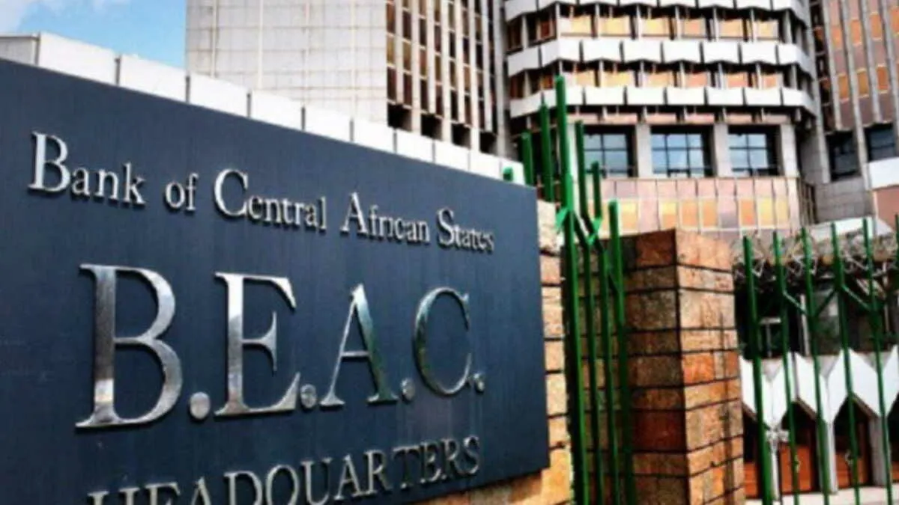

## Table of Contents

## What is the Bank of Central African States (BEAC)?

The Bank of Central African States, or BEAC, is a central bank that serves six countries in Central Africa. These countries are Cameroon, Central African Republic, Chad, Republic of the Congo, Equatorial Guinea, and Gabon. BEAC's main job is to manage the currency used in these countries, called the Central African CFA franc. It helps keep the money stable and works to control inflation, which is when prices go up a lot.

BEAC also helps these countries with their banking systems. It makes rules that banks must follow to make sure they are safe and fair. The bank also keeps an eye on how much money is moving in and out of these countries. This helps them understand and manage their economies better. By doing all these things, BEAC plays a big role in helping the economies of these six countries grow and stay strong.

## Which countries are members of the BEAC?

The Bank of Central African States, or BEAC, is a central bank for six countries in Africa. These countries are Cameroon, Central African Republic, Chad, Republic of the Congo, Equatorial Guinea, and Gabon.

BEAC helps these countries by managing their money, called the Central African CFA franc. It makes sure the money stays stable and works to keep prices from going up too fast. This helps the economies of these countries grow and stay strong.

## What is the primary currency used by the BEAC?

The primary currency used by the BEAC is the Central African CFA franc. This currency is used in all six countries that are part of the BEAC: Cameroon, Central African Republic, Chad, Republic of the Congo, Equatorial Guinea, and Gabon. The Central African CFA franc helps these countries have a stable money system.

The BEAC works to make sure the Central African CFA franc stays strong and that prices don't go up too fast. This is important because it helps people in these countries buy things they need without worrying about money losing its value quickly. By managing the currency well, the BEAC helps the economies of these countries grow and stay healthy.

## When was the BEAC established?

The BEAC, which stands for Bank of Central African States, was established on November 22, 1972. It was created to help manage the money for six countries in Central Africa. These countries are Cameroon, Central African Republic, Chad, Republic of the Congo, Equatorial Guinea, and Gabon.

Before the BEAC was created, these countries used a different bank called the BCEAEC. The BEAC took over from the BCEAEC and started using a new currency called the Central African CFA franc. The BEAC helps keep this currency stable and works to control inflation, which means making sure prices don't go up too fast. This helps the economies of these countries stay strong and grow.

## What are the main functions of the BEAC?

The BEAC, or Bank of Central African States, has many important jobs. It looks after the money used in six countries in Central Africa: Cameroon, Central African Republic, Chad, Republic of the Congo, Equatorial Guinea, and Gabon. This money is called the Central African CFA franc. The BEAC makes sure this money stays stable and works well. It does this by controlling how much money is in the economy and making sure there's not too much or too little.

Another big job of the BEAC is to watch over the banks in these countries. It makes rules that banks have to follow to make sure they are safe and fair. This helps people trust the banks and use them without worry. The BEAC also keeps an eye on how money moves in and out of these countries. This helps them understand the economy better and make good decisions to help it grow. By doing all these things, the BEAC helps the economies of these six countries stay strong and healthy.

## How does the BEAC contribute to the economic stability of its member countries?

The BEAC helps keep the economies of its six member countries stable by managing their money, called the Central African CFA franc. It does this by controlling how much money is in the economy. If there's too much money, prices can go up too fast, which is bad. If there's too little money, it can be hard for people to buy what they need. By keeping the right amount of money, the BEAC helps keep prices stable and makes sure people can buy things without worrying about money losing value quickly.

The BEAC also watches over the banks in these countries. It makes rules that banks have to follow to make sure they are safe and fair. This helps people trust the banks and use them without worry. The BEAC also keeps an eye on how money moves in and out of these countries. This helps them understand the economy better and make good decisions to help it grow. By doing all these things, the BEAC helps the economies of Cameroon, Central African Republic, Chad, Republic of the Congo, Equatorial Guinea, and Gabon stay strong and healthy.

## What is the organizational structure of the BEAC?

The BEAC has a clear structure to help it manage the money for six countries in Central Africa. At the top, there's a board of directors. They make big decisions about the bank and the money. The board has people from all six countries. They meet regularly to talk about how to keep the money stable and help the economies grow. The board also picks the governor, who is like the boss of the BEAC. The governor makes sure everything runs smoothly and follows the board's decisions.

Below the governor, there are different departments that do specific jobs. One department looks after the money, making sure there's the right amount in the economy. Another department watches over the banks in the six countries, making sure they follow the rules and are safe for people to use. There's also a department that keeps track of how money moves in and out of the countries. This helps the BEAC understand the economy better and make good decisions. All these departments work together to make sure the BEAC can do its job well and help the economies of Cameroon, Central African Republic, Chad, Republic of the Congo, Equatorial Guinea, and Gabon stay strong.

## How has the role of the BEAC evolved since its inception?

When the BEAC was first set up in 1972, its main job was to take over from the old bank, BCEAEC, and manage the Central African CFA franc. At the start, the BEAC focused on keeping the money stable and making sure there was enough money in the economy for people to use. It also started to make rules for banks in the six countries it serves: Cameroon, Central African Republic, Chad, Republic of the Congo, Equatorial Guinea, and Gabon. These rules were to make sure banks were safe and fair.

Over the years, the BEAC's role has grown. It now does more to watch how money moves in and out of these countries. This helps the BEAC understand the economy better and make better decisions to help it grow. The BEAC also works more closely with other central banks and international groups to learn new ways to keep the economy stable. It has become more important in helping these six countries work together and grow their economies, making sure they can deal with changes in the world economy.

## What are some significant historical events that impacted the BEAC?

The BEAC was created in 1972 to take over from the old bank, BCEAEC. This was a big change because it meant the six countries it serves—Cameroon, Central African Republic, Chad, Republic of the Congo, Equatorial Guinea, and Gabon—had a new bank to manage their money. The BEAC started using a new currency called the Central African CFA franc. This was important because it helped these countries have a stable money system.

In the 1990s, there was a big economic crisis in many African countries. This affected the BEAC too. It had to work hard to keep the Central African CFA franc stable and make sure the economy didn't get too bad. The BEAC started to watch how money moved in and out of the countries more closely. This helped them understand and control the economy better. Over the years, the BEAC has also worked more with other central banks and international groups to learn new ways to keep the economy stable and help the six countries grow.

## How does the BEAC manage monetary policy within the Central African Economic and Monetary Community (CEMAC)?

The BEAC manages monetary policy in the Central African Economic and Monetary Community (CEMAC) by controlling how much money is in the economy. It does this to keep the Central African CFA franc stable and to control inflation, which is when prices go up too fast. The BEAC decides how much money banks can lend and how much interest they can charge. This helps keep the right amount of money in the economy so that people can buy things they need without prices going up too quickly.

The BEAC also works with the governments of the six CEMAC countries to make sure their economic plans match the bank's goals. This means the BEAC looks at what the countries are doing and tries to help them reach their economic targets while keeping the money stable. By doing all these things, the BEAC helps the economies of Cameroon, Central African Republic, Chad, Republic of the Congo, Equatorial Guinea, and Gabon stay strong and grow.

## What challenges does the BEAC face in maintaining economic stability?

The BEAC faces many challenges in keeping the economies of its six countries stable. One big challenge is dealing with changes in the world economy. Things like the price of oil going up or down can affect these countries a lot because they rely on oil. If the price of oil drops, it can make their money less valuable and cause problems. The BEAC has to work hard to keep the Central African CFA franc strong even when the world economy changes.

Another challenge is making sure all six countries work together. Each country has its own way of doing things and its own problems. The BEAC has to make rules that help all of them, but sometimes these rules can be hard for some countries to follow. The bank also has to watch over the banks in these countries to make sure they are safe and fair. This can be difficult because it needs a lot of work and checking. By dealing with these challenges, the BEAC tries to keep the economies of Cameroon, Central African Republic, Chad, Republic of the Congo, Equatorial Guinea, and Gabon strong and stable.

## How does the BEAC collaborate with international financial institutions?

The BEAC works with big international money groups like the International Monetary Fund (IMF) and the World Bank to keep the money stable in its six countries. These groups give the BEAC advice and help on how to manage the economy. They also give money to the BEAC to help the countries when they need it. By working together, the BEAC can learn new ways to keep the Central African CFA franc strong and help the economies grow.

The BEAC also joins meetings and talks with other central banks from around the world. This helps them share ideas and learn from each other. For example, they might talk about how to control inflation or how to make banks safer. By working with other banks, the BEAC can find better ways to help Cameroon, Central African Republic, Chad, Republic of the Congo, Equatorial Guinea, and Gabon stay economically strong.

## References & Further Reading

[1]: Bergstra, J., Bardenet, R., Bengio, Y., & Kégl, B. (2011). ["Algorithms for Hyper-Parameter Optimization."](https://dl.acm.org/doi/10.5555/2986459.2986743) Advances in Neural Information Processing Systems 24.

[2]: ["Advances in Financial Machine Learning"](https://www.amazon.com/Advances-Financial-Machine-Learning-Marcos/dp/1119482089) by Marcos Lopez de Prado

[3]: ["Evidence-Based Technical Analysis: Applying the Scientific Method and Statistical Inference to Trading Signals"](https://www.amazon.com/Evidence-Based-Technical-Analysis-Scientific-Statistical/dp/0470008741) by David Aronson

[4]: ["Machine Learning for Algorithmic Trading"](https://github.com/stefan-jansen/machine-learning-for-trading) by Stefan Jansen

[5]: ["Quantitative Trading: How to Build Your Own Algorithmic Trading Business"](https://www.amazon.com/Quantitative-Trading-Build-Algorithmic-Business/dp/1119800064) by Ernest P. Chan