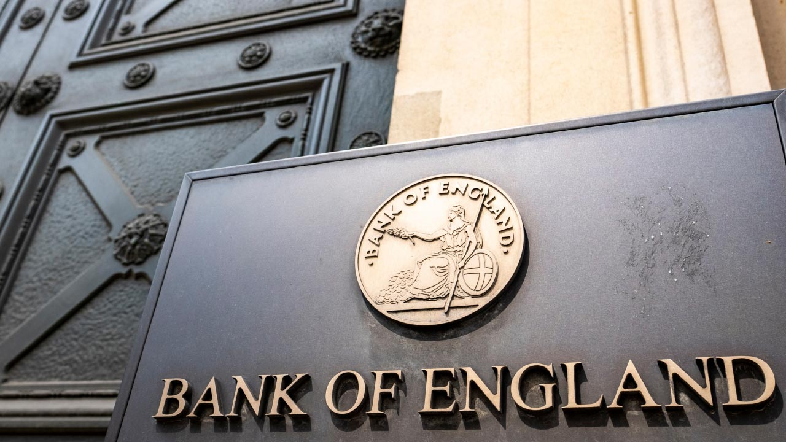

## Table of Contents

## What is the Bank of England?

The Bank of England is a very important bank in the United Kingdom. It is often called the "BoE" for short. The BoE was created a long time ago, in 1694. Its main job is to control the country's money and make sure the economy stays healthy. It does this by setting interest rates, which affect how much it costs to borrow money, and by making sure there is enough money in the economy.

The Bank of England also looks after the UK's gold and money reserves. It works to keep prices stable, which means it tries to stop things from getting too expensive too quickly. The BoE is run by a group of people called the Monetary Policy Committee. They meet regularly to decide on the best ways to manage the economy. The Bank of England is located in the City of London and is very important for the financial world.

## When was the Bank of England founded?

The Bank of England was founded in 1694. This was a long time ago, and it was created to help manage the country's money.

The Bank of England is very important because it helps keep the economy healthy. It does this by controlling interest rates and making sure there is enough money for everyone.

## What are the main functions of the Bank of England?

The Bank of England has several important jobs. One of its main functions is to control the country's money supply. This means it decides how much money is available in the economy. The Bank does this by setting interest rates, which affect how much it costs for people and businesses to borrow money. If the interest rates are low, borrowing money becomes cheaper, and people might spend more. If the rates are high, borrowing becomes more expensive, and people might spend less.

Another key function of the Bank of England is to keep prices stable. This means it tries to stop things from getting too expensive too quickly, which is called inflation. The Bank does this by watching the economy closely and making changes when needed. It also looks after the UK's gold and money reserves, making sure they are safe and secure. The Bank of England works hard to keep the economy healthy and balanced.

The Bank of England is also responsible for supervising and regulating financial institutions in the UK. This means it makes sure that banks and other financial companies are working properly and not taking too many risks. By doing this, the Bank helps to keep the financial system stable and protect people's money. The Bank of England plays a crucial role in the UK's economy by managing money, controlling inflation, and overseeing financial stability.

## How does the Bank of England influence the UK economy?

The Bank of England influences the UK economy mainly by controlling the amount of money in circulation and setting interest rates. When the Bank decides to change the interest rates, it affects how much it costs for people and businesses to borrow money. If the interest rates are low, borrowing becomes cheaper, and people might spend more money on things like houses or cars. This can help the economy grow because more spending means more business for companies. On the other hand, if the interest rates are high, borrowing becomes more expensive, and people might spend less, which can slow down the economy.

Another way the Bank of England influences the economy is by keeping prices stable. It tries to stop inflation, which is when prices go up too quickly. The Bank does this by watching the economy and making changes to the money supply when needed. If prices are going up too fast, the Bank might raise interest rates to slow things down. If the economy is not doing well, it might lower interest rates to encourage more spending. By doing these things, the Bank of England helps to keep the economy balanced and healthy.

The Bank of England also oversees the financial system to make sure it is stable. It watches over banks and other financial companies to make sure they are not taking too many risks. If these companies are not managed well, it could cause problems for the whole economy. By keeping an eye on them, the Bank helps to protect people's money and keep the financial system running smoothly. This is another important way the Bank of England influences the UK economy.

## What is the role of the Monetary Policy Committee?

The Monetary Policy Committee, or MPC for short, is a group of people who work at the Bank of England. Their main job is to decide on the best interest rates for the UK. They meet regularly to look at the economy and figure out if the interest rates should go up, go down, or stay the same. By changing the interest rates, they can help control how much people spend and borrow, which affects the whole economy.

The MPC tries to keep prices stable, which means they want to stop things from getting too expensive too quickly. This is called controlling inflation. If prices are going up too fast, the MPC might raise interest rates to make borrowing money more expensive, so people spend less. If the economy is not doing well, they might lower interest rates to make borrowing cheaper, so people spend more. This way, the MPC helps to keep the economy healthy and balanced.

## How does the Bank of England set interest rates?

The Bank of England sets interest rates through its Monetary Policy Committee (MPC). The MPC meets eight times a year to look at the economy and decide if the interest rates should change. They think about things like how fast prices are going up, how well the economy is doing, and what might happen in the future. If they think prices are going up too fast, they might raise the interest rates to slow things down. If the economy needs a boost, they might lower the interest rates to make borrowing cheaper and encourage people to spend more.

When the MPC decides on a new interest rate, they announce it to the public. This rate is called the "Bank Rate," and it affects the whole economy. Banks use this rate to set their own interest rates for loans and savings. If the Bank Rate goes up, borrowing money becomes more expensive, and people might spend less. If it goes down, borrowing becomes cheaper, and people might spend more. By changing the Bank Rate, the Bank of England helps to keep the economy balanced and prices stable.

## What is quantitative easing and how has the Bank of England used it?

Quantitative easing, or QE for short, is a special tool that central banks like the Bank of England use to help the economy when normal ways of doing things are not working well. It means the Bank creates new money electronically and uses it to buy things like government bonds from banks and other financial companies. This is done to put more money into the economy, making it easier for people and businesses to borrow and spend. When the Bank buys these bonds, it gives the sellers money, which they can then lend to others, helping the economy grow.

The Bank of England started using quantitative easing during the 2008 financial crisis, and it has used it several times since then, including during the economic problems caused by the COVID-19 pandemic. By buying bonds, the Bank of England increases the amount of money in the economy, which can help lower interest rates and encourage more spending and investment. This is important because when the economy is struggling, people and businesses might be afraid to spend or borrow, and QE can help give them the confidence they need to start doing so again.

## How does the Bank of England regulate financial institutions?

The Bank of England keeps an eye on banks and other financial companies to make sure they are working properly and not taking too many risks. It does this through a part of the Bank called the Prudential Regulation Authority, or PRA for short. The PRA makes rules that these companies have to follow, like how much money they need to keep in reserve and how much risk they can take. This helps to keep the financial system stable and stops problems from happening that could hurt the economy.

The Bank of England also works with another group called the Financial Conduct Authority, or FCA. Together, they make sure that financial companies treat their customers fairly and follow the rules. If a company is not doing what it should, the Bank of England can step in and make them fix it. By watching over these companies and making sure they are safe and fair, the Bank of England helps to protect people's money and keep the whole financial system running smoothly.

## What is the relationship between the Bank of England and the UK government?

The Bank of England works closely with the UK government, but it is not controlled by it. The Bank has something called "operational independence," which means it can make its own decisions about things like interest rates. The government sets the overall goals for the Bank, like keeping prices stable, but the Bank decides how to reach those goals. This setup helps make sure that decisions about the economy are made based on what is best for the country, not just what the government wants at the time.

Even though the Bank of England makes its own decisions, it still talks a lot with the government. The Bank's Governor meets regularly with the Chancellor of the Exchequer, who is in charge of the country's money matters. They discuss the economy and how the Bank's actions might affect government plans. This helps them work together to keep the economy healthy. The Bank also gives advice to the government on financial matters, but the final decisions about things like taxes and spending are made by the government.

## How does the Bank of England manage inflation?

The Bank of England manages inflation mainly by controlling interest rates. When prices start going up too fast, the Bank might raise interest rates. This makes borrowing money more expensive, so people and businesses might spend less. When people spend less, prices usually go up more slowly. On the other hand, if the economy is not doing well and prices are not going up enough, the Bank might lower interest rates. This makes borrowing cheaper, so people might spend more, which can help prices go up a bit.

The Bank also uses a tool called quantitative easing to manage inflation. This means the Bank creates new money and uses it to buy things like government bonds. This puts more money into the economy, which can help lower interest rates and encourage spending. If the economy needs a boost and prices are not rising fast enough, the Bank might use quantitative easing to help. By using these tools, the Bank of England tries to keep inflation at a healthy level, which helps keep the economy stable.

## What are some historical events that have significantly impacted the Bank of England?

One big event that changed the Bank of England was the financial crisis in 2008. During this time, many banks around the world were in trouble, and the economy was struggling. The Bank of England used a special tool called quantitative easing to help. It created new money and bought government bonds to put more money into the economy. This helped to lower interest rates and encourage people to spend more, which was important because the economy needed a boost. The crisis showed how important the Bank's role is in keeping the economy stable.

Another important event was when the Bank of England got more independence in 1997. Before this, the government had more control over the Bank's decisions. But in 1997, the government decided to let the Bank make its own choices about interest rates. This change helped the Bank focus on keeping prices stable without being influenced by what the government wanted at the time. It made the Bank's decisions more trusted by people and businesses, which is good for the economy.

## How does the Bank of England contribute to global financial stability?

The Bank of England helps keep the world's money safe by working with other big banks around the globe. It talks with banks like the Federal Reserve in the United States and the European Central Bank to share ideas and plans. They work together to make sure that big problems in one country don't cause trouble everywhere. By doing this, the Bank of England helps make the world's money system stronger and more stable.

The Bank of England also keeps an eye on big banks and other money companies in the UK to make sure they are not taking too many risks. If these companies are not careful, it could cause problems not just in the UK, but all over the world. The Bank makes rules that these companies have to follow, which helps keep them safe and fair. By doing this, the Bank of England helps protect the world's money and keep the global economy running smoothly.

## References & Further Reading

[1]: Kynaston, D. (2017). ["Till Time's Last Sand: A History of the Bank of England 1694-2013."](https://www.cambridge.org/core/journals/journal-of-economic-history/article/abs/till-times-last-sand-a-history-of-the-bank-of-england-16942013-by-david-kynaston-london-bloomsbury-2017-pp-viii-879-6750-hardcover/C0CC1A2D59771083906389232ADDC790) Bloomsbury Publishing.

[2]: Bank of England. (2021). ["The Bank of England's approach to stress testing."](https://www.bankofengland.co.uk/stress-testing/2021/bank-of-england-stress-testing-results)

[3]: Carney, M. (2013). ["The UK at the Heart of a Renewed Globalisation."](https://www.bankofengland.co.uk/-/media/boe/files/speech/2013/the-uk-at-the-heart-of-a-renewed-globalisation-transcript.pdf) Bank of England.

[4]: Financial Conduct Authority. (2021). ["Algorithmic Trading Compliance in Wholesale Markets."](https://www.fca.org.uk/publications/multi-firm-reviews/algorithmic-trading-compliance-wholesale-markets)

[5]: European Securities and Markets Authority. (2012). ["Guidelines on systems and controls in an automated trading environment for trading platforms, investment firms and competent authorities."](https://www.esma.europa.eu/document/guidelines-systems-and-controls-in-automated-trading-environment-trading-platforms)