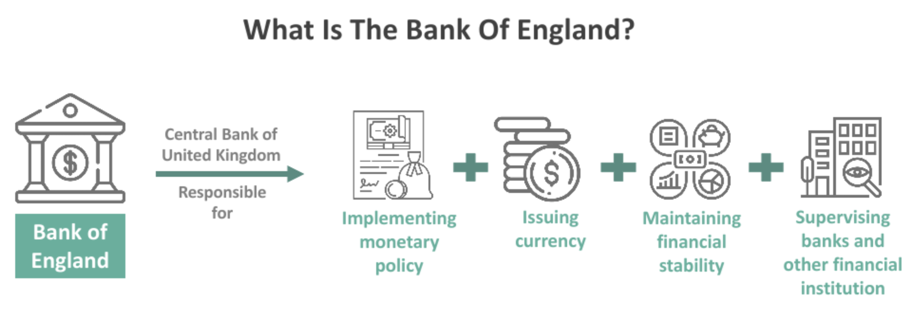

## Table of Contents

## What is the Bank of England?

The Bank of England is a very important bank in the United Kingdom. It is also called the "central bank" of the country. This means it helps to control the money and economy of the UK. The Bank of England was first started a long time ago in 1694. It is located in the city of London.

One of the main jobs of the Bank of England is to make sure that the money in the UK keeps its value. They do this by setting interest rates, which is the cost of borrowing money. If they think prices are going up too fast, they might raise interest rates to slow things down. The Bank also prints money and keeps it safe. They work hard to make sure the economy stays stable and people can trust the money they use every day.

## What is monetary policy?

Monetary policy is what central banks, like the Bank of England, do to control the amount of money in the economy and how much it costs to borrow money. The main tool they use is setting the interest rate. When the central bank changes the interest rate, it can make borrowing money cheaper or more expensive. If borrowing is cheaper, people and businesses might borrow more, spend more, and help the economy grow. If borrowing is more expensive, people might borrow and spend less, which can slow down the economy.

The goal of monetary policy is to keep the economy stable. This means trying to keep prices from going up too fast, which is called inflation, and also trying to avoid times when the economy is not growing well, which is called a recession. Central banks watch the economy closely and adjust interest rates to try to keep everything balanced. Sometimes they might also use other tools, like buying or selling government bonds, to influence how much money is circulating in the economy.

## How does the Bank of England influence monetary policy?

The Bank of England influences monetary policy mainly by setting the [interest rate](/wiki/interest-rate-trading-strategies), which is the cost of borrowing money. When the Bank decides to change this rate, it affects how much banks charge people and businesses to borrow money. If the Bank lowers the interest rate, borrowing becomes cheaper, and people might take out more loans to buy things like houses or cars. This can help the economy grow because more spending means more business for companies. On the other hand, if the Bank raises the interest rate, borrowing becomes more expensive, and people might spend less, which can slow down the economy.

Besides setting interest rates, the Bank of England also uses other tools to manage the amount of money in the economy. One important tool is called "quantitative easing." This is when the Bank buys government bonds or other financial assets to put more money into the economy. By doing this, the Bank can encourage spending and investment when the economy needs a boost. The Bank also keeps a close eye on inflation, which is how fast prices are going up. If inflation is too high, the Bank might raise interest rates to cool things down. If inflation is too low, they might lower rates to encourage more spending. By using these tools, the Bank of England works to keep the economy stable and growing at a healthy pace.

## What are the main objectives of the Bank of England's monetary policy?

The main goal of the Bank of England's monetary policy is to keep prices stable. This means they try to keep inflation at a level that is good for the economy. They aim for an inflation rate of 2% over the medium term. If prices start going up too fast, the Bank might raise interest rates to make borrowing money more expensive. This can slow down spending and help control inflation. On the other hand, if prices are not going up enough, the Bank might lower interest rates to encourage people to borrow and spend more, which can help the economy grow.

Another important objective is to support the overall health of the economy. The Bank wants to avoid times when the economy is growing too slowly or shrinking, which is called a recession. By adjusting interest rates and using other tools like quantitative easing, the Bank tries to keep the economy moving at a steady pace. They watch things like unemployment and economic growth to make sure their policies are helping to keep the economy on track. By balancing these goals, the Bank of England works to create a stable environment where people and businesses can plan for the future with confidence.

## How does the Bank of England set interest rates?

The Bank of England sets interest rates through a group called the Monetary Policy Committee (MPC). This group meets eight times a year to decide on the interest rate. They look at a lot of information about the economy, like how fast prices are going up, how many people have jobs, and how the economy is growing. If they think prices are going up too fast, they might decide to raise the interest rate to make borrowing money more expensive. This can help slow down spending and keep prices from going up too quickly. If they think the economy needs a boost, they might lower the interest rate to make borrowing cheaper, which can encourage people to spend more.

After the MPC makes its decision, they tell everyone about it. This is important because it helps people and businesses plan for the future. The interest rate they set is called the "Bank Rate," and it affects the rates that banks charge each other for overnight loans. This, in turn, influences the rates that banks charge their customers for loans and mortgages. By setting the Bank Rate, the Bank of England can guide the whole economy, trying to keep things stable and help the economy grow in a healthy way.

## What is quantitative easing and how has the Bank of England used it?

Quantitative easing, often called QE, is a tool used by central banks like the Bank of England to help the economy when interest rates are already very low. When the Bank does QE, it buys government bonds or other financial assets from banks and other investors. This puts more money into the economy because the banks then have more cash to lend out. The idea is to encourage spending and investment when the economy needs a boost. It's like giving the economy a bit of extra help when normal methods, like changing interest rates, aren't enough.

The Bank of England has used QE a lot, especially during tough economic times. For example, during the global financial crisis in 2008 and the economic challenges caused by the COVID-19 pandemic in 2020, the Bank used QE to support the economy. By buying lots of government bonds, the Bank was able to keep money flowing and help businesses and people keep spending. This helped to prevent the economy from shrinking too much and supported recovery. The Bank carefully decides how much QE to use, always trying to balance helping the economy with keeping prices stable.

## How does the Bank of England's monetary policy affect inflation?

The Bank of England's monetary policy affects inflation by controlling how much money is in the economy and how expensive it is to borrow money. When the Bank sets interest rates, it can make borrowing cheaper or more expensive. If the Bank lowers interest rates, borrowing becomes cheaper, and people might spend more money. More spending can push prices up, which means higher inflation. On the other hand, if the Bank raises interest rates, borrowing becomes more expensive, and people might spend less. Less spending can help slow down price increases, which means lower inflation.

The Bank also uses a tool called quantitative easing (QE) to affect inflation. QE means the Bank buys government bonds and other financial assets, which puts more money into the economy. This can encourage spending and investment, which can lead to higher inflation. The Bank uses QE when interest rates are already very low and the economy needs extra help. By carefully managing these tools, the Bank tries to keep inflation at a healthy level, aiming for about 2% over the medium term. This helps keep prices stable and supports a strong economy.

## What role does the Monetary Policy Committee play in the Bank of England?

The Monetary Policy Committee, or MPC for short, is a special group inside the Bank of England. They are the ones who decide how much it costs to borrow money, which is called the interest rate. The MPC meets eight times every year to talk about the economy and make these important decisions. They look at things like how fast prices are going up, how many people have jobs, and how the economy is doing overall. If they think prices are going up too fast, they might decide to make borrowing money more expensive by raising the interest rate. If they think the economy needs a boost, they might make borrowing cheaper by lowering the interest rate.

After the MPC makes their decision, they tell everyone about it. This is important because it helps people and businesses know what to expect and plan for the future. The interest rate they set is called the "Bank Rate," and it affects the rates that banks charge each other and their customers for loans and mortgages. By setting the Bank Rate, the MPC helps guide the whole economy, trying to keep things stable and help the economy grow in a healthy way. They work hard to make sure inflation stays around 2%, which means prices are going up at a good pace for everyone.

## How does the Bank of England communicate its monetary policy decisions?

The Bank of England communicates its monetary policy decisions in a clear and open way. After the Monetary Policy Committee (MPC) meets to decide on the interest rate, they release a statement right away to let everyone know what they decided. This statement explains why they made their decision and what they think about the economy. The Bank also publishes the minutes of the MPC meeting a few weeks later, which give more details about the discussions and the votes of the committee members. This helps everyone understand the different views and reasons behind the decision.

The Bank of England also holds press conferences after some of the MPC meetings. During these conferences, the Governor of the Bank and other top officials talk to reporters about the decision and answer questions. This helps the public get a better understanding of what the Bank is thinking and planning. The Bank also publishes reports, like the Inflation Report and the Financial Stability Report, which provide more information about the economy and the Bank's views on it. By doing all of these things, the Bank makes sure that people and businesses can plan for the future with good information.

## What is the impact of the Bank of England's monetary policy on the economy?

The Bank of England's monetary policy has a big impact on the economy. When the Bank changes the interest rate, it affects how much it costs for people and businesses to borrow money. If the Bank lowers the interest rate, borrowing becomes cheaper, and people might take out more loans to buy things like houses or cars. This can help the economy grow because more spending means more business for companies. On the other hand, if the Bank raises the interest rate, borrowing becomes more expensive, and people might spend less. This can slow down the economy and help control inflation, which is when prices go up too fast.

The Bank also uses a tool called quantitative easing (QE) to help the economy. QE means the Bank buys government bonds and other financial assets, which puts more money into the economy. This can encourage spending and investment, especially when interest rates are already very low. By doing QE, the Bank can help the economy during tough times, like during the global financial crisis in 2008 or the economic challenges from the COVID-19 pandemic in 2020. The Bank carefully balances these tools to keep the economy stable, aiming to keep inflation at about 2% and support healthy economic growth.

## How does the Bank of England coordinate with other central banks globally?

The Bank of England works with other central banks around the world to help keep the global economy stable. They talk to each other a lot, sharing information and ideas about what's happening in their countries and around the world. This helps them make better decisions about their own monetary policies. For example, if many countries are facing similar economic problems, the central banks might decide to work together to help solve these problems. They might do things like setting up special agreements to make sure banks in different countries can borrow money from each other easily.

One important way the Bank of England coordinates with other central banks is through organizations like the Bank for International Settlements (BIS). The BIS is like a club for central banks where they can meet and discuss important issues. The Bank of England also works closely with the European Central Bank (ECB) and the U.S. Federal Reserve because what happens in Europe and the U.S. can affect the UK economy a lot. By working together, these central banks can help make sure that their actions don't cause problems in other countries and that they can support each other when needed.

## What are some criticisms and challenges faced by the Bank of England in its monetary policy?

Some people criticize the Bank of England for not always getting the economy right. They say that the Bank sometimes keeps interest rates too low for too long, which can lead to too much borrowing and spending. This can cause prices to go up too fast, which is called inflation. Others think the Bank doesn't react quickly enough to changes in the economy. For example, if the economy is growing too slowly, some people believe the Bank should lower interest rates faster to help it grow. It's hard for the Bank to predict exactly what will happen in the economy, and sometimes their decisions don't work out as planned.

Another challenge for the Bank of England is dealing with global events that affect the UK economy. Things like financial crises in other countries or big changes in world trade can make it hard for the Bank to keep the economy stable. The Bank has to think about what other central banks are doing and how that might affect the UK. Also, the Bank has to balance keeping inflation under control with helping the economy grow. This can be tricky because sometimes the actions that help one goal might hurt the other. Despite these challenges, the Bank works hard to make the best decisions it can with the information it has.

## References & Further Reading

[1]: ["Inflation Report"](https://www.cbsnews.com/news/cpi-report-inflation-november-2024-federal-reserve-rate-decision/) from the Bank of England, a resource for understanding the role of monetary policy in the UK economy.

[2]: Carney, M. (2018). ["The Future of the Financial System."](https://www.bankofengland.co.uk/-/media/boe/files/speech/2018/the-future-of-money-speech-by-mark-carney.pdf) Speech by the Governor of the Bank of England discussing the financial system's evolution with technology.

[3]: Farmer, J. D., & Skouras, S. (2013). ["An Ecological Perspective on the Future of Computer Trading."](https://www.tandfonline.com/doi/full/10.1080/14697688.2012.757636) The Government Office for Science, UK.

[4]: Hendershott, T., Jones, C. M., & Menkveld, A. J. (2011). ["Does Algorithmic Trading Improve Liquidity?"](https://onlinelibrary.wiley.com/doi/full/10.1111/j.1540-6261.2010.01624.x) The Journal of Finance, Wiley.

[5]: MacKenzie, D. (2017). ["A Sociology of Algorithms: High-Frequency Trading and the Shaping of Markets."](https://uberty.org/wp-content/uploads/2015/11/mackenzie-algorithms.pdf) Social Studies of Science, Sage Journals.

[6]: Menkveld, A. J. (2013). ["High Frequency Trading and the New Market Makers."](https://www.sciencedirect.com/science/article/pii/S1386418113000281) Journal of Financial Markets, Elsevier.