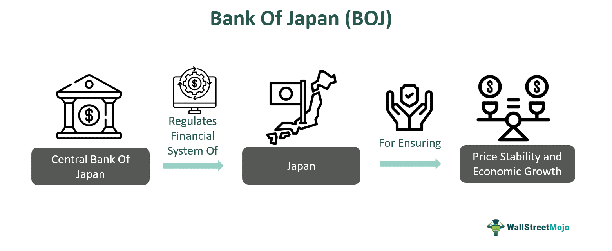

## Table of Contents

## What is the Bank of Japan?

The Bank of Japan is the central bank of Japan. It is like a big bank that helps control the money in the country. The Bank of Japan makes sure that the money in Japan is safe and that the economy is working well. It does this by setting interest rates, which is the cost of borrowing money, and by controlling the amount of money in the economy.

The Bank of Japan was started in 1882. It is run by a group of people called the Policy Board. They meet regularly to talk about the economy and decide what actions to take. The Bank of Japan also works with the government to make sure that their plans for the economy match. This helps Japan's economy stay strong and stable.

## What is the organizational structure of the Bank of Japan?

The Bank of Japan has a clear way of being organized. At the top is the Policy Board, which is made up of nine members. Six of these members are chosen by the government, and the other three are the Governor and two Deputy Governors. The Policy Board is in charge of making important decisions about Japan's money and economy. They meet often to talk about what's happening and decide what to do next.

Below the Policy Board, there are different departments that help run the Bank of Japan. These departments handle things like making money, managing the country's gold and foreign money, and looking after the financial system. Each department has its own leader and team, and they all work together to make sure the Bank of Japan does its job well. This setup helps the Bank of Japan keep Japan's economy stable and safe.

## Who governs the Bank of Japan and how are they appointed?

The Bank of Japan is governed by the Policy Board, which has nine members. The Governor and two Deputy Governors are part of this board. The rest of the members, which are six, are chosen by the government. The Governor leads the Policy Board and makes sure that everyone works together to keep Japan's money safe and the economy strong.

The Governor and the two Deputy Governors are appointed by the Cabinet of Japan and then approved by the Diet, which is like Japan's parliament. They serve for a term of five years and can be reappointed. The other six members of the Policy Board are also appointed by the Cabinet, but they serve for four years and can be reappointed once. This way, the government makes sure that the people running the Bank of Japan are trusted and good at their jobs.

## What are the primary objectives of the Bank of Japan's monetary policy?

The main goal of the Bank of Japan's monetary policy is to keep prices stable. This means they want to make sure that the prices of things people buy don't go up too fast or too slow. They do this by trying to keep inflation, which is when prices go up, at around 2% every year. By keeping prices stable, they help make sure that people can plan their money better and the economy stays strong.

Another big goal is to help the economy grow and keep it stable. The Bank of Japan does this by controlling how much money is in the economy and by setting interest rates, which is the cost of borrowing money. When they think the economy needs a boost, they might lower interest rates to make it cheaper for people and businesses to borrow money. If they think the economy is growing too fast, they might raise interest rates to slow things down a bit. By doing these things, they help keep Japan's economy healthy and balanced.

## How does the Bank of Japan implement its monetary policy?

The Bank of Japan implements its monetary policy mainly by controlling the amount of money in the economy and by setting interest rates. When they want to help the economy grow, they might lower interest rates. This makes it cheaper for people and businesses to borrow money, so they spend more and the economy gets a boost. If they think the economy is growing too fast and prices are going up too quickly, they might raise interest rates. This makes borrowing more expensive, so people and businesses spend less, and it helps slow down the economy and keep prices stable.

Another way the Bank of Japan implements its monetary policy is by buying and selling government bonds. When they buy bonds, they put more money into the economy, which can help it grow. When they sell bonds, they take money out of the economy, which can help slow it down. They also use a tool called "quantitative easing," where they buy lots of bonds to put a lot of money into the economy quickly. This is used when the economy really needs a big boost. By using these tools, the Bank of Japan tries to keep the economy stable and prices from going up too fast.

## What tools does the Bank of Japan use to control inflation and support economic growth?

The Bank of Japan uses several tools to control inflation and help the economy grow. One main tool is setting interest rates. When they want the economy to grow, they lower interest rates. This makes it cheaper for people and businesses to borrow money, so they spend more. If prices are going up too fast, they might raise interest rates to make borrowing more expensive, which slows down spending and helps control inflation.

Another tool they use is buying and selling government bonds. When the Bank of Japan buys bonds, it puts more money into the economy, which can help it grow. If they sell bonds, they take money out of the economy, which can help slow it down. They also use something called "quantitative easing," where they buy a lot of bonds to quickly put a lot of money into the economy. This is used when the economy really needs a big boost.

By using these tools, the Bank of Japan tries to keep prices stable and support economic growth. They aim to keep inflation around 2% each year, which helps people plan their money better and keeps the economy strong and balanced.

## How does the Bank of Japan coordinate with the government on economic policy?

The Bank of Japan works closely with the government to make sure their plans for the economy match. They talk to each other a lot to make sure they are working towards the same goals. The government can tell the Bank of Japan what they think about the economy and what they want to happen. The Bank of Japan listens and tries to help the government's plans work by using its tools like setting interest rates and buying bonds.

Even though the Bank of Japan and the government work together, the Bank of Japan is independent. This means it can make its own decisions about money and the economy. But they still share information and ideas to make sure Japan's economy stays strong. By working together but staying independent, they can help keep prices stable and the economy growing.

## What role does the Bank of Japan play in financial stability?

The Bank of Japan helps keep the financial system stable. They do this by watching over banks and other financial companies to make sure they are safe and healthy. If they see a problem, they can step in to fix it. They also work with the government to make rules that help keep the financial system strong. By doing these things, the Bank of Japan helps make sure that people's money is safe and the economy can keep working well.

Another way the Bank of Japan helps with financial stability is by being ready for emergencies. If there is a big financial crisis, they can quickly put money into the system to help calm things down. They also have plans and tools to use in tough times to keep the economy from getting too bad. By being ready and acting fast, the Bank of Japan helps keep Japan's financial system stable and protects people's money.

## How transparent is the Bank of Japan in its operations and decision-making?

The Bank of Japan tries to be open about what it does and how it makes decisions. They do this by sharing a lot of information with the public. After every meeting of the Policy Board, they put out a statement that tells people what they decided and why. They also release minutes from these meetings a few weeks later, which give more details about what was discussed. This helps people understand how the Bank of Japan thinks about the economy and what they plan to do.

The Bank of Japan also publishes reports and forecasts about the economy. These reports explain what is happening with prices, jobs, and other important parts of the economy. By sharing this information, they help people and businesses make better plans. Even though the Bank of Japan shares a lot, some things are kept private to protect sensitive information. But overall, they work hard to be as open as possible so that everyone can trust them and understand their actions.

## What are the major challenges faced by the Bank of Japan in achieving its monetary policy goals?

One big challenge for the Bank of Japan is that Japan's economy has been growing very slowly for a long time. This makes it hard for the Bank of Japan to reach its goal of keeping prices stable and helping the economy grow. When the economy grows slowly, people and businesses don't spend as much, which makes it harder for the Bank of Japan to control inflation. They have tried to fix this by using tools like lowering interest rates and buying bonds, but it's still a tough problem to solve.

Another challenge is that Japan has a lot of debt. This means the government owes a lot of money, and it can make the Bank of Japan's job harder. When the government has a lot of debt, it can affect the economy in ways that make it harder for the Bank of Japan to control inflation and help the economy grow. The Bank of Japan has to be careful with its actions so it doesn't make the debt problem worse. Balancing these issues while trying to meet its goals is a big challenge for the Bank of Japan.

## How has the Bank of Japan's approach to monetary policy evolved over the years?

Over the years, the Bank of Japan has changed how it handles its money policy. In the past, they used to focus a lot on controlling the amount of money in the economy. They did this by setting interest rates and buying or selling government bonds. But as Japan's economy started growing very slowly, they realized they needed to try new things. So, they started using a tool called "quantitative easing." This means they buy a lot of bonds to quickly put a lot of money into the economy. They hoped this would help the economy grow faster and keep prices stable.

In recent years, the Bank of Japan has kept using quantitative easing and even tried new ways to make it work better. They set a goal to keep inflation at around 2% every year, but it has been hard to reach this goal. So, they started buying different kinds of assets, not just government bonds, to put even more money into the economy. They also started using negative interest rates, which means banks have to pay to keep their money at the Bank of Japan. This is another way to encourage spending and help the economy. By trying these new things, the Bank of Japan hopes to finally meet its goals and help Japan's economy grow stronger.

## What are some expert critiques and recommendations regarding the Bank of Japan's policies and transparency?

Some experts think the Bank of Japan should be clearer about what it does. They say the Bank of Japan shares a lot of information, but it can be hard to understand. They want the Bank of Japan to explain things in a simpler way so everyone can understand. Experts also think the Bank of Japan should tell people more about how it makes decisions. This way, people can trust the Bank of Japan more and feel sure about what it is doing.

Other experts have ideas about how the Bank of Japan can do better with its money policies. They say the Bank of Japan has been trying hard to help the economy grow and keep prices stable, but it's been tough. Some experts think the Bank of Japan should try new things, like changing how it uses interest rates or buying different kinds of assets. They also say the Bank of Japan should work more closely with the government to make sure their plans match. By doing these things, the Bank of Japan might be able to help Japan's economy grow stronger and keep prices from going up too fast.

## References & Further Reading

[1]: Shirakawa, M. (2012). ["Central Banking in a Complex, Uncertain and Globalized World: The Bank of Japan's Experience."](https://www.bis.org/review/r120329b.pdf) Speech at the Bank of Japan.

[2]: Ito, T., & Mishkin, F. S. (2004). ["Two Decades of Japanese Monetary Policy and the Deflation Problem."](https://www.nber.org/papers/w10878) National Bureau of Economic Research Working Paper No. 10878.

[3]: Borio, C., & Disyatat, P. (2009). ["Unconventional Monetary Policies: An Appraisal."](https://www.bis.org/publ/work292.htm) Bank for International Settlements Working Paper No. 292.

[4]: Hendershott, T., Jones, C. M., & Menkveld, A. J. (2011). ["Does Algorithmic Trading Improve Liquidity?"](https://onlinelibrary.wiley.com/doi/full/10.1111/j.1540-6261.2010.01624.x) The Review of Financial Studies, 24(8), 2245–2279.

[5]: Kawai, M., & Morgan, P. J. (2012). ["Central Banking for Financial Stability in Asia."](https://www.adb.org/sites/default/files/publication/156232/adbi-wp377.pdf) Asian Development Bank Institute Working Paper No. 377.

[6]: Fujii, M. (2016). ["The Impact of Negative Interest Rate Policy on the Slope of the Yield Curve in Japan."](https://onlinelibrary.wiley.com/doi/full/10.1111/obes.12635) Bank of Japan Working Paper Series No. 16-E-3.

[7]: Ultra, C. (2012). ["Algorithmic Trading and Market Efficiency"](https://papers.ssrn.com/sol3/papers.cfm?abstract_id=2686082) Bank of England Quarterly Bulletin, 52(4).

[8]: Kuroda, H. (2017). ["Quantitative and Qualitative Monetary Easing with Yield Curve Control."](https://www.bis.org/review/r170324c.pdf) Speech at the Bank of Japan Conference.