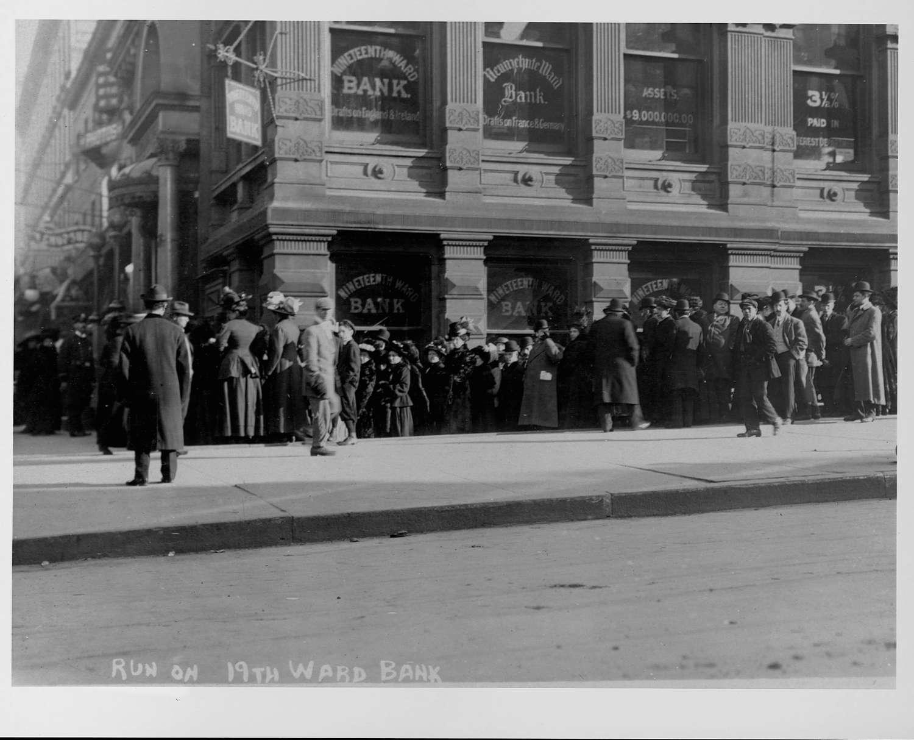

## Table of Contents

## What was the Bank Panic of 1907?

The Bank Panic of 1907 was a financial crisis that happened in the United States. It started in October 1907 and lasted for several weeks. During this time, many people were worried about their money and started taking it out of banks. This caused some banks to run out of money and close down. The panic began when a group of people tried to control the stock market but failed, causing the stock market to crash.

The crisis got worse when a big bank called the Knickerbocker Trust Company failed. This made people even more scared, and they rushed to take their money out of other banks too. The situation was so bad that it threatened the whole economy. Eventually, a group of rich bankers, led by J.P. Morgan, stepped in to help. They used their own money to save important banks and stop the panic. This event showed that the country needed a better system to protect banks, which led to the creation of the Federal Reserve System in 1913.

## When did the Bank Panic of 1907 occur?

The Bank Panic of 1907 happened in October 1907 and lasted for a few weeks. It started when some people tried to control the stock market but failed, causing the stock market to crash. This made many people worried about their money, so they started taking it out of banks.

The situation got worse when a big bank called the Knickerbocker Trust Company failed. This made people even more scared, and they rushed to take their money out of other banks too. The crisis was so bad that it threatened the whole economy. A group of rich bankers, led by J.P. Morgan, stepped in to help. They used their own money to save important banks and stop the panic. This event showed that the country needed a better system to protect banks, which led to the creation of the Federal Reserve System in 1913.

## What were the immediate causes of the Bank Panic of 1907?

The Bank Panic of 1907 started because some people tried to take control of the stock market but failed. This caused the stock market to crash in October 1907. When the stock market crashed, people got worried about their money. They thought their money in the banks might not be safe anymore, so they started taking it out of the banks.

The situation got worse when a big bank called the Knickerbocker Trust Company failed. When this happened, people became even more scared. They rushed to other banks to take their money out too. This made more banks run out of money and close down. The panic spread quickly and threatened the whole economy.

## How did the failure of the Knickerbocker Trust Company contribute to the panic?

The failure of the Knickerbocker Trust Company was a big reason why the Bank Panic of 1907 got so bad. When Knickerbocker Trust failed, people got really scared. They thought that if a big bank like Knickerbocker could fail, then their money in other banks might not be safe either. So, they rushed to take their money out of other banks too. This made more banks run out of money and close down.

The panic spread quickly because people were so worried. When they saw that Knickerbocker Trust had failed, they didn't trust any bank anymore. They all wanted their money back right away, which made the situation even worse. This is why the failure of the Knickerbocker Trust Company was such an important part of the Bank Panic of 1907.

## What role did speculative investments play in the Bank Panic of 1907?

Speculative investments played a big part in starting the Bank Panic of 1907. Some people tried to make a lot of money fast by buying and selling stocks. They thought they could control the stock market, but they were wrong. When their plan failed, the stock market crashed. This made people worry about their money in banks. They thought the banks might lose their money too, so they started taking it out.

The failure of the Knickerbocker Trust Company made things even worse. This bank had made a lot of risky investments, hoping to make big profits. When these investments failed, the bank ran out of money and had to close. This scared people even more. They thought that if a big bank like Knickerbocker could fail because of bad investments, their money in other banks might not be safe either. So, they rushed to take their money out of other banks too, which made the panic spread quickly.

## How did the lack of a central bank exacerbate the crisis?

The lack of a central bank made the Bank Panic of 1907 much worse. Without a central bank, there was no one to help the banks when they ran out of money. When people started taking their money out of banks, the banks had no way to get more money quickly. This made more banks fail, which scared even more people. If there had been a central bank, it could have given the banks the money they needed to stay open.

Because there was no central bank, a group of rich bankers, led by J.P. Morgan, had to step in to save the banks. They used their own money to help the banks that were in trouble. This stopped the panic from getting even worse. The Bank Panic of 1907 showed that the country really needed a central bank to help in times of crisis. This led to the creation of the Federal Reserve System in 1913.

## What were the economic effects of the Bank Panic of 1907 on the United States?

The Bank Panic of 1907 had big effects on the United States economy. It made many businesses struggle because they couldn't get loans from banks. When banks ran out of money, they stopped lending to businesses. This slowed down the economy a lot. Many people lost their jobs because businesses couldn't keep running without money from the banks. The panic also made people lose trust in banks, which made it hard for the economy to recover quickly.

The crisis also showed that the country needed a central bank to help in times like this. Without a central bank, there was no one to give money to the banks that were in trouble. This made the panic worse and longer than it needed to be. After the Bank Panic of 1907, people realized that a central bank was important. This led to the creation of the Federal Reserve System in 1913, which helped prevent similar crises in the future.

## How did J.P. Morgan's intervention affect the outcome of the Bank Panic of 1907?

J.P. Morgan's intervention was really important during the Bank Panic of 1907. He was a rich banker who stepped in to help when no one else could. He used his own money to save important banks that were about to fail. This stopped the panic from getting even worse. If J.P. Morgan hadn't helped, more banks would have closed, and the economy would have been in even bigger trouble.

Because of J.P. Morgan's actions, the panic didn't last as long as it could have. He and other rich bankers worked together to make sure that people could still trust the banks. This helped calm people down and stop them from taking all their money out. J.P. Morgan's intervention showed everyone that the country needed a better way to protect banks, which led to the creation of the Federal Reserve System in 1913.

## What were the long-term consequences of the Bank Panic of 1907 on U.S. financial regulation?

The Bank Panic of 1907 showed that the United States needed a better way to protect its banks. Before the panic, there was no central bank to help when banks ran out of money. This made the panic worse and longer than it needed to be. After the panic, people realized that a central bank could stop future crises. This led to the creation of the Federal Reserve System in 1913. The Federal Reserve was made to be a central bank that could give money to banks in trouble and help keep the economy stable.

The panic also made the government think more about how to regulate banks. They saw that banks needed to be watched more closely to stop them from making risky investments. This led to new rules and laws to make sure banks were safer. The Bank Panic of 1907 was a big reason why the U.S. started to have stronger financial regulations. These changes helped prevent similar panics in the future and made the banking system more stable.

## How did the Bank Panic of 1907 influence the creation of the Federal Reserve System?

The Bank Panic of 1907 showed that the United States needed a central bank. Before the panic, there was no central bank to help when banks ran out of money. This made the panic worse and last longer. People got scared and took their money out of banks, which made more banks fail. The panic showed that without a central bank, the country was not ready for financial crises. This led people to think about how to stop this from happening again.

After the Bank Panic of 1907, the government decided to create the Federal Reserve System in 1913. The Federal Reserve was made to be a central bank that could give money to banks in trouble and help keep the economy stable. It was also made to watch over banks and make sure they didn't make risky investments. The Bank Panic of 1907 was a big reason why the Federal Reserve was created. It helped make the banking system safer and more stable for the future.

## What lessons can be learned from the Bank Panic of 1907 to prevent future financial crises?

The Bank Panic of 1907 teaches us that having a central bank is really important. Without a central bank, there was no one to help the banks when they ran out of money. This made the panic worse and longer than it needed to be. People got scared and took their money out of banks, which made more banks fail. If there had been a central bank, it could have given money to the banks in trouble and stopped the panic from spreading. This is why the Federal Reserve was created in 1913, to help prevent similar crises in the future.

Another lesson from the Bank Panic of 1907 is that banks need to be watched closely. The panic started because some people tried to control the stock market but failed, and banks made risky investments. When these investments failed, banks ran out of money. If there had been better rules and laws to stop banks from making risky investments, the panic might not have happened. This is why the government made new rules after the panic to make sure banks are safer and more stable.

## How did the Bank Panic of 1907 compare to other financial panics in U.S. history?

The Bank Panic of 1907 was one of several financial panics in U.S. history, but it was unique because it showed how important a central bank could be. Like the Panic of 1873, which was caused by the failure of a big bank and led to a long economic depression, the Bank Panic of 1907 started when a group of people failed to control the stock market and the Knickerbocker Trust Company failed. Both panics caused people to lose trust in banks and take their money out, leading to more bank failures. However, the 1907 panic was different because it led to the creation of the Federal Reserve System in 1913, which was meant to prevent such crises in the future.

Another financial panic that the Bank Panic of 1907 can be compared to is the Panic of 1893. Both were caused by risky investments and bank failures, and both led to widespread economic trouble. The Panic of 1893 was triggered by the failure of the Philadelphia and Reading Railroad, which led to a chain reaction of bank failures and economic depression. Similarly, the 1907 panic was triggered by the failure of the Knickerbocker Trust Company, but the response to the 1907 panic was more organized, with J.P. Morgan and other bankers stepping in to help. This intervention, and the subsequent creation of the Federal Reserve, showed that the U.S. was starting to learn how to better manage financial crises.

## References & Further Reading

[1]: Bruner, R. F., & Carr, S. D. (2007). ["The Panic of 1907: Lessons Learned from the Market's Perfect Storm."](https://archive.org/details/panicof1907lesso0000brun) Wiley.

[2]: Moen, J., & Tallman, E. (1992). ["The Bank Panic of 1907: The Role of Trust Companies."](https://www.jstor.org/stable/pdfplus/2122887.pdf) The Journal of Economic History, 52(3), 611-630.

[3]: Silber, W. L. (2010). ["Why Did J.P. Morgan & Co. Survive the Panic of 1907?"](https://en.wikipedia.org/wiki/Panic_of_1907) Business History Review, 84(4), 595-618.

[4]: Lowenstein, R. (2015). ["America's Bank: The Epic Struggle to Create the Federal Reserve."](https://www.amazon.com/Americas-Bank-Struggle-Federal-Reserve/dp/0143109847) Penguin Press.

[5]: Benston, G. J., & Kaufman, G. G. (1995). ["Is the Banking and Payments System Fragile?"](https://link.springer.com/article/10.1007/BF01051747) Journal of Financial Services Research, 9(3-4), 209-240.